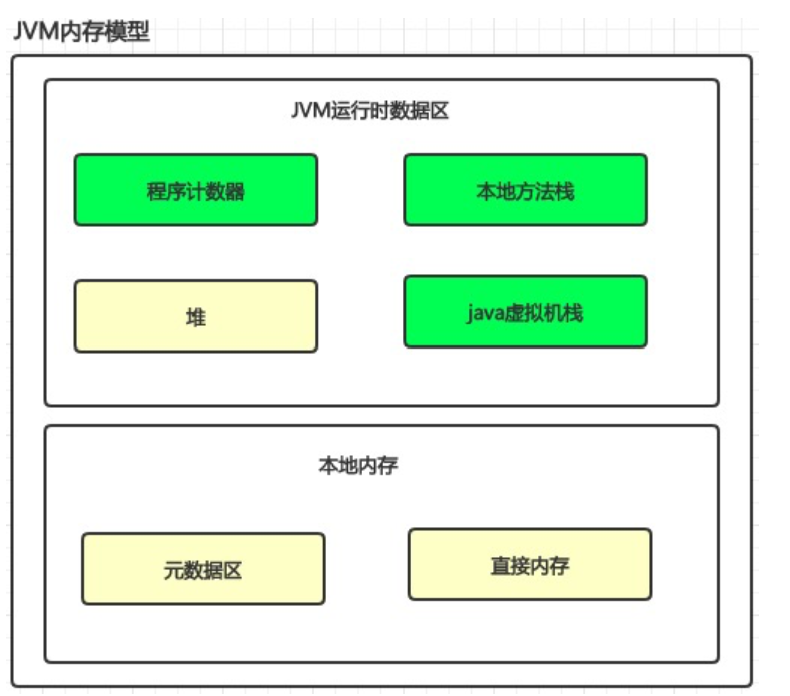

JVM是Java Virtual Machine 的缩写，主要是通过在实际计算机模仿各种计算机功能来实现的，组成部分包括堆、栈、本地方法栈、程序计算器，元空间等部分组成。
Java能够被称为“一次编译，到处运行”的原因就是Java屏蔽了很多的操作系统平台相关信息，使得Java只需要生成在JVM虚拟机运行的目标代码也就是所说的字节码，就可以在多种平台运行。

###1.程序计数器，线程私有

程序控制流的指示器，会不断选取下一条执行的指令，JVM的多线程会轮询被分配使用CPU片，为了线程切换之后能恢复之前的位置，每个线程都需要一个独立的程序计数器，互不影响。
这个区域是唯一JVM没有规定OutOfMemoryError的区域。

###2.Java虚拟机栈，线程私有

java栈是**java方法**执行的内存模型，每个方法执行时，会同步创建一个栈帧，用于存储局部变量表，操作数栈，动态连接和方法出口等信息。
这里比较重要的是局部变量表，JVM在编译期对于一个方法的局部变量locals和内存大小完成分配，同时对栈深度stack也完成定义。

java栈会出现两种异常：
-  StackOverflowError: 线程请求的栈深度大于虚拟机所允许的深度，特别是在有递归调用时
OutOfMemoryError: 虚拟机栈无法满足线程所申请的空间需求，即使经过动态扩展任然无法满足，将会导致该类异常的发送

###3.本地栈，线程私有

与Java栈类似，不过本地栈是为**本地native方法**服务。

###4.java堆

所有线程共享，几乎所有的实例对象都在分配在这里（注：随着JVM技术升级，一些逃逸分析技术可以在栈上分配对象），
-xmx，-xms等参数起效的地方，以及GC发生的主要区域。

堆空间大小不足时会抛出OutOfMemoryError异常。

###5.元数据区

在之前的jvm版本中通常称为方法区，所有线程共享。

这里存放已知的所有被加载的类型信息，常量，静态变量以及非常重要的一部分：运行时常量。

元数据区的类信息中有一项常量池表用于存放编译期生成的各种字面量和符号引用，这部分数据在JVM加载阶段之后会放入运行时常量区（加载分为多个阶段，后续会详细补充，其中一个解析阶段会将某些符号引用更换会直接引用）。

注：
- 字面量指各种字符串，final常量，基本类型值等
- 符号引用指类，接口限定名，字段名称，方法名称，符号引用可以是任何形式的字面量，只要无歧义定位到目标即可
- 直接引用：直接指向目标物理地址的指针或相对偏移量