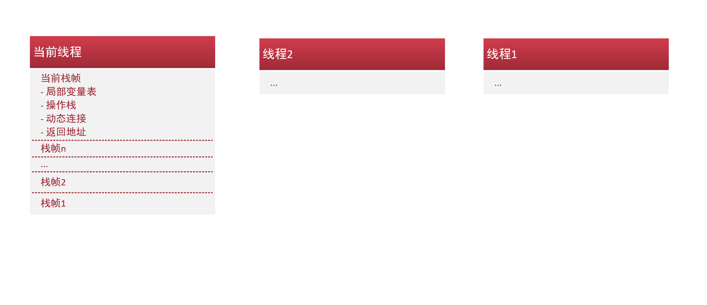

JVM以方法作为最基本的执行单位，栈帧就是执行方法的数据结构。每一个栈帧都包括局部变量表，操作栈，动态连接，返回地址等。

执行引擎执行的永远是当前栈帧。

####1.局部变量表：

存放方法参数和方法内部的局部变量，以slot槽为基本单位，在class文件中的code属性中由max_locals完全确定了大小以及内容。

注：如果是实例方法（非static方法），那么第0为slot为this，即类对象本身的引用。

####2.操作数栈：
先入后出LIFO栈，其元素是任意java类型， 操作数栈的最大深度也由code属性中的max_stacks完全确定。
执行过程中，会有各种字节码指令向栈中放入或提取数据。

####3.动态连接：
指一个指向运行时常量中该栈帧所属方法的引用。常量池中的符号引用会在加载阶段一部分转化为直接引用，而另一部分在运行期转化，
这时就需要常量池中的相关信息和栈帧连接从而进行转化。

####4.方法返回：
这部分信息用于方法退出后返回到最初调用的位置。

方法的退出只有两种：
- 得到明确的return返回或void方法执行完毕。
- 发生异常时返回。