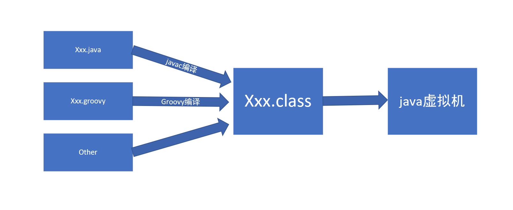
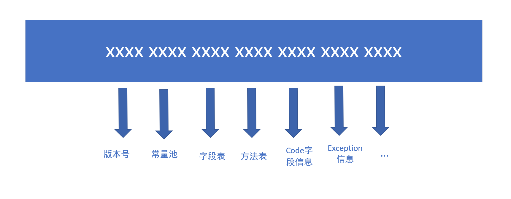
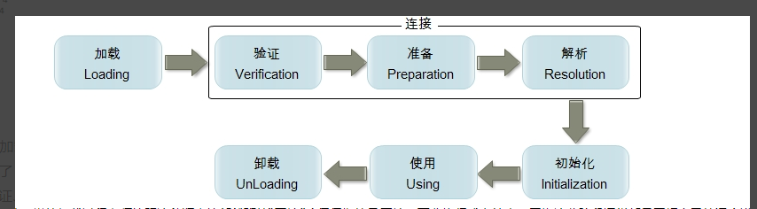
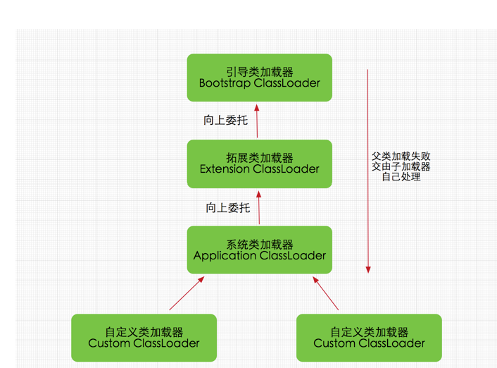

## Class文件

java被称为平台无关语言是因为java虚拟机只执行class文件，而class文件可以由各种途径达到。

而class文件需要承载所有代码信息，因此是一种严格限定的文件格式，按一定顺序存放

其具体格式类似如上形式，解释几个重要信息。

- 常量池：包名，类名，字段名和描述符，方法名和描述符，方法类型和句柄等，
这里信息的作用是在后续的字段，方法，code信息或其他类来调取本类时，不直接放入字面量，而是放入常量池中的引用。

- 字段表：接口或类中声明的变量和修饰符信息，即字段，但不包括方法内部声明的局部变量。

- 方法表：所有类中声明的方法，包括public和private等

- code属性：java程序方法体的代码经过javac编译器的处理之后，最终变为字节码指令存储在code属性内，格式有点类似汇编代（-add -sub这种），这里又有几个比较重要的信息在code属性中
    - stack：操作栈深度，java栈和本地栈就是根据这个分配方法的栈帧
    - locals：局部变量表，单位是slot。byte，int，boolean或对象引用（可能是一个引用地址句柄）占一个slot。
    double，long占两个slot
    
***

## 类加载机制

JVM中类加载遵循如下过程

1.加载

- 通过类的全限名获得此类的二进制字节流，可以从压缩包中获取如jar，war等，可以从网络中获取，可以在运行时动态生成如动态代理技术，可以从其他文件中获取.....

- 将子节流中的静态存储结构转化为元数据区中的数据，即元数据区存放了类的源信息。

- 在Java堆内存中实例化一个java.lang.class类对象，作为程序访问元数据区数据的外部接口。通常看到的xxx.class，this.getClass()得到的就是这个对象。

2.验证

根据JVM中class的定义验证class文件的合法性。

3.准备

为类中定义的变量分配内存并设置初始值，即static变量进入元数据区。
但这里的初始值指的是数据类型的零指。如static int value = 123，就初始化value为0。

还有一种final修饰的变量，如static final int value = 123 ，这种就在准备阶段直接赋值value为123，这是final值的特性。

4.解析

将常量池中的符号引用变为直接引用，如constant_class_info原来符号引用可能是#3，#8这种，直接替换为0x8c这种直接引用。

5.初始化

执行static代码以及真正为static变量赋值，static相关的都只在类加载过程中执行一次，static变量最终都存放在元数据区中，
与此不同的是普通变量只在对象创建的时候赋值。
***

##关于类加载器

通过一个类的全限名获得该类的二进制字节流，执行上述动作的就是类加载器。

Java对于同一个类的定义是必须来自同一个class文件以及被同一个类加载器加载。

Java虚拟机对于class文件的加载采用的是双亲委派模式，即加载class文件时，首先交由父加载器加载，依次向上，直到所有父加载器无法加载，才会自身尝试加载。

这个模型的优势在于避免了重复加载，并保证核心类在任何时候都无法被修改，因为是顶级加载器加载。
并且使所有的类形成了一种带有优先级的层级关系。

注：在自定义加载器时通过修改find class方法来实现本身的加载逻辑。

双亲委派模式严格的顺序加载也带来一定的局限：

- 反向委托：如DriverManage在JAVA-HOME/lib中，只能由启动类加载器加载，但它的实现类由不同的厂商部署在classpath中，这时就形成了父加载器委托子加载器的反向委托。
这里只能用java设计开出的一个后门，指定上下文加载器为application Loader来解决。

- 热部署器：OSGI将类加载层次由上下结构进化为网状结构。