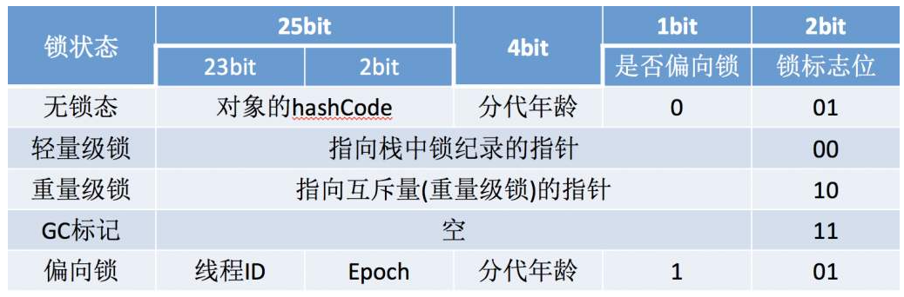
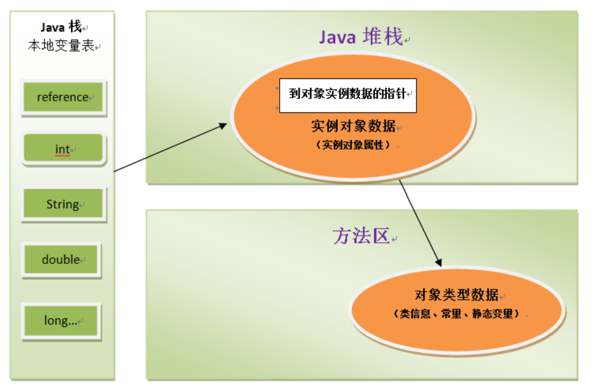

Java是一门面向对象的语言，java程序运行过程中无时无刻都有对象被创建出来，对于JVM的学习，对象的结构和创建很重要。

### 1.对象结构布局

一个对象在堆内存中布局可以分为三个部分：对象头，实例数据和对齐填充

对象头 = 自身数据 + 类型指针

- 自身数据：包括hash码，GC分代年龄，锁状态等信息，这部分被称为mark word，mark word被设计为一个有着动态定义的数据结构，其可能存放的信息如下

- 指针类型：即对象指向它的类型元数据指针，java虚拟机通过这个指针来确定该对象是哪个类的实例。

- 实例数据：对象真正存放的代码信息，即各种类型的字段内容，包括本类和从父类中继承而来的。

- 对齐填充：占位符作用用于规范格式。

### 2.对象创建

- 当JVM遇到一条new指令或者getinstance指令，首先会去检查这个符号引用对应的类是否被加载，如果没有则进行类加载的过程。

- 类加载完成之后，实际上一个对象所需要内存的大小就完成确定了，于是在堆中划出一块内存分配。

- 内存分配之后，虚拟机会将这块内存空间的初始化为零值，然后设置对象的类指针，hash码，对象GC分代信息，锁相关的信息等。

- 初始化完成后，对于JVM来说，一个新的对象已经生成了，但是从程序的视角来说，对象的创建才开始，进入构造函数的流程，即class文件中的init方法。
当构造函数执行完成后，一个真正可用的对象就创建出来了。

### 3.对象访问

关于对象的访问通常有两种访问方式

- 句柄访问：java堆中划出一块区域作为句柄池，栈中引用存储对象的句柄地址，通过句柄再访问对象和对象的类型信息，
句柄访问的好处在于reference只存放稳定的句柄地址，在对象被动（垃圾收集时的常见操作）只改变句柄中实例数据指针，而reference本身不需要改变，当然坏处是多一次指针定位的开销。

- 直接访问：reference存放的直接就是对象地址，不需要再多一次访问的开销，当然存放的时候就必须考虑内存布局。
如HotSpot使用的就是直接访问。

