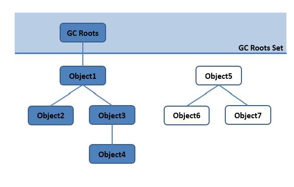

随着jvm动态分配技术越来越成熟，于是出现了各种内存溢出，内存泄漏问题，于是需要更好的GC垃圾回收技术。

###1.哪些内存需要回收：

"死去"（指任何途径都无法访问到的对象）的对象需要回收，而如何判断一个对象再也不会被使用了，通常有两个方法

- 引用计数算法：即再对象中添加一个引用计数器，每当有一个地方引用它，就+1，引用失效时就-1，通过这个计数是否为0来判断是否失效。
这个方法的优势是简单效率高，但是会占用一些额外内存，更严重的问题是无法解决对象相互依赖的问题。

- 可达性算法：图论概念中的不可达作为依据

从GC Roots出发，向下搜索全部路径，如果某个对象不在路径中，那么即为不可达，表示对象可以被收集了。

###2.回收内存时间：
//TODO

###3.GC算法

- 标记-清除算法：标记所有需要回收的数据统一回收，实现简单，但是会产生大量的内存碎片

- 标记-复制算法：半区复制，将内存分为两块，当一块内存用完，将存活的对象复制到另一块，同时清除已使用的一块，这样不产生碎片，但是也用内存减少

- 标记-整理算法：在清除的过程中并不是直接清除，而是将所有存活对象将内存一端移动，并清理边界之外的内存。不产生碎布也不占用空间，但是移动的过程复杂，时间长。

###4.java分代理论

java会将堆分为新生代和老年代，老年代存放长期存活的对象和比较大的实例对象。

新生代分为Eden区和两个survivor区，占比为80%，10%，10%，只使用Eden区和一个survivor区，整体使用空间为90%，
每次垃圾收集时，将Eden区和survivor区存活的对象移动到另一个survivor区中，并清理，如此反复。

如果是大对象或数组直接进入老年区，因为年轻代需要频繁移动，大对象成本过高。

当对象在两个survivor区中切换多次之后（默认15次minorGC）后，对象进入老年代。

老年代采用标记-整理算法，当老年代不够用时，触发Full GC

####5.垃圾收集器

- CMS收集器：标记-清除老年代算法，注标记清楚不适用与年轻代，因为频繁回收产生大量的内存碎布不可接受
并发标记和回收得到最短的STW
  
- ZGC：高吞吐量

- G1：不明显区分区域，全区域回收，性能最强