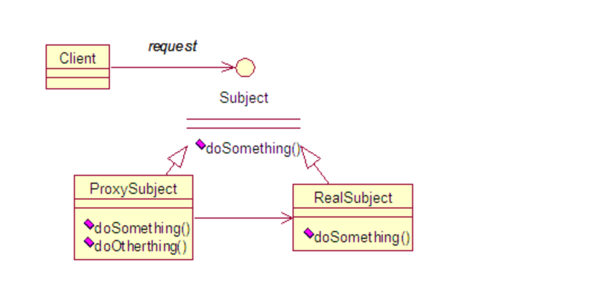

###代理设计模式


代理模式是常用的Java设计模式，它的特征是代理类与委托类有同样的接口，代理类主要负责为委托类预处理消息、过滤消息、把消息转发给委托类，以及事后处理消息等。代理类和委托类之间通常会存在关联关系，一个代理类的对象与一个委托类的对象关联，代理类的对象本身并不是真正实现服务，而是通过调用委托类对象的相关
的方法来提供特定的服务。

****
###代理的分类

java中代理按创建模式分类，可以分为两种：
- 静态代理：由程序员或特定工具自动生成的源代码，再对其编译，在程序运行之前，代理的类编译生成的.class文件就已经存在了。

- 动态代理：在程序运行时创建而成，动态代理也分为两类，jdk代理和cglib代理，动态代理广泛应用于Spring AOP，mybatis，RPC等各类框架中。

****
###jdk代理

在jdk代理中，实现的关键在于一个接口和一个类。一个是接口InvoactionHandler，一个是类Proxy，
这一个类和一个接口是实现动态代理所必须用到的。
每一个动态代理类都必须实现InvocationHandler这个接口，并且每一个代理类的实例都关联到一个Handler，当我们通过代理对象调用一个方法的时候，这个方法的调用就会被转发为由InvocationHandler这个接口的invoke方法来调用。

被代理接口
````
public interface ReaJdkObj {
    public void coding();
}
````
接口实现类
````
public class ReaJdkImpl implements ReaJdkObj {
    @Override
    public void coding() {
        System.out.println("reellllll!......");
    }
}
````
**代理类**
````
public class JdkProxy implements InvocationHandler {
    private Object target;

    public Object bind(Object target) {
        this.target = target;
        return Proxy.newProxyInstance(target.getClass().getClassLoader(), target.getClass().getInterfaces(), this);
    }

    public void test() {
        System.out.println("Hello World ProxyJDK");
    }

    @Override
    public Object invoke(Object proxy, Method method, Object[] args) throws Throwable {
        test();
        method.invoke(target, args);
        return null;
    }
}
````
测试方法
````
public class TeatMain {
    public static void main(String[] args) throws InstantiationException, IllegalAccessException {
        //代理类绑定
        Object bind = (ReaJdkObj) new JdkProxy().bind(new ReaJdkImpl());
        bind.coding();
    }
}
````
以上一个非常典型的代理结构，有代理接口，被代理对象，代理方法中的其他业务实现，这里唯一需要解释也是jdk代理实现的关键在于Proxy.newProxyInstance这个方法。

通过对这个方法的追踪，可以看到一系列验证，缓存，同步，生成字节码等操作，但是最终这个方法会生成一个实际的代理类，
当我们调用new JdkProxy().bind(new ReaJdkImpl())，这里返回的实际上就是一个代理类，通过反编译出的代理类源码如下：
````
public final class $Proxy0 extends Proxy implements ReaJdkObj {
    private static Method m1;
    private static Method m2;
    private static Method m3;
    private static Method m4;
    private static Method m0;

    public $Proxy0(InvocationHandler var1) throws  {
        super(var1);
    }

    public final boolean equals(Object var1) throws  {
        try {
            return (Boolean)super.h.invoke(this, m1, new Object[]{var1});
        } catch (RuntimeException | Error var3) {
            throw var3;
        } catch (Throwable var4) {
            throw new UndeclaredThrowableException(var4);
        }
    }

    public final String toString() throws  {
        try {
            return (String)super.h.invoke(this, m2, (Object[])null);
        } catch (RuntimeException | Error var2) {
            throw var2;
        } catch (Throwable var3) {
            throw new UndeclaredThrowableException(var3);
        }
    }

    public final void rest() throws  {
        try {
            super.h.invoke(this, m3, (Object[])null);
        } catch (RuntimeException | Error var2) {
            throw var2;
        } catch (Throwable var3) {
            throw new UndeclaredThrowableException(var3);
        }
    }

    public final void coding() throws  {
        try {
            super.h.invoke(this, m4, (Object[])null);
        } catch (RuntimeException | Error var2) {
            throw var2;
        } catch (Throwable var3) {
            throw new UndeclaredThrowableException(var3);
        }
    }

    public final int hashCode() throws  {
        try {
            return (Integer)super.h.invoke(this, m0, (Object[])null);
        } catch (RuntimeException | Error var2) {
            throw var2;
        } catch (Throwable var3) {
            throw new UndeclaredThrowableException(var3);
        }
    }

    static {
        try {
            m1 = Class.forName("java.lang.Object").getMethod("equals", Class.forName("java.lang.Object"));
            m2 = Class.forName("java.lang.Object").getMethod("toString");
            m3 = Class.forName("com.ccc.fizz.proxy.ReaJdkObj").getMethod("rest");
            m4 = Class.forName("com.ccc.fizz.proxy.ReaJdkObj").getMethod("coding");
            m0 = Class.forName("java.lang.Object").getMethod("hashCode");
        } catch (NoSuchMethodException var2) {
            throw new NoSuchMethodError(var2.getMessage());
        } catch (ClassNotFoundException var3) {
            throw new NoClassDefFoundError(var3.getMessage());
        }
    }
}
````
可以看到这个类实现了ReaJdkObj实际代理接口和继承了Proxy类，**这也就是为什么jdk动态代理只能用在接口上，因为它的实现类需要继承proxy接口，而java是不支持多继承的**。

这个类中为实际接口的中的每一个方法，包括其父类，来自Object的equals()，toString()等方法，都生成了对应的实现，并且最后都是调用了InvocationHandle对象的invoke方法，super.h就是父类proxy中保存的InvocationHandle实例，
不同的方法区别仅是传入的参数和Method对象不同。

****
####cglib代理

JDK动态代理机制只能代理实现接口的类，一般没有实现接口的类不能进行代理。cglib就是针对类来实现代理的，它
的原理是对指定目标类生成一个子类，并通过修改其字节码实现增强，但因为采用的是继承，所以不能对final修饰的类进行代理。

cglib的代理实现原理于jdk代理使用反射的效率要高，因为cglib底层采用ASM字节码生成框架，使用字节码技术生成代理类，
并且不受代理必须是接口的限制。

在jdk1.8之前，通常是cglib代理更快一点，而1.8之后，jdk代理的速度就更快了