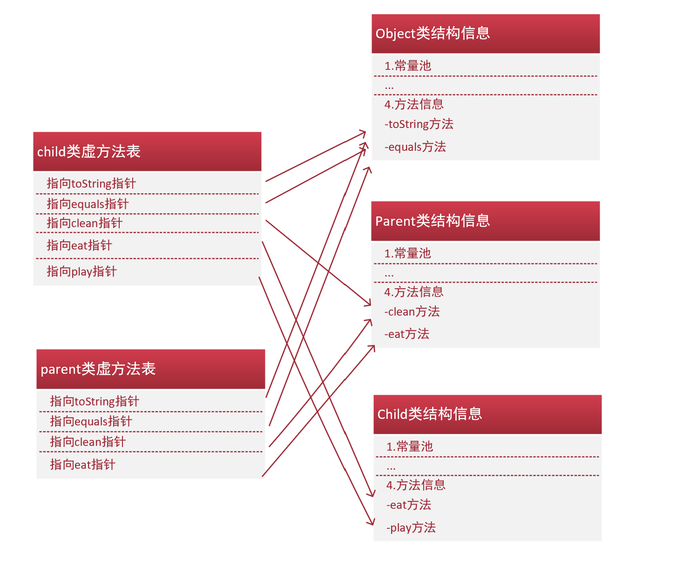
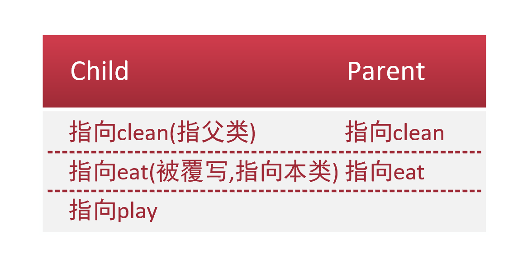

java语言的两大特性是继承与多态。由于继承和多态的特性，JVM需要在运行期间确定方法的版本，
这个方法调用涉及到了重写，重载相关概念。

java中的子类继承了父类除了构造方法之外的所有东西，包括所有私有属性和方法。
这在子节码中表现形式为：本类数据 + 父类指针

虚方法：JVM在类的解析阶段将常量池中的一部分符号引用转化为直接引用，这种转化的前提是在class文件中可以确定类方法的版本，即静态方法和私有方法，这类不可更改，在编译期确定的方法称**非虚方法**，
而与之相对的需要在运行期才可以确定方法版本的方法称为**虚方法**。调用指令为invokeDynamic。每个类在连接阶段后都会生成一个虚方法表，
虚方法一定是实例方法。

如图：Parent p = new Child()


这里p对象的实际类型是child，但静态类型是parent，静态类型一个重要的作用就是**限制了访问内存的范围**，
这里存在一个从静态类型出发的引用的转换，注意一切以静态类型的方法为标准，如果存在override，则指向实际方法，自然静态类型中不存在的方法也就无法访问。



由于Parent的范围限定，对象p无法访问play方法。
***
分派确定方法：

- 静态分派：依赖于静态类型决定方法的版本

````
Human man = New Man();
Human woman = New Woman();

public void test(Human man) {}

test(man);
test(woman);
````
上述的test方法接受参数时，无论传入man还是woman，都会被认为传入Human，即对象的静态类型

- 动态分派：就是多态的应用
````
Parent p = new Child();
p.eat();
````
p调用方法时，首先在根据Parent的限定范围在Child中寻找描述符和名称相同的方法，如果没有找到，则向上寻找父类方法，这个过程中以对象的实际类型为参考。


