### 一、概述

操作系统（Operating System， OS）是指控制和管理整个计算机系统的硬件和软件资源，并合理地组织调度计算机的工作和资源的分配；以提供给用户和其他软件方便的接口和环境；它是计算机系统中最基本的系统软件。

1.操作系统的功能和目标

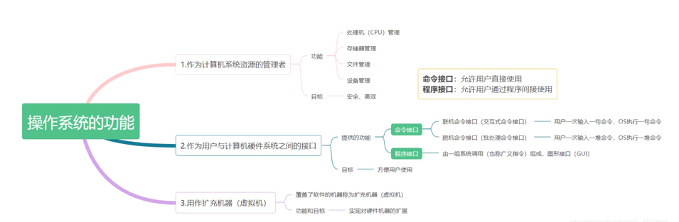

(1) 作为计算机系统资源的管理者

- 处理器（CPU）管理:在多道程序环境下，cpu的分配和运行都以进程（或线程）为基本单位，因此对cpu的管理可理解为对进程的管理。进程管理的主要功能包括进程控制、进程同步、进程通信、死锁处理、处理机调度等。
- 存储器管理:为多道程序的运行提供良好的环境，方便用户使用及提高内存的利用率，主要包括内存分配与回收、地址映射、内存保护与共享和内存扩充等功能。
- 文件管理:计算机中所有的信息都是以文件的形式存在的，操作系统中负责文件的管理的部分称为文件系统，文件管理包括文件存储空间的管理、目录管理及文件读写管理和保护等。
- 设备管理:设备管理的主要任务是完成用户的I/O请求，方便用户使用各种设备，并提高设备的利用率，主要包括缓存管理、设备分配、设备处理和虚拟设备等功能。

(2) 作为用户与计算机硬件系统之间的接口

为了让用户方便、快捷、可靠的操作计算机硬件并执行自己的程序，操作系统提供了用户接口，操作系统提供的接口分为两类：命令接口和程序接口

- 命令接口
    - 联机命令接口：又称交互式命令接口，适用于分时或实时系统的接口，由一组键盘操作命令组成。用户输入一条指令，操作系统就执行一条指令；
    - 脱机命令接口：.bat文件，又称批处理接口，使用于批处理系统，由一组作业控制命令组成。用户输入一堆指令，操作系统运行一堆指令。在操作系统运行这些命令时用户不可干预。

- 程序接口：windows中的dll文件，由一组系统调用（也称广义指令）组成
    - 用户通过在程序中使用这些系统调用来请求操作系统为其提供服务，只能通过用户程序间接调用
    - 如使用各种外部设备、申请分配和回收内存及其它各种要求
    - 常见的图形用户界面程序接口GUI

动态链接库英文为DLL，是Dynamic Link Library的缩写。DLL是一个包含可由多个程序，同时使用的代码和数据的库。

(3) 作为扩充机器（虚拟机）

- 没有任何软件支持的计算机称为裸机 
- 覆盖了软件的机器称为扩充机器或虚拟机

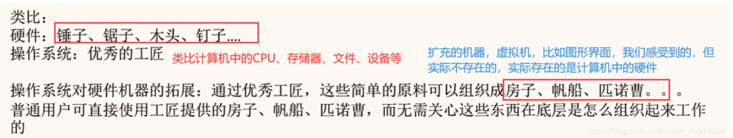

2.操作系统的特征

- 操作系统是一种系统软件，但与其它系统软件和应用软件有很大的不同，它有自己的特殊性，及基本特征(并发、共享、虚拟、异步)

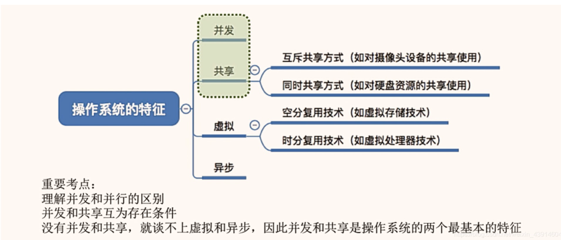

(1) 并发

- 并发：两个或多个事件在同一时间间隔内发生，这些事件在宏观上是同时发生的，在微观上是交替发生的，操作系统的并发性指系统中同时存在着多个运行的程序
- 并行：两个或多个事件在同一时刻发生

一个单核(CPU)同一时刻只能执行一个程序，因此操作系统会协调多个程序使他们交替进行（这些程序在宏观上是同时发生的，在微观上是交替进行的）

操作系统是伴随着“多道程序技术出现的”，因此操作系统和并发是一同诞生的，
在如今的计算机中，一般都是多核cpu的，即在同一时刻可以并行执行多个程序，比如我的计算机是8核的，我的计算机可以在同一时刻并行执行8个程序，但是事实上我们计算机执行的程序并不止8个，因此并发技术是必须存在的，并发性必不可少。

(2) 共享

资源共享即共享，是指系统中的资源可以供内存中多个并发执行的进程共同使用。

- 互斥共享：计算机中的某个资源在一段时间内只能允许一个进程访问，别的进程没有使用权，在一段时间内只允许一个进程访问的资源，计算机中大多数物理设备及某些软件中的栈、变量和表格都属于临界资源，它们被要求互斥共享。
比如QQ和微信视频。同一段时间内摄像头只能分配给其中一个进程。
  
- 同时共享：计算机中的某个资源在在一段时间内可以同时允许多个进程访问。同时共享通常要求一个请求分为几个时间片段间隔的完成，即交替进行，“分时共享”。 
  
- 这里的同时指在宏观上是同时的，在微观上是交替进行访问的，只是cpu处理速度很快，我们感觉不到，在宏观上感觉是在同时进行。
  
- 比如QQ在发送文件A，微信在发送文件B，宏观上两个进程A和B都在访问磁盘，在我们看来是同时进行的，但是在微观上两个进程A和B是交替进行访问磁盘的，只是时间太短，cpu处理速度太快，我们感觉不到。
  注意：有时候多个进程可能真的是在同时进行资源访问，比如玩游戏时可以放音乐，游戏声音和音乐声音都能听见。
  
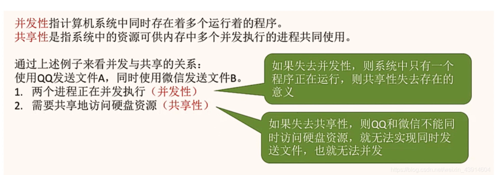

(3) 虚拟

时分和空分

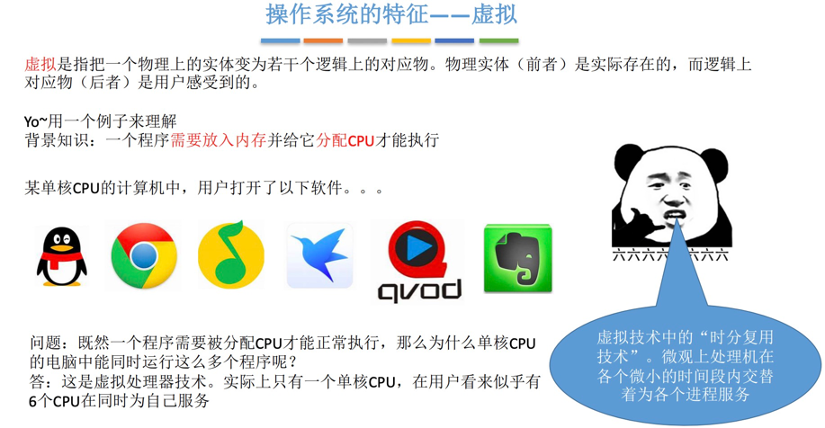

- 虚拟是把一个物理上的实体变为若干逻辑上的对应物。
- 物理实体（前者）是实际存在的；而后者是虚的，是用户感觉上的事务
- 虚拟技术：用于实现虚拟的技术
- 虚拟处理器（CPU）：通过多道程序设计技术，采用让多道程序并发执行的方法，分时来使用一个CPU，实际物理上只有一个CPU，但是用户感觉到有多个CPU
- 虚拟存储器：从逻辑上扩充存储器容量，用户感觉到的但实际不存在的存储器
- 虚拟设备：将一台物理设备虚拟为逻辑上的多台设备，使多个用户在同一时间段内访问同一台设备，即同时共享，用户宏观上感觉是同时的，但实际上是微观交替访问同一台设备的
- 操作系统的虚拟技术科归纳为：
  - 时分复用技术：如处理器的分时共享
  - 空间复用技术：如虚拟存储器

(4) 异步

- 异步：多道程序环境允许多个程序并发执行，但由于资源有限，如cpu只有一个，进程的执行并不是一贯到底的，而是走走停停的，它以不可预知的速度向前推进。
- 比如A进程正在占用CPU计算，B进程这时也想占用CPU计算，B进程只有等，等A进程算完了，A进程去访问磁盘资源了，这时B进程再占用CPU进行计算，B进程还没计算完，A进程从磁盘取出资源了，A进程发现B这时在占用CPU，这时A进程就需要等待，等B算完后再继续到CPU中进行计算。由于每个进程占用资源的时间不固定，所以进程的执行以不可预知的速度前进

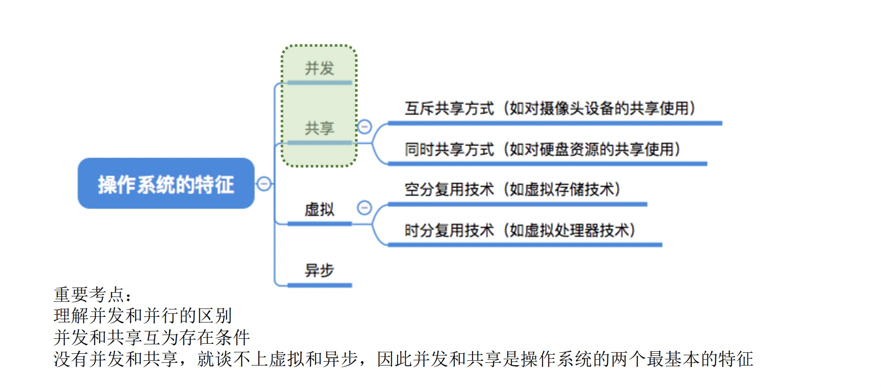

### 二、操作系统发展

OS分类
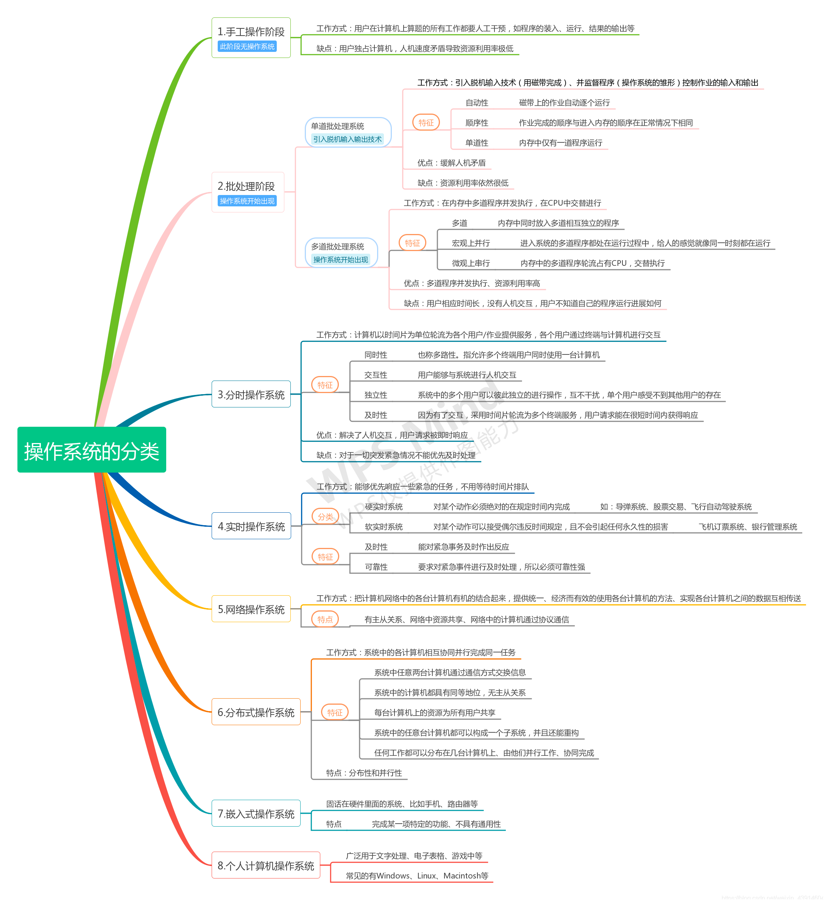

OS发展
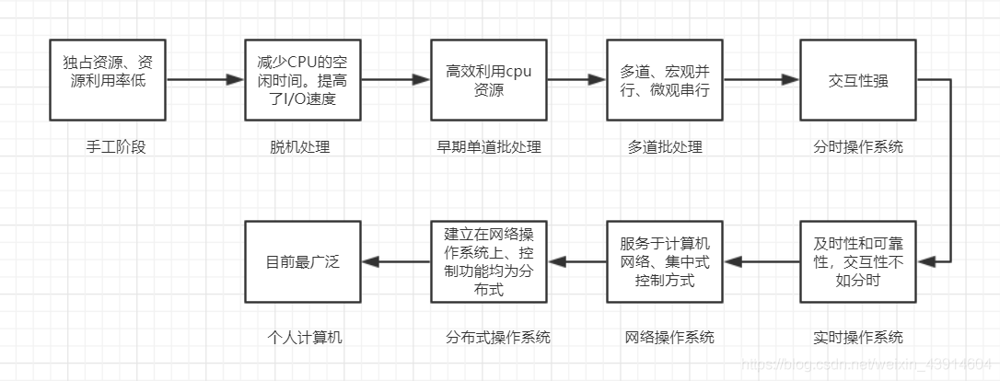

### 三、操作系统的运行机制和体系结构

1.操作系统的运行机制和体系结构
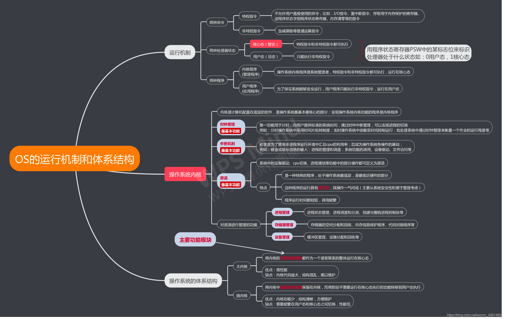

- 特权指令不允许普通用户执行，CPU会判断是否允许执行，通过用户态和核心态两种状态来判断，用程序状态字psw在表示处理器状态。
- 内核程序即管理程序运行在核心态，允许执行所有指令，而普通的用户程序只能使用普通指令。
- 最接近硬件的部分是操作系统的内核，可以直接操控硬件。
  - 时钟管理
  - 中断功能
  - 原语
  - 资源管理功能：进程管理，存储器管理。
  
- 大内核：将内核的所有功能作为一个整体运行在内核态。
- 微内核：内核基本功能放在内核态，其他功能放在用户态，需要频繁切换用户态和内核态。

2.操作系统内核在计算机系统中的层次结构

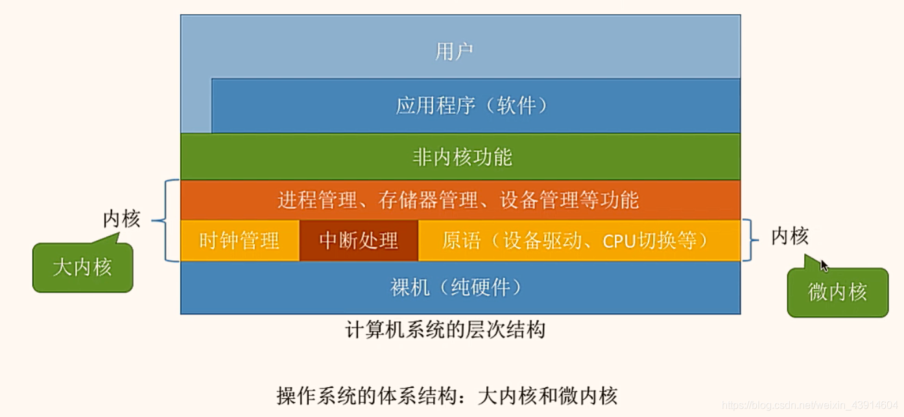

3.操作系统用户态和核心态的转换

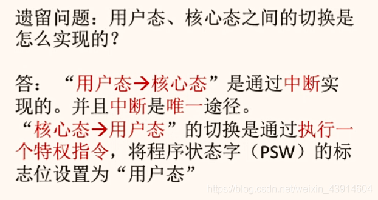

### 四、中断和异常

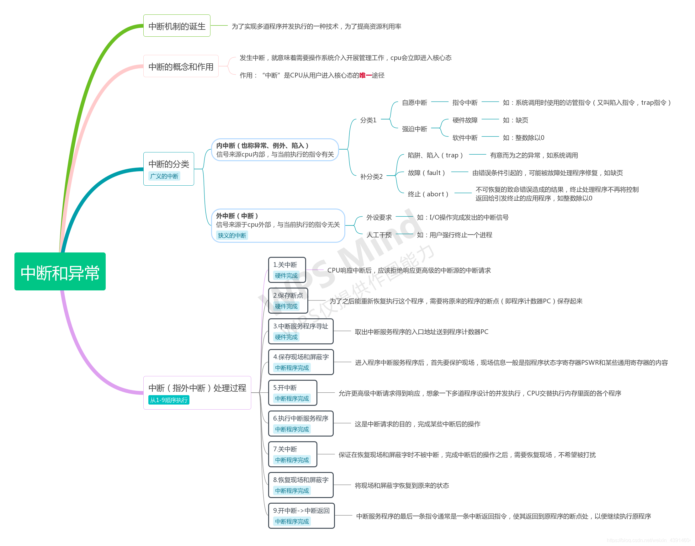

- 中断是唯一从用户态进入内核态的途径。
- 中断发生之后就需要操作系统介入。
- 通过中断来自与CPU内部还是外部分为内中断和外中断。

### 五、系统调用

1.系统调用

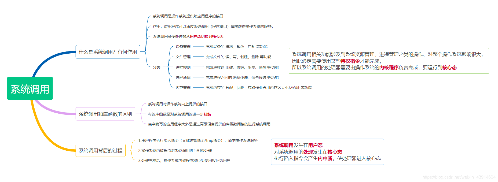

- 操作系统作为用户和计算机硬件之间的接口，需要向上提供一些简单易用的服务。主要包括命令接口和程序接口。其中，
  程序接口由一组系统调用组成。应用程序通过系统调用来向操作系统发出请求，由操作系统完成高权限的操作。

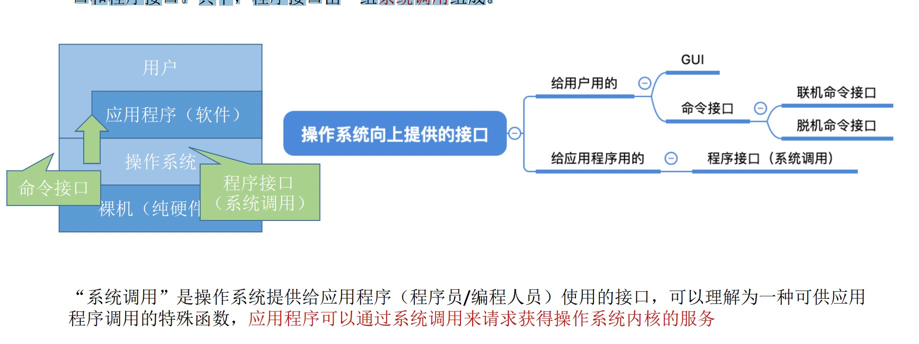
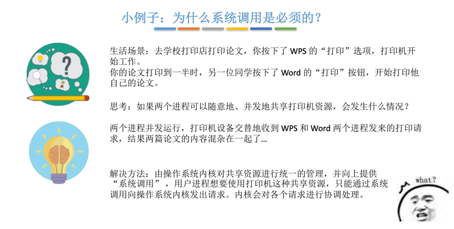

2.系统调用和库函数的区别

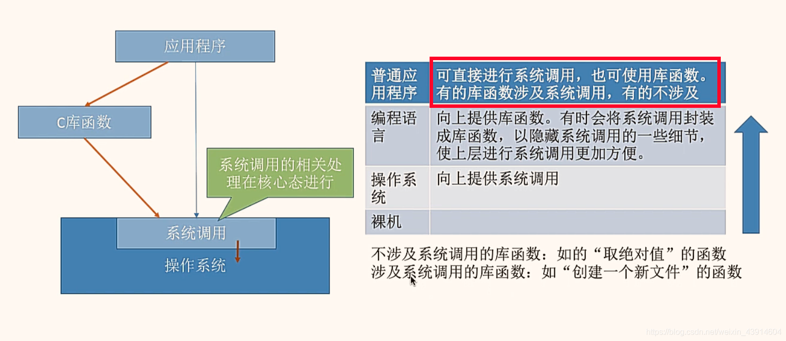

3.系统调用的执行过程

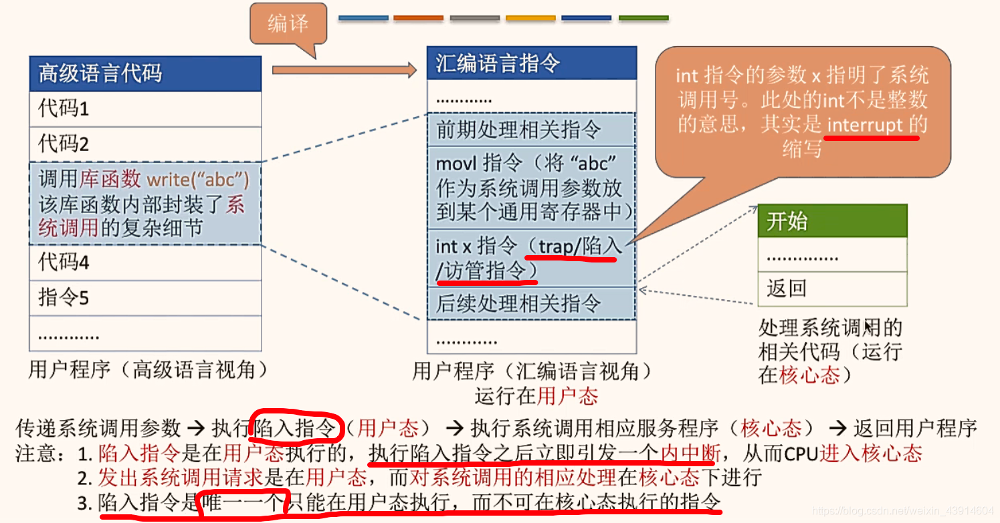

interrupt x：x对应不同的系统调用

