### 一、 进程的定义、特征、组成、组织

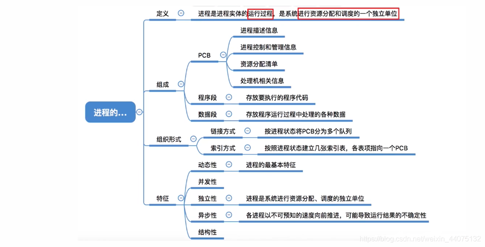

- 程序：一个指令序列，早期计算机只支持单道程序。

- 进程：引入多道程序之后，区分出了进程，PCB 程序段和数据段构成来进程实体。PCB是进程存在的唯一标志。

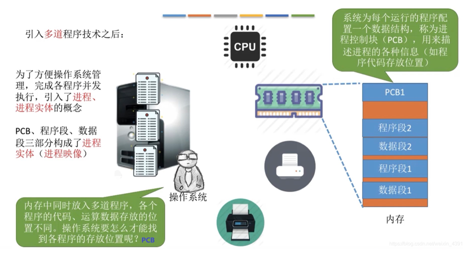

1.进程定义
- 进程是程序的一次执行过程。
- 进程是一个程序及其数据在处理机上顺序执行时所发生的活动。
- 进程是具有独立功能的程序的运行过程，它是**系统进行资源分配和调度的一个独立单位**。

2.进程组成

进程的组成：

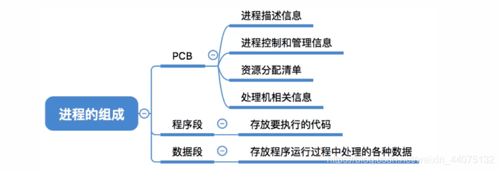

进程的管理者(操作系统)所需的数据都在PCB中，程序本身的运行所需的数据存放在程序段和数据段中。

PCB组成：

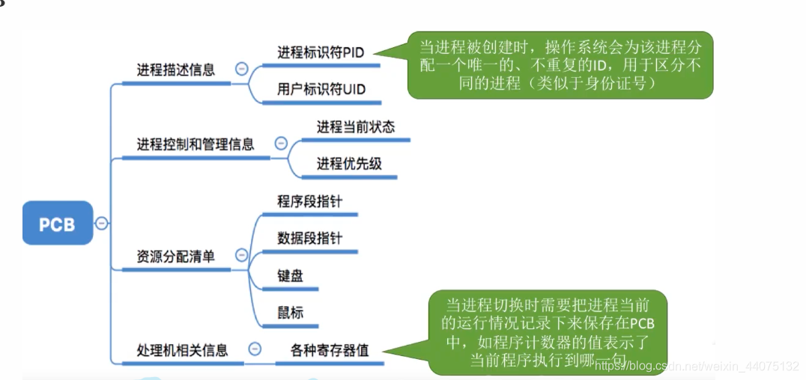

3.进程组织

在一个系统中，通常有数十、数百乃至数千个PCB。为了能对他们加以有效的管理，应该用适当的方式把这些PCB组织起来。

链接方式：

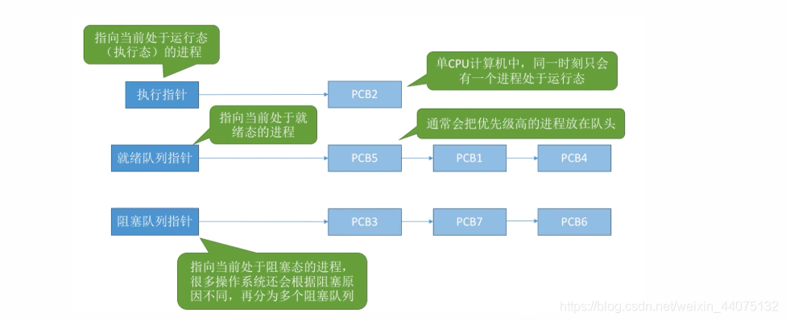

索引方式：

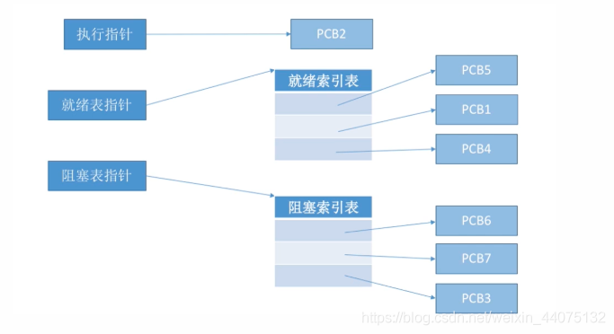

4.进程特征 

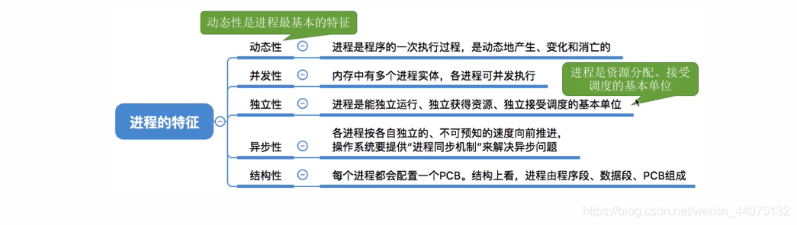

### 二、进程状态

1.三种基本状态：运行态，就绪态和阻塞态。

注意:单核处理机环境下，每时刻最多只有一个进程处于运行态。(双核环境下可以同时有两个进程处于运行态)。

就绪态：进程已经拥有了除处理机之外所有需要的资源，一旦获得处理机，即可立即进入运行态开始运行。即:万事俱备，只欠CPU。

阻塞态：如:等待操作系统分配打印机、等待读磁盘操作的结果。CPU是计算机中最昂贵的部件，为了提高CPU的利用率，需要先将其他进程需要的资源分配到位，才能得到CPU的服务。

2.其他状态

创建态：操作系统需要完成创建进程。操作系统为该进程分配所需的内存空间等系统资源，并为其创建、初始化PCB (如:为进程分配PID)

终止态：进程运行结束(或者由于bug导致进程无法继续执行下去，比如数组越界错误)，需要撤销进程。完成将分配给进程的资源回收，撤销进程PCB等工作。

3.状态转换

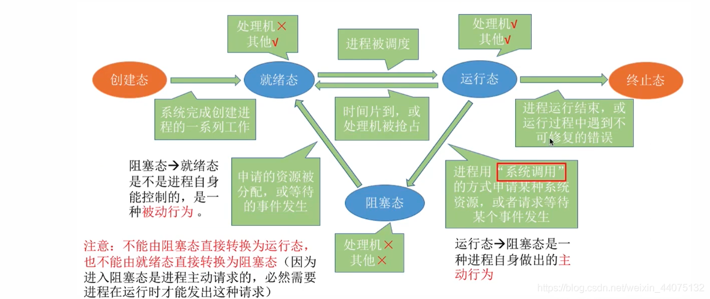
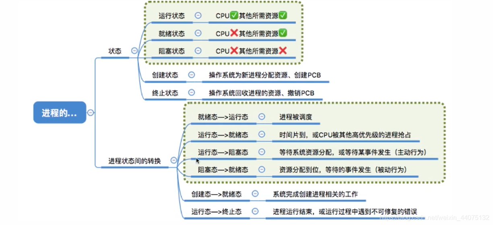

### 三、进程控制

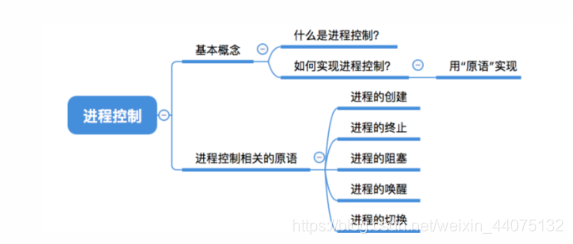

进程控制的主要功能是对系统中的所有进程实施有效的管理，它具有创建新进程、撤销已有进程、实现进程状态转换等功能。

简化理解：反正进程控制就是要实现进程状态转换。

通过原语操控状态的切换，原语是一种特殊的程序，它的执行具有原子性。也就是说，这段程序的运行必须一气呵成，不可中断，保证了状态的顺利切换。

注：如果不能“一气呵成”，就有可能导致操作系\统中的某些关键数据结构信息不统一的情况，这会影响操作系统进行别的管理工作。

原语工作：
- 设置pcb状态。
- 将进程放入相应的队列。
- 其他相关操作，可能包括资源的回收等。

1.创建原语

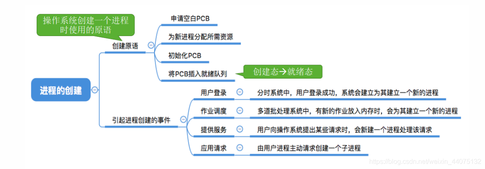

2.撤销原语

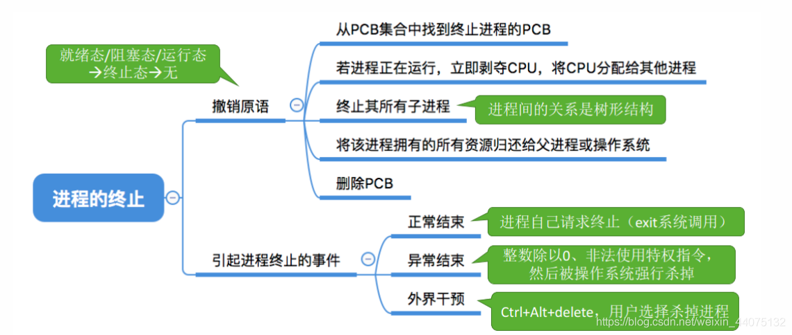

3.阻塞唤醒

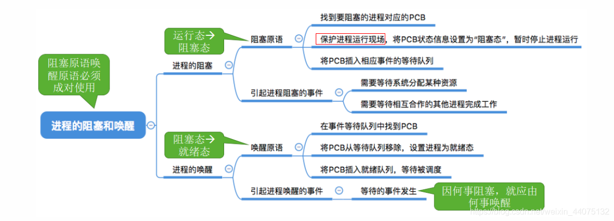

4.进程切换

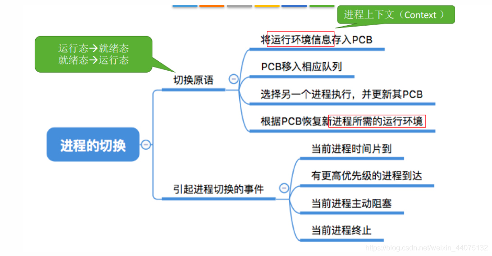

### 四、进程通讯

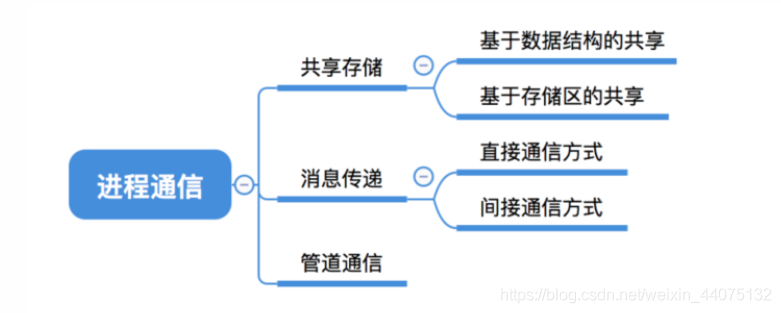

进程通讯：进程通信就是指进程之间的信息交换。

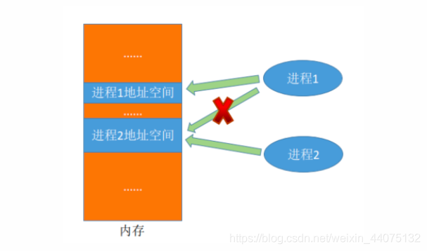

进程是分配系统资源的单位（包括内存地址空间），因此各进程拥有的内存地址空间相互独立。为了保证安全，一个进程不能直接访问另一个进程的地址空间。
但是进程之间的信息交换又是必须实现的。为了保证进程间的安全通信，操作系统提供了一些方法。

1.共享存储：
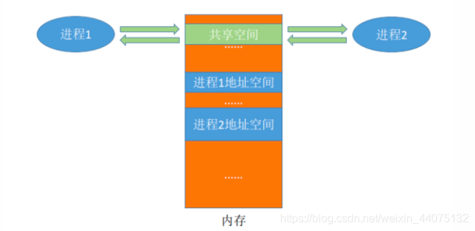

虽然可以同时访问一块空间，但不能同时操作。

- 数据结构共享：固定数据结构，比如共享空间里只能放一个长度为10的数组。这种共享方式速度慢、限制多，是一种低级通信方式。
- 存储区共享：在内存中画出一块共享存储区，数据的形式、存放位置都由进程控制，而不是操作系统。相比之下，这种共享方式速度更快，是一种高级通信方式。

2.管道通信

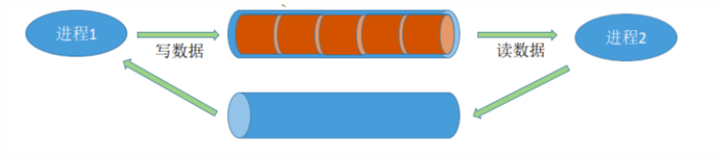
“管道”是指用于连接读写进程的一个共享文件，又名pipe文件。其实就是在内存中开辟一个大小固定的缓冲区。

- 管道只能采用半双工通信，某一时间段内只能实现单向的传输。如果要实现双向同时通信，则需要设置两个管道。
- 各进程要互斥地访问管道。
- 数据以字符流的形式写入管道，当管道写满时，写进程的write() 系统调用将被阻塞，等待读进程将数据取走。当读进程将数据全部取走后，管道变空，此时读进程的read() 系统调用将被阻塞。（缓冲区的特性）
- 如果没写满，就不允许读。如果没读空，就不允许写。（缓冲区的特性）
- 数据一旦被读出，就从管道中被抛弃，这就意味着读进程最多只能有一个，否则可能会有读错数据的情况。

3.消息传递

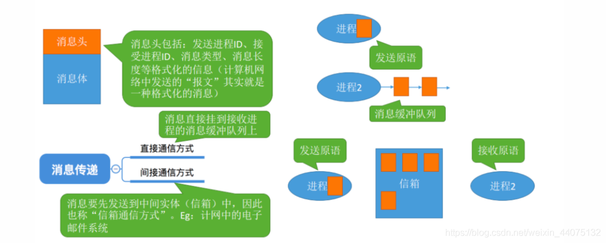

进程间的数据交换以格式化的消息（Message）为单位。进程通过操作系统提供的“发送消息 / 接收消息”两个原语进行数据交换。

需要带上消息头，消息体，消息进程id等。

- 直接消息传递：消息直接挂到接收进程的消息缓冲队列上
- 间接消息传递：消息要先发送到中间实体（信箱）中，因此也称“信箱通信方式”。Eg：计网中的电子邮件系统

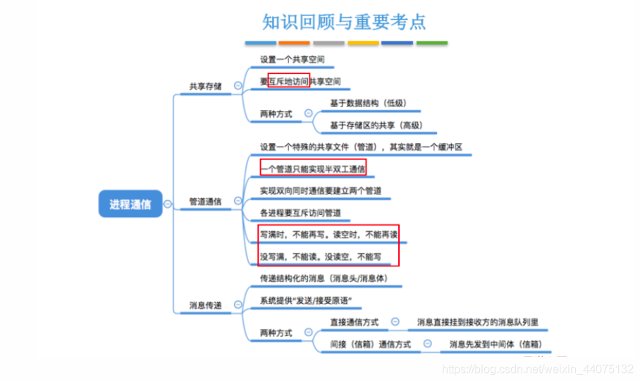

### 五、线程

1.什么是线程，为什么要引入线程？

进程是程序的一次执行。某些功能显然需要用不同的几段程序才能实现，并且这几段程序还要并发运行。采用进程模式只能开启多个进程去执行。

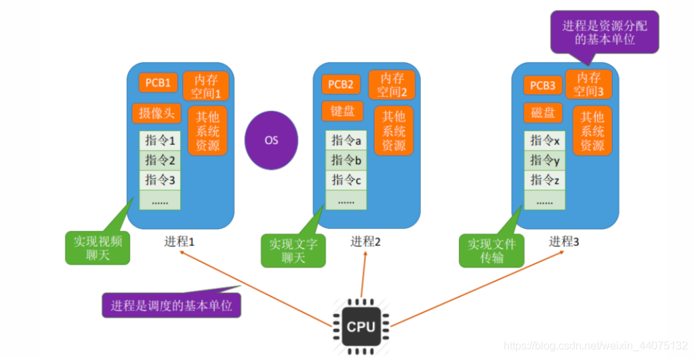

当切换进程时，需要保存 / 恢复进程运行环境，还需要切换内存地址空间（更新快表、更新缓存）开销很大，而这些进程上实际上是来自相同的应用，
有相同的内存空间。

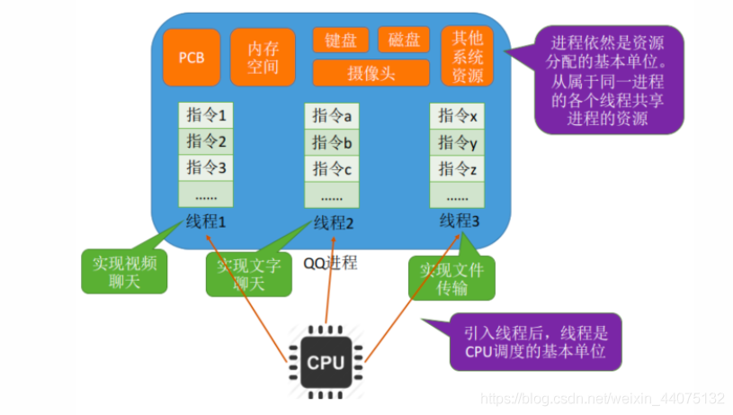

为了在一个进程上并发地执行功能，引入线程增加了系统的并发度。

- 引入线程前，进程既是资源分配的基本单位，也是调度的基本单位，只能执行相同功能的代码，且切换进程的开销较大。

- 引入线程后，进程是资源分配的基本单位，线程是调度的基本单位。同一进程内的各个线程间并发，不需要切换进程运行环境和内存地址空间，省时省力。并发带来的系统开销降低，系统并发性提升。

线程几乎不拥有资源，只拥有极少量的资源（线程控制块TCB、寄存器信息、堆栈等），同一进程中线程共享资源，天然可以通讯。

2.线程实现

用户级线程：

- 用户级线程由应用程序通过线程库实现，所有的线程管理工作都由应用程序负责（包括线程切换）。
- 用户级线程中，线程切换可以在用户态下即可完成，无需操作系统干预。
- 在用户看来，是有多个线程。但是在操作系统内核看来，并意识不到线程的存在。“用户级线程”就是“从用户视角看能看到的线程”。
- 用户级线程的切换在用户空间即可完成，不需要切换到核心态，线程管理的系统开销小，效率，但当一个用户级线程被阻塞后，整个进程都会被阻塞，并发度不高。多个线程不可在多核处理机上并行运行。

内核级线程：
- 内核级线程的管理工作由操作系统内核完成。
- 线程调度、切换等工作都由内核负责，因此内核级线程的切换必然需要在核心态下才能完成。
- 操作系统会为每个内核级线程建立相应的TCB（Thread Control Block，线程控制块），通过TCB对线程进行管理。“内核级线程”就是“从操作系统内核视角看能看到的线程”。
- 当一个线程被阻塞后，别的线程还可以继续执行，并发能力强。多线程可在多核处理机上并行执行。

3.多线程模型

操作系统“看得见”只有内核级线程，因此只有内核级线程才是处理机分配的单位。用户级线程需要映射到内核级线程中。

根据映射模式不同分类：

- 多对一 

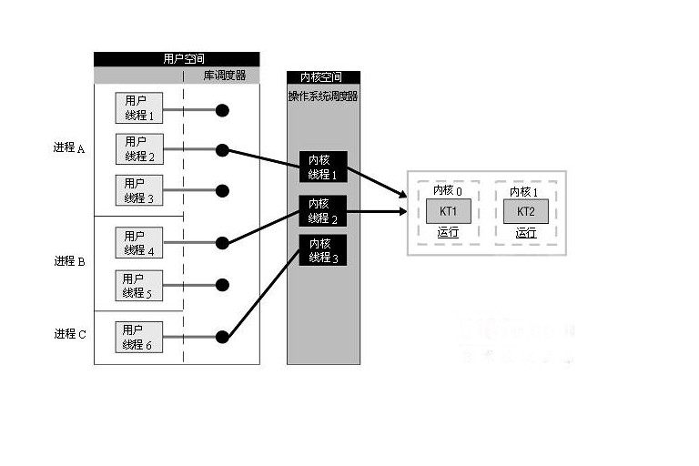

用户线程的切换开销小，但是共用一个内核级线程，并发度不高，且阻塞导致不可用。

- 一对一

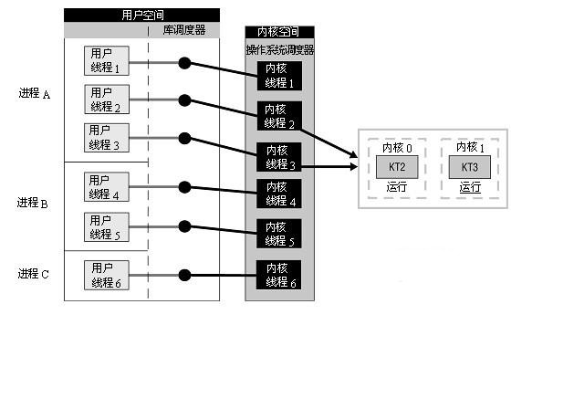

相当于全是内核级线程，并发度高，一个进程会占有多个内核级线程，且切换成本高。

- 多对多

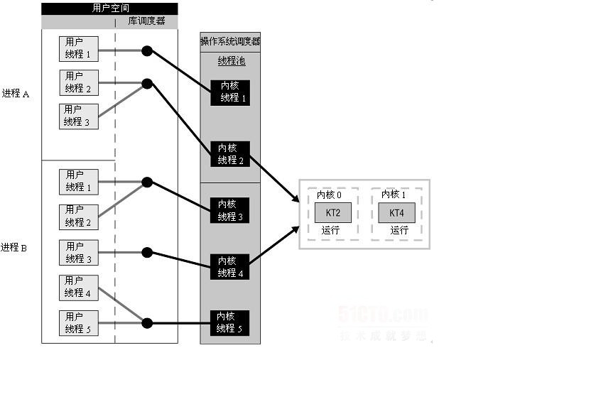
***
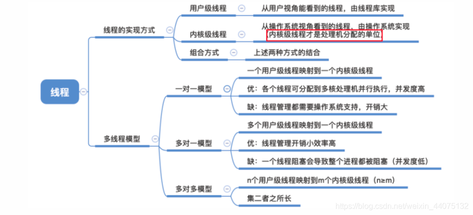

