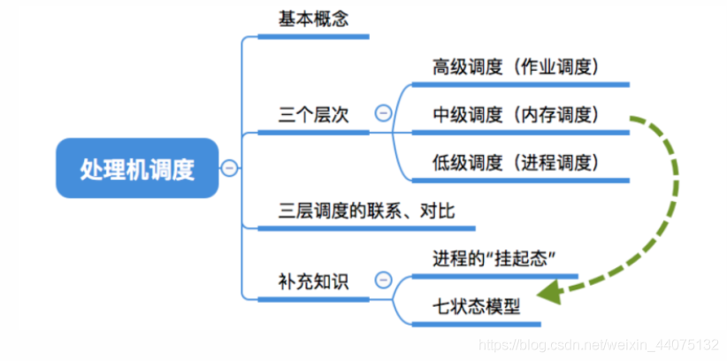
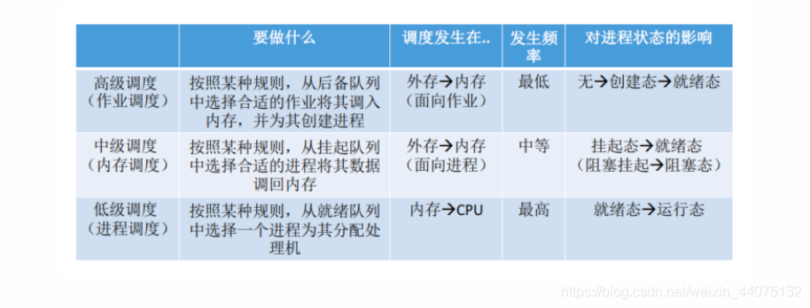
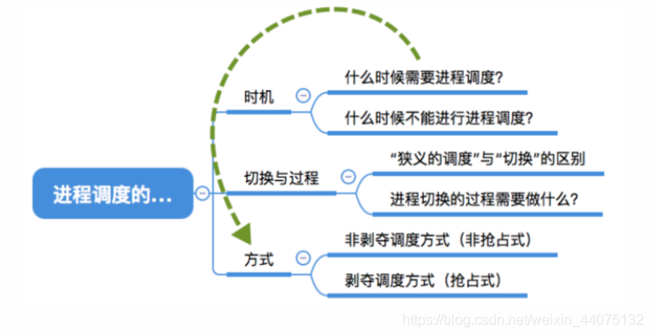
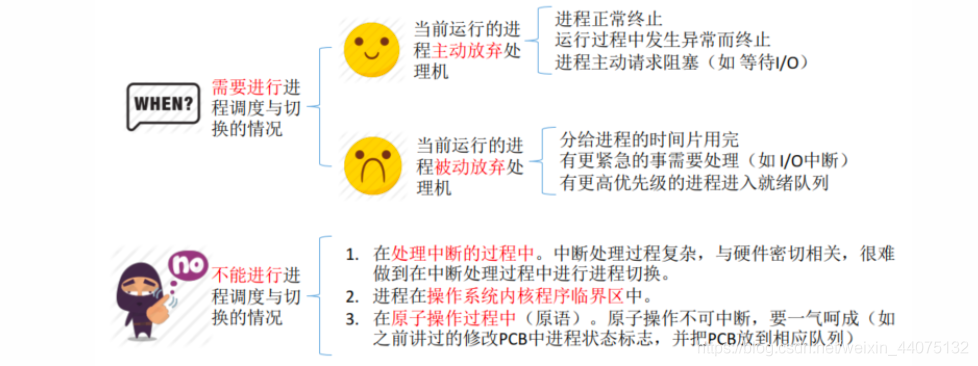
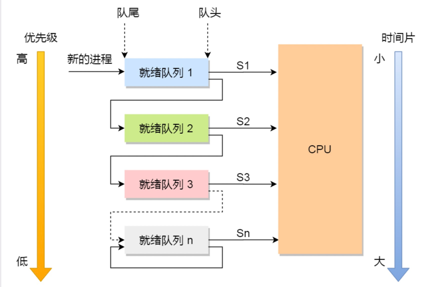
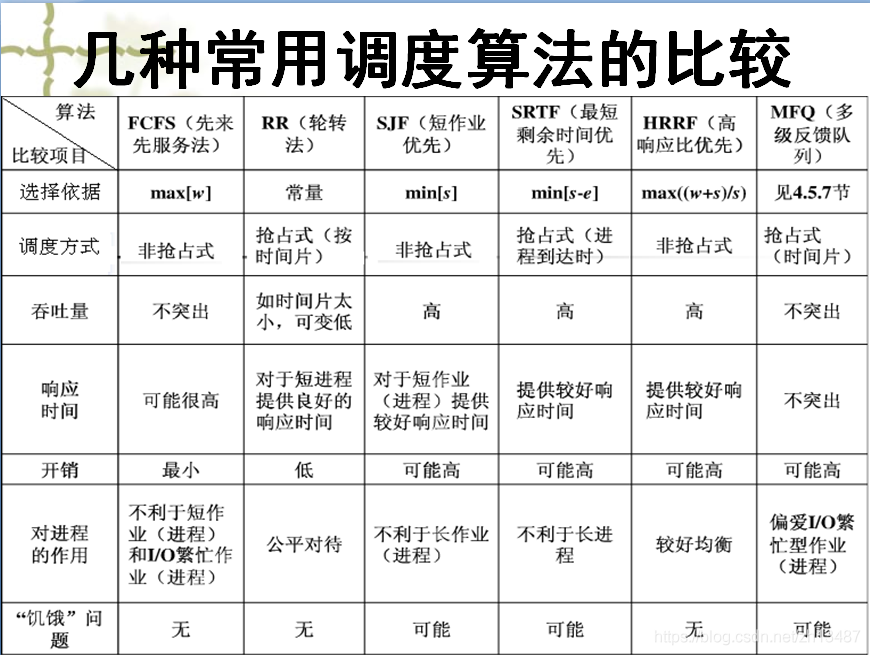

### 六、调度机

当有一堆任务要处理，但由于资源有限，这些事情没法同时处理。这就需要确定某种规则来决定处理这些任务的顺序，这就是“调度”研究的问题。

在多道程序系统中，进程的数量往往是多于处理机的个数的，这样不可能同时并行地处理各个进程。处理机调度，就是从就绪队列中按照一定的算法选择一个进程并将处理机分配给它运行，以实现进程的并发执行。

1.高级调度（作业调度）

由于内存空间有限，有时无法将用户提交的作业全部放入内存，因此就需要确定某种规则来决定将作业调入内存的顺序。

高级调度（作业调度）。按一定的原则从外存上处于后备队列的作业中挑选一个（或多个）作业，给他们分配内存等必要资源，并建立相应的进程（建立PCB），以使它（们）获得竞争处理机的权利。

高级调度是辅存（外存）与内存之间的调度。每个作业只调入一次，调出一次。作业调入时会建立相应的PCB，作业调出时才撤销PCB。高级调度主要是指调入的问题，因为只有调入的时机需要操作系统来确定，但调出的时机必然是作业运行结束才调出

2.中级调度（内存调度）

引入了虚拟存储技术之后，可将暂时不能运行的进程调至外存等待。等它重新具备了运行条件且内存又稍有空闲时，再重新调入内存。这么做的目的是为了提高内存利用率和系统吞吐量。

暂时调到外存等待的进程状态为挂起状态。值得注意的是，PCB并不会一起调到外存，而是会常驻内存。PCB中会记录进程数据在外存中的存放位置，进程状态等信息，操作系统通过内存中的PCB来保持对各个进程的监控、管理。被挂起的进程PCB会被放到的挂起队列中。

中级调度（内存调度），就是要决定将哪个处于挂起状态的进程重新调入内存。中级调度发生的频率要比高级调度更高。

3.低级调度（进程调度）

低级调度（进程调度），其主要任务是按照某种方法和策略从就绪队列中选取一个进程，将处理机分配给它。

进程调度是操作系统中最基本的一种调度，在一般的操作系统中都必须配置进程调度。

进程调度的频率很高，一般几十毫秒一次。

***

### 七、进程调度的时机切换与过程调度方式

进程调度方式：

- 非剥夺调度方式：非抢占方式。即，只允许进程主动放弃处理机。
- 剥夺调度方式：抢占方式，可以优先处理更紧急的进程，也可实现让各进程按时间片轮流执行的功能（通过时钟中断）。适合于分时操作系统、实时操作系统。

进程切换时机：

临界资源：一个时间段内只允许一个进程使用的资源。各进程需要互斥地访问临界资源。临界区就是访问临界资源的那段代码。

内核程序临界区一般是用来访问某种内核数据结构的，比如进程的就绪队列（由各就绪进程的PCB组成）。

在内核程序临界区中不能进行进程的调度和切换，而在普通临界区中是可以进行调度、切换的。

进程切换的过程：

- 对原来运行进程各种数据的保存。

- 对新的进程各种数据的恢复（如：程序计数器、程序状态字、各种数据寄存器等处理机现场信息，这些信息一般保存在进程控制块）。

注意：进程切换是有代价的，因此如果过于频繁的进行进程调度、切换，必然会使整个系统的效率降低，使系统大部分时间都花在了进程切换上，而真正用于执行进程的时间减少。

### 八、调度算法

- CPU利用率：利用率=忙碌的时间/总时间
- 系统吞吐量：系统吞吐量=总共完成了多少道作业/总共花了多少时间
- 周转时间：平均周转时间=各作业周转时间之和/作业数
- 等待时间：指进程 / 作业处于等待处理机状态时间之和
- 响应时间：指从用户提交请求到首次产生响应所用的时间

调度算法：

1.先来先服务

从“公平”的角度考虑，按照作业/进程到达的先后顺序进行服务，用于作业调度时，考虑的是哪个作业先到达后备队列。
用于进程调度时，考虑的是哪个进程先到达就绪队列，属于非抢占式算法。不会导致饥饿。

优点：公平、算法实现简单

缺点：排在长作业（进程）后面的短作业需要等待很长时间，带权周转时间很大，对短作业来说用户体验不好。即FCFS算法对长作业有利，对短作业不利。

2.短作业优先（SJF, Shortest Job First）

追求最少的平均等待时间，最少的平均周转时间、最少的平均平均带权周转时间。最短的作业 / 进程优先得到服务（所谓“最短”，是指要求服务时间最短）。
即可用于作业调度，也可用于进程调度。用于进程调度时称为“短进程优先（SPF, Shortest Process First）算法”。一般使用非抢占式策略。

优点：“最短的”平均等待时间、平均周转时间

缺点：不公平。对短作业有利，对长作业不利。可能产生饥饿现象。另外，作业/进程的运行时间是由用户提供的，并不一定真实，不一定能做到真正的短作业优先。
会导致长时间某个作业得不到响应。

3.高响应比优先算法

综合考虑作业/进程的等待时间和要求服务的时间，在每次调度时先计算各个作业/进程的响应比，选择响应比最高的作业/进程为其服务。

动态计算权值，比较均衡的算法。

4.时间片轮转调度算法

每个进程被分配一个时间段，称为时间片（Quantum），即允许该进程在该时间段中运行。

- 如果时间片用完，进程还在运行，那么将会把此进程从CPU释放出来，并把CPU分配另外一个进程；
- 如果该进程在时间片结束前阻塞或结束，则CPU立即进行切换；

如果时间片设得太短会导致过多的进程上下文切换，降低了CPU效率，如果设得太长又可能引起对短作业进程的响应时间变长。将通常时间片设为20ms~50ms通常是一个比较合理的折中值。

5.最高优先级调度算法

时间片轮转算法的思想是所有的进程同等重要，而优先级调度算法会从就绪队列中选择最高优先级的进程进行运行。

- 静态优先级：创建进程时候，就已经确定了优先级了，然后整个运行时间优先级都不会变化。 
- 动态优先级：根据进程的动态变化调整优先级，比如如果进程运行时间增加，则降低其优先级，如果进程等待时间（就绪队列的等待时间）增加，则升高其优先级，也就是随着时间的推移增加等待进程的优先级。

可以使用抢占式策略或非抢占式策略
- 非抢占式：当就绪队列中出现优先级高的进程，运行完当前进程，再选择优先级高的进程。
- 抢占式：当就绪队列中出现优先级高的进程，当前进程挂起，调度优先级高的进程运行。

可能会导致低优先级的进程永远不会运行。

6.多级反馈队列调度算法

多级反馈队列（Multilevel Feedback Queue）调度算法是「时间片轮转算法」和「最高优先级算法」的综合和发展。

- 多级表示有多个队列，每个队列优先级从高到低，同时优先级越高时间片越短。
- 反馈表示如果有新的进程加入优先级高的队列时，立刻停止当前正在运行的进程，转而去运行优先级高的队列。

队列工作流程

- 设置了多个队列，赋予每个队列不同的优先级，每个队列优先级从高到低，同时优先级越高时间片越短；
- 新的进程会被放入到第一级队列的末尾，按先来先服务的原则排队等待被调度，如果在第一级队列规定的时间片没运行完成，则将其转入到第二级队列的末尾，以此类推，直至完成；
- 当较高优先级的队列为空，才调度较低优先级的队列中的进程运行。如果进程运行时，有新进程进入较高优先级的队列，则停止当前运行的进程并将其移入到原队列末尾，接着让较高优先级的进程运行；

可以发现，对于短作业可能可以在第一级队列很快被处理完。对于长作业，如果在第一级队列处理不完，可以移入下次队列等待被执行，虽然等待的时间变长了，
但是运行时间也会更长了，所以该算法很好的兼顾了长短作业，同时有较好的响应时间。

