### 一、同步与互斥

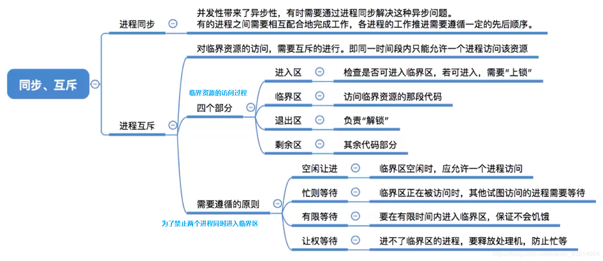

- 异步性：各并发执行的进程以各自独立的、不可预知的速度向前推进。
- 同步性：为了协调进程之间的相互制约关系,如等待、传递信息等，同步也称为直接制约关系。

进程互斥指当一个进程访问某临界资源时，另一个想要访问该临界资源的进程必须等待。当前访问临界资源的进程访问结束，释放该资源之后，另一个进程才能去访问临界资源。

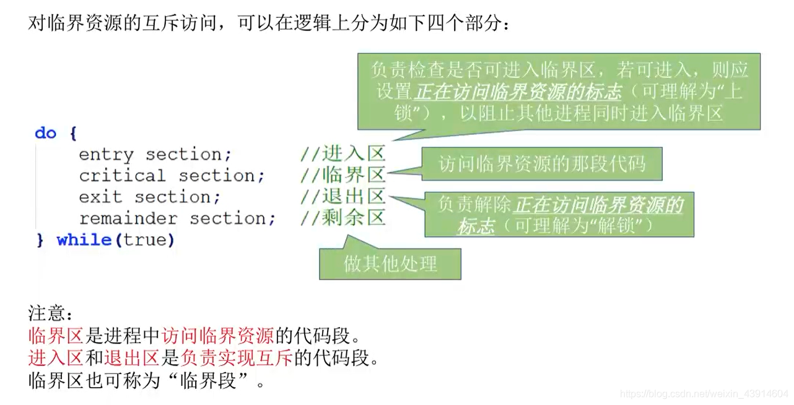

1.进程互斥的软件实现

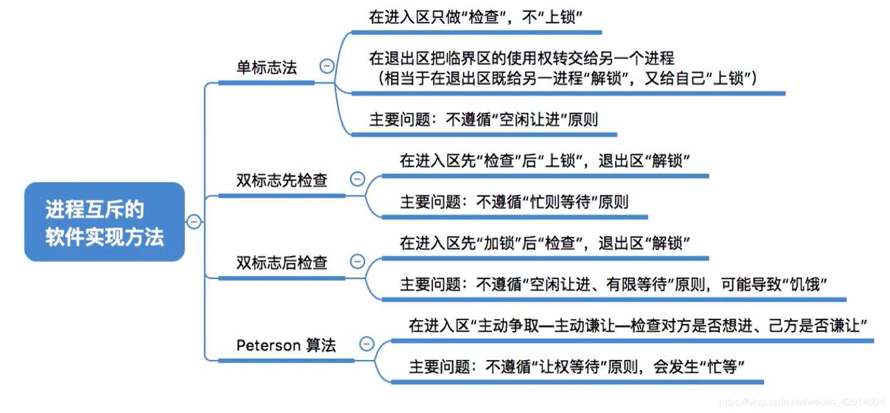

- 单标志法

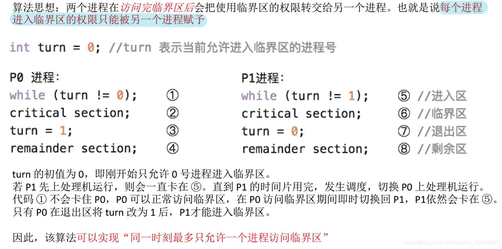

- 双标志先检查法

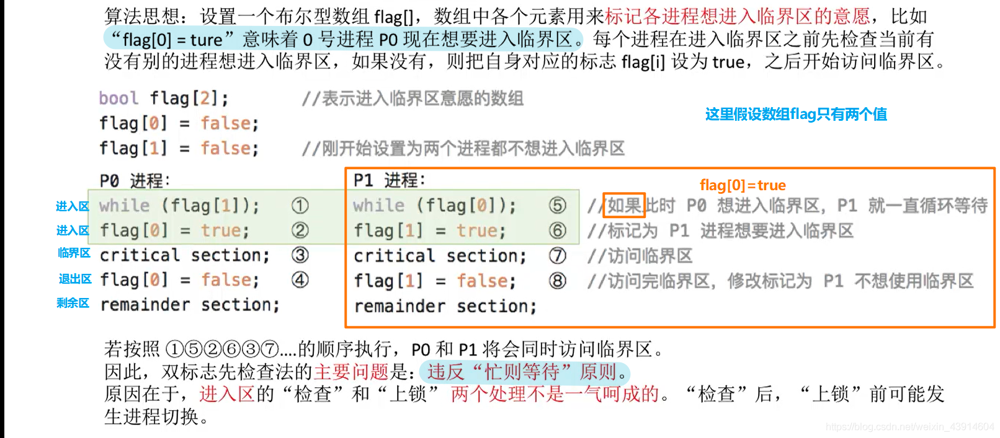
检查和上锁过程非原子化


- 双标志后检查法
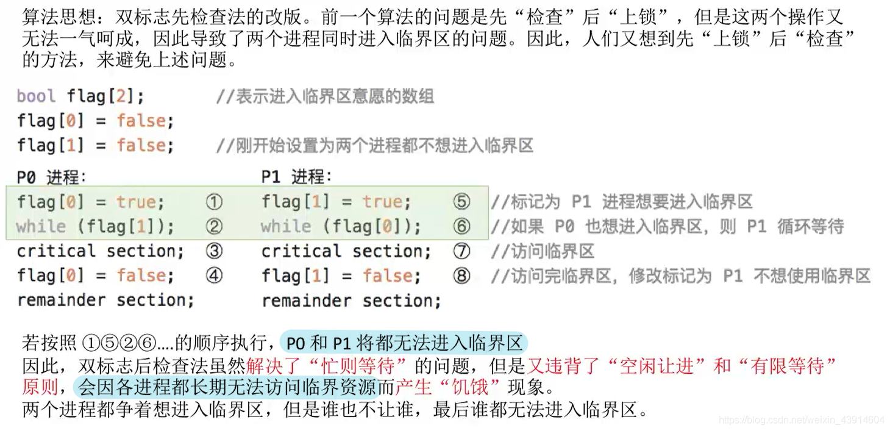
  出现无限等待的死锁情况
  
- Peterson算法

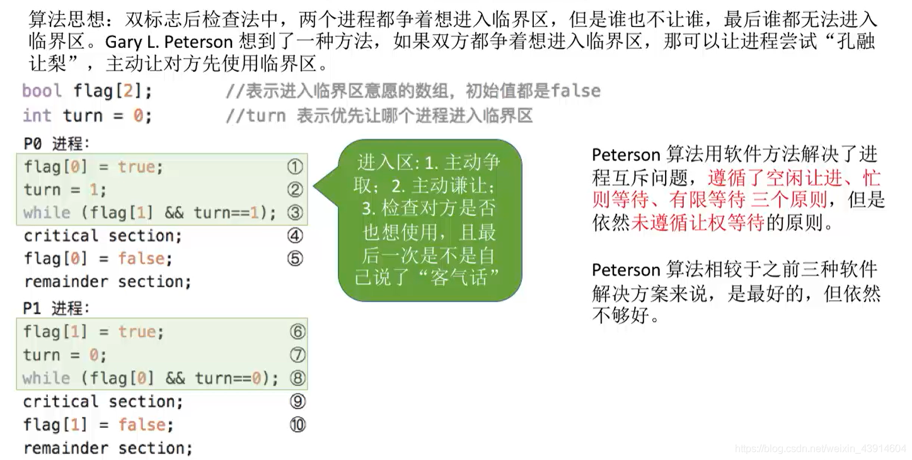

2.进程互斥的硬件实现 


- 中断屏蔽方式

利用“开 / 关中断指令”实现（与原语的实现思想相同，即在某进程开始访问临界区到结束访问为止都不允许被中断，也就不能发生进程切换，因此也不可能发生两个同时访问临界区的情况）

优点：简单、高效

缺点：不适用于多处理机；只适用于操作系统内核进程，不适用于用户进程（因为开 / 关中断指令 只能运行在内核态，这组指令如果能让用户随意使用会很危险）

- TestAndSet指令

底层语义上的CAS操作，检查和上锁原子化。

优点：实现简单，无需像软件实现方法那样严格检查是否会有逻辑漏洞；适用于多处理机环境。

缺点：不满足让权等待原则，暂时无法进入临界区的进程会占用CPU并循环执行TSL指令，从而导致“忙等”。

- Swap指令

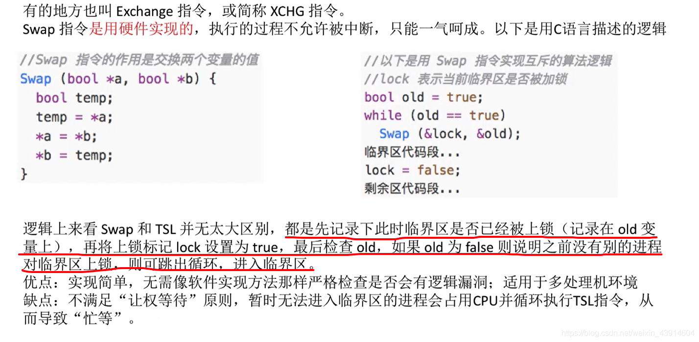
逻辑上来看Swap 和TSL 并无太大区别。

### 二、信号量

之前的互斥方案无法解决让权等待的功能。

信号量其实就是一个变量（可以是一个整数，也可以是更复杂的记录型变量） ，可以用一个信号量来表示系统中某种资源的数量。

用户进程可以通过使用操作系统提供的一对原语来对信号量进行操作，wait、signal 原语常简称为P、V操作（来自荷兰语proberen 和verhogen）。

1.整型信号量

用一个整数型的变量作为信号量，用来表示系统中某种资源的数量，对信号量的操作只有三种，即初始化、P操作、V操作。

打印机例子：
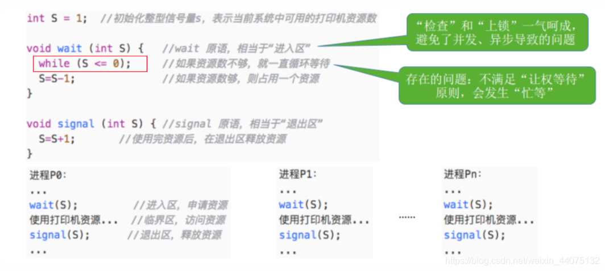

2.记录型信号量

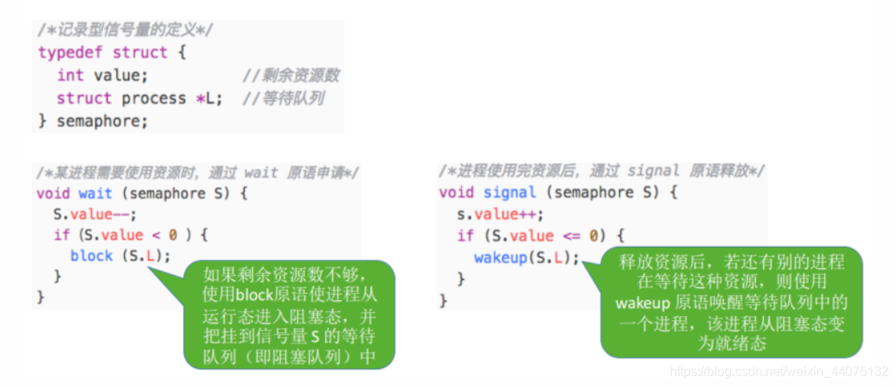

P操作请求资源，资源数减1，如果小于0，进程应调用block 原语进行自我阻塞（当前运行的进程从运行态 ----> 阻塞态），
主动放弃处理机，并插入该类资源的等待队列S.L 中。可见，该机制遵循了“让权等待”原则。

V操作释放资源，资源数加+1，如果仍然小于等于0，表示还有其他进程等待资源，
因此应调用wakeup 原语唤醒等待队列中的第一个进程（被唤醒进程从阻塞态 ----> 就绪态）。

3.信号量实现互斥

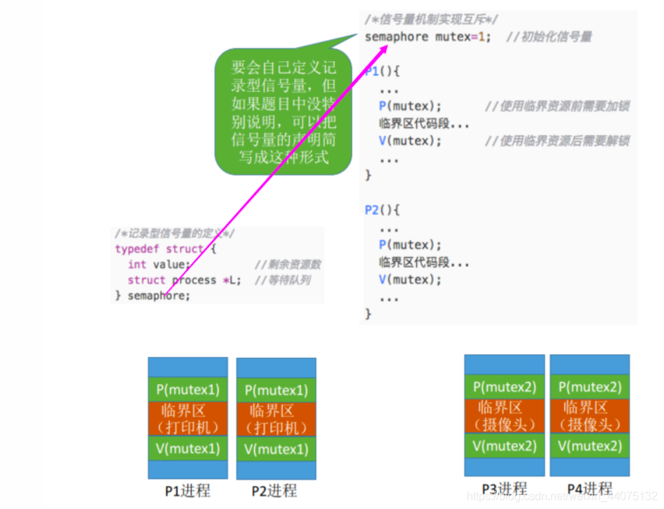

- 对不同的临界资源需要设置不同的互斥信号量。
- P、V操作必须成对出现。缺少P(mutex) 就不能保证临界资源的互斥访问。缺少V(mutex) 会导致资源永不被释放，等待进程永不被唤醒。

4.信号量实现同步 

进程同步：要让各并发进程按要求有序地推进。

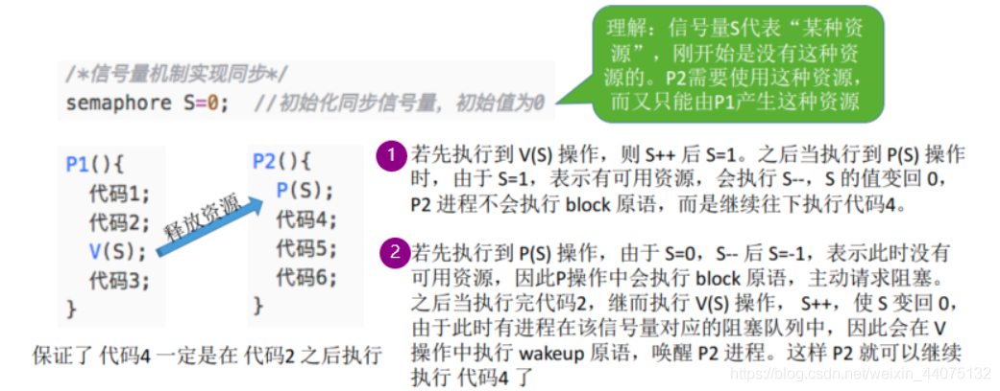


5.信号量机制实现前驱关系

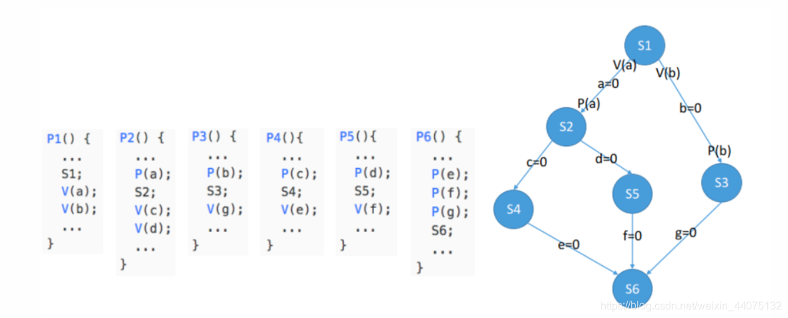

拓扑图结构。

- 要为每一对前驱关系各设置一个同步信号量
- 在“前操作”之后对相应的同步信号量执行V操作
- 在“后操作”之前对相应的同步信号量执行P操作

6.生产者消费者问题

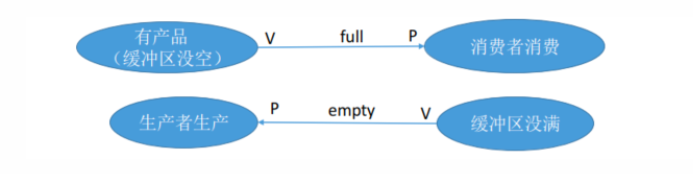

- semaphore mutex = 1; // 互斥信号量，实现对缓冲区的互斥访问
- semaphore empty = n; // 同步信号量，表示空闲缓冲区的数量
- semaphore full = 0; // 同步信号量，表示产品的数量，也即非空缓冲区的数量

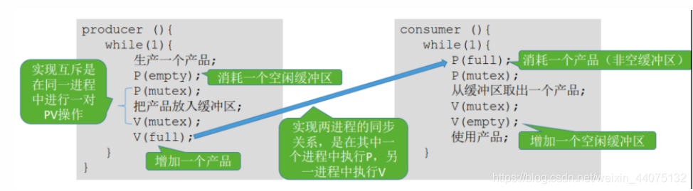

能否改变相邻P、V操作的顺序？
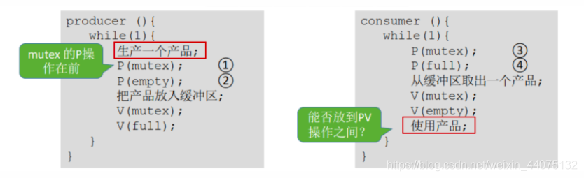

因此，实现互斥的P操作一定要在实现同步的P操作之后，否则导致死锁。
V操作不会导致进程阻塞，因此两个V操作顺序可以交换。

7.多生产者和消费者

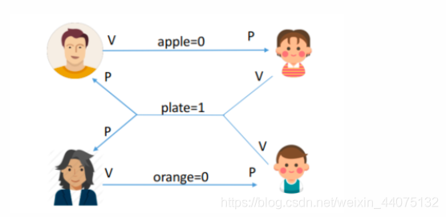

对缓冲区（盘子）的访问要互斥地进行，父亲将苹果放入盘子后，女儿才能取苹果。母亲将橘子放入盘子后，儿子才能取橘子。只有盘子为空时，父亲或母亲才能放入水果

````
semaphore mutex = 1; // 实现互斥访问盘子（缓冲区）
semaphore apple = 0; // 盘子中有几个苹果
semaphore orange = 0; // 盘子中有几个橘子
semaphore plate = 1; // 盘子中还可以放多少个水果
````

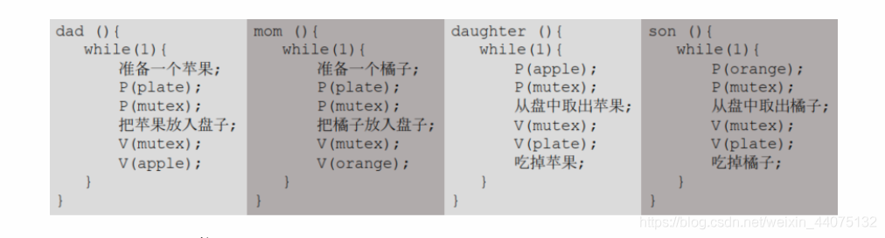

由于缓冲区大小为1，在任何时刻，apple、 orange、 plate 三个同步信号量中最多只有一个是1。
因此在任何时刻，最多只有一个进程的P操作不会被阻塞，并顺利地进入临界区。所以可以去掉缓冲区的互斥。

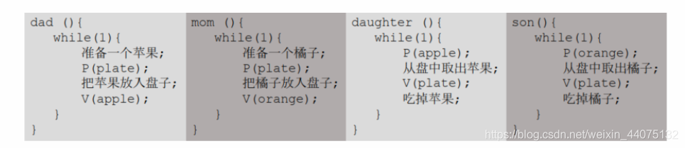

如果缓冲区大小大于1，就必须专门设置一个互斥信号量 mutex 来保证互斥访问缓冲区。

8.吸烟者问题

假设一个系统有三个抽烟者进程和一个供应者进程。每个抽烟者不停地卷烟并抽掉它，但是要卷起并抽掉一支烟，抽烟者需要有三种材料：烟草、纸和胶水。

三个抽烟者中，第一个拥有烟草、第二个拥有纸、第三个拥有胶水。

供应者进程无限地提供三种材料，供应者每次将两种材料放桌子上，拥有剩下那种材料的抽烟者卷一根烟并抽掉它，并给供应者进程一个信号告诉完成了，供应者就会放另外两种材料再桌上，这个过程一直重复（让三个抽烟者轮流地抽烟）

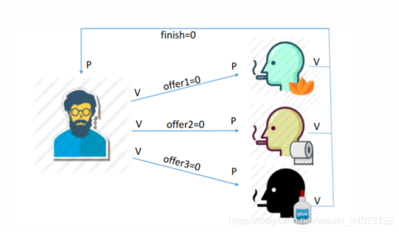

````
semaphore offer1 = 0; // 桌上组合一的数量
semaphore offer2 = 0; // 桌上组合二的数量
semaphore offer3 = 0; // 桌上组合三的数量
semaphore finish = 0; // 抽烟是否完成
int i = 0; // 用于实现“三个抽烟者轮流抽烟”

provider() {
	while(1){
		if(i==0) {
			将组合一放桌上 ;
			V(offer1);
		} else if(i==1){
			将组合二放桌上 ;
			V(offer2);
		} else if(i == 2){
			将组合三放桌上 ;
			V(offer3);
		}
		i = (i+1)%3;
		P(finish);
	}
}
````

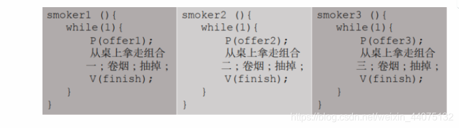

9.哲学家问题

一张圆桌上坐着5名哲学家，每两个哲学家之间的桌上摆一根筷子，桌子的中间是一碗米饭。哲学家们倾注毕生的精力用于思考和进餐，哲学家在思考时，并不影响他人。只有当哲学家饥饿时，才试图拿起左、右两根筷子（一根一根地拿起）。如果筷子已在他人手上，则需等待。饥饿的哲学家只有同时拿起两根筷子才可以开始进餐，当进餐完毕后，放下筷子继续思考。

死锁现象：
````
semaphore chopstick[5]={1,1,1,1,1};
Pi (){ //i号哲学家的进程
	while(1){
		P(chopstick[i]); // 拿左
		P(chopstick[(i+1)%5]); // 拿右
		吃饭…
		V(chopstick[i]); // 放左
		V(chopstick[(i+1)%5]); // 放右
		思考…
	}
}
````

解法1：只允许四个哲学家同时拿左筷子，保证至少有一个哲学家进餐。
````
semaphore chopstick[5]={1,1,1,1,1};
semaphore r = 4;

Pi (){ //i号哲学家的进程
	while(1){
	    P(r)//请求进餐-1
		P(chopstick[i]); // 拿左
		P(chopstick[(i+1)%5]); // 拿右
		吃饭…
		V(chopstick[i]); // 放左
		V(chopstick[(i+1)%5]); // 放右
		V(r)//完成+1
		思考…
	}
}
````

解法二：仅当哲学家的左右手筷子都拿起时才允许进餐。
````
semaphore chopstick[5]={1,1,1,1,1};

Pi (){ //i号哲学家的进程
	while(1){
		P(chopstick[i] && chopstick[(i+1)%5]); //拿左和拿右
		吃饭…
		V(chopstick[i] && chopstick[(i+1)%5]); //放左和放右
		V(r)//完成+1
		思考…
    }
}
````

利用互斥信号量实现左右的原子化

````
semaphore chopstick[5]={1,1,1,1,1};
semaphore mutex = 1;

Pi (){ //i号哲学家的进程
	while(1){
	    P(mutex)
		P(chopstick[i]); // 拿左
		P(chopstick[(i+1)%5]); // 拿右
		V(mutex)
		吃饭…
		V(chopstick[i]); // 放左
		V(chopstick[(i+1)%5]); // 放右
		思考…
	}
}
````

### 三、管程

1.为什么要引入管程

信号量机制存在的问题：编写程序困难、易出错。能不能设计一种机制，让程序员写程序时不需要再关注复杂的PV操作。

1973年，Brinch Hansen 首次在程序设计语言 (Pascal)中引入了“管程”成分，一种高级同步机制。

2.管程的组成：

- 局部于管程的共享数据结构说明；
- 对该数据结构进行操作的一组过程；
- 对局部于管程的共享数据设置初始值的语句；
- 管程有一个名字。

3.管程的特征：

- 局部于管程的数据只能被局部于管程的过程所访问；
- 一个进程只有通过调用管程内的过程才能进入管程访问共享数据；
- 每次仅允许一个进程在管程内执行某个内部过程。

4.管程解决消费者

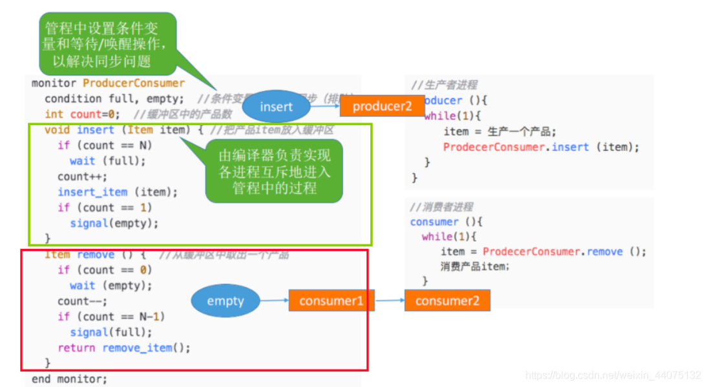

5.Java 中类似于管程的机制

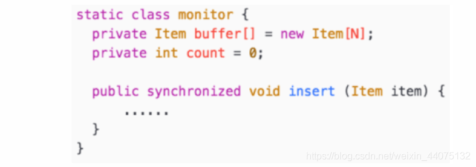

其实就是对上锁和解锁的过程进行了一次封装。

### 四、死锁

- 死锁:各进程互相等待对方手里的资源，导致各进程都阻塞，无法向前推进的现象。

- 饥饿:由于长期得不到想要的资源，某进程无法向前推进的现象。比如:在短进程优先(SPF) 算法中，若有源源不断的短进程到来，则长进程将一直得不到处理机， 从而发生长进程“饥饿”。

- 死循环:某进程执行过程中一直跳不出某个循环的现象。有时是因为程序逻辑bug导致的，有时是程序员故意设计的。

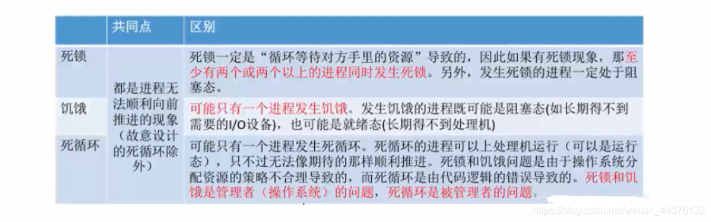

1.死锁的四个必要条件

- 互斥条件:只有对必须互斥使用的资源的争抢才会导致死锁(如哲学家的筷子、打印机设备)。像内存、扬声器这样可以同时让多个进程使用的资源是不会导致死锁的(因为进程不用阻塞等待这种资源)。
- 不剥夺条件:进程所获得的资源在未使用完之前，不能由其他进程强行夺走，只能主动释放。
- 请求和保持条件:进程已经保持了至少一个资源，但又提出了新的资源请求，而该资源又被其他进程占有，此时请求进程被阻塞，但又对自己已有的资源保持不放。
- 循环等待条件:存在一种进程资源的循环等待链，链中的每一个进程已获得的资源同时被下一个进程所请求。

注意!发生死锁时一定有循环等待，但是发生循环等待时未必死锁( 循环等待是死锁的必要不充分条件)。

如果同类资源数大于1，则即使有循环等待，也未必发生死锁。但如果系统中每类资源都只有一个，那循环等待就是死锁的充分必要条件了。

2.什么时候发生死锁

- 对系统资源的竞争。各进程对不可剥夺的资源(如打印机)的竞争可能引起死锁，对可剥夺的资源(CPU)的竞争是不会引起死锁的。
- 进程推进顺序非法。请求和释放资源的顺序不当，也同样会导致死锁。例如，并发执行的进程P1、P2分别申请并占有了资源R1、R2，之后进程P1又紧接着申请资源R2，而进程P2又申请资源R1,两者会因为申请的资源被对方占有而阻塞，从而发生死锁。
- 信号量的使用不当也会造成死锁。如生产者~消费者问题中，如果实现互斥的P操作在实现同步的P操作之前，就有可能导致死锁。(可 以把互斥信号量、同步信号量也看做是一种抽象的系统资源)。

总之，对不可剥夺资源的不合理分配，可能导致死锁。

3.预防死锁

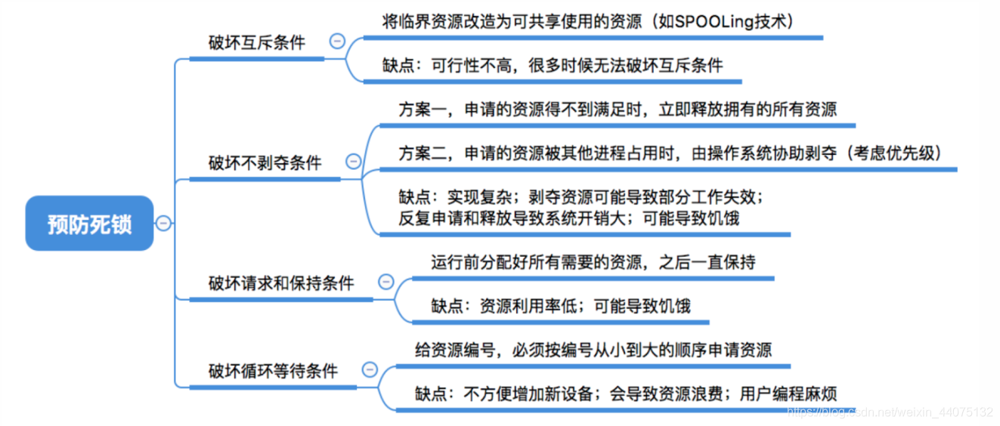

- 破坏互斥条件

如果把只能互斥使用的资源改造为允许共享使用，则系统不会进入死锁状态。比如 : SPOOLing技术。操作系统可以采用SPOOLing 技术把独占设备在逻辑上改造成共享设备。比如，用SPOOLing技术将打印机改造为共享设备…

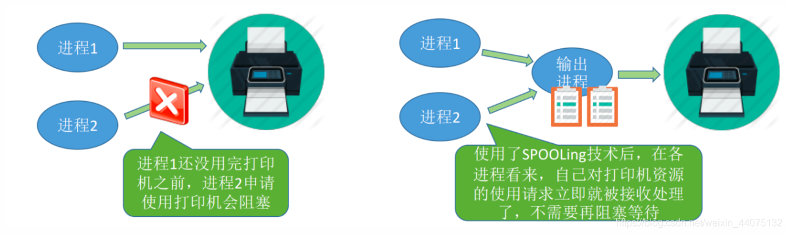

该策略的缺点：并不是所有的资源都可以改造成可共享使用的资源。并且为了系统安全，很多地方还必须保护这种互斥性。因此，很多时候都无法破坏互斥条件。

- 破坏不剥夺条件

  - 当某个进程请求新的资源得不到满足时，它必须立即释放保持的所有资源，待以后需要时再重新申请。也就是说，即使某些资源尚未使用完，也需要主动释放，从而破坏了不可剥夺条件。
  - 当某个进程需要的资源被其他进程所占有的时候，可以由操作系统协助，将想要的资源强行剥夺。这种方式一般需要考虑各进程的优先级（比如：剥夺调度方式，就是将处理机资源强行剥夺给优先级更高的进程使用）。

该策略的缺点：
1.实现起来比较复杂。
2.释放已获得的资源可能造成前一阶段工作的失效。因此这种方法一般只适用于易保存和恢复状态的资源，如CPU。
3.反复地申请和释放资源会增加系统开销，降低系统吞吐量。
4.若采用方案一，意味着只要暂时得不到某个资源，之前获得的那些资源就都需要放弃，以后再重新申请。如果一直发生这样的情况，就会导致进程饥饿。

- 破坏请求和保持条件
  
请求和保持条件：进程已经保持了至少一个资源，但又提出了新的资源请求，而该资源又被其他进程占有，此时请求进程被阻塞，但又对自己已有的资源保持不放。

可以采用静态分配方法，即进程在运行前一次申请完它所需要的全部资源，在它的资源未满足前，不让它投入运行。一旦投入运行后，这些资源就一直归它所有，该进程就不会再请求别的任何资源了。

该策略的缺点：有些资源可能只需要用很短的时间，因此如果进程的整个运行期间都一直保持着所有资源，就会造成严重的资源浪费，资源利用率极低。另外，该策略也有可能导致某些进程饥饿。

- 破坏循环等待条件

可采用顺序资源分配法。首先给系统中的资源编号，规定每个进程必须按编号递增的顺序请求资源，同类资源（即编号相同的资源）一次申请完。

一个进程只有已占有小编号的资源时，才有资格申请更大编号的资源。按此规则，已持有大编号资源的进程不可能逆向地回来申请小编号的资源，从而就不会产生循环等待的现象。

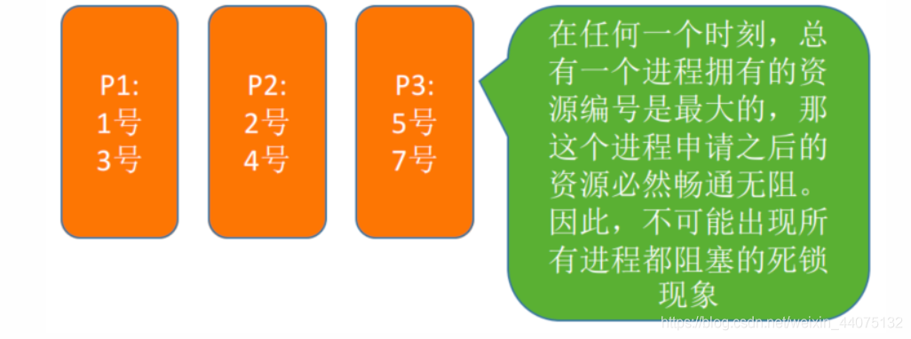

该策略的缺点：
1.不方便增加新的设备，因为可能需要重新分配所有的编号；
2.进程实际使用资源的顺序可能和编号递增顺序不一致，会导致资源浪费；
3.必须按规定次序申请资源，用户编程麻烦。
****

4.避免死锁 

安全序列、不安全状态、死锁：

所谓安全序列，就是指如果系统按照这种序列分配资源，则每个进程都能顺利完成。只要能找出一个安全序列，系统就是安全状态。当然，安全序列可能有多个。

如果分配了资源之后，系统中找不出任何一个安全序列，系统就进入了不安全状态。这就意味着之后可能所有进程都无法顺利的执行下去。当然，如果有进程提前归还了一些资源，那系统也有可能重新回到安全状态，不过我们在分配资源之前总是要考虑到最坏的情况。

如果系统处于安全状态，就一定不会发生死锁。如果系统进入不安全状态，就可能发生死锁（处于不安全状态未必就是发生了死锁，但发生死锁时一定是在不安全状态）

因此可以在资源分配之前预先判断这次分配是否会导致系统进入不安全状态，以此决定是否答应资源分配请求。这也是“银行家算法”的核心思想。


5.死锁的检测和解除


进程分配资源图：

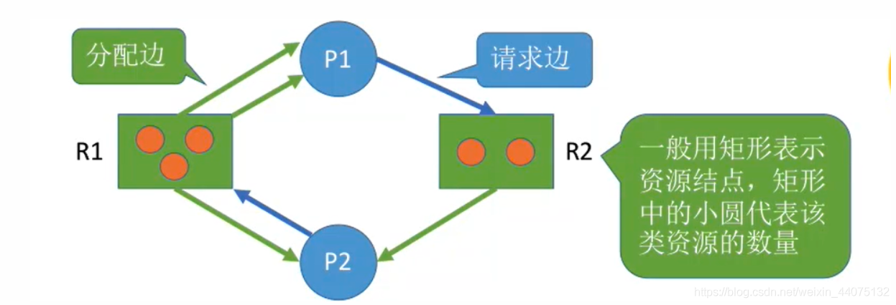

如果系统中剩余的可用资源数足够满足进程的需求，那么这个进程暂时是不会阻塞的，可以顺利地执行下去。如果这个进程执行结束了把资源归还系统，就可能使某些正在等待资源的进程被激活，并顺利地执行下去。相应的，这些被激活的进程执行完了之后又会归还一些资源，这样可能又会激活另外一些阻塞的进程…

如果按上述过程分析，最终能消除所有边，就称这个图是可完全简化的。此时一定没有发生死锁（相当于能找到一个安全序列）。

如果最终不能消除所有边，那么此时就是发生了死锁。

死锁如何解除：

一旦检测出死锁的发生，就应该立即解除死锁。

补充：并不是系统中所有的进程都是死锁状态，用死锁检测算法化简资源分配图后，还连着边的那些进程就是死锁进程。

解除死锁的主要方法有：
- 资源剥夺法。挂起（暂时放到外存上）某些死锁进程，并抢占它的资源，将这些资源分配给其他的死锁进程。但是应防止被挂起的进程长时间得不到资源而饥饿。

- 撤销进程法（或称终止进程法）。强制撤销部分、甚至全部死锁进程，并剥夺这些进程的资源。这种方式的优点是实现简单，但所付出的代价可能会很大。因为有些进程可能已经运行了很长时间，已经接近结束了，一旦被终止可谓功亏一篑，以后还得从头再来。

- 进程回退法。让一个或多个死锁进程回退到足以避免死锁的地步。这就要求系统要记录进程的历史信息，设置还原点。


