### 五、分页存储基本地址转换

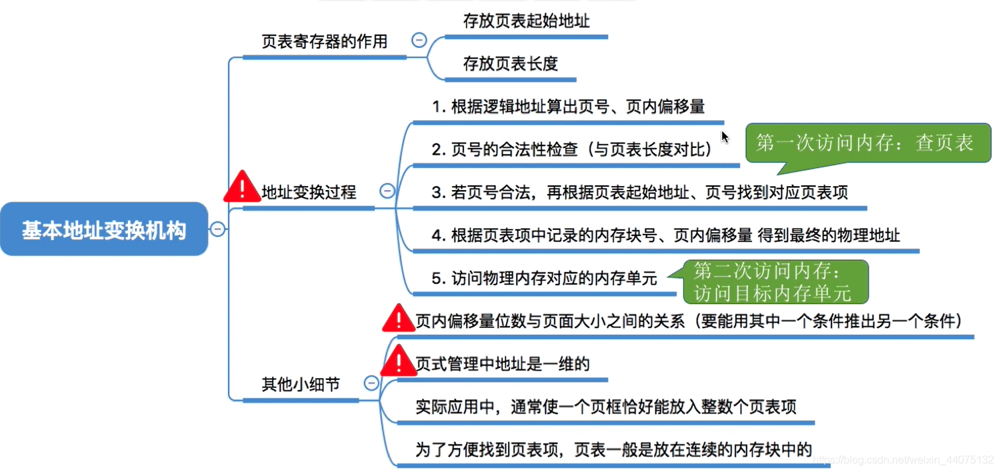

基本地址变换机构可以借助进程的页表将逻辑地址转换为物理地址。

通常会在系统中设置一个页表寄存器(PTR)，存放页表在内存中的起始地址F和页表长度M。进程未执行时，页表的始址和页表长度放在进程控制块(PCB) 中，当进程被调度时，操作系统内核会把它们放到页表寄存器中。

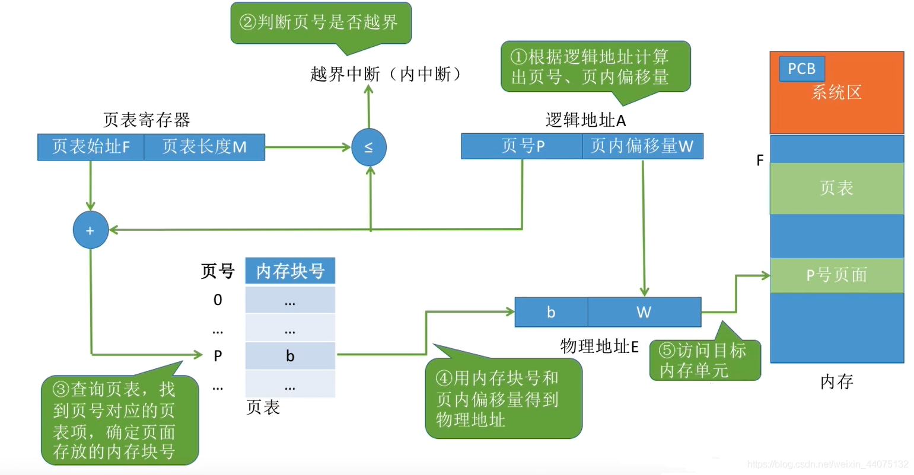

获取下一条指令的地址：

1.计算页号P和页内偏移量W (如果用十进制数手算，则P=A/L，W=A%L;但是在计算机实际运行时，逻辑地址结构是固定不变的，因此计算机硬件可以更快地得到二进制表示的页号、页内偏移量)。

2.比较页号P和页表长度M，若P≥M,则产生越界中断，否则继续执行。(注意: 页号是从0开始的，而页表长度至少是1，因此P=M时也会越界)。

3.页表中页号P对应的页表项地址=页表起始地址F+页号P*页表项长度，取出该页表项内容b,即为内存块号。

4.计算E=b*L+ W,用得到的物理地址E去访存。(如果内存块号、 页面偏移量是用二进制表示的，那么把二者拼接起来就是最终的物理地址了)

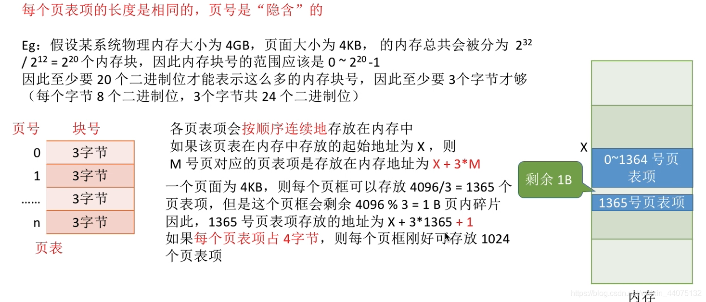

理论上，页表项长度为3B即可表示内存块号的范围，但是，为了方便页表的查询，常常会让一个页表项占更多的字节，使得每个页面恰好可以装得下整数个页表项。进程页表通常是装在连续的内存块中的

### 五、快表地址转换

1.局部性原理

- 时间局部性:如果执行了程序中的某条指令，那么不久后这条指令很有可能再次执行;如果某个数据被访问过，不久之后该数据很可能再次被访问。(因为程序中存在大量的循环)。

- 空间局部性:一旦程序访问了某个存储单元，在不久之后，其附近的存储单元也很有可能被访问。(因为很多数据在内存中都是连续存放的)。

2.快表机制(TLB)

在基本地址变换中，每次访问内存都需要两次操作，第一次访问查页表，第二次访问目标内存单元。

由于局部性原理，可能连续多次访问的都是同一个页表项。

快表，又称联想寄存器(TLB) ，是一种访问速度比内存快很多的高速缓冲存储器，用来存放当前访问的若干页表项，以加速地址变换的过程。与此对应，内存中的页表常称为慢表。

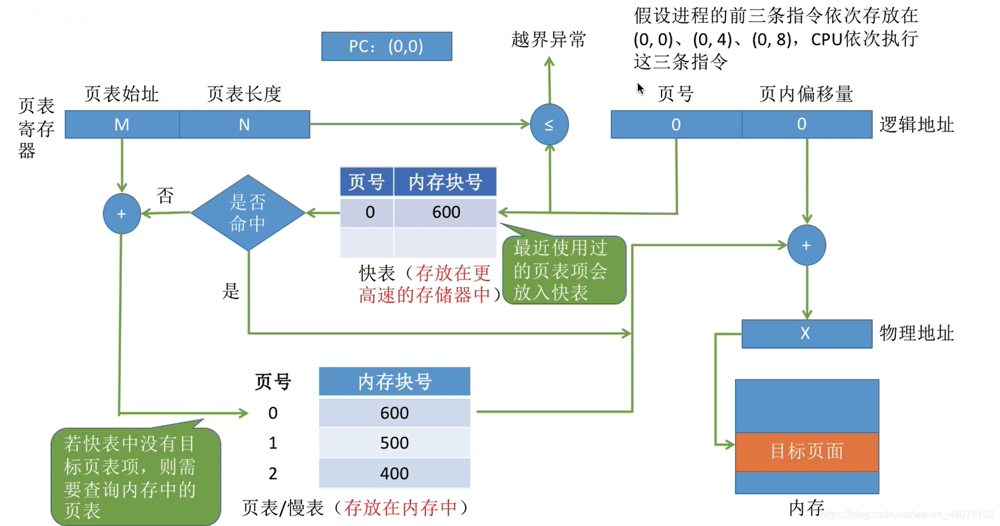

相当于对页表的对应关系做一个缓存。

- CPU给出逻辑地址，由某个硬件算得页号、页内偏移量，将页号与快表中的所有页号进行比较。

- 如果找到匹配的页号，说明要访问的页表项在快表中有副本，则直接从中取出该页对应的内存块号，再将内存块号与页内偏移量拼接形成物理地址，最后，访问该物理地址对应的内存单元。因此，若快表命中，则访问某个逻辑地址仅需一次访存即可。

- 如果没有找到匹配的页号，则需要访问内存中的页表，找到对应页表项，得到页面存放的内存块号，再将内存块号与页内偏移量拼接形成物理地址，最后，访问该物理地址对应的内存单元。因此,若快表未命中，则访问某个逻辑地址需要两次访存(注意:在找到页表项后，应同时将其存入快表,以便后面可能的再次访问。但若快表已满，则必须按照一定的算法对旧的页表项进行替换)。

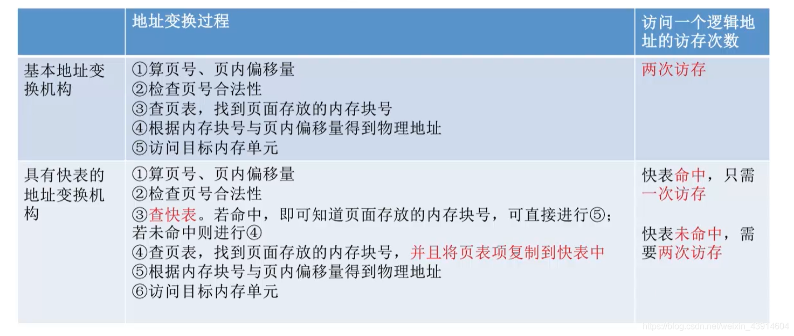

### 六、二级页表

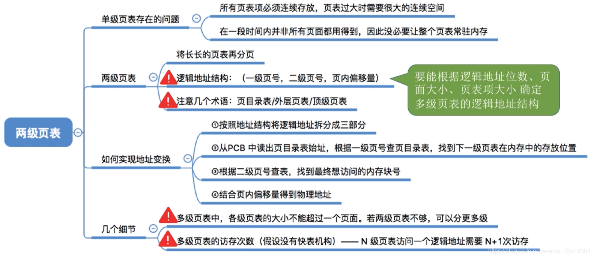

单级页表的问题：
````
# 某计算机系统按字节寻址，支持32位的逻辑地址，采用分页存储管理，页面大小为4KB，页表项长度为4B。4KB= 2^12B，因此页内地址要用12位表示，剩余20位表示页号。

# 因此，该系统中用户进程最多有2^20页。相应的，一个进程的页表中，最多会有2^20= 1M= 1,048,576个页表项，所以一个页表最大需要2^20* 4B=2^22B，共需要2^22/2^12= 2^10个页框存储该页表。

# 根据页号查询页表的方法: K号页对应的页表项存放位置=页表始址+K* 4
# 要在所有的页表项都连续存放的基础上才能用这种方法找到页表项
````

- 需要专门给进程分配2^10= 1024个连续的页框来存放它的页表

- 根据局部性原理可知，很多时候，进程在一段时间内只需要访问某几个页面就可以正常运行了。因此没有必要让整个页表都常驻内存。

1.解决连续问题

引入页目录表：

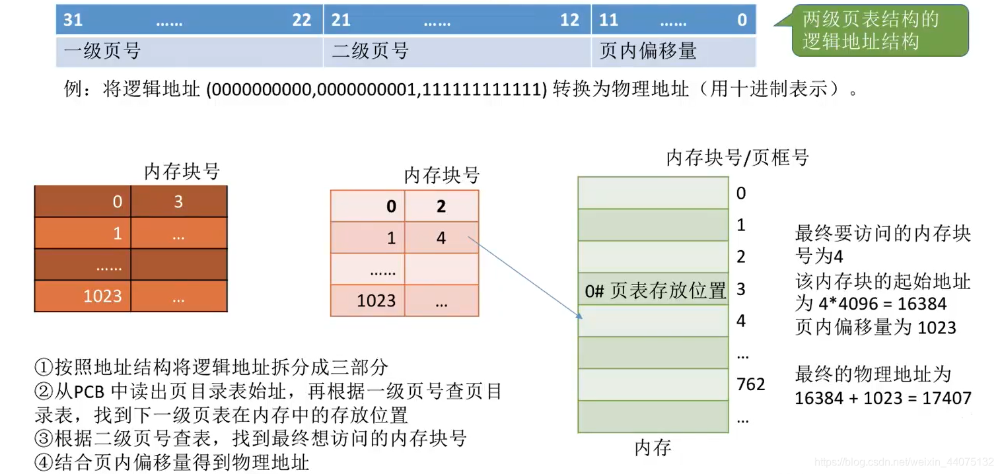

2.解决常驻内存问题

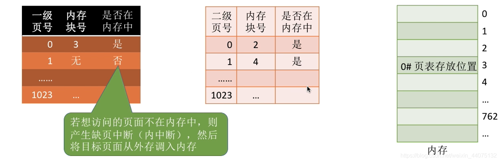

可以在需要访问页面时才把页面调入内存( 虚拟存储技术)。可以在页表项中增加一个标志位，用于表示该页面是否已经调入内存。

### 七、基本分段存储管理

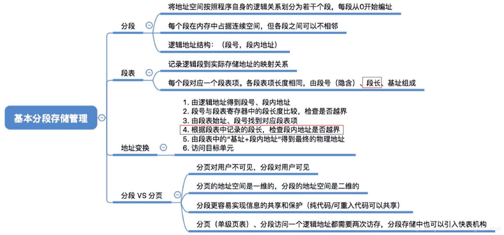

1.分段

进程的地址空间:按照程序自身的逻辑关系划分为若干个段，每个段都有-一个段名(在低级语言中，程序员使用段名来编程)，每段从0开始编址。

内存分配规则:以段为单位进行分配，每个段在内存中占据连续空间，但各段之间可以不相邻。

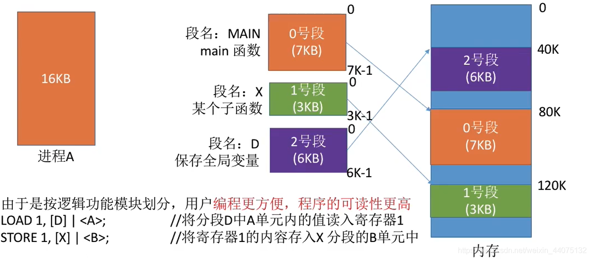

分段系统的逻辑地址结构由段号(段名)和段内地址(段内偏移量)所组成。

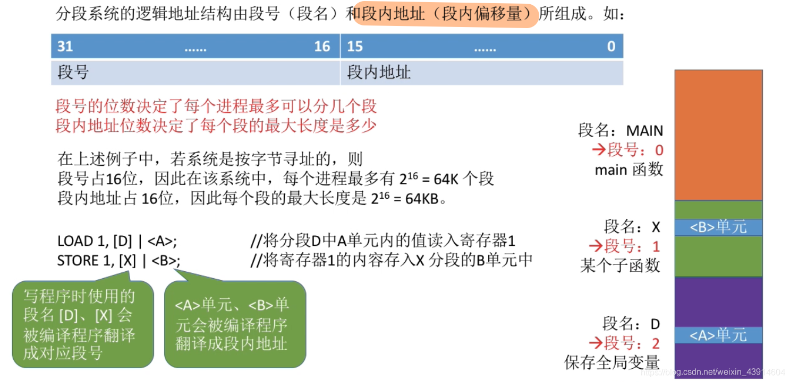

2.段表

程序分多个段，各段离散地装入内存，为了保证程序能正常运行，就必须能从物理内存中找到各个逻辑段的存放位置。
为此，需为每个进程建立一 张段映射表，简称“段表”。类似页表。

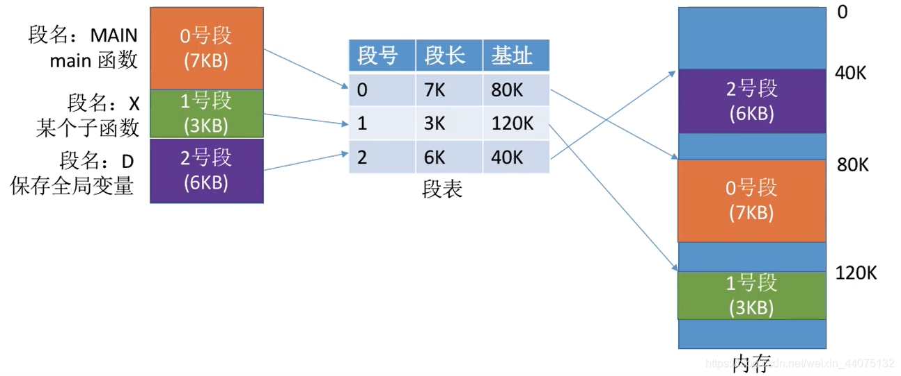

- 每个段对应一个段表项，其中记录了该段在内存中的起始位置(又称基址”)和段的长度。

- 各个段表项的长度是相同的。例如:某系统按字节寻址，采用分段存储管理，逻辑地址结构为(段号16位,段内地址16位)，因此用16位即可表示最大段长。
  物理内存大小为4GB (可用32位表示整个物理内存地址空间)。
  因此，可以让每个段表项占16+32 = 48位，即6B。由于段表项长度相同，因此段号可以是隐含的，不占存储空间。若段表存放的起始地址为M，则K号段对应的段表项存放的地址为M+ K*6。

3.地址变换


4.分页和分段

页是信息的物理单位。分页的主要目的是为了实现离散分配，提高内存利用率。分页仅仅是系统管理上的需要，完全是系统行为，对用户是不可见的。

段是信息的逻辑单位。分段的主要目的是更好地满足用户需求。一个段通常包含着一组属于一个逻辑模块的信息。分段对用户是可见的，用户编程时需要显式地给出段名。

页的大小固定且由系统决定。段的长度却不固定，决定于用户编写的程序。

分页的用户进程地址空间是一维的，程序员只需给出一个记忆符即可表示一个地址。

分段的用户进程地址空间是二维的，程序员在标识一个地址时，既要给出段名，也要给出段内地址。

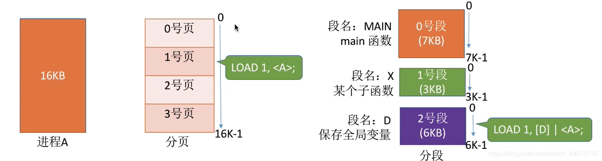

分段比分页更容易实现信息的共享和保护。


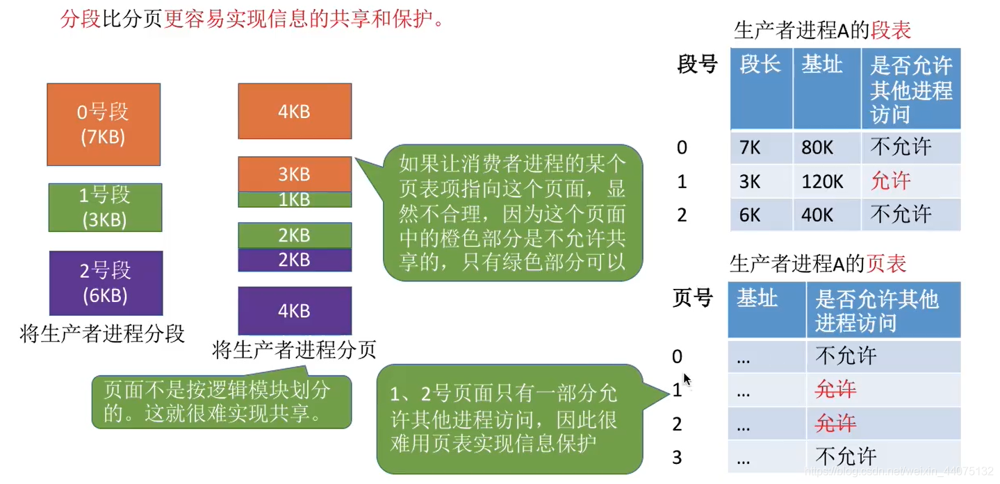

### 八、段页式管理

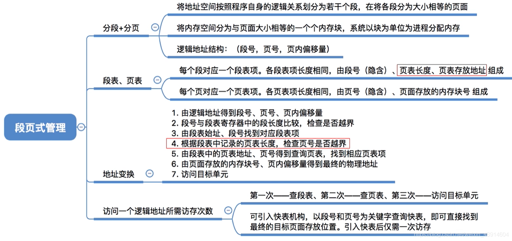


段页式管理：先分段，后分页。


逻辑结构：

段号的位数决定了每个进程最多可以分几个段。
页号位数决定了每个段最大有多少页。
页内偏移量决定了页面大小、内存块小是多少。

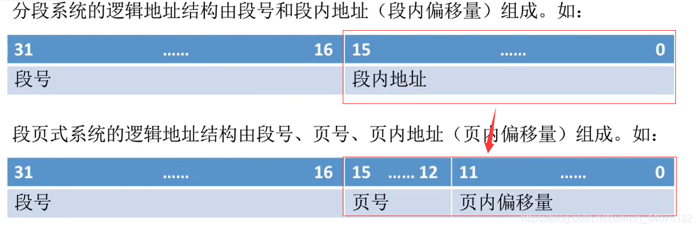

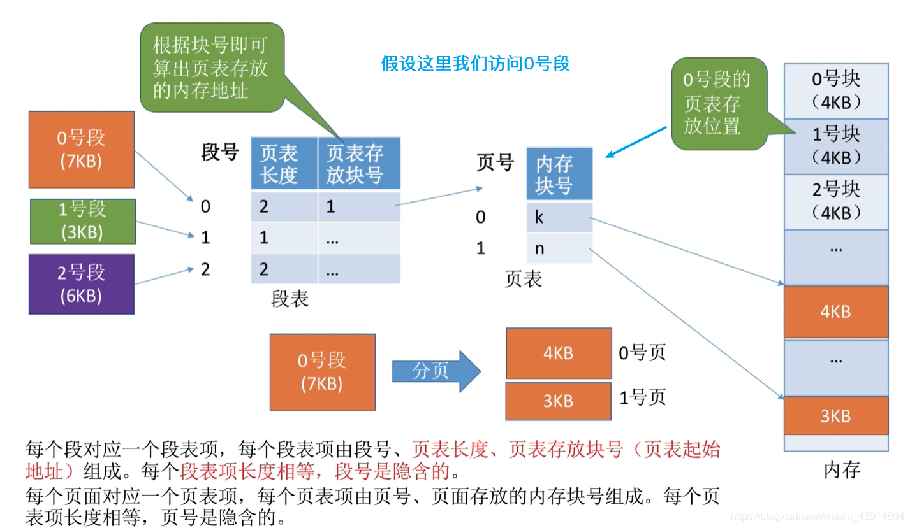

地址变换：

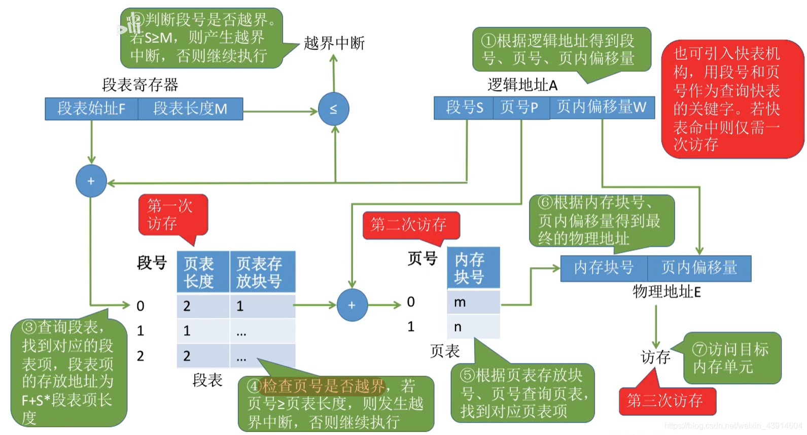