### 一、概述

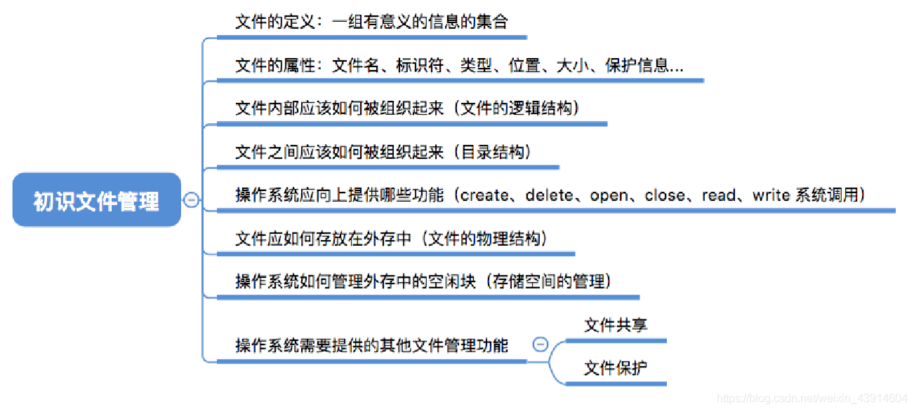

1.文件属性

- 文件名:由创建文件的用户决定文件名，主要是为了方便用户找到文件，同一目录下不允许有重名文件。 
- 标识符:一个系统内的各文件标识符唯一，对用户来说毫无可读性，因此标识符只是操作系统用于区分各个文件的一种内部名称。
- 类型:指明文件的类型。
- 位置:文件存放的路径(让用户使用)、在外存中的地址(操作系统使用，对用户不可见)。
- 大小:指明文件大小。 
- 创建时间:上次修改时间文件所有者信息。
- 保护信息:文件的访问控制信息。

2.文件内部数据结构

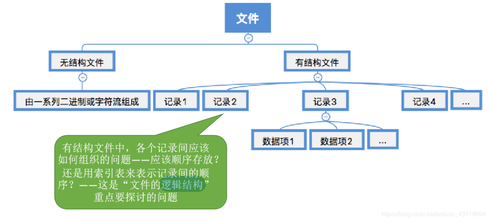

3.文件之间组织结构

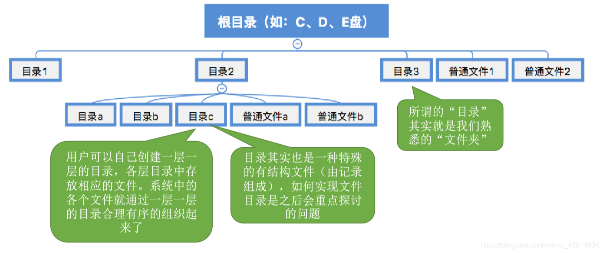

4.与操作系统交互

OS向上提供的功能：创建文件，删除文件，读写文件，打开文件，关闭文件。

文件如何放在外存中：

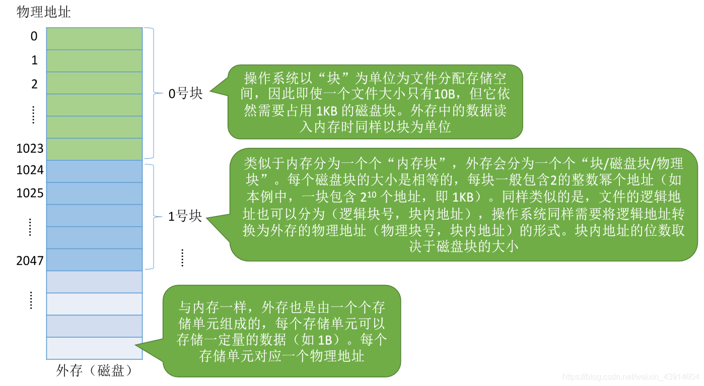

问题：

- 文件数据放在连续的几个磁盘块中
- 文件数据放在离散的几个磁盘块中此时，应该如何记录各个磁盘块之间的先后顺序呢?
- 操作系统又应该怎么管理空闲磁盘块?

### 二、文件逻辑结构

无结构文件：文件内部数据就是一系列二进制流或字符流，流式文件，如txt文件。

有结构文件：由一组相似的记录组成，又称记录式文件。每条记录又若千个数据项组成，根据各条记录的长度(占用的存储空间)是否相等，又可分为定长记录和可变长记录两种。重点探讨有结构文件。

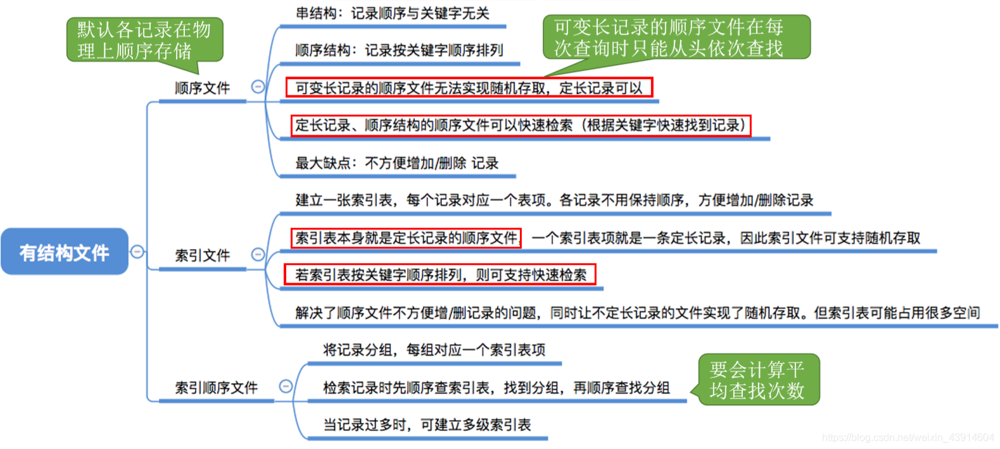

1.顺序文件:文件中的记录一个接一个地顺序排列(逻辑上)，记录可以是定长的或可变长的。各个记录在物理上可以顺序存储或链式存储。

- 串结构：通常按照记录存入的时间决定记录的顺序。
- 顺序结构：记录之间的顺序按关键字顺序排列。

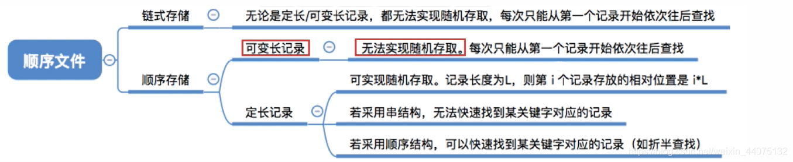

2.索引文件

对于可变长记录文件，要找到第i个记录，必须先顺序第查找前i-1个记录，但是很多应用场景中又必须使用可变长记录。如何解决这个问题?

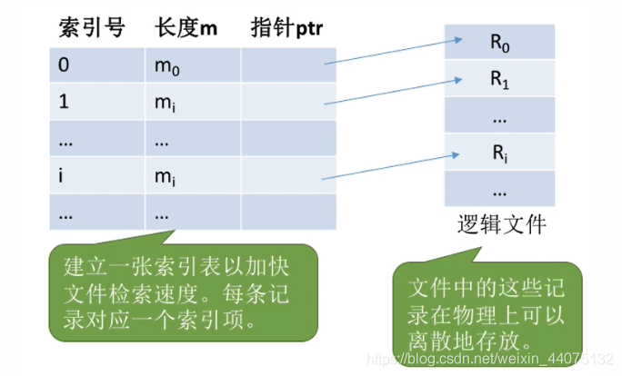

建立索引表，第i个记录对应的索引项。

索引表本身是定长记录的顺序文件。因此可以快速找到第i个记录对应的索引项。

可将关键字作为索引号内容，若按关键字顺序排列，则还可以支持按照关键字折半查找。

每当要增加/删除一个记录时，需要对索引表进行修改。由于索引文件有很快的检索速度，因此主要用于对信息处理的及时性要求比较高的场合。

3.索引顺序文件

思考索引文件的缺点:每个记录对应一个索引表项，因此索引表可能会很大。比如:文件的每个记录平均只占8B，而每个索引表项占32个字节，那么索引表都要比文件内容本身大4倍，这样对存储空间的利用率就太低了。

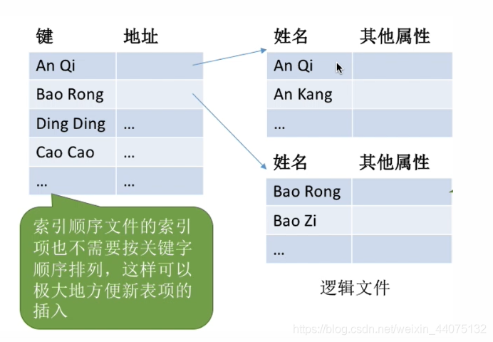

索引顺序文件是索引文件和顺序文件思想的结合。索引顺序文件中，同样会为文件建立张索引表，但不同的是:并不是每个记录对应一个索引表项，而是一组记录对应一个索引表项。

4.多级索引顺序文件 

为了进一步提高检索效率，可以为顺序文件建立多级索引表。例如，对于一个含106个记录的文件，可先为该文件建立一 张低级索引表，每100个记录为一组，故低级索引表中共有10000个表项( 即10000个定长记录)，再把这10000个定长记录分组，每组100个，为其建立顶级索引表，故顶级索引表中共有100个表项。

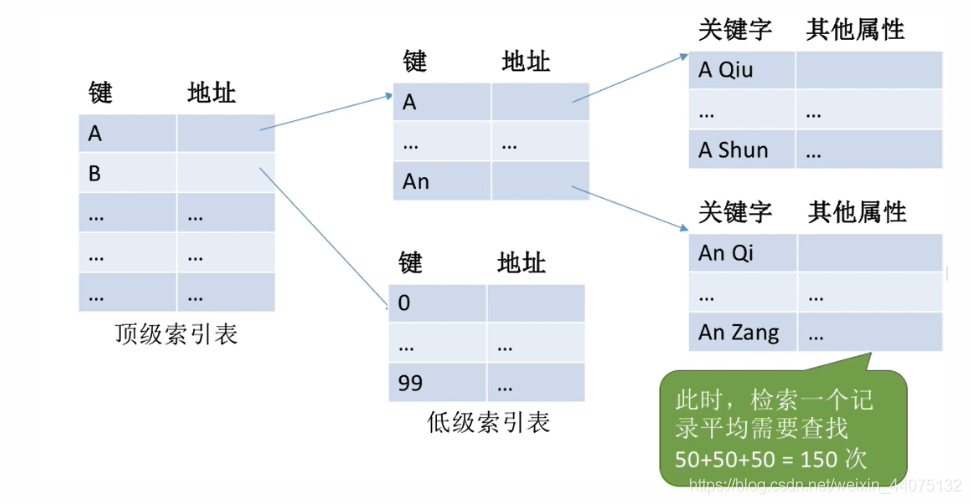

### 三、文件目录

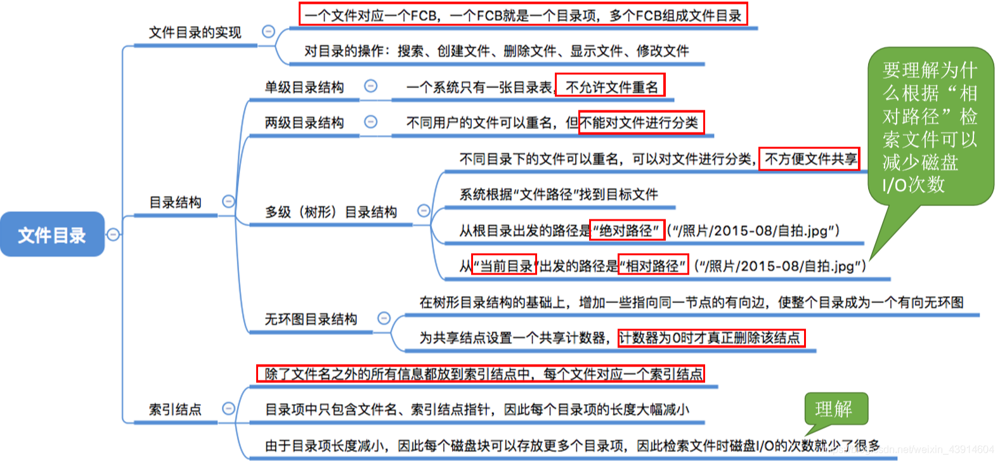

1.文件控制块

目录是一种特殊的文件。

目录本身就是一种有结构文件，由一条条记录组成。每条记录对应一个在该放在该目录下的文件。

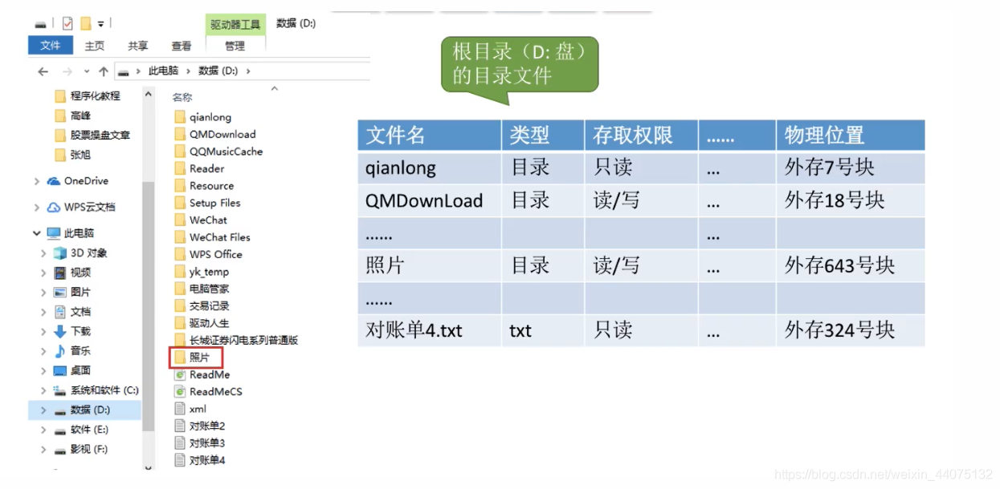

目录文件中的一条记录就是一个 文件控制块(FCB), FCB实现了文件名和文件之间的映射。使用户(用户程序) 可以实现按名存取。

FCB的有序集合称为文件目录，一个FCB就是一个文件目录项。
FCB中包含了文件的基本信息(文件名、物理地址、逻辑结构、物理结构等)，存取控制信息(是否可读/可写、禁止访问的用户名单等)，使用信息(如文件的建立时间、修改时间等)。
最重要，最基本的还是文件名、文件存放的物理地址。

目录操作：
- 搜索:当用户要使用一个文件时，系统要根据文件名搜索目录，找到该文件对应的目录项。
- 创建文件:创建一个 新文件时，需要在其所属的目录中增加一个目录项。
- 删除文件:当删除一个文件时，需要在目录中删除相应的目录项。
- 显示目录:用户可以请求显示目录的内容，如显示该目录中的所有文件及相应属性。
- 修改目录:某些文件属性保存在目录中，因此这些属性变化时需要修改相应的目录项(如:文件重命名)。

2.单级目录结构

早期操作系统并不支持多级目录，整个系统中只建立- -张目录表，每个文件占一个目录项。
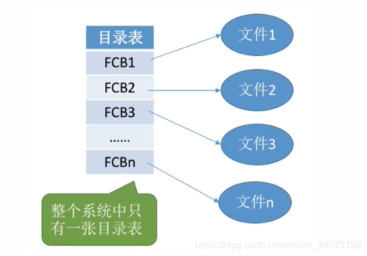

在创建一个文件时，需要先检查目录表中有没有重名文件，确定不重名后才能允许建立文件，并将新文件对应的目录项插入目录表中。

显然，单级目录结构不适用于多用户操作系统。

3.两级文件目录结构

早期的多用户操作系统，采用两级目录结构。分为主文件目录(MFD，Master File Directory)和用户文件目录(UFD， User Flie Directory)。

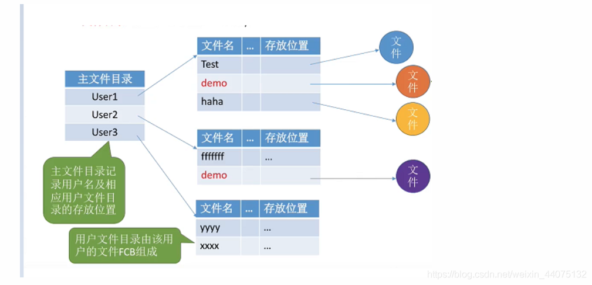

两级目求结构允许不同用户的文件重名，也可以在目录上实现实现访问限制(检查此时登录的用户名是否匹配)。但是两级目录结构依然缺乏灵活性，用户不能对自己的文件进行分类。

4.多级目录结构-树形

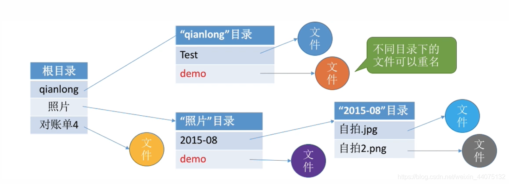

用户(或用户进程)要访问某个文件时要用文件路径名标识文件，文件路径名是个字符串。各级目录之间用/隔开。从根目录出发的路径称为绝对路径。

引入当前目录和相对路径后，磁盘 I/O 的次数减少了。这就提升了访问文件的效率。

树形目录结构可以很方便地对文件进行分类，层次结构清晰，也能够更有效地进行文件的管理和保护。但是，树形结构不便于实现文件的共享。为此，提出了无环图目录结构。

5.无环图目录结构

在树形目录结构的基础上，增加些指向同一节点的有向边，使整个目录成为一个有向无环图。可以更方便地实现多个用户间的文件共享。

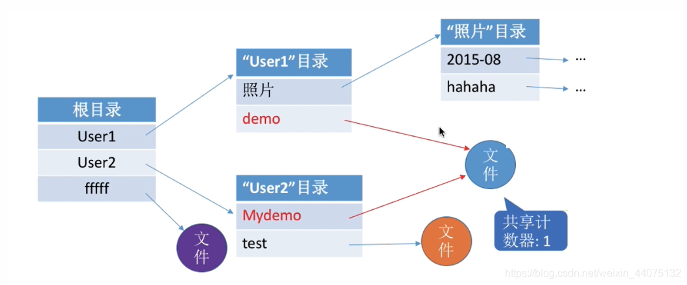

可以用不同的文件名指向同一个文件，甚至可以指向同一个目录(共享同一目录下的所有内容)。

需要为每个共享结点设置一个共享计数器，用于记录此时有多少个地方在共享该结点。
用户提出删除结点的请求时，只是删除该用户的FCB、并使共享计数器减1，并不会直接删除共享结点。只有共享计数器减为0时，才删除结点。

注意:共享文件不同于复制文件。在共享文件中，由于各用户指向的是同一个文件，因此只要其中一个用户修改了文件数据，那么所有用户都可以看到文件数据的变化。

6.索引节点(FCB的改进)

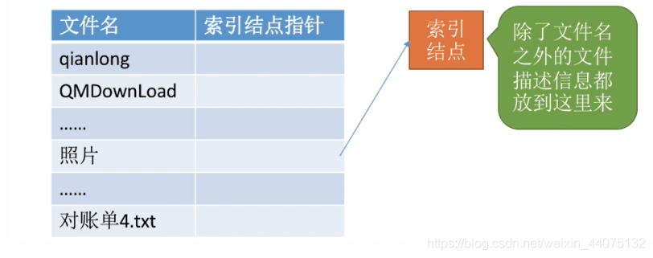

其实在查找各级目录的过程中只需要用到文件名这个信息，只有文件名匹配时，才需要读出文件的其他信息。因此可以考虑让目录表“瘦身”来提升效率。

存放在外存中的索引结点称为磁盘索引结点，当索引结点放入内存后称为内存索引结点。

相比之下内存索引结点中需要增加一些信息，比如:文件是否被修改、此时有几个进程正在访问该文件
等。

### 四、文件物理结构

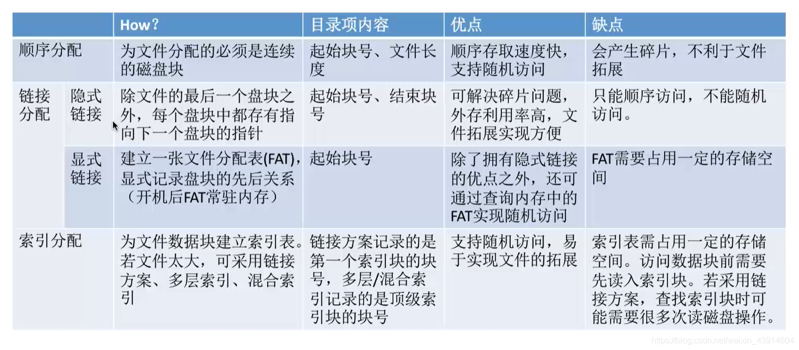

文件分配方式:

1.文件块 磁盘块

类似于内存分页，磁盘中的存储单元也会被分为一个个块/磁盘块/物理块。很多操作系统中，磁盘块的大小与内存块、页面的大小相同。

内存与磁盘之间的数据交换(即读/写操作、磁盘I/O)都是以块为单位进行的。即每次读块，或每次写出一块。

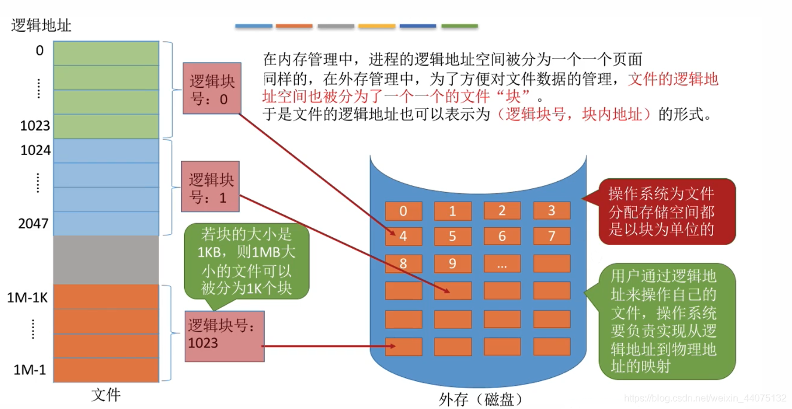

2.连续分配方式

连续分配方式要求每个文件在磁盘上占有一组连续的块。

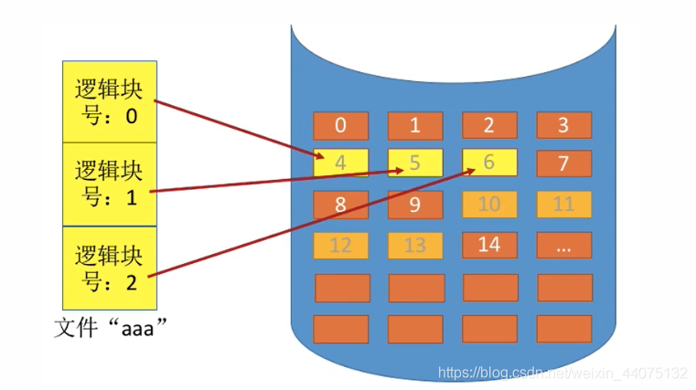

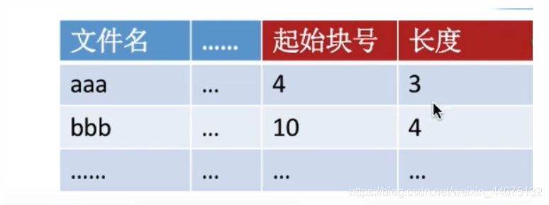

文件目录中记录存放的起始块号和长度(总共占用几个块)。

用户给出要访问的逻辑块号，操作系统找到该文件对应的目录项(FCB)。

物理块号=起始块号+逻辑块号 当然，还需要检查用户提供的逻辑块号是否合法(逻辑块号2长度就不合法)。

可以直接算出逻辑块号对应的物理块号，因此连续分配支持顺序访问和直接访问(即随机访问)。

由于磁头读取的特性，连续分配方式的读取速度非常快。

缺点：若此时文件A要拓展,需要再增加一个磁盘块(总共需要连续的4个磁盘块)。由于采用连续结构，因此文件A占用的磁盘块必须是连续的。因此只能将文件A全部“迁移”到绿色区域。结论:物理上采用连续分配的文件不方便拓展。

3.链接分配

（1）隐式链接

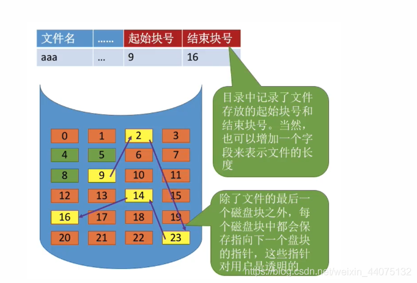

用户给出要访问的逻辑块号i，操作系统找到该文件对应的目录项(FCB)。

从目录项中找到起始块号(即0号块)，将0号逻辑块读入内存，由此知道1号逻辑块存
放的物理块号，于是读入1号逻辑块，再找到2号逻辑块的存放位置…以此类推。因此，读入i号逻辑块，总共需要i+1次磁盘
I/O。

采用链式分配(隐式链接)方式的文件，只支持顺序访问，不支持随机访问，查找效率低。另外，指向下一个盘块的指针也需要耗费少量的存储空间。但是方便扩展文件，不会有碎片问题。

（2）显示链接

把用于链接文件各物理块的指针显式地存放在一张表中。即文件分配表(FAT，File Allocation Table )

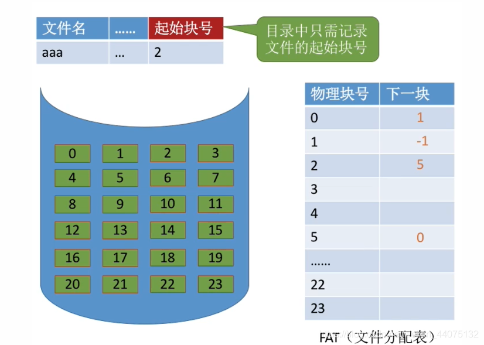

注意:一个磁盘仅设置一张FAT。开机时，将FAT读入内存，并常驻内存。FAT 的各个表项在物理上连续存储，且每 一个表项长度相同，因此物理块号字段可以，是隐含的。

用户给出要访问的逻辑块号i，操作系统找到该文件对应的目录项(FCB)。

从目录项中找到起始块号，若i>0，则查询内存中的文件分配表FAT,往后找到i号逻辑块对应的物理块号。逻辑块号转换成物理块号的过程不需要读磁盘操作。

采用链式分配(显式链接)方式的文件，支持顺序访问，也支持随机访问( 想访问i号逻辑块时，并不需要依次访问之前的0~i-1 号逻辑块)，由于块号转换的过程不需要访问磁盘，因此相比于隐式链接来说，访问速度快很多。

优点:很方便文件拓展，不会有碎片问题，外存利用率高，并且支持随机访问。相比于隐式链接来说，地址转换时不需要访问磁盘，因此文件的访问效率更高。

缺点:文件分配表的需要占用一定的存储空间。

4.索引分配

索引分配允许文件离散地分配在各个磁盘块中，系统会为每个文件建立一张索引表，索引表中记录了文件的各个逻辑块对应的物理块(索引表的功能类似于内存管理中的页表--------建立逻辑页面到物理页之间的映射关系)。
索引表存放的磁盘块称为索引块。文件数据存放的磁盘块称为数据块。

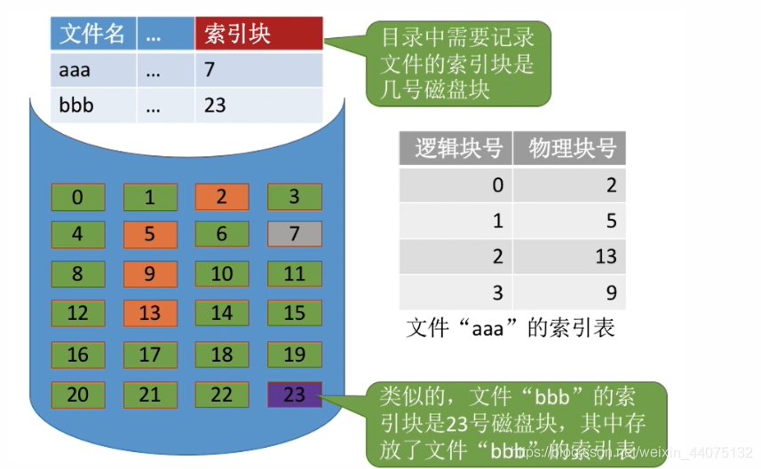

如某个新创建的文件aaa的数据依次存放在磁盘块2 >5 >13 >9。7号磁盘块作为aaa 的索引块,索引块中保存了索引表的内容。

注:在显式链接的链式分配方式中，文，件分配表FAT是一个磁盘对应一张。而索引分配方式中，索引表是一个文件对应一张。

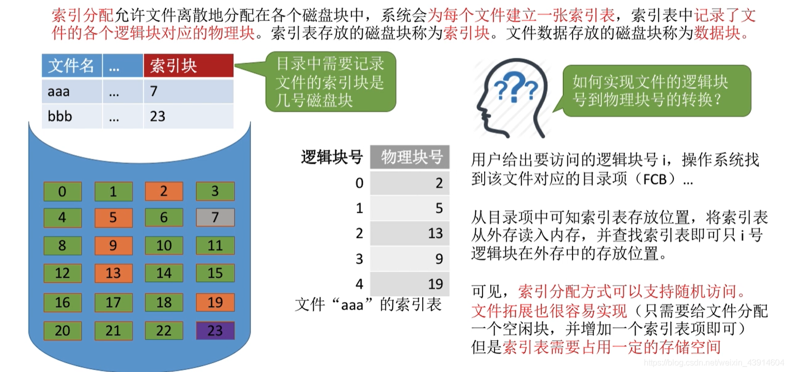

若每个磁盘块1KB，一个索引表项4B，则一个磁盘块只能存放256个索引项。如果一个文件的大小超过了256块，那么一个磁盘块是装不下文件的整张索引表的，如何解决这个问题?

（1）链接方案

如果索引表太大，一个索引块装不下，那么可以将多个索引块链接起来存放。

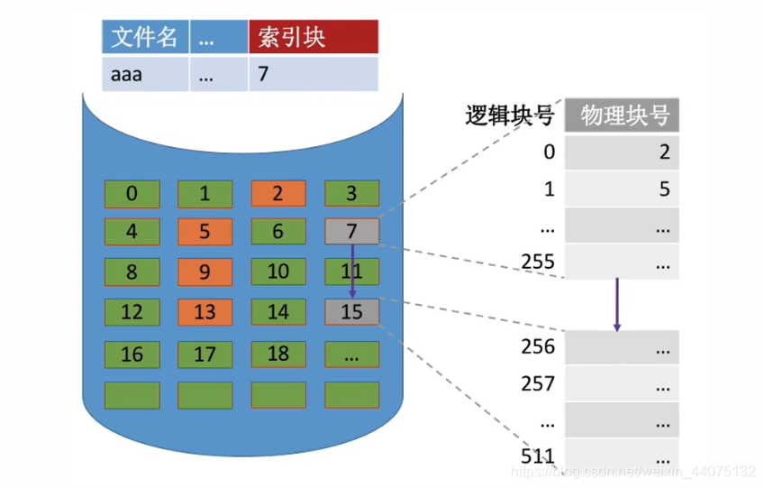

（2）多层索引

建立多层索引(原理类似于多级页表)。使第一层索引块指向第二层的索引块。还可根据文件大小的要求再建立第三层、第四层索引块。

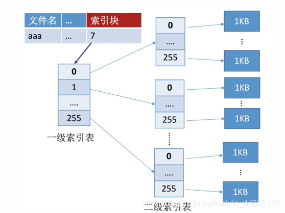

（3）混合索引

多种索引分配方式的结合。

如一个文件的顶级索引表中，既包含直接地址索引(直接指向数据块)，又包含一级间接索引(指向单层索引表)、还包含两级间接索引(指向两层索引表)。

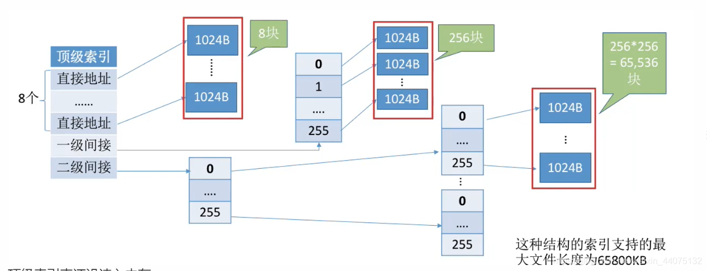

### 五、文件存储空间管理

就是操作系统对空闲磁盘块的管理。

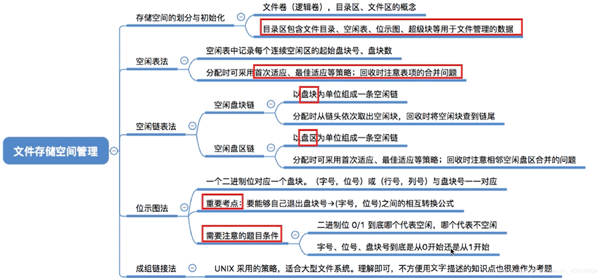

1.存储空间的划分与初始化

存储空间的划分:将物理磁盘划分为一个个文件卷(逻辑卷、逻辑盘)。

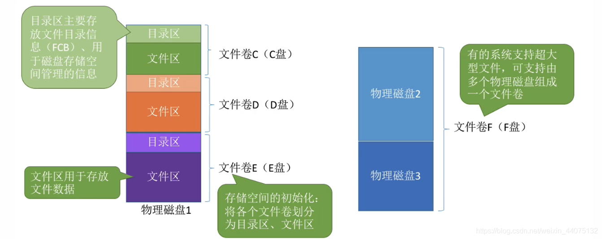

2.空闲表法

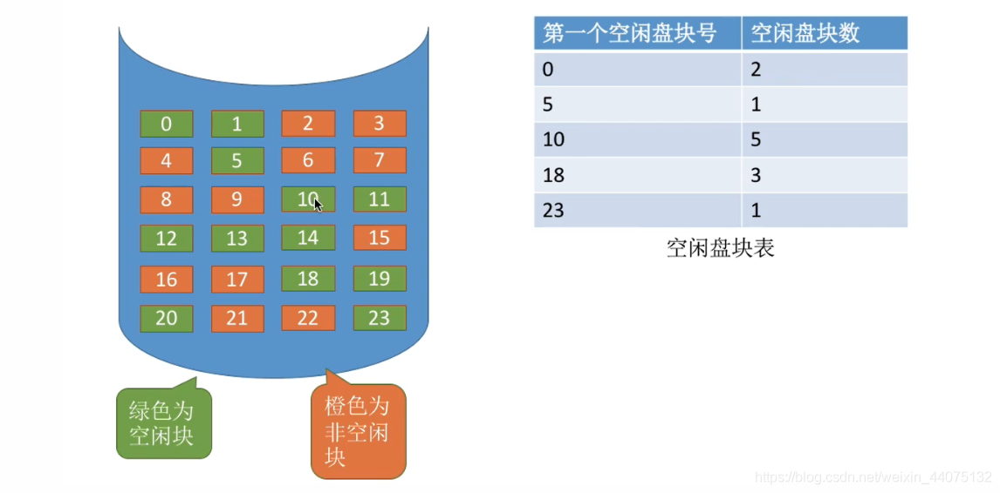

与内存管理中的动态分区分配很类似，为一个文件分配连续的存储空间。
同样可采用首次适应、最佳适应、最坏适应等算法来决定要为文件分配哪个区间。

回收时要要注意表项合并的问题。

3.空闲链表法

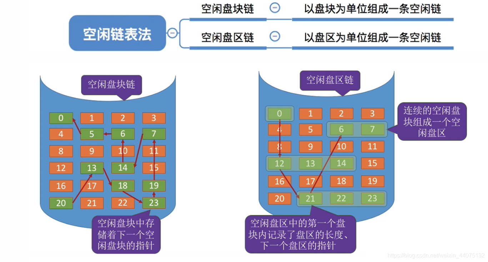

（1）空闲盘块链

操作系统保存着链头、链尾指针。

如何分配: 若某文件申请K个盘块，则从链头开始依次摘下K个盘块分配，并修改空闲链的链头指针。

如何回收: 回收的盘块依次挂到链尾，并修改空闲链的链尾指针。

适用于离散分配的物理结构。为文件分配多个盘块时可能要重复多次操作。

（2）空闲盘区链

若某文件申请K个盘块，则可以采用首次适应、最佳适应等算法，从链头开始检索，按照算法规则找到一个大小符合要求的空闲盘区,分配给文件。

若没有合适的连续空闲块，也可以将不同盘区的盘块同时分配给一个文件，注意分配后可能要修改相应的链指针、盘区大小等数据。

如何回收:若回收区和某个空闲盘区相邻，则需要将回收区合并到空闲盘区中。若回收区没有和任何空闲区相邻，将回收区作为单独的一个空闲盘区挂到链尾。

离散分配、连续分配都适用。为一个文件分配多个盘块时效率更高。

4.位示图法

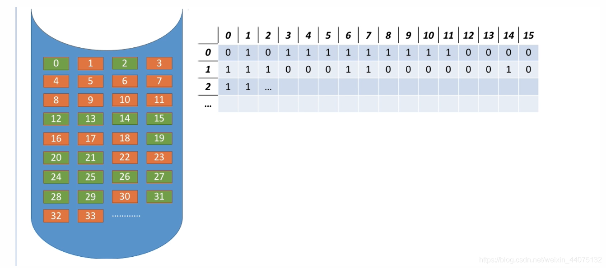

位示图:每个二进制位对应一一个盘块。在本例中，“0” 代表盘块空闲,“1”代表盘块已分配。位示图一般用连续的“字”来表示，如本例中一个字的字长是16位，字中的每一位对应一个盘块。
因此可以用(字号，位号)对应一个盘块号。当然有的题目中也描述为(行号，列号)。

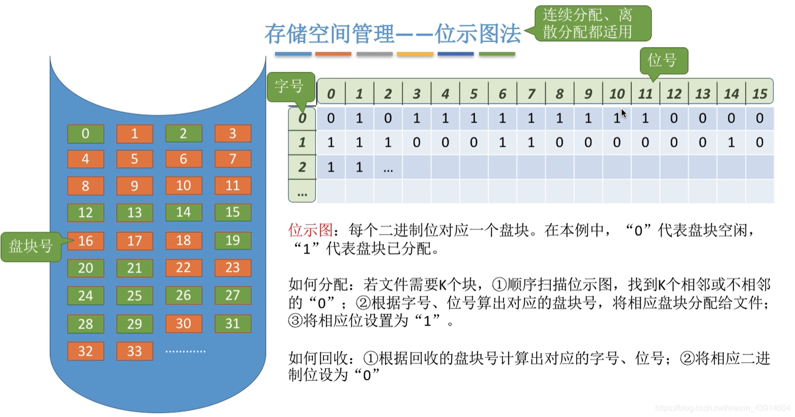

5.成组链接法

空闲表法、空闲链表法不适用于大型文件系统，因为空闲表或空闲链表可能过大。UNIX系统中采用了成组链接法对磁盘空闲块进行管理。

文件卷的目录区中专门用一个磁盘块作为“超级块”，当系统启动时需要将超级块读入内存。并且要保证内存与外存中的“超级块”数据一致。

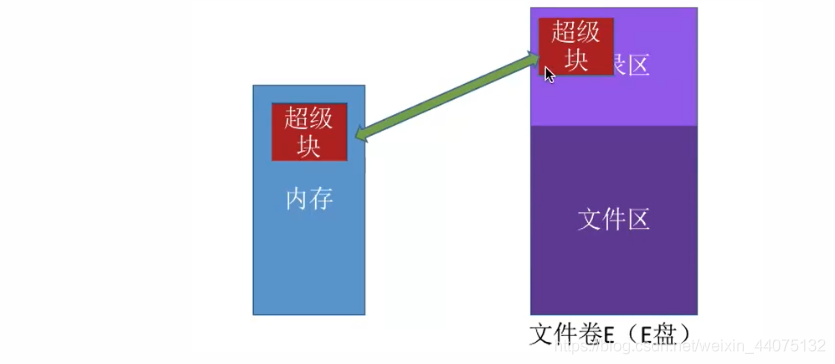

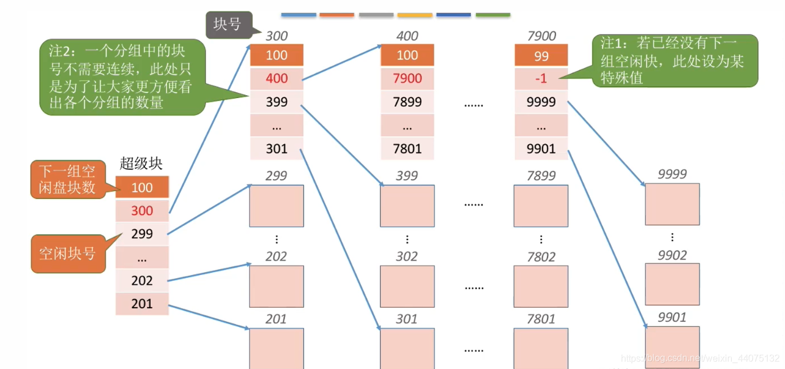

### 六、文件基本操作

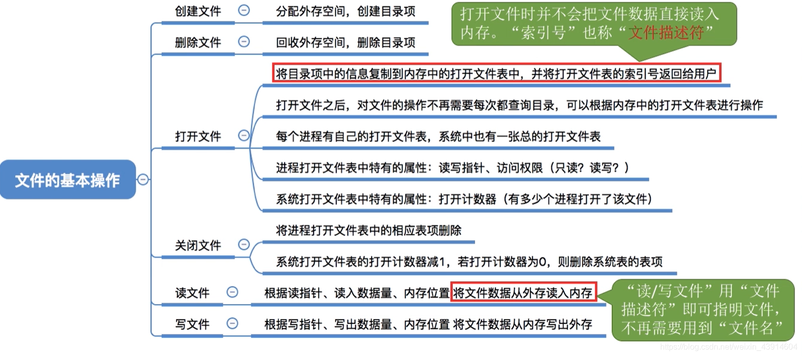

1.创建文件

进行Create系统调用时，需要提供的几个主要参数:
所需的外存空间大小(如:一个盘块，即1KB)，
文件存放路径(D:/Demo)，
文件名(这个地方默认为“新建文本文档.txt" )

- 在外存中找到文件所需的空间(结合上小节学习的空闲链表法、位示图、成组链接法等管理策略，找到空闲空间)
- 根据文件存放路径的信息找到该目录对应的目录文件(此处就是D:/Demo目录)，在目录中创建该文件对应的目录项。目录项中包含了文件名、文件在外存中的存放位置等信息。

2.删除文件

进行Delete系统调用时，需要提供的几个主要参数:
文件存放路径(“D:/Demo ”)，
文件名(“test.txt” )

- 根据文件存放路径找到相应的目录文件，从目录中找到文件名对应的目录项。
- 根据该目录项记录的文件在外存的存放位置、文件大小等信息，回收文件占用的磁盘块。(回收磁盘块时，根据空闲表法、空闲链表法、位图法等管理策略的不同，需要做不同的处理)
- 从目录表中删除文件对应的目录项。

3.打开文件

使用open系统调用“打开文件”，需要提供的几个主要参数：
文件存放路径(“D:/Demo” )，
文件名(“test.txt" )，
要对文件的操作类型(如: r只读; .rw读写等)

- 根据文件存放路径找到相应的目录文件，从目录中找到文件名对应的的目录项，并检查该用户是否有指定的操作权限。
- 将目录项复制到内存中的“打开文件表”中。并将对应表目的编号返回给用户。之后用户使用打开文件表的编号来指明要操作的文件。

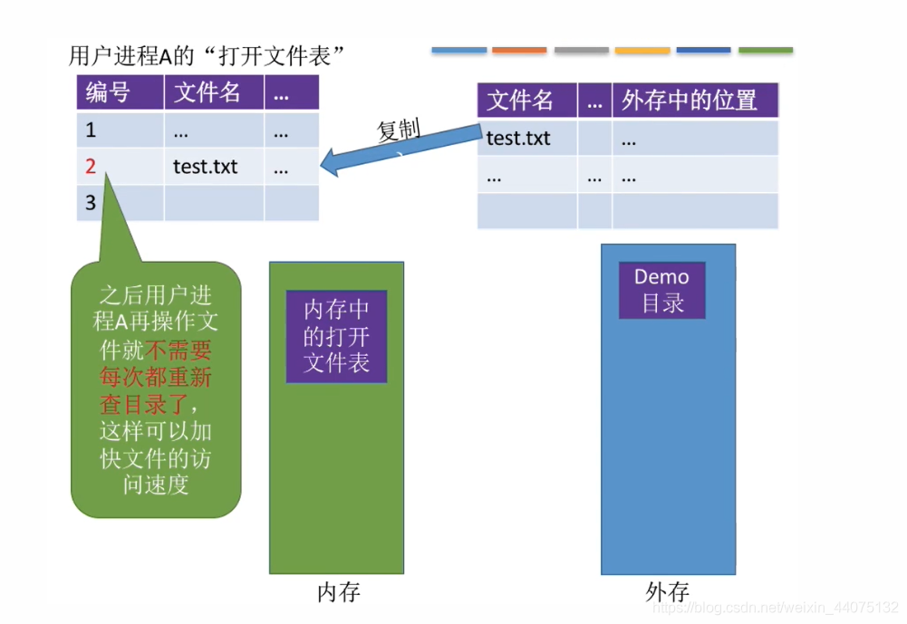

打开文件表：

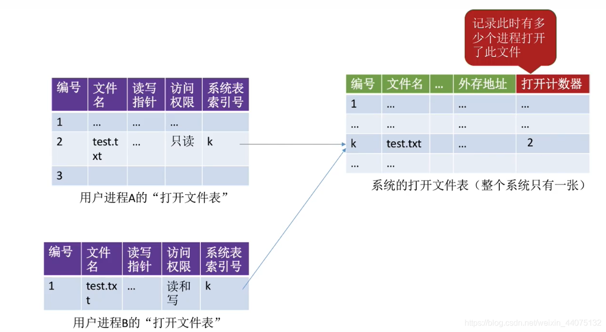

打开计数器记录了有多少进程打开此文件，如我们尝试删除某个txt文件，如果此时该文件已被某个“记事本”。

进程打开，则系统会提示我们“暂时无法删除该文件”。其实系统在背后做的事就是先检查了系统打开文件表，确认此时是否有进程正在使用该文件。

- 读写指针：记录读/写操作进行到的位置。

- 访问权限：如果打开文件时声明的是只读，则该进程不能对文件进行写操作。

4.关闭文件

使用Close系统调用关闭文件。

- 将进程的打开文件表相应表项删除。

- 回收分配给该文件的内存空间等资源。

- 系统打开文件表的打开计数器count减1，若count=0，则删除对应表项。

5.读文件

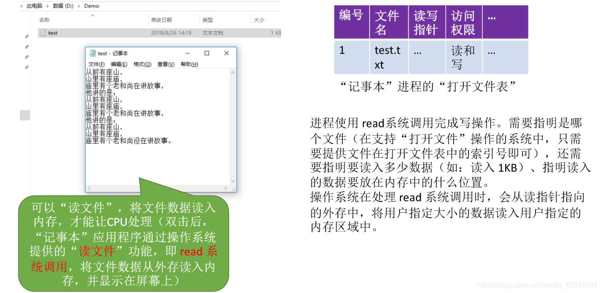

6.写文件

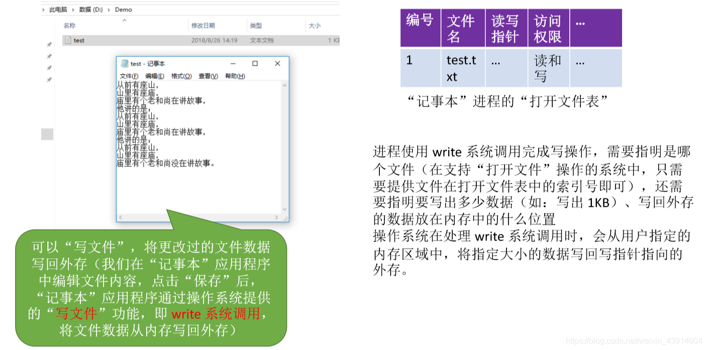

### 七、文件共享

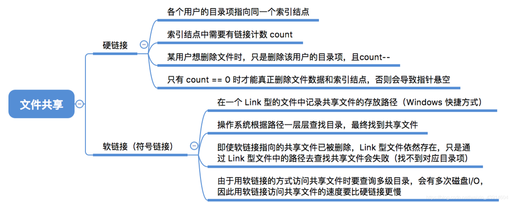

多个用户共享同一个文件，意味着系统中只有一份文件数据。并且只要某个用户修改了该文件的数据，其他用户也可以看到文件数据的变化。

如果是多个用户都复制了同一个文件，那么系统中会有好几份文件数据。其中一个用户修改了自己的那份文件数据，对其他用户的文件数据并没有影响。

1.硬链接

索引结点中设置一个链接计数变量count,用于表示链接到本索引结点上的用户目录项数。
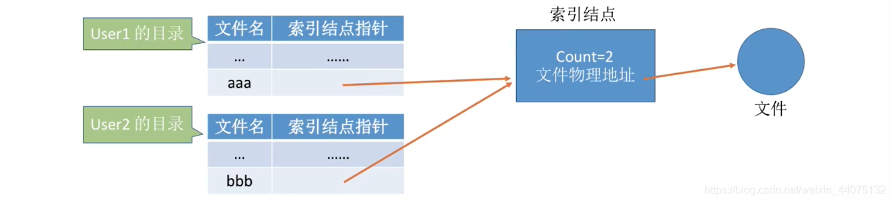windows 中的快捷方式

若count= 2，说明此时有两个用户目录项链接到该索引结点上，或者说是有两个用户在共享此文件。

若某个用户决定删除该文件，则只是要把用户目录中与该文件对应的目录项删除，且索引结点的count值减1。若count>0，说明还有别的用户要使用该文件，暂时不能把文件数据删除，否则会导致指针悬空。

2.软链接

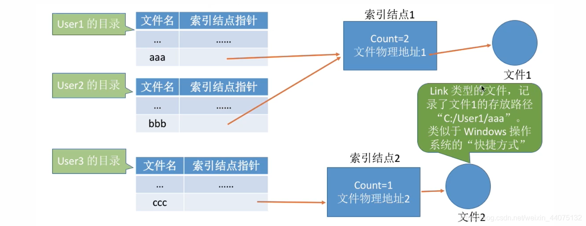

当User3访问ccc 时，操作系统判断文件ccc属于Link类型文件，于是会根据其中记录的路径层层查找目录，最终找到User1的目录表中的aaa 表项，于是就找到了文件1的索引结点。

如果文件1删除，但是文件2依然存在，只是通过C:/User1/aaa这个路径已经找不到文件1了，windows中的快捷方式的原理。

### 八、文件保护

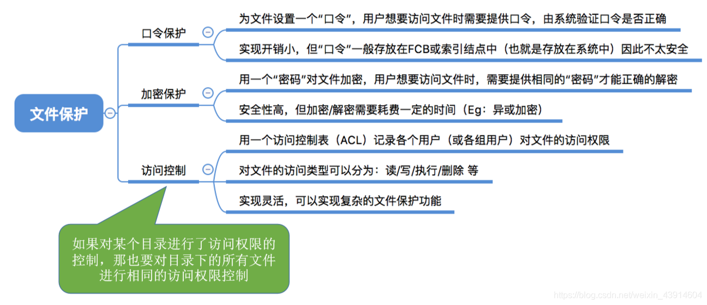

1.口令保护

为文件设置一个口令(如: abc112233) ，用户请求访问该文件时必须提供口令。

口令一般存放在文件对应的FCB或索引结点中。用户访问文件前需要先输入“口令”，操作系统会将用户提供的口令与FCB中存储的口令进行对比，如果正确，则允许该用户访问文件

优点:保存口令的空间开销不多，验证口令的时间开销也很小。

缺点:正确的口令存放在系统内部，不够安全。

2.加密保护

优点:保密性强，不需要在系统中存储“密码”。

缺点:编码/译码，或者说加密/解密要花费一定时间。

3.访问控制

在每个文件的FCB (或索引结点)中增加一个访问控制列表(Access-Control List, ACL)，该表中记录了各个用户可以对该文件执行哪些操作。

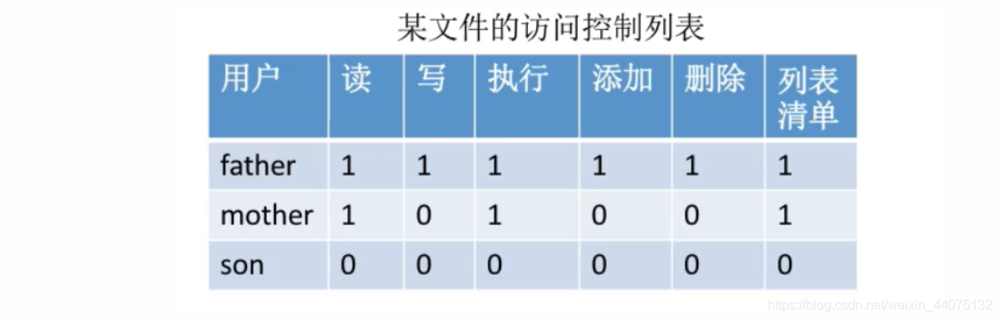

有的计算机可能会有很多个用户，因此访问控制列表可能会很大，可以用精简的访问列表解决这个问题。

精简的访问列表:以组为单位，标记各组用户可以对文件执行哪些操作。

如 :分为系统管理员、文件主、文件主的伙伴、其他用户几个分组。

当某用户想要访问文件时，系统会检查该用户所属的分组是否有相应的访问权限。

### 九、文件系统层次结构

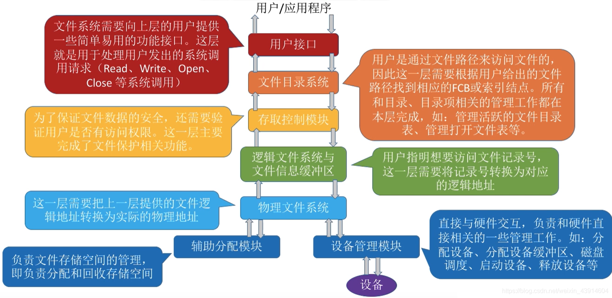

假设某用户请求删除文件 D:/工作目录/学生信息.xIsx 的最后100条记录。

1.用户需要通过操作系统提供的接口发出，上述请求----用户接口

2.由于用户提供的是文件的存放路径，因此需要操作系统一层一层地查找目录，找到对应的目录项----文件目录系统

3.不同的用户对文件有不同的操作权限，因此为了保证安全，需要检查用户是否有访问权限----存取控制模块(存取控制验证层)

4.验证了用户的访问权限之后，需要把用户提供的“记录号”转变为对应的逻辑地址----逻辑文件系统与文件信息缓冲区

5.知道了目标记录对应的逻辑地址后，还需要转换成实际的物理地址----物理文件系统

6.要删除这条记录，必定要对磁盘设备发出请求----设备管理程序模块

7.删除这些记录后，会有一些盘块空闲，因此要将这些空闲盘块回收----辅助分配模块

