### 一、磁盘结构


1.磁盘、磁道、扇区

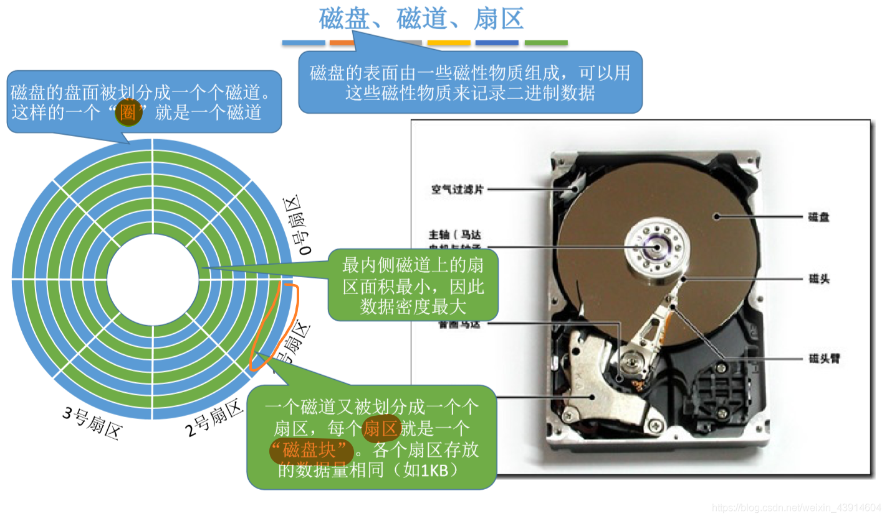

2.如何在磁盘中读/写数据

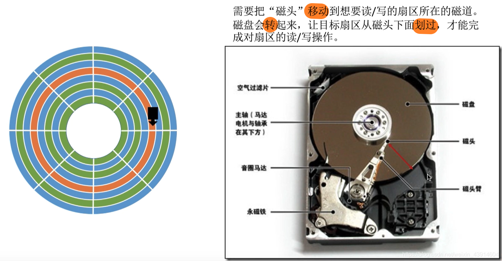

3.盘面、柱面

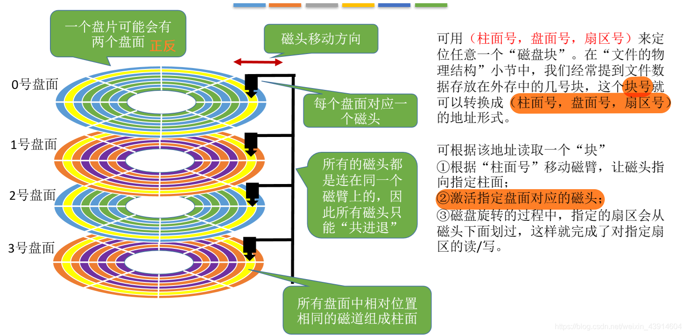

4.磁盘的分类

- 按磁头是否可移动分类

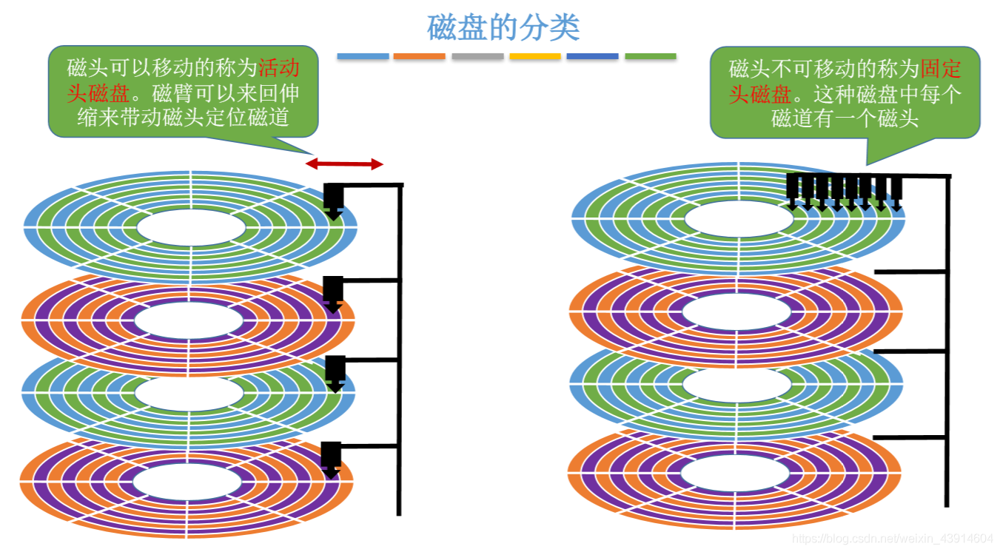

- 按盘片是否可更换分类

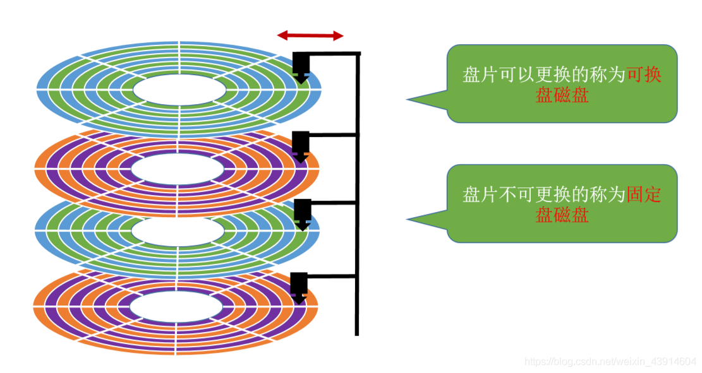

### 二、磁盘调度算法

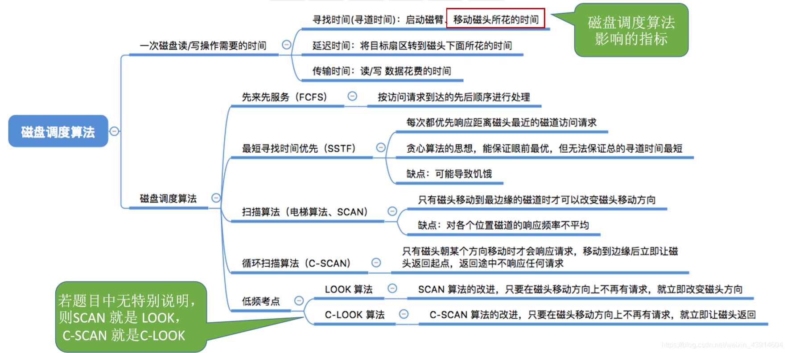

1.一次磁盘读/写操作需要的时间

寻找时间(寻道时间) Ts:在读/写数据前，将磁头移动到指定磁道所花的时间。

- 启动磁头臂是需要时间的。假设耗时为s; 
- 移动磁头也是需要时间的。假设磁头匀速移动，每跨越一个磁道耗时为m,总共需要跨越n条磁道。则: 寻道时间Ts=s+ m*n

延迟时间Tp:通过旋转磁盘，使磁头定位到目标扇区所需要的时间。

- 设磁盘转速为r (单位: 转/秒，或转/分)(5400转/min，7200转/min)，则平均所需的延迟时间Tp=(1/2)*(1/r)= 1/2r

传输时间T:从磁盘读出或向磁盘写入数据所经历的时间。

- 假设磁盘转速为r，此次读/写的字节数为b，每个磁道上的字节数为N。则:传输时间T = (1/r) * (b/N) = b/(rN)

因此总的平均存取时间Ta =Ts + 1/2r + b/(rN)。

延迟时间和传输时间都与磁盘转速相关，且为线性相关。而转速是硬件的固有属性，因此操作系统也无法优化延迟时间和传输时间。

但是操作系统的磁盘调度算法会直接影响寻道时间。

2.先来先服务算法(FCFS)

根据进程请求访问磁盘的先后顺序进行调度。

假设磁头的初始位置是100号磁道，有多个进程先后陆续地请求访问55、58、39、 18、90、160、150、38、184 号磁道。

按照FCFS的规则，按照请求到达的顺序，磁头需要依次移动到55、58、 39、18、90、 160、150、 38、184号磁道。

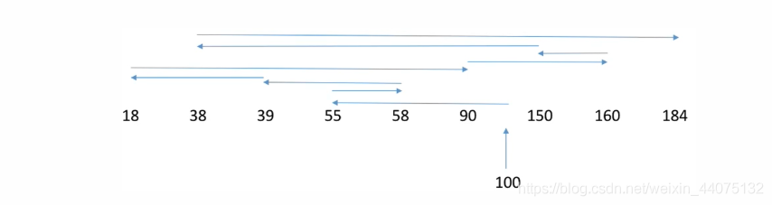

磁头总共移动了45+3+19+21+72+70+10+112+146 = 498个磁道。

响应一个请求平均需要移动498/9= 55.3个磁道(平均寻找长度)。

优点:公平;如果请求访问的磁道比较集中的话，算法性能还算过的去。

缺点:如果有大量进程竞争使用磁盘，请求访问的磁道很分散，则FCFS在性能上很差，寻道时间长。

3.最短寻找时间优先(SSTF)

SSTF算法会优先处理的磁道是与当前磁头最近的磁道。可以保证每次的寻道时间最短，但是并不能保证总的寻道时间最短。
(其实就是贪心算法的思想，只是选择局部最优，但是总体未必最优)。

假设磁头的初始位置是100号磁道，有多个进程先后陆续地请求访问55、58、39、18、 90、160、150、38、184号磁道。


磁头总共移动了(100-18) + (184-18) = 248个磁道。

响应一个请求平均需要移动248/9=27.5个磁道( 平均寻找长度)。

优点:性能较好，平均寻道时间短。

缺点:可能产生“饥饿”现象。

- 如果在处理18号磁道的访问请求时又来了一个38号磁道的访问请求，处理38号磁道的访问请求时又来了一个18号磁道的访问请求。如果有源源不断的18号、38号磁道的访问请求到来的话，150、160、184号磁道的访问请求就永远得不到满足，从而产生“饥饿”现象。

4.扫描算法(SCAN)

SSTF算法会产生饥饿的原因在于:磁头有可能在一个小区域内来回来去地移动。
为了防止这个问题，可以规定，只有磁头移动到最外侧磁道的时候才能往内移动，移动到最内侧磁道的时候才能往外移动。
这就是扫描算法(SCAN)的思想。由于磁头移动的方式很像电梯，因此也叫电梯算法。

假设某磁盘的磁道为0~200号，磁头的初始位置是100号磁道，且此时磁头正在往磁道号增大的方向移动，有多个进程先后陆续地请求访问55、58、39、18、90、160、150、38、184 号磁道。

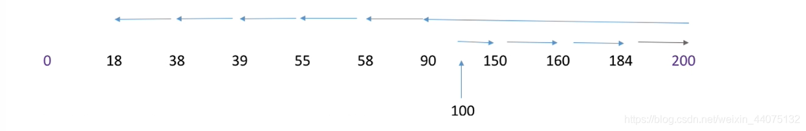
- 只有到了最边上的磁道才能改变磁头移动方向减少磁盘延迟时间的方法

磁头总共移动了(200-100) + (200-18) = 282个磁道。

响应一个请求平均需要移动282/9=31.3个磁道(平均寻找长度)。

优点:性能较好，平均寻道时间较短，不会产生饥饿现象

缺点:

（1）只有到达最边上的磁道时才能改变磁头移动方向，事实上，处理了184号磁道的访问请求之后就不需要再往右移动磁头了。

（2）SCAN算法对于各个位置磁道的响应频率不平均(如:假设此时磁头正在往右移动，且刚处理过90号磁道，那么下次处理90号磁道的请求就需要等磁头移动很长一段距离，而响应了184号磁道的请求之后，很快又可以再次响应184号磁道的请求了)

5.LOOK调度算法

扫描算法(SCAN) 中，只有到达最边上的磁道时才能改变磁头移动方向，事实上，处理了184号磁道的访问请求之后就不需要再往右移动磁头了。
look调度算法就是为了解决这个问题，如果在磁头移动方向上已经没有别的请求，就可以立即改变磁头移动方向。(边移动边观察， 因此叫look)


磁头总共移动了(184-100) + (184-18) =250个磁道。

响应一个请求平均需要移动250/9=27.5个磁道(平均寻找长度)。

优点:比起SCAN算法来，不需要每次都移动到最外侧或最内侧才改变磁头方向，使寻道时间进一步缩短。

6.循环扫描算法(C-SCAN)

SCAN算法对于各个位置磁道的响应频率不平均，而C-SCAN算法就是为了解决这个问题。
规定只有磁头朝某个特定方向移动时才处理磁道访问请求，而返回时直接快速移动至起始端而不处理任何请求。

假设某磁盘的磁道为0~200号，磁头的初始位置是100号磁道，且此时磁头正在往磁道号增大的方向移动，有多个进程先后陆续地请求访问55、58、39、18、 90、160、 150、 38、184 号磁道。
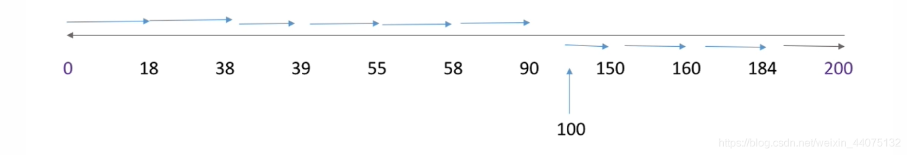

磁头总共移动了(200-100) + (200-0) + (90-0)= 390个磁道。

响应一个请求平均需要移动390/9=43.3个磁道(平均寻找长度)。

优点:比起SCAN来，对于各个位置磁道的响应频率很平均。

缺点:只有到达最边上的磁道时才能改变磁头移动方向，事实上，处理了184号磁道的访问请求之后就不需要再往右移动磁头了;
并且，磁头返回时其实只需要返回到18号磁道即可，不需要返回到最边缘的磁道。另外，比起SCAN算法来，平均寻道时间更长。

7.C-LOOK调度算法

C-SCAN算法的主要缺点是只有到达最边上的磁道时才能改变磁头移动方向，并且磁头返回时不一定需要返回到最边缘的磁道上。C-LOOK 算法就是为了解决这个问题。
如果磁头移动的方向上已经没有磁道访问请求了，就可以立即让磁头返回，并且磁头只需要返回到有磁道访问请求的位置即可。

假设某磁盘的磁道为0~200号，磁头的初始位置是100号磁道，且此时磁头正在往磁道号增大的方向移动，有多个进程先后陆续地请求访问55、58、39、18、90、160、 150、38、184 号磁道。
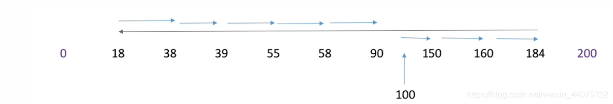

磁头总共移动了(184-100) + (184-18) + (90-18)=322个磁道。

响应一个请求平均需要移动322/9=35.8个磁道(平均寻找长度)。

优点:比起C-SCAN算法来，不需要每次都移动到最外侧或最内侧才改变磁头方向，使寻道时间进一步缩短。

### 三、减少磁盘延迟时间

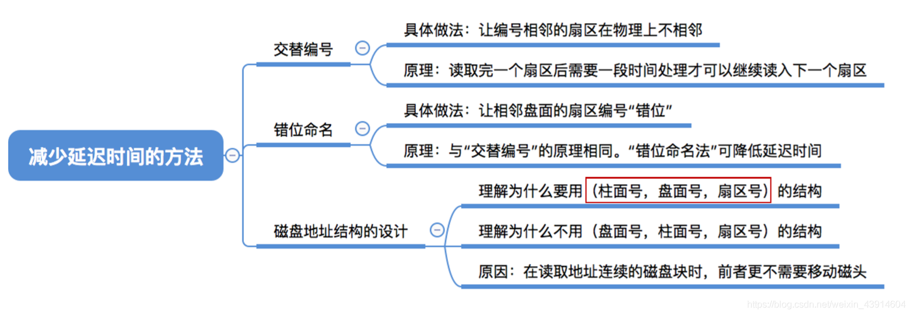

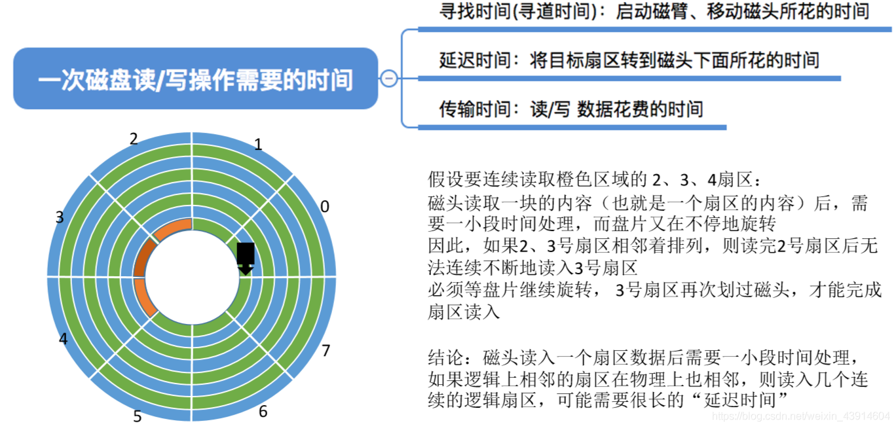

1.交替编号

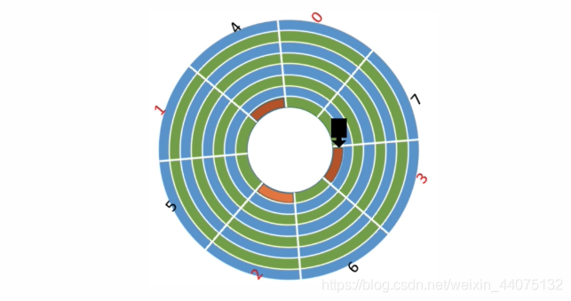

若采用交替编号的策略，即让逻辑上相邻的扇区在物理上有一定的间隔，可以使读取连续的逻辑扇区所需要的延迟时间更小。

2.磁盘地址结构的设计

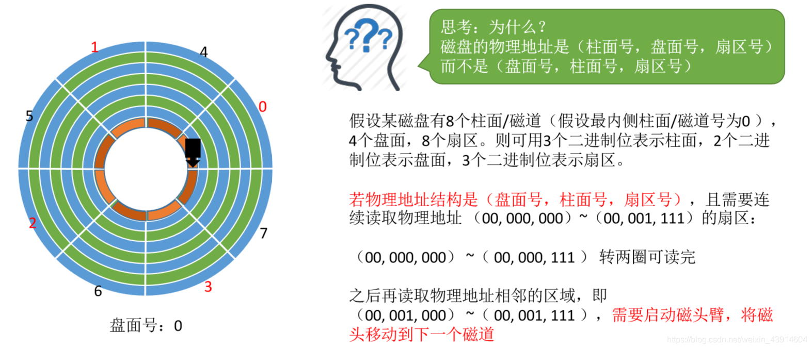

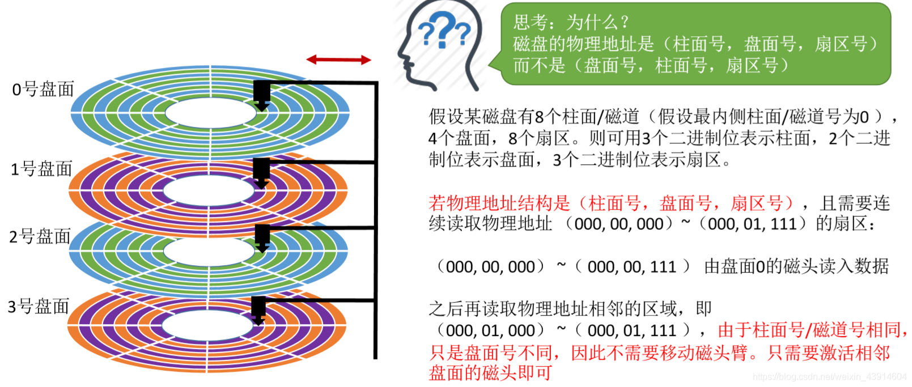

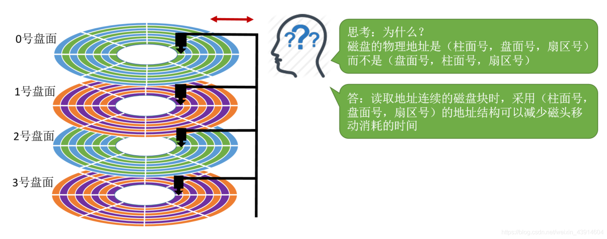

3.错位命名

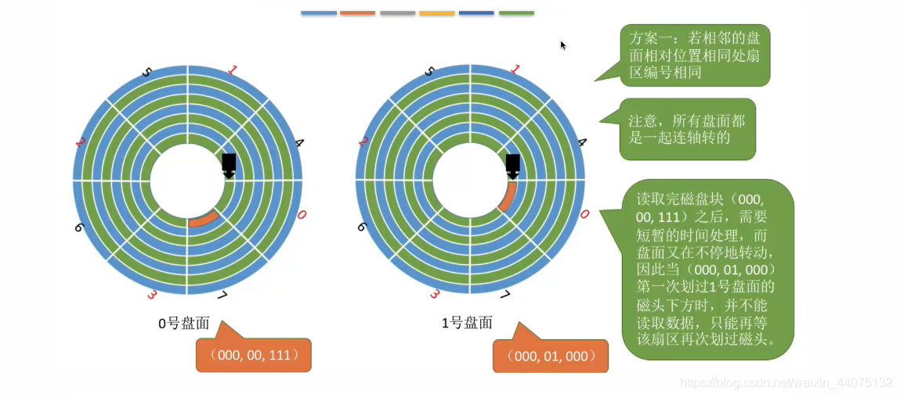

不同盘面之间的命名错开一位，这样可以方便不同盘面之间的连续读取。

### 四、磁盘管理

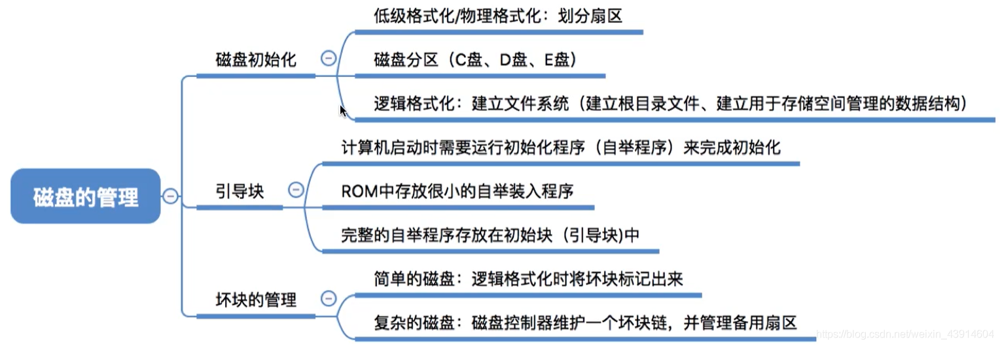

1.磁盘初始化

（1）进行低级格式化(物理格式化)，将磁盘的各个磁道划分为扇区。一个扇区通常可分为头、数据区域(如512B大小)、尾三个部分组成。
管理扇区所需要的各种数据结构一般存放在头、尾两个部分，包括扇区校验码(如奇偶校验、CRC循环冗余校验码等，校验码用于校验扇区中的数据是否发生错误)

（2）将磁盘分区，每个分区由若干柱面组成(即分为我们熟悉的C盘、D盘、E盘)

（3）进行逻辑格式化，创建文件系统。包括创建文件系统的根目录、初始化存储空间管理所用的数据结构(如位示图、空闲分区表)

2.磁盘引导块

计算机开机时需要进行一系列初始化的工作，这些初始化工作是通过执行初始化程序(自举程序)完成的。

初始化程序可以放在ROM ( 只读存储器)中。ROM中的数据在出厂时就写入了，并且以后不能再修改。

````
万一需要更新自举程序，将会很不方便，因为ROM中的数据无法更改。如何解决呢?

1.ROM中只存放很小的“自举装入程序”

2.完整的自举程序放在磁盘的启动块(即引导块/启动分区)上，启动块位于磁盘的固定位置。拥有启动分区的磁盘称为动磁盘或系统磁盘C:盘

开机时计算机先运行“自举装入程序”，通过执行该程序就可找到引导块，并将完整的“自举程序”读入内存，完成初始化
````

3.坏块

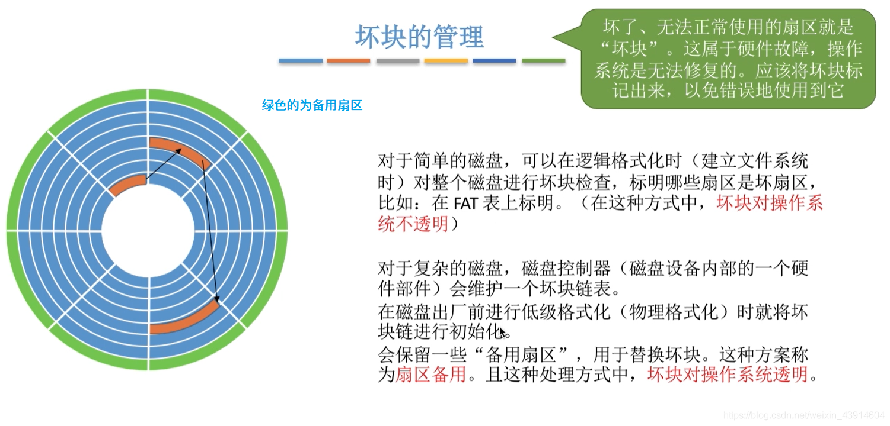


