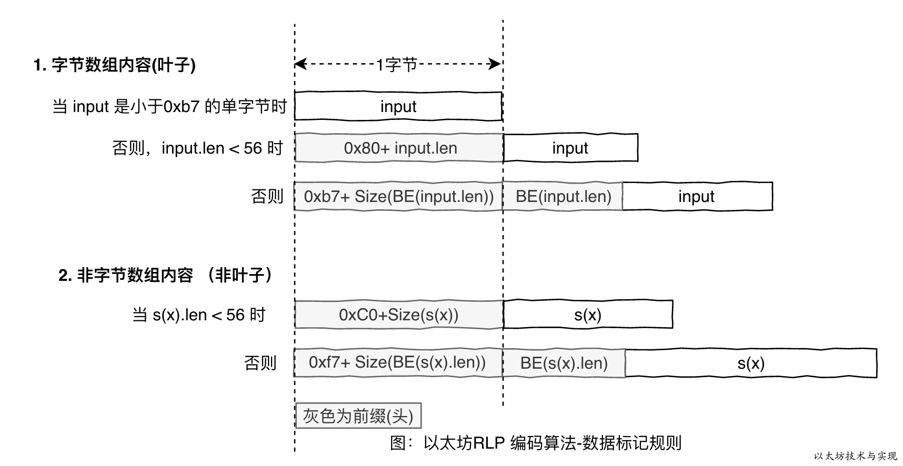

### RLP

RLP(Recursive Length Prefix)，递归长度前缀编码，它是以太坊序列化所采用的编码方式（区块、交易、账户、消息等等）。RLP主要用于以太坊中数据的网络传输和持久化存储。

### 为什么使用RLP？

类似json这样的序列化方式会有数据的冗余，而BSON这样的实现过于复杂。RLP 编码更容易实现，更加简介，并且可确保字节操作的完全一致性。

### RLP定义

RLP编码的定义只处理两类数据：一类是字符串（例如字节数组），一类是列表。字符串指的是一串二进制数据，列表是一个嵌套递归的结构，里面可以包含字符串和列表，例如["cat",["puppy","cow"],"horse",[[]],"pig",[""],"sheep"]就是一个复杂的列表。

其他类型的数据需要转成以上的两类，转换的规则不是RLP编码定义的，可以根据自己的规则转换，例如struct可以转成列表，int可以转成二进制（属于字符串一类）。

RLP编码的特点：递归性，和长度前缀。

- 规则1：对于值在[0, 127]之间的单个字节，其编码是其本身。
    - 如a的RLP编码就是97

- 规则2：如果字节数组长度 <= 55，128+len作为前缀，后接数组本身。此时第一个前缀字节在[0x80,0x80+55=0xb7]之间
    - abc编码结果是[0x83, ‘a’, ‘b’, ‘c’]
    
- 规则3：如果数组长度大于55， 编码结果第一个是183加数组长度的编码的长度，然后是数组长度的本身的编码，最后是byte数组的编码。第一个字节范围是[0xb7+1,0xbf]
    - The length of this sentence is more than 55 bytes, I know it because I pre-designed it
    - [184, 86, ‘T’, ‘h’, ‘e’….]
    - 86表示byte数组的长度，184表示183 + 1（1表示数组长度86编码后占了一个字节）

- 规则4：列表情况，如果列表长度小于55，编码结果第一位是192加列表长度的编码的长度，然后依次连接各子列表递归的编码。第一个字节范围是[192, 192 + 55]
    - ["abc", "def"]的编码结果是[200, 131, ‘a’, ‘b’, ‘c’, 131, ‘d’, ‘e’, ‘f’]
    - 200表示192 + 8（列表元素编码后的长度）
    - 后接列表各个元素的编码
    
- 规则5：如果列表长度超过55，编码结果第一位是247加列表长度的编码长度，然后是列表长度本身的编码，最后依次连接各子列表的编码。
    - ["The length of this sentence is more than 55 bytes, ", "I know it because I pre-designed it"]
    - [248, 88, 179, ‘T’, ‘h’, ‘e’, … , 163, ‘I’, ‘k’, ‘o’…]
    - 248 = 247 + 1(列表长度的编码长度, 88占一个字节
    - 88 = 86 + 2（各个元素的长度编码，各占一个字节）
    - 179表示第一个元素的长度128 + 51
    - 163表示第二个元素的长度128 + 35



解码规则类似如下：

1.　如果f∈ [0,128),　那么它是一个字节本身。

2.　如果f∈[128,184)，那么它是一个长度不超过55的byte数组，数组的长度为 l=f-128

3.　如果f∈[184,192)，那么它是一个长度超过55的数组，长度本身的编码长度ll=f-183,然后从第二个字节开始读取长度为ll的bytes，按照BigEndian编码成整数l，l即为数组的长度。

4.　如果f∈(192,247]，那么它是一个编码后总长度不超过55的列表，列表长度为l=f-192。递归使用规则1~4进行解码。

5.　如果f∈(247,256]，那么它是编码后长度大于55的列表，其长度本身的编码长度ll=f-247,然后从第二个字节读取长度为ll的bytes,按BigEndian编码成整数l，l即为子列表长度。然后递归根据解码规则进行解码。

### go实现
```go
decode.go			解码器，把RLP数据解码为go的数据结构
decode_tail_test.go		解码器测试代码
decode_test.go			解码器测试代码	
doc.go				文档代码
encode.go			编码器，把GO的数据结构序列化为字节数组
encode_test.go			编码器测试
encode_example_test.go
raw.go				未解码的RLP数据
raw_test.go
typecache.go			类型缓存， 类型缓存记录了类型->(编码器|解码器)的内容。

encbuffer.go 具体编码填充数据的处理器
```

encode.EncodeToBytes
```go
func EncodeToBytes(val interface{}) ([]byte, error) {
	buf := getEncBuffer()
	defer encBufferPool.Put(buf)

	if err := buf.encode(val); err != nil {
		return nil, err
	}
	return buf.makeBytes(), nil
}

这里会可以接受任意类型的参数，但由于GO语言本身不支持重载，也没有泛型，所以函数的分派就需要自己实现。
typecache.go中实现根据参数类型反射寻找编码器函数和解码器函数。

经过typecache.go的一系列方法info，generate等
这些方法主要做了缓存和加解锁的操作，类似多重校验单例生成模式，
最终又回到encode中makeWriter方法，找到对应的writer，放入

func makeWriter(typ reflect.Type, ts rlpstruct.Tags) (writer, error) {
	kind := typ.Kind()
	switch {
	case typ == rawValueType:
		return writeRawValue, nil
	case typ.AssignableTo(reflect.PtrTo(bigInt)):
		return writeBigIntPtr, nil
	case typ.AssignableTo(bigInt):
		return writeBigIntNoPtr, nil
	case kind == reflect.Ptr:
		return makePtrWriter(typ, ts)
	case reflect.PtrTo(typ).Implements(encoderInterface):
		return makeEncoderWriter(typ), nil
	case isUint(kind):
		return writeUint, nil
	case kind == reflect.Bool:
		return writeBool, nil
	case kind == reflect.String:
		return writeString, nil
	case kind == reflect.Slice && isByte(typ.Elem()):
		return writeBytes, nil
	case kind == reflect.Array && isByte(typ.Elem()):
		return makeByteArrayWriter(typ), nil
	case kind == reflect.Slice || kind == reflect.Array:
		return makeSliceWriter(typ, ts)
	case kind == reflect.Struct:
		return makeStructWriter(typ)
	case kind == reflect.Interface:
		return writeInterface, nil
	default:
		return nil, fmt.Errorf("rlp: type %v is not RLP-serializable", typ)
	}
}
```

具体算法实现在encbuffer.go中，以["abc", "edf"]分析一次encode的过程。
```go
func TestCode(t *testing.T) {
	b, _ := rlp.EncodeToBytes([]string{"abc", "edf"})

	val := []string{}
	rlp.DecodeBytes(b, &val)

	fmt.Println(b)
	fmt.Println(val)
}


func EncodeToBytes(val interface{}) ([]byte, error) {
	buf := getEncBuffer()
	defer encBufferPool.Put(buf)

	if err := buf.encode(val); err != nil {
		return nil, err
	}
	return buf.makeBytes(), nil
}

func (buf *encBuffer) encode(val interface{}) error {
	rval := reflect.ValueOf(val)
	writer, err := cachedWriter(rval.Type()) //获取类型对应writer，是一个匿名方法
	if err != nil {
		return err
	}
	return writer(rval, buf)//执行方法
}

//从这里返回匿名方法
func makeSliceWriter(typ reflect.Type, ts rlpstruct.Tags) (writer, error) {
	etypeinfo := theTC.infoWhileGenerating(typ.Elem(), rlpstruct.Tags{})
	if etypeinfo.writerErr != nil {
		return nil, etypeinfo.writerErr
	}

	var wfn writer
	if ts.Tail {
		// This is for struct tail slices.
		// w.list is not called for them.
		wfn = func(val reflect.Value, w *encBuffer) error {
			vlen := val.Len()
			for i := 0; i < vlen; i++ {
				if err := etypeinfo.writer(val.Index(i), w); err != nil {
					return err
				}
			}
			return nil
		}
	} else {
		// This is for regular slices and arrays.
		//真正的执行方法体逻辑
		wfn = func(val reflect.Value, w *encBuffer) error {
			vlen := val.Len()
			if vlen == 0 {
				w.str = append(w.str, 0xC0)
				return nil
			}
			listOffset := w.list()
			for i := 0; i < vlen; i++ {
				//处理列表每个元素
				if err := etypeinfo.writer(val.Index(i), w); err != nil {
					return err
				}
			}
			w.listEnd(listOffset)
			return nil
		}
	}
	return wfn, nil
}

//etypeinfo.writer方法，又回到处理字符串的逻辑，这里是一个递归的过程
func writeString(val reflect.Value, w *encBuffer) error {
	s := val.String()
	if len(s) == 1 && s[0] <= 0x7f {//单字节逻辑
		// fits single byte, no string header
		w.str = append(w.str, s[0])
	} else {//多字节
		w.encodeStringHeader(len(s))
		w.str = append(w.str, s...)
	}
	return nil
}

//这里就是规则2中，取字节长度逻辑
func (buf *encBuffer) encodeStringHeader(size int) {
	if size < 56 {
		buf.str = append(buf.str, 0x80+byte(size))
	} else {
		sizesize := putint(buf.sizebuf[1:], uint64(size))
		buf.sizebuf[0] = 0xB7 + byte(sizesize)
		buf.str = append(buf.str, buf.sizebuf[:sizesize+1]...)
	}
}

encode执行完毕，所有元素本身就解析完毕，此时结构
[131, 97, 98, 99, 131, 100, 101, 102]

func (w *encBuffer) makeBytes() []byte {
	out := make([]byte, w.size())
	w.copyTo(out)
	return out
}

//以下两个方法计算规则4中的首位字节，192加列表长度的编码的长度
func (w *encBuffer) copyTo(dst []byte) {
	strpos := 0
	pos := 0
	for _, head := range w.lheads {
		// write string data before header
		n := copy(dst[pos:], w.str[strpos:head.offset])
		pos += n
		strpos += n
		// write the header
		enc := head.encode(dst[pos:])
		pos += len(enc)
	}
	// copy string data after the last list header
	copy(dst[pos:], w.str[strpos:])
}

func (head *listhead) encode(buf []byte) []byte {
	return buf[:puthead(buf, 0xC0, 0xF7, uint64(head.size))]
}
```
decode基本上就是encode的逆过程