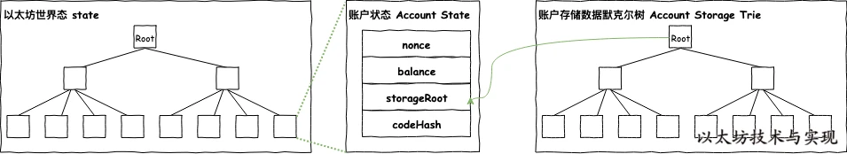
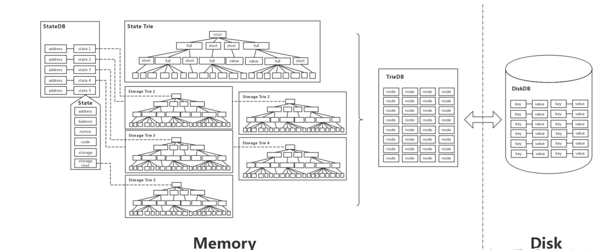
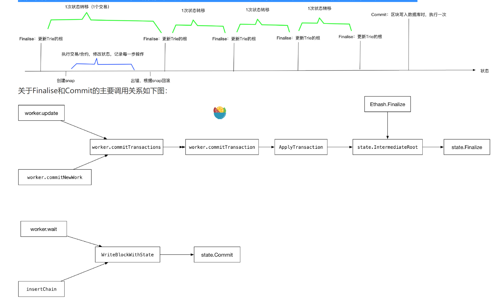
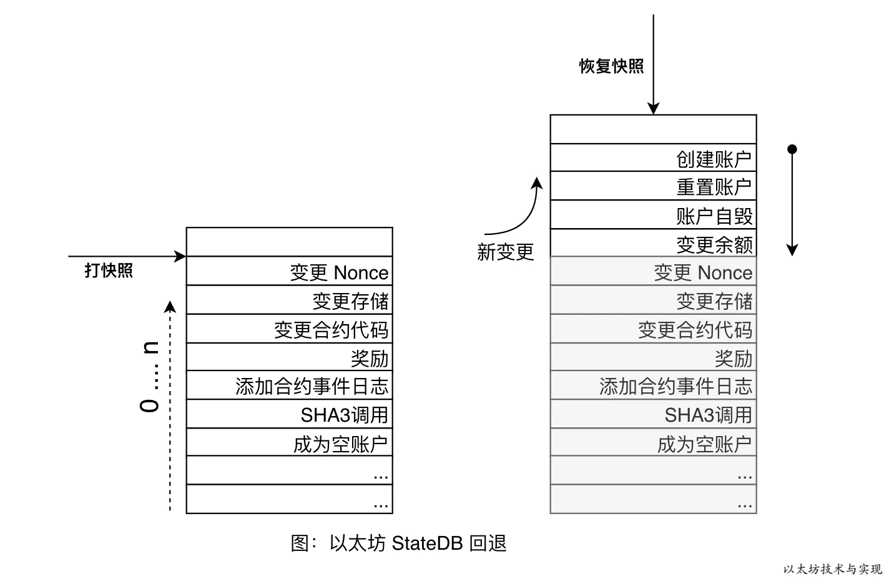

## StateDB

基于状态机模型，以太坊网络可以认为是一个依靠矿工维护的去中心化的大型状态机。在任意时刻，只会处于一个状态中，全世界唯一的状态。

这个世界状态，代表着以太坊网络的全局状态。实际是由无数的账户信息组成，每个账户都有账户余额、Nonce、合约哈希、账户状态等内容，随着账户信息的变化，世界状态也会迁移到新状态。

### 为什么要设计StateDB？

由于账户信息的不断膨胀，一个完整的有所有信息的归档节点已经是TB级别，这些信息显然不能存储在链上，作为优化，这些账户信息将记录在MPT树中，链上仅存储对应的树的ROOT值。这个用来维护账户映射的数据库叫做 StateDB。


在以太坊中，所有和账户相关的状态信息都是通过 StateDB 来存储和获取的。

- 维护账户状态到世界状态的映射。
- 支持修改、回滚、提交状态。
- 支持持久化状态到数据库中。
- 是状态进出默克尔树的媒介。

注意状态数据是以MPT树组织，但MPT树不提供外部接口，增删查改操作的外部接口由StateDB实现。

实际上 StateDB 充当状态（数据）、Trie(树)、LevelDB（存储）的协调者。

stateDB作为MPT树的缓冲层。


再次明确下层次结构

- levelDb：持久化数据，k-v形式序列化存储在磁盘中，逻辑上形成树的结构。
- Trie：从levelDb恢复到内存中，实际上形成树的机构。
- stateDB：提供给外部的接口，对Trie数据访问的包装，同时有自己的缓存，以及存取数据有序列化/反序列化的操作。

### stateDB初始化

构建state需要两个参数

- stateRoot：账户数据的hash树根，相当于世界状态的版本号，一个区块就是一个版本，底层db会记录所有版本的快照。
- db类型：一共有两种db类型，轻节点使用的odrDatabase ，和正常节点端使用的带有缓存的 cachingDB。轻节点并不存储数据，需要通过向其他节点查询来获得数据，而 odrDatabase 就是这种数据读取方式的封装。普通节点内置 levelDB，为了提高读写性能，使用 cachingDB 对其进行一次封装。
- snaps：可选参数，快照树。

```go
datebase.go

// db接口
type Database interface {
	// OpenTrie opens the main account trie.
	//根据roothash构建账户树
	OpenTrie(root common.Hash) (Trie, error)

	// OpenStorageTrie opens the storage trie of an account.
	//构建合约数据树
	OpenStorageTrie(addrHash, root common.Hash) (Trie, error)

	// CopyTrie returns an independent copy of the given trie.
	CopyTrie(Trie) Trie

	// ContractCode retrieves a particular contract's code.
	ContractCode(addrHash, codeHash common.Hash) ([]byte, error)

	// ContractCodeSize retrieves a particular contracts code's size.
	ContractCodeSize(addrHash, codeHash common.Hash) (int, error)

	// TrieDB retrieves the low level trie database used for data storage.
	TrieDB() *trie.Database
}
```
```go
//传入根节点和db开始
func New(root common.Hash, db Database, snaps *snapshot.Tree) (*StateDB, error) {
	tr, err := db.OpenTrie(root)
	if err != nil {
		return nil, err
	}
	sdb := &StateDB{
		db:                  db,
		trie:                tr,
		originalRoot:        root,//根节点
		snaps:               snaps,
		//账户状态缓存
		stateObjects:        make(map[common.Address]*stateObject),
		stateObjectsPending: make(map[common.Address]struct{}),
		//标记被修改过的账户
		stateObjectsDirty:   make(map[common.Address]struct{}),
		logs:                make(map[common.Hash][]*types.Log),
		preimages:           make(map[common.Hash][]byte),
		//修改状态的日志流水，使用此日志流水可回滚状态
		journal:             newJournal(),
		accessList:          newAccessList(),
		hasher:              crypto.NewKeccakState(),
	}
	if sdb.snaps != nil {
		if sdb.snap = sdb.snaps.Snapshot(root); sdb.snap != nil {
			sdb.snapDestructs = make(map[common.Hash]struct{})
			sdb.snapAccounts = make(map[common.Hash][]byte)
			sdb.snapStorage = make(map[common.Hash]map[common.Hash][]byte)
		}
	}
	return sdb, nil
}

trie.go
func New(root common.Hash, db *Database) (*Trie, error) {
	if db == nil {
		panic("trie.New called without a database")
	}
	trie := &Trie{
		db: db,
		//tracer: newTracer(),
	}
	if root != (common.Hash{}) && root != emptyRoot {
		//从底层数据恢复树
		rootnode, err := trie.resolveHash(root[:], nil)
		if err != nil {
			return nil, err
		}
		trie.root = rootnode
	}
	return trie, nil
}

//最终进入datebase.go
func (db *Database) node(hash common.Hash) node {
	// Retrieve the node from the clean cache if available
	if db.cleans != nil {
		if enc := db.cleans.Get(nil, hash[:]); enc != nil {
			memcacheCleanHitMeter.Mark(1)
			memcacheCleanReadMeter.Mark(int64(len(enc)))
			return mustDecodeNode(hash[:], enc)
		}
	}
	// Retrieve the node from the dirty cache if available
	db.lock.RLock()
	dirty := db.dirties[hash]
	db.lock.RUnlock()

	if dirty != nil {
		memcacheDirtyHitMeter.Mark(1)
		memcacheDirtyReadMeter.Mark(int64(dirty.size))
		return dirty.obj(hash)
	}
	memcacheDirtyMissMeter.Mark(1)

	// Content unavailable in memory, attempt to retrieve from disk
	//读取操作
	enc, err := db.diskdb.Get(hash[:])
	if err != nil || enc == nil {
		return nil
	}
	if db.cleans != nil {
		db.cleans.Set(hash[:], enc)
		memcacheCleanMissMeter.Mark(1)
		memcacheCleanWriteMeter.Mark(int64(len(enc)))
	}

	//[]byte解析为node
	return mustDecodeNode(hash[:], enc)
}
```

```go
type stateObject struct {
	//20位地址
	address  common.Address
	//地址hash
	addrHash common.Hash // hash of ethereum address of the account
	//账户数据
	data     types.StateAccount
	//数据库对象
	db       *StateDB

	// DB error.
	// State objects are used by the consensus core and VM which are
	// unable to deal with database-level errors. Any error that occurs
	// during a database read is memoized here and will eventually be returned
	// by StateDB.Commit.
	dbErr error

	// Write caches.
	trie Trie // storage trie, which becomes non-nil on first access
	code Code // contract bytecode, which gets set when code is loaded

	originStorage  Storage // Storage cache of original entries to dedup rewrites, reset for every transaction
	pendingStorage Storage // Storage entries that need to be flushed to disk, at the end of an entire block
	dirtyStorage   Storage // Storage entries that have been modified in the current transaction execution
	fakeStorage    Storage // Fake storage which constructed by caller for debugging purpose.

	// Cache flags.
	// When an object is marked suicided it will be delete from the trie
	// during the "update" phase of the state transition.
	dirtyCode bool // true if the code was updated
	suicided  bool
	deleted   bool
}

//account数据结构
type StateAccount struct {
	Nonce    uint64
	Balance  *big.Int
	Root     common.Hash // merkle root of the storage trie
	CodeHash []byte
}
```
state是以一个map格式存储 

`stateObjects        map[common.Address]*stateObject`

### GetBalance
```go
func (s *StateDB) GetBalance(addr common.Address) *big.Int {
	stateObject := s.getStateObject(addr)
	if stateObject != nil {
		return stateObject.Balance()
	}
	return common.Big0
}

func (s *StateDB) getDeletedStateObject(addr common.Address) *stateObject {
	// Prefer live objects if any is available
	//1.尝试直接从state中获取，state维护在内存中，相当于缓存
	if obj := s.stateObjects[addr]; obj != nil {
		return obj
	}
	// If no live objects are available, attempt to use snapshots
	//2.尝试从快照中获取
	var data *types.StateAccount
	if s.snap != nil {
		start := time.Now()
		acc, err := s.snap.Account(crypto.HashData(s.hasher, addr.Bytes()))
		if metrics.EnabledExpensive {
			s.SnapshotAccountReads += time.Since(start)
		}
		if err == nil {
			if acc == nil {
				return nil
			}
			data = &types.StateAccount{
				Nonce:    acc.Nonce,
				Balance:  acc.Balance,
				CodeHash: acc.CodeHash,
				Root:     common.BytesToHash(acc.Root),
			}
			if len(data.CodeHash) == 0 {
				data.CodeHash = emptyCodeHash
			}
			if data.Root == (common.Hash{}) {
				data.Root = emptyRoot
			}
		}
	}
	// If snapshot unavailable or reading from it failed, load from the database
	//3.尝试从底层树中获取
	if data == nil {
		start := time.Now()
		//这里就是trie.go mtp树的逻辑
		enc, err := s.trie.TryGet(addr.Bytes())
		if metrics.EnabledExpensive {
			s.AccountReads += time.Since(start)
		}
		if err != nil {
			s.setError(fmt.Errorf("getDeleteStateObject (%x) error: %v", addr.Bytes(), err))
			return nil
		}
		if len(enc) == 0 {
			return nil
		}
		data = new(types.StateAccount)
		//4.反序列化数据
		if err := rlp.DecodeBytes(enc, data); err != nil {
			log.Error("Failed to decode state object", "addr", addr, "err", err)
			return nil
		}
	}
	//5.插入缓存
	obj := newObject(s, addr, *data)
	s.setStateObject(obj)
	return obj
}
```

### addBalance/subBalance
```go
func (s *StateDB) AddBalance(addr common.Address, amount *big.Int) {
	stateObject := s.GetOrNewStateObject(addr)
	if stateObject != nil {
		stateObject.AddBalance(amount)
	}
}

func (s *stateObject) AddBalance(amount *big.Int) {
	// EIP161: We must check emptiness for the objects such that the account
	// clearing (0,0,0 objects) can take effect.
	if amount.Sign() == 0 {
		if s.empty() {
			s.touch()
		}
		return
	}
	s.SetBalance(new(big.Int).Add(s.Balance(), amount))
}

func (s *stateObject) SetBalance(amount *big.Int) {
	s.db.journal.append(balanceChange{
		account: &s.address,
		prev:    new(big.Int).Set(s.data.Balance),
	})
	s.setBalance(amount)
}
```
最后的SetBalance做了两件事

- 记录日志balanceChange
- 修改stateObject的balance

这里修改的是stateObject，记录在内存的中缓存数据，真正更新trie和持久化在commit中

### commit

在完成区块挖矿前，只是获得在内存中的状态树的 Root 值。 StateDB 可视为一个内存数据库，状态数据先在内存数据库中完成修改，所有关于状态的计算都在内存中完成。有新的区块产生时，触发commit操作，在将区块持久化时完成有内存到数据库的更新存储，此更新属于增量更新，仅仅修改涉及到被修改部分。

commit主要调用场景有两种

1. 自己挖到区块。
2. 收到他人的区块。

```go
func (s *StateDB) Commit(deleteEmptyObjects bool) (common.Hash, error) {
	if s.dbErr != nil {
		return common.Hash{}, fmt.Errorf("commit aborted due to earlier error: %v", s.dbErr)
	}
	// Finalize any pending changes and merge everything into the tries
	s.IntermediateRoot(deleteEmptyObjects)

	// Commit objects to the trie, measuring the elapsed time
	var storageCommitted int
	codeWriter := s.db.TrieDB().DiskDB().NewBatch()
	for addr := range s.stateObjectsDirty {
		if obj := s.stateObjects[addr]; !obj.deleted {
			// Write any contract code associated with the state object
			if obj.code != nil && obj.dirtyCode {
				rawdb.WriteCode(codeWriter, common.BytesToHash(obj.CodeHash()), obj.code)
				obj.dirtyCode = false
			}
			// Write any storage changes in the state object to its storage trie
			//1.内存中stateObject写入trie中
			committed, err := obj.CommitTrie(s.db)
			if err != nil {
				return common.Hash{}, err
			}
			storageCommitted += committed
		}
	}
	if len(s.stateObjectsDirty) > 0 {
		s.stateObjectsDirty = make(map[common.Address]struct{})
	}
	if codeWriter.ValueSize() > 0 {
		if err := codeWriter.Write(); err != nil {
			log.Crit("Failed to commit dirty codes", "error", err)
		}
	}
	// Write the account trie changes, measuing the amount of wasted time
	var start time.Time
	if metrics.EnabledExpensive {
		start = time.Now()
	}
	// The onleaf func is called _serially_, so we can reuse the same account
	// for unmarshalling every time.
	var account types.StateAccount
	//2.将树中的内容持久化写入db
	root, accountCommitted, err := s.trie.Commit(func(_ [][]byte, _ []byte, leaf []byte, parent common.Hash) error {
		if err := rlp.DecodeBytes(leaf, &account); err != nil {
			return nil
		}
		if account.Root != emptyRoot {
			s.db.TrieDB().Reference(account.Root, parent)
		}
		return nil
	})
	if err != nil {
		return common.Hash{}, err
	}
	if metrics.EnabledExpensive {
		s.AccountCommits += time.Since(start)

		accountUpdatedMeter.Mark(int64(s.AccountUpdated))
		storageUpdatedMeter.Mark(int64(s.StorageUpdated))
		accountDeletedMeter.Mark(int64(s.AccountDeleted))
		storageDeletedMeter.Mark(int64(s.StorageDeleted))
		accountCommittedMeter.Mark(int64(accountCommitted))
		storageCommittedMeter.Mark(int64(storageCommitted))
		s.AccountUpdated, s.AccountDeleted = 0, 0
		s.StorageUpdated, s.StorageDeleted = 0, 0
	}
	// If snapshotting is enabled, update the snapshot tree with this new version
	//3.如果有快照，更新快照
	if s.snap != nil {
		if metrics.EnabledExpensive {
			defer func(start time.Time) { s.SnapshotCommits += time.Since(start) }(time.Now())
		}
		// Only update if there's a state transition (skip empty Clique blocks)
		if parent := s.snap.Root(); parent != root {
			if err := s.snaps.Update(root, parent, s.snapDestructs, s.snapAccounts, s.snapStorage); err != nil {
				log.Warn("Failed to update snapshot tree", "from", parent, "to", root, "err", err)
			}
			// Keep 128 diff layers in the memory, persistent layer is 129th.
			// - head layer is paired with HEAD state
			// - head-1 layer is paired with HEAD-1 state
			// - head-127 layer(bottom-most diff layer) is paired with HEAD-127 state
			if err := s.snaps.Cap(root, 128); err != nil {
				log.Warn("Failed to cap snapshot tree", "root", root, "layers", 128, "err", err)
			}
		}
		s.snap, s.snapDestructs, s.snapAccounts, s.snapStorage = nil, nil, nil, nil
	}
	return root, err
}
```
在生成1个区块的时候，会进行很多次Finalise，回滚是不能跨越交易的，也就是说，当前交易失败了，我不能回滚到上上一条交易。生成区块的时候，最后一次Finalize的Trie的Root，会保存到区块头的Header.Root。当区块要写入到区块链的时候，会执行一次Commit。



Finalize两种调用场景：

1. 执行交易/合约，进行一次状态转移。
2. 给矿工计算奖励后，进行一次状态转移。

### 关于回滚

回滚的功能通过journal实现，对State的任何修改都将产生修改日志，就像mysql的 log 文件，对数据库的操作都将产生日志流水，statedb也可以通过日志回滚。



当需要恢复状态到某个版本时，只需要该版本的日志索引位置以上的所有变更日志从最新到最旧顺序依次回退即可。

```go
work.go

func (w *worker) commitTransaction(env *environment, tx *types.Transaction) ([]*types.Log, error) {
	snap := env.state.Snapshot()

	receipt, err := core.ApplyTransaction(w.chainConfig, w.chain, &env.coinbase, env.gasPool, env.state, env.header, tx, &env.header.GasUsed, *w.chain.GetVMConfig())
	if err != nil {
		//出现错误时使用快照回滚
		env.state.RevertToSnapshot(snap)
		return nil, err
	}
	env.txs = append(env.txs, tx)
	env.receipts = append(env.receipts, receipt)

	return receipt.Logs, nil
}

statedb.go

func (s *StateDB) RevertToSnapshot(revid int) {
	// Find the snapshot in the stack of valid snapshots.
	idx := sort.Search(len(s.validRevisions), func(i int) bool {
		return s.validRevisions[i].id >= revid
	})
	if idx == len(s.validRevisions) || s.validRevisions[idx].id != revid {
		panic(fmt.Errorf("revision id %v cannot be reverted", revid))
	}
	snapshot := s.validRevisions[idx].journalIndex

	// Replay the journal to undo changes and remove invalidated snapshots
	s.journal.revert(s, snapshot)
	s.validRevisions = s.validRevisions[:idx]
}

journal.go

func (j *journal) revert(statedb *StateDB, snapshot int) {
	//snapshot以上所有数据回滚
	for i := len(j.entries) - 1; i >= snapshot; i-- {
		// Undo the changes made by the operation
		j.entries[i].revert(statedb)

		// Drop any dirty tracking induced by the change
		if addr := j.entries[i].dirtied(); addr != nil {
			if j.dirties[*addr]--; j.dirties[*addr] == 0 {
				delete(j.dirties, *addr)
			}
		}
	}
	j.entries = j.entries[:snapshot]
}
```