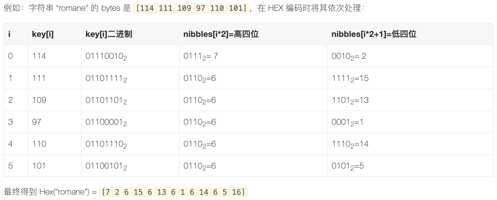

### MPT树结构

- Patricia Tries (前缀树)：压缩前缀树的不同之处在于如果节点公共前缀，那么就使用公共前缀，否则就把剩下的所有节点插入同一个节点。


- Merkle树：Hash树，防篡改，易于验证


### key编码


- **Secure编码：Keccak256(key) 得到的key的哈希值替换原数据key，是为了解决路径深度攻击而将数据进入 MPT 前进行一次安全清洗**
- **HEX编码：将数据 key 进行半字节拆解而成。即依次将 key[0],key[1],…,key[n] 分别进行半字节拆分成两个数，再依次存放在长度为 len(key)+1 的数组中。 并在数组末尾写入终止符 `16`**

```go
func keybytesToHex(str []byte) []byte {
	l := len(str)*2 + 1
	var nibbles = make([]byte, l)
	for i, b := range str {
		nibbles[i*2] = b / 16
		nibbles[i*2+1] = b % 16
	}
	nibbles[l-1] = 16
	return nibbles
}
```



### MPT应用

- State Trie区块头中的状态树
    - key => sha3(以太坊账户地址 address)
    - value => rlp(账号内容信息 account)
- Transactions Trie区块头中的交易树
    - key => rlp(交易的偏移量 transaction index)
    - 每个块都有各自的交易树，且不可更改
- Receipts Trie区块头中的收据树
    - key = rlp(交易的偏移量 transaction index)
    - 每个块都有各自的交易树，且不可更改
- Storage Trie存储树
    - 存储只能合约状态
    - 每个账号有自己的 Storage Trie


#### 节点Type
```go
type (
	//全节点，全节点的父节点必是扩展节点1，成对出现，一对就是一个中间节点
	fullNode struct {
		Children [17]node //
		flags    nodeFlag
	}

	//扩展节点 
	//1.node为valueNode类型时，就是普通的k-v对，叶子节点
	//2.node为fullNode类型时，Key保存的是fullNode的共同前缀
	shortNode struct {
		Key   []byte
		Val   node
		flags nodeFlag
	}
	hashNode  []byte
	valueNode []byte//值节点，只存在于shortnode.val
)
```

#### insert
```go
func (t *Trie) insert(n node, prefix, key []byte, value node) (bool, node, error) {
	if len(key) == 0 {
		if v, ok := n.(valueNode); ok {
			return !bytes.Equal(v, value.(valueNode)), value, nil
		}
		return true, value, nil
	}
	switch n := n.(type) {
	case *shortNode: //root节点一定是shortNode
		//寻找前缀
		matchlen := prefixLen(key, n.Key)

		//如果前缀和key相同，表示为全节点
		if matchlen == len(n.Key) {
			dirty, nn, err := t.insert(n.Val, append(prefix, key[:matchlen]...), key[matchlen:], value)
			if !dirty || err != nil {
				return false, n, err
			}
			return true, &shortNode{n.Key, nn, t.newFlag()}, nil
		}

		//有前缀，构建fullNode，设定children
		branch := &fullNode{flags: t.newFlag()}
		var err error
		_, branch.Children[n.Key[matchlen]], err = t.insert(nil, append(prefix, n.Key[:matchlen+1]...), n.Key[matchlen+1:], n.Val)
		if err != nil {
			return false, nil, err
		}
		_, branch.Children[key[matchlen]], err = t.insert(nil, append(prefix, key[:matchlen+1]...), key[matchlen+1:], value)
		if err != nil {
			return false, nil, err
		}
		// Replace this shortNode with the branch if it occurs at index 0.
		if matchlen == 0 {
			return true, branch, nil
		}
		// New branch node is created as a child of the original short node.
		// Track the newly inserted node in the tracer. The node identifier
		// passed is the path from the root node.
		t.tracer.onInsert(append(prefix, key[:matchlen]...))

		// Replace it with a short node leading up to the branch.
		return true, &shortNode{key[:matchlen], branch, t.newFlag()}, nil

	case *fullNode:
		dirty, nn, err := t.insert(n.Children[key[0]], append(prefix, key[0]), key[1:], value)
		if !dirty || err != nil {
			return false, n, err
		}
		n = n.copy()
		n.flags = t.newFlag()
		n.Children[key[0]] = nn
		return true, n, nil

	case nil:
		// New short node is created and track it in the tracer. The node identifier
		// passed is the path from the root node. Note the valueNode won't be tracked
		// since it's always embedded in its parent.
		t.tracer.onInsert(prefix)

		return true, &shortNode{key, value, t.newFlag()}, nil

	case hashNode:
		// We've hit a part of the trie that isn't loaded yet. Load
		// the node and insert into it. This leaves all child nodes on
		// the path to the value in the trie.
		rn, err := t.resolveHash(n, prefix)
		if err != nil {
			return false, nil, err
		}
		dirty, nn, err := t.insert(rn, prefix, key, value)
		if !dirty || err != nil {
			return false, rn, err
		}
		return true, nn, nil

	default:
		panic(fmt.Sprintf("%T: invalid node: %v", n, n))
	}
}
```