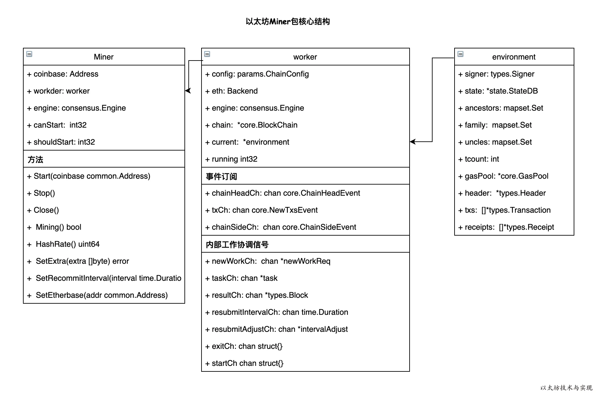

## 整体架构



miner只接受外部信号，然后传递信号给worker，具体实现都在worker中。

## worker

work是具体实现挖矿逻辑的地方，从New开始。
```go
func newWorker(config *Config, chainConfig *params.ChainConfig, engine consensus.Engine, eth Backend, mux *event.TypeMux, isLocalBlock func(header *types.Header) bool, init bool) *worker {
	worker := &worker{
		config:             config,
		chainConfig:        chainConfig,
		engine:             engine,
		eth:                eth,
		mux:                mux,
		chain:              eth.BlockChain(),
		isLocalBlock:       isLocalBlock,
		localUncles:        make(map[common.Hash]*types.Block),
		remoteUncles:       make(map[common.Hash]*types.Block),
		unconfirmed:        newUnconfirmedBlocks(eth.BlockChain(), sealingLogAtDepth),
		pendingTasks:       make(map[common.Hash]*task),
		txsCh:              make(chan core.NewTxsEvent, txChanSize),
		chainHeadCh:        make(chan core.ChainHeadEvent, chainHeadChanSize),
		chainSideCh:        make(chan core.ChainSideEvent, chainSideChanSize),
		newWorkCh:          make(chan *newWorkReq),
		getWorkCh:          make(chan *getWorkReq),
		taskCh:             make(chan *task),
		resultCh:           make(chan *types.Block, resultQueueSize),
		exitCh:             make(chan struct{}),
		startCh:            make(chan struct{}, 1),
		resubmitIntervalCh: make(chan time.Duration),
		resubmitAdjustCh:   make(chan *intervalAdjust, resubmitAdjustChanSize),
	}
	// Subscribe NewTxsEvent for tx pool
	worker.txsSub = eth.TxPool().SubscribeNewTxsEvent(worker.txsCh)
	// Subscribe events for blockchain
	worker.chainHeadSub = eth.BlockChain().SubscribeChainHeadEvent(worker.chainHeadCh)
	worker.chainSideSub = eth.BlockChain().SubscribeChainSideEvent(worker.chainSideCh)

	// Sanitize recommit interval if the user-specified one is too short.
	recommit := worker.config.Recommit
	if recommit < minRecommitInterval {
		log.Warn("Sanitizing miner recommit interval", "provided", recommit, "updated", minRecommitInterval)
		recommit = minRecommitInterval
	}

	worker.wg.Add(4)
	//四个监听线程
	go worker.mainLoop()
	go worker.newWorkLoop(recommit)
	go worker.resultLoop()
	go worker.taskLoop()

	// Submit first work to initialize pending state.
	if init {
		worker.startCh <- struct{}{}
	}
	return worker
}
```

- mianloop：主循环接受开始信号，测链信号，交易信号，是整个挖矿过程的协调者。
- newWorkLoop：工作线程，负责根据不同情况来抉择是否需要终止当前工作，或者开始新一个区块挖掘。
- resultLoop：结果线程，成功计算时结果后的处理。
- taskLoop：任务情况线程，这里是执行真正pow的入口。

[mianloop](./miner/mainloop.md) 

[workLoop](./miner/workLoop.md) 

[resultloop](./miner/resultloop.md) 

[taskloop](./miner/taskloop.md) 

