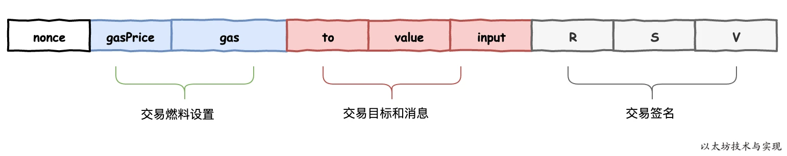
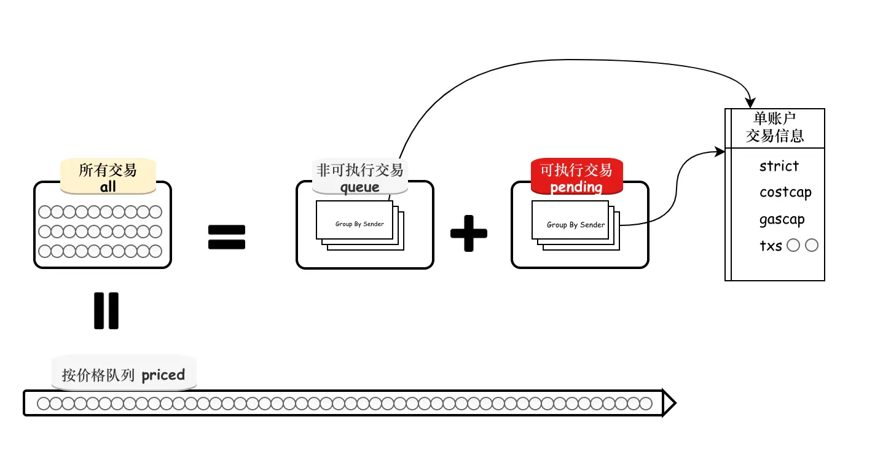

## Tx结构



```go
type Transaction struct {
	//外部不可见tx数据结构
	inner TxData
	time  time.Time // Time first seen locally (spam avoidance)

	// caches
	hash atomic.Value
	size atomic.Value
	from atomic.Value
}

type LegacyTx struct {
	//sender交易nonce，每交易一笔，账户的nonce会+1
	Nonce uint64
	//gas单价
	GasPrice *big.Int
	//gas上限，最高手续费为gasPrcie * gas
	Gas uint64
	//接收方 To ，nil means contract creation
	To *common.Address `rlp:"nil"`
	//转账资金，wei amount
	Value *big.Int
	//合约调用数据
	Data []byte
	//签名信息
	V, R, S *big.Int // signature values
}
```

- 由于交易结构需要hash计算，因此不能随意调整字段定义顺序。
- 由于浮点数精度问题，货币类型均是整数，但最小值1所代表的币值不一样，一个以太币等于 10的18次方 Amount。
- hash cache：hash值运算一次复杂，因此使用缓存降低复杂度

```go
func (tx *Transaction) Hash() common.Hash {
	if hash := tx.hash.Load(); hash != nil {
		return hash.(common.Hash)
	}

	var h common.Hash
	if tx.Type() == LegacyTxType {
		h = rlpHash(tx.inner)
	} else {
		h = prefixedRlpHash(tx.Type(), tx.inner)
	}
	tx.hash.Store(h)
	return h
}
```

- size cache：size计算涉及rlp操作，和长度校验
```go
func (tx *Transaction) Size() common.StorageSize {
	if size := tx.size.Load(); size != nil {
		return size.(common.StorageSize)
	}
	c := writeCounter(0)
	rlp.Encode(&c, &tx.inner)
	tx.size.Store(common.StorageSize(c))
	return common.StorageSize(c)
}
```
- from cache：from涉及签名运算和校验
```go
func Sender(signer Signer, tx *Transaction) (common.Address, error) {
	if sc := tx.from.Load(); sc != nil {
		sigCache := sc.(sigCache)
		// If the signer used to derive from in a previous
		// call is not the same as used current, invalidate
		// the cache.
		//重复事务将不会再处理
		if sigCache.signer.Equal(signer) {
			return sigCache.from, nil
		}
	}

	addr, err := signer.Sender(tx)
	if err != nil {
		return common.Address{}, err
	}
	tx.from.Store(sigCache{signer: signer, from: addr})
	return addr, nil
}
```
hash，size，from这三个根据inner数据确定，一旦确定下来，inner数据不允许修改，否则会引起变化，因此inner数据为私有变量。

完整交易json数据:
```
{
	"nonce": "0x16",
	"gasPrice": "0x2",
	"gas": "0x1",
	"to": "0x0100000000000000000000000000000000000000",
	"value": "0x0",
	"input": "0x616263646566",
	"v": "0x25",
	"r": "0x3c46a1ff9d0dd2129a7f8fbc3e45256d85890d9d63919b42dac1eb8dfa443a32",
	"s": "0x6b2be3f225ae31f7ca18efc08fa403eb73b848359a63cd9fdeb61e1b83407690",
	"hash": "0xb848eb905affc383b4f431f8f9d3676733ea96bcae65638c0ada6e45038fb3a6"
}
```

## TxPool

- 交易池配置
```go
type TxPoolConfig struct {
	//local交易的账户地址。任何来自此清单的交易均被视为 local 交易
	Locals []common.Address
	//是否禁止local交易处理。默认为 fasle,允许 local 交易。如果禁止，则来自 local 的交易均视为 remote 交易处理。
	NoLocals bool
	//存储local交易记录的文件名，默认是 ./transactions.rlp。
	Journal string
	//定期将local交易存储文件中的时间间隔。默认为每小时一次。
	Rejournal time.Duration

	// remote交易进入交易池的最低 Price 要求。此设置对 local 交易无效。默认值1。
	PriceLimit uint64
	//替换交易时所要求的价格上调涨幅比例最低要求。任何低于要求的替换交易均被拒绝。
	PriceBump uint64 // Minimum price bump percentage to replace an already existing transaction (nonce)

	//当交易池中可执行交易（是已在等待矿工打包的交易）量超标时，允许每个账户可以保留在交易池最低交易数。默认值是 16 笔。
	AccountSlots uint64
	//交易池中所允许的可执行交易量上限，高于上限时将释放部分交易。默认是 4096 笔交易。
	GlobalSlots uint64
	//交易池中单个账户非可执行交易上限，默认是64笔。
	AccountQueue uint64
	//交易池中所有非可执行交易上限，默认1024 笔。
	GlobalQueue uint64 
	//允许 remote 的非可执行交易可在交易池存活的最长时间。交易池每分钟检查一次，一旦发现有超期的remote 账户，则移除该账户下的所有非可执行交易。默认为3小时。
	Lifetime time.Duration
}

var DefaultTxPoolConfig = TxPoolConfig{
	Journal:   "transactions.rlp",
	Rejournal: time.Hour,

	PriceLimit: 1,
	PriceBump:  10,

	AccountSlots: 16,
	GlobalSlots:  4096 + 1024, // urgent + floating queue capacity with 4:1 ratio
	AccountQueue: 64,
	GlobalQueue:  1024,

	Lifetime: 3 * time.Hour,
}
```

## 提交Transaction

交易先进入交易池
```
从func addTxs(pool *TxPool) addTxs(txs []*types.Transaction, local, sync bool) []error 开始

一共有三个位置可以调此方法新增交易，AddLocals，AddRemotes，AddRemotesSync。

调用链：
addTxs -> addTxsLocked -> add
```
```go
func (pool *TxPool) add(tx *types.Transaction, local bool) (replaced bool, err error) {
	//1.包含交易，重复提交
	hash := tx.Hash()
	if pool.all.Get(hash) != nil {
		log.Trace("Discarding already known transaction", "hash", hash)
		knownTxMeter.Mark(1)
		return false, ErrAlreadyKnown
	}
	// Make the local flag. If it's from local source or it's from the network but
	// the sender is marked as local previously, treat it as the local transaction.
	isLocal := local || pool.locals.containsTx(tx)

	//2.校验交易合法性
	if err := pool.validateTx(tx, isLocal); err != nil {
		log.Trace("Discarding invalid transaction", "hash", hash, "err", err)
		invalidTxMeter.Mark(1)
		return false, err
	}

	//3.如果交易池满，则淘汰最低fee的交易
	if uint64(pool.all.Slots()+numSlots(tx)) > pool.config.GlobalSlots+pool.config.GlobalQueue {

		//3.1 当前交易就是最低交易，不接受此交易，交易池中队列已经按从高到低排序完成
		if !isLocal && pool.priced.Underpriced(tx) {
			log.Trace("Discarding underpriced transaction", "hash", hash, "gasTipCap", tx.GasTipCap(), "gasFeeCap", tx.GasFeeCap())
			underpricedTxMeter.Mark(1)
			return false, ErrUnderpriced
		}
		// We're about to replace a transaction. The reorg does a more thorough
		// analysis of what to remove and how, but it runs async. We don't want to
		// do too many replacements between reorg-runs, so we cap the number of
		// replacements to 25% of the slots
		if pool.changesSinceReorg > int(pool.config.GlobalSlots/4) {
			throttleTxMeter.Mark(1)
			return false, ErrTxPoolOverflow
		}

		// New transaction is better than our worse ones, make room for it.
		// If it's a local transaction, forcibly discard all available transactions.
		// Otherwise if we can't make enough room for new one, abort the operation.
		//3.2 取出需要淘汰交易list
		drop, success := pool.priced.Discard(pool.all.Slots()-int(pool.config.GlobalSlots+pool.config.GlobalQueue)+numSlots(tx), isLocal)

		// Special case, we still can't make the room for the new remote one.
		if !isLocal && !success {
			log.Trace("Discarding overflown transaction", "hash", hash)
			overflowedTxMeter.Mark(1)
			return false, ErrTxPoolOverflow
		}
		// Bump the counter of rejections-since-reorg
		pool.changesSinceReorg += len(drop)

		// Kick out the underpriced remote transactions.
		//3.3 移出交易池
		for _, tx := range drop {
			log.Trace("Discarding freshly underpriced transaction", "hash", tx.Hash(), "gasTipCap", tx.GasTipCap(), "gasFeeCap", tx.GasFeeCap())
			underpricedTxMeter.Mark(1)
			pool.removeTx(tx.Hash(), false)
		}
	}

	// Try to replace an existing transaction in the pending pool
	//4 尝试加入交易池
	from, _ := types.Sender(pool.signer, tx) // already validated

	//4.1 已存在该nonce交易，但是付更高的fee替换原交易，提升优先级
	//默认上调10%fee才可以进行替换
	if list := pool.pending[from]; list != nil && list.Overlaps(tx) {
		// Nonce already pending, check if required price bump is met
		inserted, old := list.Add(tx, pool.config.PriceBump)
		if !inserted {
			pendingDiscardMeter.Mark(1)
			return false, ErrReplaceUnderpriced
		}
		// New transaction is better, replace old one
		if old != nil {
			pool.all.Remove(old.Hash())
			pool.priced.Removed(1)
			pendingReplaceMeter.Mark(1)
		}
		pool.all.Add(tx, isLocal)
		pool.priced.Put(tx, isLocal)
		pool.journalTx(from, tx)
		pool.queueTxEvent(tx)
		log.Trace("Pooled new executable transaction", "hash", hash, "from", from, "to", tx.To())

		// Successful promotion, bump the heartbeat
		pool.beats[from] = time.Now()
		return old != nil, nil
	}

	//4.2 进入queue队列，同样如果queue中有相同nonce那么做替换处理
	replaced, err = pool.enqueueTx(hash, tx, isLocal, true)
	if err != nil {
		return false, err
	}

	// Mark local addresses and journal local transactions
	//5 如果是本地交易，进入本地集
	if local && !pool.locals.contains(from) {
		log.Info("Setting new local account", "address", from)
		pool.locals.add(from)
		pool.priced.Removed(pool.all.RemoteToLocals(pool.locals)) // Migrate the remotes if it's marked as local first time.
	}
	if isLocal {
		localGauge.Inc(1)
	}
	pool.journalTx(from, tx)

	log.Trace("Pooled new future transaction", "hash", hash, "from", from, "to", tx.To())
	return replaced, nil
}
```
- 打包过程：[blockchain](./tx/blockchain.md) 

## 校验Tx 
```go
func (pool *TxPool) validateTx(tx *types.Transaction, local bool) error {
	//1.主网校验协议
	if !pool.eip2718 && tx.Type() != types.LegacyTxType {
		return ErrTxTypeNotSupported
	}
	if !pool.eip1559 && tx.Type() == types.DynamicFeeTxType {
		return ErrTxTypeNotSupported
	}
	// Reject transactions over defined size to prevent DOS attacks

	//2.防止DOS攻击，不允许交易数据超过128KB
	if uint64(tx.Size()) > txMaxSize {
		return ErrOversizedData
	}
	// Transactions can't be negative. This may never happen using RLP decoded
	// transactions but may occur if you create a transaction using the RPC.

	//3.负值校验，RLP不允许负值，RPC调用可能出现
	if tx.Value().Sign() < 0 {
		return ErrNegativeValue
	}
	// Ensure the transaction doesn't exceed the current block limit gas.

	//4.校验gas费，确保所有交易gas费总和不能超过区块上限
	if pool.currentMaxGas < tx.Gas() {
		return ErrGasLimit
	}
	// Sanity check for extremely large numbers
	if tx.GasFeeCap().BitLen() > 256 {
		return ErrFeeCapVeryHigh
	}
	if tx.GasTipCap().BitLen() > 256 {
		return ErrTipVeryHigh
	}
	// Ensure gasFeeCap is greater than or equal to gasTipCap.
	if tx.GasFeeCapIntCmp(tx.GasTipCap()) < 0 {
		return ErrTipAboveFeeCap
	}
	// Make sure the transaction is signed properly.

	//5.校验签名
	from, err := types.Sender(pool.signer, tx)
	if err != nil {
		return ErrInvalidSender
	}
	// Drop non-local transactions under our own minimal accepted gas price or tip
	if !local && tx.GasTipCapIntCmp(pool.gasPrice) < 0 {
		return ErrUnderpriced
	}

	//6.校验账户nonce，账户的nonce是一个递增数据，该nonce可以间接表示账户交易了多少次
	//该nonce不会变小，当然也不会出现小于当前账户nonce的数据
	if pool.currentState.GetNonce(from) > tx.Nonce() {
		return ErrNonceTooLow
	}

	// cost == V + GP * GL
	//7.校验账户余额
	if pool.currentState.GetBalance(from).Cmp(tx.Cost()) < 0 {
		return ErrInsufficientFunds
	}

	// Ensure the transaction has more gas than the basic tx fee.
	//8.检查节点gas费用，如果设置费用大于 交易设定最高gaslimit，则交易肯定无法成功
	intrGas, err := IntrinsicGas(tx.Data(), tx.AccessList(), tx.To() == nil, true, pool.istanbul)
	if err != nil {
		return err
	}
	if tx.Gas() < intrGas {
		return ErrIntrinsicGas
	}
	return nil
}
```

## 本地交易

Locals表示认定为本地交易的地址

```go
type TxPoolConfig struct {
  //local交易的账户地址。任何来自此清单的交易均被视为 local 交易
	Locals []common.Address
	//是否禁止local交易处理。默认为 fasle,允许 local 交易。如果禁止，则来自 local 的交易均视为 remote 交易处理。
	NoLocals bool
}
```

同时本地交易在交易池中会被打上标志位
```go
func (pool *TxPool) add(tx *types.Transaction, local bool) (replaced bool, err error) {
	...
	pool.all.Add(tx, isLocal)
	pool.priced.Put(tx, isLocal)
	...
}
```
local交易的特权：

1.  在本地磁盘存储已发送的交易。这样，本地交易不会丢失，重启节点时可以重新加载到交易池，实时广播出去。
    
2. local交易可优先于 remote 交易。对交易量的限制等操作，不影响 local 下的账户和交易。

## 执行队列



- 删除无效交易
```go
func (pool *TxPool) loop() {
	...
	for {
		select {
		//1.接受新区块新型号
		case ev := <-pool.chainHeadCh:
			if ev.Block != nil {
				pool.requestReset(head.Header(), ev.Block.Header())
				head = ev.Block
			}
		}
		...
	}
	...
}


func (pool *TxPool) requestReset(oldHead *types.Header, newHead *types.Header) chan struct{} {
	select {
	//2.传递tx重制信号
	case pool.reqResetCh <- &txpoolResetRequest{oldHead, newHead}:
		return <-pool.reorgDoneCh
	case <-pool.reorgShutdownCh:
		return pool.reorgShutdownCh
	}
}


func (pool *TxPool) scheduleReorgLoop() {
	...
	for {
		if curDone == nil && launchNextRun {
			//4.传递reset
			go pool.runReorg(nextDone, reset, dirtyAccounts, queuedEvents)

			// Prepare everything for the next round of reorg
			curDone, nextDone = nextDone, make(chan struct{})
			launchNextRun = false

			reset, dirtyAccounts = nil, nil
			queuedEvents = make(map[common.Address]*txSortedMap)
		}

		...
		select {
		//3.接受重置信号，设置reset值
		case req := <-pool.reqResetCh:
			// Reset request: update head if request is already pending.
			if reset == nil {
				reset = req
			} else {
				reset.newHead = req.newHead
			}
			launchNextRun = true
			pool.reorgDoneCh <- nextDone
		}
		...
	}
}

func (pool *TxPool) runReorg(done chan struct{}, reset *txpoolResetRequest, dirtyAccounts *accountSet, events map[common.Address]*txSortedMap) {
	...
	if reset != nil {
		pool.demoteUnexecutables()
	...
}

func (pool *TxPool) demoteUnexecutables() {
	...
	// Iterate over all accounts and demote any non-executable transactions
	for addr, list := range pool.pending {
		nonce := pool.currentState.GetNonce(addr)

		// Drop all transactions that are deemed too old (low nonce)
		//5.删除低于新nonce的交易
		olds := list.Forward(nonce)
		for _, tx := range olds {
			hash := tx.Hash()
			pool.all.Remove(hash)
			log.Trace("Removed old pending transaction", "hash", hash)
		}
		// Drop all transactions that are too costly (low balance or out of gas), and queue any invalids back for later
		//6.重新计算余额，删除余额不足的交易
		drops, invalids := list.Filter(pool.currentState.GetBalance(addr), pool.currentMaxGas)
		for _, tx := range drops {
			hash := tx.Hash()
			log.Trace("Removed unpayable pending transaction", "hash", hash)
			pool.all.Remove(hash)
		}
	}
	...
}
```

- 提升tx等级，从等待队列queue进入可执行队列pending
```go
func (pool *TxPool) promoteExecutables(accounts []common.Address) []*types.Transaction {
	// Track the promoted transactions to broadcast them at once
	var promoted []*types.Transaction

	// Iterate over all accounts and promote any executable transactions
	for _, addr := range accounts {
		//某账户所有queue事务
		list := pool.queue[addr]
		if list == nil {
			continue // Just in case someone calls with a non existing account
		}
		// Drop all transactions that are deemed too old (low nonce)
		forwards := list.Forward(pool.currentState.GetNonce(addr))
		for _, tx := range forwards {
			hash := tx.Hash()
			pool.all.Remove(hash)
		}
		log.Trace("Removed old queued transactions", "count", len(forwards))
		// Drop all transactions that are too costly (low balance or out of gas)
		drops, _ := list.Filter(pool.currentState.GetBalance(addr), pool.currentMaxGas)
		for _, tx := range drops {
			hash := tx.Hash()
			pool.all.Remove(hash)
		}
		log.Trace("Removed unpayable queued transactions", "count", len(drops))
		queuedNofundsMeter.Mark(int64(len(drops)))

		// Gather all executable transactions and promote them
		//获取该账户pending中最小nonce，如果queue中存在更小的nonce，那么提升进入pending中
		readies := list.Ready(pool.pendingNonces.get(addr))
		for _, tx := range readies {
			hash := tx.Hash()
			if pool.promoteTx(addr, hash, tx) {
				promoted = append(promoted, tx)
			}
		}
		log.Trace("Promoted queued transactions", "count", len(promoted))
		queuedGauge.Dec(int64(len(readies)))

		// Drop all transactions over the allowed limit
		//如果账户不在local中，那么有交易数上限，移除多余的交易
		var caps types.Transactions
		if !pool.locals.contains(addr) {
			caps = list.Cap(int(pool.config.AccountQueue))
			for _, tx := range caps {
				hash := tx.Hash()
				pool.all.Remove(hash)
				log.Trace("Removed cap-exceeding queued transaction", "hash", hash)
			}
			queuedRateLimitMeter.Mark(int64(len(caps)))
		}
		// Mark all the items dropped as removed
		pool.priced.Removed(len(forwards) + len(drops) + len(caps))
		queuedGauge.Dec(int64(len(forwards) + len(drops) + len(caps)))
		if pool.locals.contains(addr) {
			localGauge.Dec(int64(len(forwards) + len(drops) + len(caps)))
		}
		// Delete the entire queue entry if it became empty.
		if list.Empty() {
			delete(pool.queue, addr)
			delete(pool.beats, addr)
		}
	}
	return promoted
}
```

- 删除超出上限交易，queue和pending
```go
func (pool *TxPool) runReorg(done chan struct{}, reset *txpoolResetRequest, dirtyAccounts *accountSet, events map[common.Address]*txSortedMap) {
	// Ensure pool.queue and pool.pending sizes stay within the configured limits.
	pool.truncatePending()
	pool.truncateQueue()
}
```

## journal
[journal](./tx/journal.md) 
   

## 交易执行
TODO