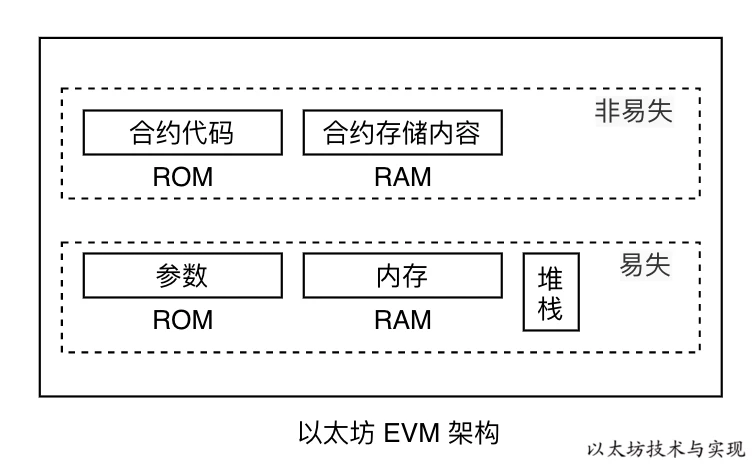
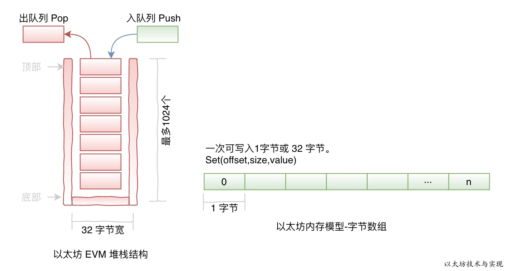
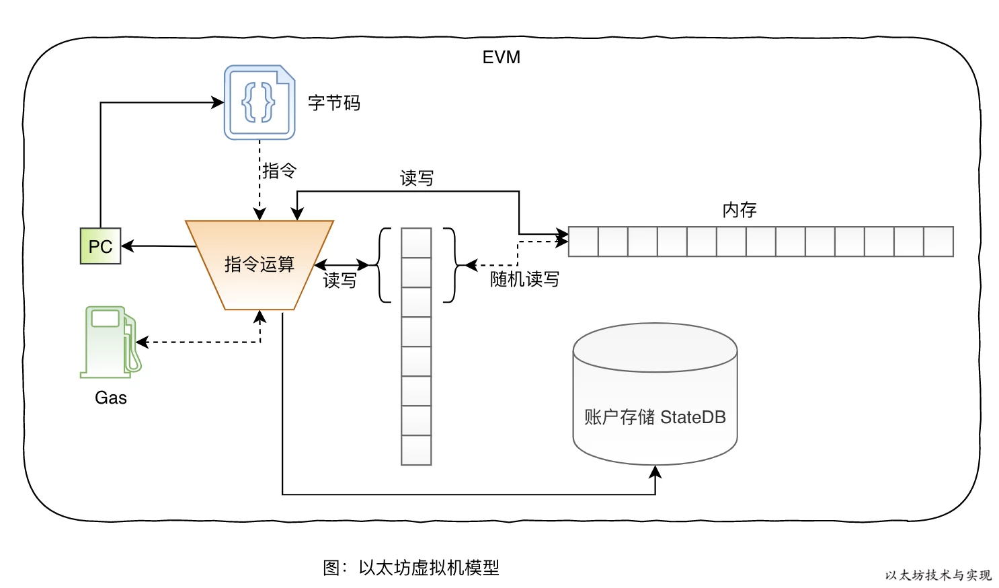

## 概述

EVM 是一个**准图灵完备机**，他为智能合约的执行提供运行时环境，实现以太坊共识模型，从而改变区块链的状态。

EVM计算受内存和时间限制， 而EVM上的计算受GAS限制。 Gas 是在以太坊计算引擎上执行操作的单位开销。在EVM上执行程序（智能合约）之前，先估算程序中每个操作的 Gas 开销，然后在执行程序中的每个操作时付费。在 EVM 中的程序靠 Gas 燃料作为动力来驱动。 这限制了每个程序的EVM执行的操作数量，因为程序可能会用光Gas。因为此种机制，所有写入操作都需要花费gas，且避免无限loop操作。

以太坊的共识执行模型指定了在给定的一系列字节码指令的情况下如何修改以太坊世界状态(World State)。 这些字节码指令由 EVM 编译器根据智能合约和环境信息编译。 EVM 的作用是通过为智能合约提供运行时环境来实现此执行模型，该智能合约已被 EVM 编译器编译为要执行的字节码， EVM 管理合约发起交易的执行，然后将区块链转换为新状态。

EVM使用栈机制实现。

堆栈是先进后出模型，最大大小为 1024，初始大小为 0。内存模型是简单的基于字寻址的字节数组，每项数据都分配有自己的内存地址（数组偏移量和大小）。

## 执行模型

合约字节码中指定了 EVM 要执行怎样的指令运算。 PC 是程序计算器，用于指明代码的执行位置。 每次读到的一个指令，都有对应的运算逻辑。如果不存在则说明指令错误，合约执行终止。 在运算时将从堆栈、内存、账户StateDB中读写数据。

## EVM 安全性

1. 执行程序过程中每个计算步骤都必须预先付费，从而防止拒绝服务（DoS）攻击。如果预先支付了计算步骤，则打算在EVM上无限执行的任何恶意程序最终都会在某个时刻耗尽资源，从而确保该恶意程序的执行不会拒绝其他程序使用EVM。
2. 程序只能通过传输单个任意长度的字节数组来进行交互。他们无法访问彼此的状态。
3. 程序执行是沙盒操作；一个EVM程序可以访问和修改其自身的内部状态，并且可以触发其他EVM程序的执行，但除此之外别无其他。
4. 程序执行是完全确定性的，并为以相同状态开始的执行都而产生相同的状态转换。

## gas计算
[gas计算](./evm/gas.md) 

## 字节码
[字节码](./evm/bytecodes.md) 

## 存储结构
[存储结构](./evm/存储结构.md) 

## 方法调用
[方法调用](./evm/evm方法执行.md) 
