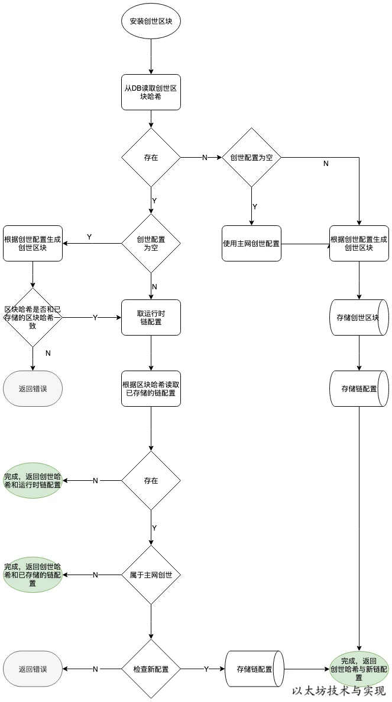

## json配置
```json
{
    "config": {
        "chainId": 15,
        "homesteadBlock": 1150000,
        "daoForkBlock": 1920000,
        "daoForkSupport": true,
        "eip150Block": 2463000,
        "eip150Hash": "0x2086799aeebeae135c246c65021c82b4e15a2c451340993aacfd2751886514f0",
        "eip155Block": 2675000,
        "eip158Block": 2675000,
        "byzantiumBlock": 4370000,
        "constantinopleBlock": 7280000,
        "petersburgBlock": 7280000,
        "ethash": {}
    },
    "nonce": "0x42",
    "timestamp": "0x0",
    "extraData": "0x11bbe8db4e347b4e8c937c1c8370e4b5ed33adb3db69cbdb7a38e1e50b1b82fa",
    "gasLimit": "0x1388",
    "difficulty": "0x400000000",
    "mixHash": "0x0000000000000000000000000000000000000000000000000000000000000000",
    "coinbase": "0x0000000000000000000000000000000000000000",
    "number": "0x0",
    "gasUsed": "0x0",
    "parentHash": "0x0000000000000000000000000000000000000000000000000000000000000000",
    "alloc": {
        "7df9a875a174b3bc565e6424a0050ebc1b2d1d82": { "balance": "300000" },
		    "f41c74c9ae680c1aa78f42e5647a62f353b7bdde": { "balance": "400000" }
    }
}
```

genesis.json配置

1. config：链配置，指定共识协议和出块配置
2. header信息
    - nonce：非必填，随机数，对应创世区块 Nonce 字段。
    - timestamp：非必填，UTC时间戳，对应创世区块 Time字段。
    - extraData：非必填，额外数据，对应创世区块 Extra 字段。
    - gasLimit：**必填**，燃料上限，对应创世区块 GasLimit 字段。
    - difficulty：**必填**，难度系数，对应创世区块 Difficulty 字段。搭建私有链时，需要根据情况选择合适的难度值，以便调整出块。
    - mixHash：非必填，一个哈希值，对应创世区块的MixDigest字段。和 nonce 值一起证明在区块上已经进行了足够的计算。
    - coinbase：非必填，一个地址，对应创世区块的Coinbase字段。
3. alloc：创世中初始账户资产配置。在生成创世区块时，将此数据集中的账户资产写入区块中，相当于预挖矿。 这对开发测试和私有链非常好用，不需要挖矿就可以直接为任意多个账户分配资产。

## 测试网

需要多个节点测试时使用可使用测试网链

geth命令中使用networkid可以指定：

1. 不同网络使用不同ID标识。
    - 1=Frontier，主网环境，是默认选项。
    - 2=Morden 测试网络，但已禁用。
    - 3=Ropsten 测试网络。
    - 4=Rinkeby 测试网络。
2. 直接使用网络名称：
    - testnet: Ropsten 测试网络。
    - rinkeby: Rinkeby 测试网络。
    - goerli: Görli 测试网络。
    - dev: 本地开发环境。

geth 启动时根据不同参数选择加载不同网络配置，并对应不同网络环境。 如果不做任何选择，虽然在此不会做出选择，但在后面流程中会默认使用主网配置。

## 创建流程



首先，需要从数据库中根据区块高度 0 读取创世区块哈希。 如果不存在则说明本地属于第一次启动，直接使用运行时创世配置来构建创世区块。 属于首次，还需要存储创世区块和链配置。

如果存在，则需要使用运行时创世配置构建创世区块并和本次已存储的创世区块哈希进行对比。 一旦不一致，则返回错误，不得继续。

随后，还需要检查链配置。先从数据库获取链配置，如果不存在，则无需校验直接使用运行时链配置。 否则，需要检查运行时链配置是否正确，只有正确时才能替换更新。 但有一个例外：主网配置不得随意更改，由代码控制而非人为指定。

总的来说，以太坊默认使用主网配置，只有在首次运行时才创建和存储创世区块，其他时候仅仅用于校验。 而链配置除主网外则在规则下可随时变更。

```go
func (g *Genesis) ToBlock(db ethdb.Database) *types.Block {
	if db == nil {
		db = rawdb.NewMemoryDatabase()
	}
	//1.生成statedb，并写入alloc预账户信息，不止可以设置个人账户，也可以设置合约账户，只要写入code，storage等字段
	//2.commit区块后生成root
	root, err := g.Alloc.flush(db)
	if err != nil {
		panic(err)
	}
	//3.填充root header
	head := &types.Header{
		Number:     new(big.Int).SetUint64(g.Number),
		Nonce:      types.EncodeNonce(g.Nonce),
		Time:       g.Timestamp,
		ParentHash: g.ParentHash,
		Extra:      g.ExtraData,
		GasLimit:   g.GasLimit,
		GasUsed:    g.GasUsed,
		BaseFee:    g.BaseFee,
		Difficulty: g.Difficulty,
		MixDigest:  g.Mixhash,
		Coinbase:   g.Coinbase,
		Root:       root,
	}
	//4.设置gaslimit和Difficulty
	if g.GasLimit == 0 {
		head.GasLimit = params.GenesisGasLimit
	}
	if g.Difficulty == nil && g.Mixhash == (common.Hash{}) {
		head.Difficulty = params.GenesisDifficulty
	}
	if g.Config != nil && g.Config.IsLondon(common.Big0) {
		if g.BaseFee != nil {
			head.BaseFee = g.BaseFee
		} else {
			head.BaseFee = new(big.Int).SetUint64(params.InitialBaseFee)
		}
	}
	//5.创建区块，并且创世区块无交易记录
	return types.NewBlock(head, nil, nil, nil, trie.NewStackTrie(nil))
}
```