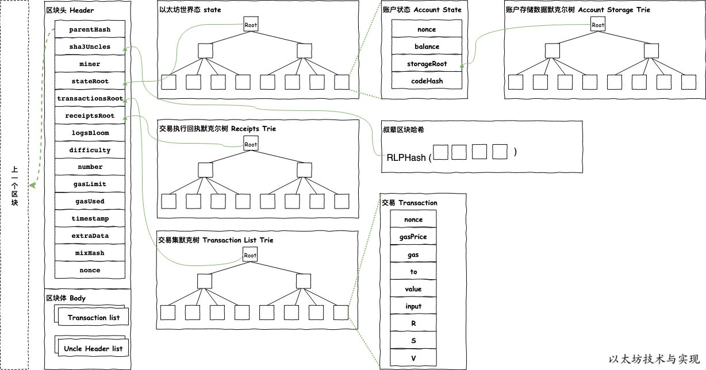
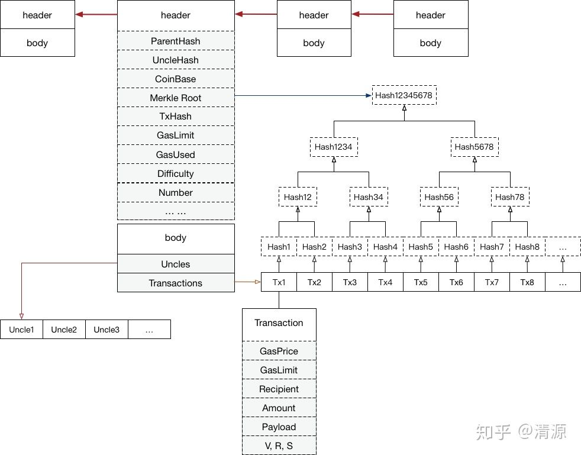
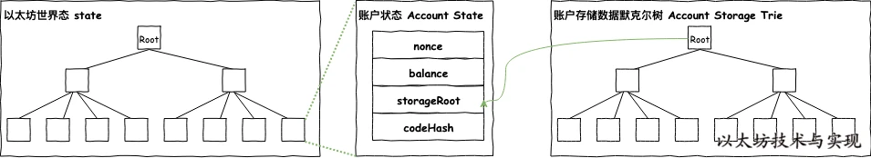

## Block结构




如：[https://etherscan.io/block/14828705#collapsePanel](https://etherscan.io/block/14828705#collapsePanel)

Merkle Root:世界状态的哈希，stateDB的RLP编码后的哈希值。



Root会指向一棵stateDB存储的状态树，存储在full节点中。

账户数据结构：

- nonce: 这个值等于由此账户发出的交易数量，或者由这个账户所创建的合约数量(当这个账户有关联代码时)。
- balance: 表示这个账户账户余额。
- storageRoot: 表示保存了账户存储内容的 MPT 树的根节点的哈希值。
- codeHash: 表示账户的 EVM 代码哈希值，当这个地址接收到一个消息调用时，这些代码会被执行; 它和其它字段不同，创建后不可更改。如果 codeHash 为空，则说明该账户是一个简单的外部账户，只存在 nonce 和 balance

```go
type Block struct {
	header       *Header
	uncles       []*Header
	transactions Transactions

	// caches
	hash atomic.Value
	size atomic.Value

	// Td is used by package core to store the total difficulty
	// of the chain up to and including the block.
	td *big.Int

	// These fields are used by package eth to track
	// inter-peer block relay.
	ReceivedAt   time.Time
	ReceivedFrom interface{}
}

type Header struct {
	ParentHash  common.Hash    `json:"parentHash"       gencodec:"required"`
	UncleHash   common.Hash    `json:"sha3Uncles"       gencodec:"required"`
	Coinbase    common.Address `json:"miner"`
	Root        common.Hash    `json:"stateRoot"        gencodec:"required"`
	TxHash      common.Hash    `json:"transactionsRoot" gencodec:"required"`
	ReceiptHash common.Hash    `json:"receiptsRoot"     gencodec:"required"`
	Bloom       Bloom          `json:"logsBloom"        gencodec:"required"`
	Difficulty  *big.Int       `json:"difficulty"       gencodec:"required"`
	Number      *big.Int       `json:"number"           gencodec:"required"`
	GasLimit    uint64         `json:"gasLimit"         gencodec:"required"`
	GasUsed     uint64         `json:"gasUsed"          gencodec:"required"`
	Time        uint64         `json:"timestamp"        gencodec:"required"`
	Extra       []byte         `json:"extraData"        gencodec:"required"`
	MixDigest   common.Hash    `json:"mixHash"`
	Nonce       BlockNonce     `json:"nonce"`

	// BaseFee was added by EIP-1559 and is ignored in legacy headers.
	BaseFee *big.Int `json:"baseFeePerGas" rlp:"optional"`
}

type Transaction struct {
	//外部不可见tx数据结构
	inner TxData
	time  time.Time // Time first seen locally (spam avoidance)

	// caches
	hash atomic.Value
	size atomic.Value
	from atomic.Value
}
```
```go
//block构建
func NewBlock(header *Header, txs []*Transaction, uncles []*Header, receipts []*Receipt, hasher TrieHasher) *Block {
	b := &Block{header: CopyHeader(header), td: new(big.Int)}

	//构建txroot
	if len(txs) == 0 {
		b.header.TxHash = EmptyRootHash
	} else {
		b.header.TxHash = DeriveSha(Transactions(txs), hasher)
		b.transactions = make(Transactions, len(txs))
		copy(b.transactions, txs)
	}

	//构建receiptroot
	if len(receipts) == 0 {
		b.header.ReceiptHash = EmptyRootHash
	} else {
		b.header.ReceiptHash = DeriveSha(Receipts(receipts), hasher)
		b.header.Bloom = CreateBloom(receipts)
	}

	if len(uncles) == 0 {
		b.header.UncleHash = EmptyUncleHash
	} else {
		b.header.UncleHash = CalcUncleHash(uncles)
		b.uncles = make([]*Header, len(uncles))
		for i := range uncles {
			b.uncles[i] = CopyHeader(uncles[i])
		}
	}

	return b
}

func DeriveSha(list DerivableList, hasher TrieHasher) common.Hash {
	hasher.Reset()

	valueBuf := encodeBufferPool.Get().(*bytes.Buffer)
	defer encodeBufferPool.Put(valueBuf)

	var indexBuf []byte
	//构建mpt树
	for i := 1; i < list.Len() && i <= 0x7f; i++ {
		indexBuf = rlp.AppendUint64(indexBuf[:0], uint64(i))
		value := encodeForDerive(list, i, valueBuf)
		hasher.Update(indexBuf, value)
	}
	if list.Len() > 0 {
		indexBuf = rlp.AppendUint64(indexBuf[:0], 0)
		value := encodeForDerive(list, 0, valueBuf)
		hasher.Update(indexBuf, value)
	}
	for i := 0x80; i < list.Len(); i++ {
		indexBuf = rlp.AppendUint64(indexBuf[:0], uint64(i))
		value := encodeForDerive(list, i, valueBuf)
		hasher.Update(indexBuf, value)
	}
	//从树中求出hash root
	return hasher.Hash()
}
```

## reward奖励

总奖励 = 区块奖励 + 叔块奖励 + 矿工费

- 区块奖励

```go
worker.go

func (w *worker) commit(env *environment, interval func(), update bool, start time.Time) error {
	if w.isRunning() {
		if interval != nil {
			interval()
		}
		// Create a local environment copy, avoid the data race with snapshot state.
		// https://github.com/ethereum/go-ethereum/issues/24299
		env := env.copy()
		//最终组装，这里包括结算奖励
		block, err := w.engine.FinalizeAndAssemble(w.chain, env.header, env.state, env.txs, env.unclelist(), env.receipts)
		if err != nil {
			return err
		}
		// If we're post merge, just ignore
		if !w.isTTDReached(block.Header()) {
			select {
			//发送执行信号，开始pow计算
			case w.taskCh <- &task{receipts: env.receipts, state: env.state, block: block, createdAt: time.Now()}:
				w.unconfirmed.Shift(block.NumberU64() - 1)
				log.Info("Commit new sealing work", "number", block.Number(), "sealhash", w.engine.SealHash(block.Header()),
					"uncles", len(env.uncles), "txs", env.tcount,
					"gas", block.GasUsed(), "fees", totalFees(block, env.receipts),
					"elapsed", common.PrettyDuration(time.Since(start)))

			case <-w.exitCh:
				log.Info("Worker has exited")
			}
		}
	}
	if update {
		w.updateSnapshot(env)
	}
	return nil
}

consensus.go

FinalizeAndAssemble() -> Finalize()

func (ethash *Ethash) Finalize(chain consensus.ChainHeaderReader, header *types.Header, state *state.StateDB, txs []*types.Transaction, uncles []*types.Header) {
	// Accumulate any block and uncle rewards and commit the final state root
	//结算奖励
	accumulateRewards(chain.Config(), state, header, uncles)
	header.Root = state.IntermediateRoot(chain.Config().IsEIP158(header.Number))
}

func accumulateRewards(config *params.ChainConfig, state *state.StateDB, header *types.Header, uncles []*types.Header) {
	// Select the correct block reward based on chain progression
	//1.结算区块奖励，最开始是5ETH，Byzantium分叉后为3ETH，Constantinople分叉后为2ETH
	blockReward := FrontierBlockReward
	if config.IsByzantium(header.Number) {
		blockReward = ByzantiumBlockReward
	}
	if config.IsConstantinople(header.Number) {
		blockReward = ConstantinopleBlockReward
	}
	// Accumulate the rewards for the miner and any included uncles
	reward := new(big.Int).Set(blockReward)
	r := new(big.Int)
	//2.结算叔块奖励
	for _, uncle := range uncles {
		r.Add(uncle.Number, big8)
		r.Sub(r, header.Number)
		r.Mul(r, blockReward)
		r.Div(r, big8)
		state.AddBalance(uncle.Coinbase, r)

		r.Div(blockReward, big32)
		reward.Add(reward, r)
	}
	//3.直接加到账户余额
	state.AddBalance(header.Coinbase, reward)
}
```

注意是先计算好区块，结算金额，再去寻找nonce，一旦寻找到，此时区块已经完成了奖励的发放。

## 提交区块

```go
worker.go

func (w *worker) resultLoop() {
	...
	//提交区块（Block）、交易回执（Receipt）、状态（State）和日志（log）到本地数据库中。
	_, err := w.chain.WriteBlockAndSetHead(block, receipts, logs, task.state, true)
	...
}

blockchain.go

func (bc *BlockChain) writeBlockWithState(block *types.Block, receipts []*types.Receipt, logs []*types.Log, state *state.StateDB) error {
	...
	//批处理事务写入db
	blockBatch := bc.db.NewBatch()
	rawdb.WriteTd(blockBatch, block.Hash(), block.NumberU64(), externTd)
	rawdb.WriteBlock(blockBatch, block)
	rawdb.WriteReceipts(blockBatch, block.Hash(), block.NumberU64(), receipts)
	rawdb.WritePreimages(blockBatch, state.Preimages())
	if err := blockBatch.Write(); err != nil {
		log.Crit("Failed to write block into disk", "err", err)
	}
	...
}
```

### SideChain侧链相关

[SideChain](./block/sidechain.md) 

### 关于交易和矿工费

[Gas](./block/gas.md) 