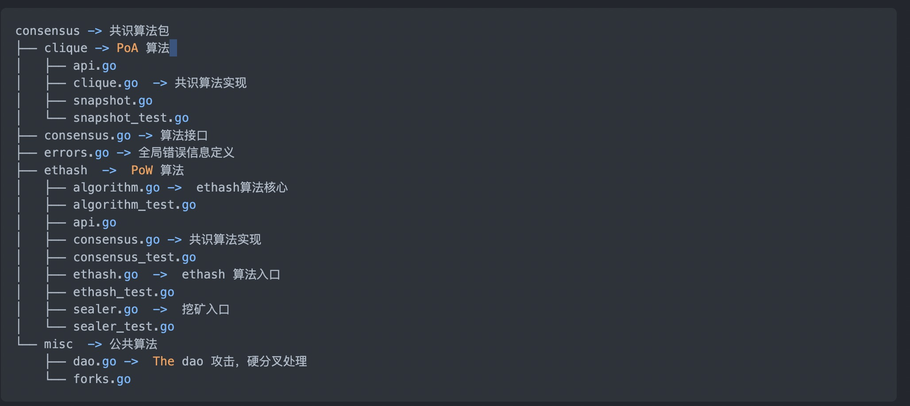
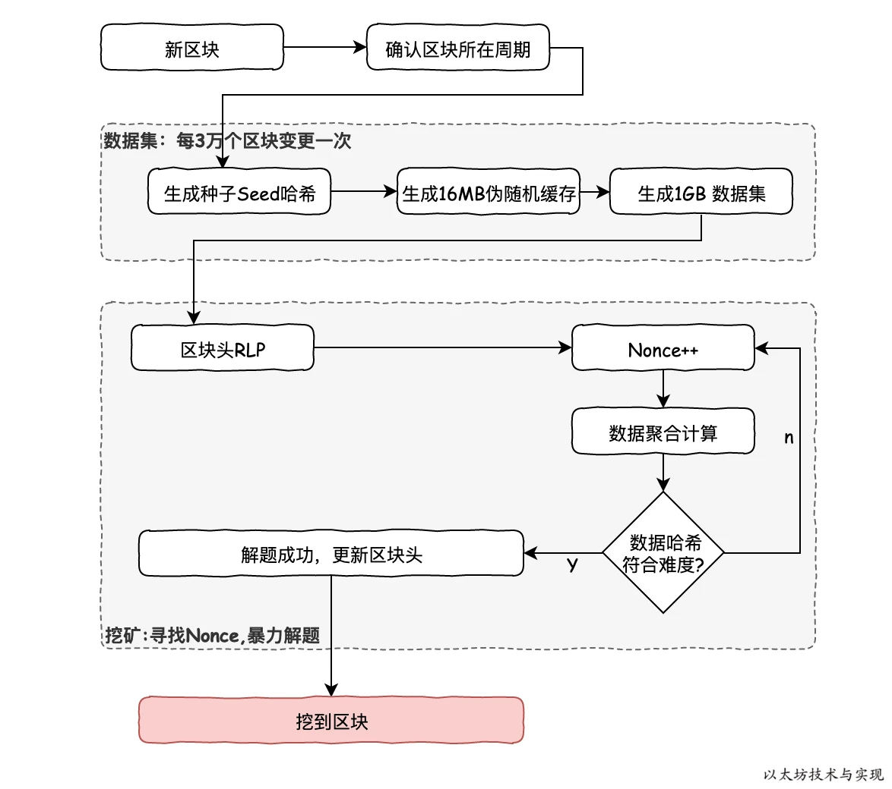
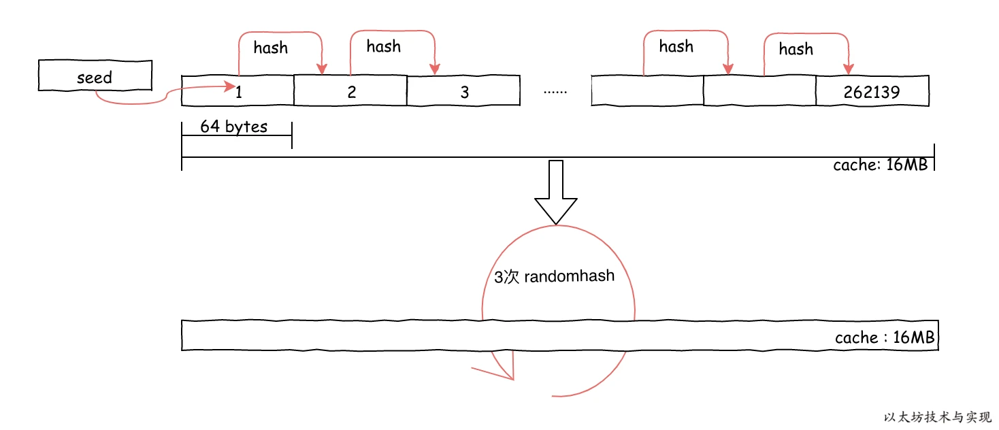
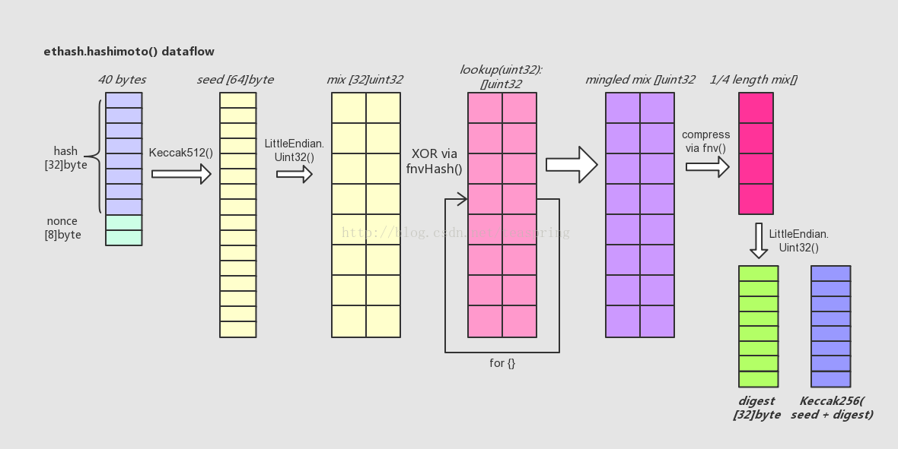
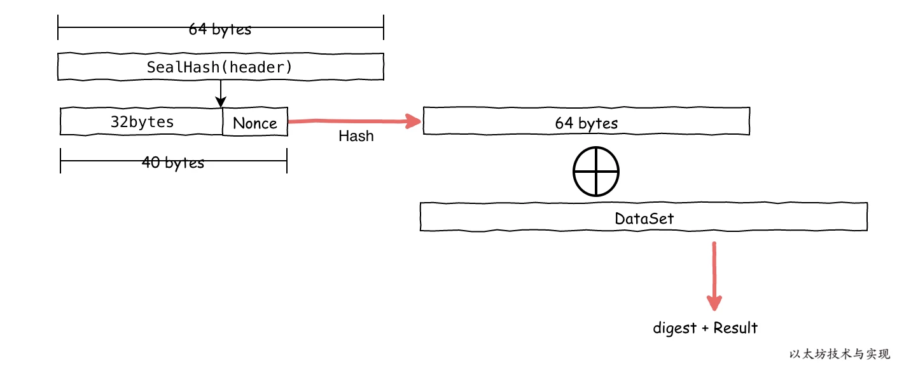

consensus.go中接口

1. 区块校验：
    - VerifyHeader： 校验单个区块头
    - VerifyHeaders：批量校验多个区块头
    - VerifyUncles： 批量校验多个叔块
    - VerifySeal： 校验区块头是否符合共识算法要求
2. 挖矿挖矿所用：
    - Prepare: 挖矿前准备信号，如设置区块难度。
    - Finalize: 新区块打包完成信号，如添加区块奖励。
    - Seal: 开始挖矿
    - SealHash： 用于挖矿计算时的数据哈希
    - CalcDifficulty： 计算挖矿难度
    - APIs： 共识算法可提供的对外API
    - Close： 通知共识关闭挖矿

taskloop中，调用sealer.go的Seal方法正式开始计算

```go
if err := w.engine.Seal(w.chain, task.block, w.resultCh, stopCh); err != nil {
				log.Warn("Block sealing failed", "err", err)
				w.pendingMu.Lock()
				delete(w.pendingTasks, sealHash)
				w.pendingMu.Unlock()
			}

func (ethash *Ethash) Seal(chain consensus.ChainHeaderReader, block *types.Block, results chan<- *types.Block, stop <-chan struct{}) 

if threads == 0 {
		threads = runtime.NumCPU()
	}
	if threads < 0 { //多线程工作
		threads = 0 // Allows disabling local mining without extra logic around local/remote
	}
	// Push new work to remote sealer
	if ethash.remote != nil {
		ethash.remote.workCh <- &sealTask{block: block, results: results}
	}
	var (
		pend   sync.WaitGroup
		locals = make(chan *types.Block)
	)

	//多线程开始mine
	for i := 0; i < threads; i++ {
		pend.Add(1)
		go func(id int, nonce uint64) {
			defer pend.Done()
			ethash.mine(block, id, nonce, abort, locals)
		}(i, uint64(ethash.rand.Int63()))
	}
```

## mine

```go
func (ethash *Ethash) mine(block *types.Block, id int, seed uint64, abort chan struct{}, found chan *types.Block) {
	// Extract some data from the header
	var (
		header  = block.Header()
		hash    = ethash.SealHash(header).Bytes()
		target  = new(big.Int).Div(two256, header.Difficulty)
		number  = header.Number.Uint64()
		//生成cache和dataset
		dataset = ethash.dataset(number, false)
	)
	// Start generating random nonces until we abort or find a good one
	var (
		attempts  = int64(0)
		nonce     = seed
		powBuffer = new(big.Int)
	)
	logger := ethash.config.Log.New("miner", id)
	logger.Trace("Started ethash search for new nonces", "seed", seed)
search:
	for {
		select {
		case <-abort:
			// Mining terminated, update stats and abort
			logger.Trace("Ethash nonce search aborted", "attempts", nonce-seed)
			ethash.hashrate.Mark(attempts)
			break search

		default:
			// We don't have to update hash rate on every nonce, so update after after 2^X nonces
			attempts++
			if (attempts % (1 << 15)) == 0 {
				ethash.hashrate.Mark(attempts)
				attempts = 0
			}
			// Compute the PoW value of this nonce
			//开始计算nonce是否符合要求，每次nonce+1，循环计算
			digest, result := hashimotoFull(dataset.dataset, hash, nonce)
			if powBuffer.SetBytes(result).Cmp(target) <= 0 {
				// Correct nonce found, create a new header with it
				header = types.CopyHeader(header)
				header.Nonce = types.EncodeNonce(nonce)
				header.MixDigest = common.BytesToHash(digest)

				// Seal and return a block (if still needed)
				select {
				case found <- block.WithSeal(header):
					logger.Trace("Ethash nonce found and reported", "attempts", nonce-seed, "nonce", nonce)
				case <-abort:
					logger.Trace("Ethash nonce found but discarded", "attempts", nonce-seed, "nonce", nonce)
				}
				break search
			}
			nonce++
		}
	}
	// Datasets are unmapped in a finalizer. Ensure that the dataset stays live
	// during sealing so it's not unmapped while being read.
	runtime.KeepAlive(dataset)
}
```

## pow整体流程



Ethash是Dagger-Hashimoto的变种。优化了算法

1. 抗ASIC性：为算法创建专用硬件的优势应尽可能小，理想情况是即使开发出专有的集成电路，加速能力也足够小。以便普通计算机上的用户仍然可以获得微不足道的利润。
2. 轻客户端可验证性: 一个区块应能被轻客户端快速有效校验。

其整体流程如图：

1. 从区块number计算得到seed
2. 根据seed获得16MB+缓存，此缓存大小与Epoch周期有关，所有节点都将存储此缓存，light节点可以据此验证nonce。
3. 根据cache计算1G+dataset，此数据集大小与Epoch周期有关，线性增长，完整客户端和矿工存储此数据集，用于计算。

## cache计算

dataset = ethash.dataset(number, false) → generate方法
```go
func (d *dataset) generate(dir string, limit int, lock bool, test bool) {
	d.once.Do(func() {
		// Mark the dataset generated after we're done. This is needed for remote
		defer atomic.StoreUint32(&d.done, 1)
		//size := cacheInitBytes + cacheGrowthBytes*uint64(epoch) - hashBytes，然后求不小于这个数的最大素数
		//在2048之前，直接使用cacheSizes，这里都是计算好的
		csize := cacheSize(d.epoch*epochLength + 1)
		//计算data大小，类似cache
		dsize := datasetSize(d.epoch*epochLength + 1)
		//连续做keccak256操作，做epoch次，
		seed := seedHash(d.epoch*epochLength + 1)
		if test {
			csize = 1024
			dsize = 32 * 1024
		}
		// If we don't store anything on disk, generate and return
		if dir == "" {
			//生成cache
			cache := make([]uint32, csize/4)
			generateCache(cache, d.epoch, seed)

			//根据cache生成数据集
			d.dataset = make([]uint32, dsize/4)
			generateDataset(d.dataset, d.epoch, cache)

			return
		}
		// Disk storage is needed, this will get fancy
		var endian string
		if !isLittleEndian() {
			endian = ".be"
		}
		path := filepath.Join(dir, fmt.Sprintf("full-R%d-%x%s", algorithmRevision, seed[:8], endian))
		logger := log.New("epoch", d.epoch)

		// We're about to mmap the file, ensure that the mapping is cleaned up when the
		// cache becomes unused.
		runtime.SetFinalizer(d, (*dataset).finalizer)

		// Try to load the file from disk and memory map it
		var err error
		d.dump, d.mmap, d.dataset, err = memoryMap(path, lock)
		if err == nil {
			logger.Debug("Loaded old ethash dataset from disk")
			return
		}
		logger.Debug("Failed to load old ethash dataset", "err", err)

		// No previous dataset available, create a new dataset file to fill
		cache := make([]uint32, csize/4)
		generateCache(cache, d.epoch, seed)

		d.dump, d.mmap, d.dataset, err = memoryMapAndGenerate(path, dsize, lock, func(buffer []uint32) { generateDataset(buffer, d.epoch, cache) })
		if err != nil {
			logger.Error("Failed to generate mapped ethash dataset", "err", err)

			d.dataset = make([]uint32, dsize/4)
			generateDataset(d.dataset, d.epoch, cache)
		}
		// Iterate over all previous instances and delete old ones
		for ep := int(d.epoch) - limit; ep >= 0; ep-- {
			seed := seedHash(uint64(ep)*epochLength + 1)
			path := filepath.Join(dir, fmt.Sprintf("full-R%d-%x%s", algorithmRevision, seed[:8], endian))
			os.Remove(path)
		}
	})
}
```

- cszie公式：sz = CACHE_BYTES_INIT + CACHE_BYTES_GROWTH * (block_number // EPOCH_LENGTH)

```go
func cacheSize(block uint64) uint64 {
   epoch := int(block /epochLength)
   if epoch <maxEpoch{
      return cacheSizes[epoch]
   }
   return calcCacheSize(epoch)
}
```

为了避免循环行为的偶然规律性的风险，再计算小于此的最大素数。此处有个cacheSizes，在2048Epoch之前可以直接使用。

dsize算法类似，只是初始大小为1G。

- seed算法：区块种子值，在每个周期是保持不变的。通过多次叠加哈希计算，得到一个 32 位值作为区块种子。

```go
func seedHash(block uint64) []byte {
	seed := make([]byte, 32)
	if block < epochLength {
		return seed
	}
	keccak256 := makeHasher(sha3.NewLegacyKeccak256())
	for i := 0; i < int(block/epochLength); i++ {
		keccak256(seed, seed)
	}
	return seed
}
```
- cache 计算


```go
func generateCache(dest []uint32, epoch uint64, seed []byte) {
	// Print some debug logs to allow analysis on low end devices
	logger := log.New("epoch", epoch)

	start := time.Now()
	defer func() {
		elapsed := time.Since(start)

		logFn := logger.Debug
		if elapsed > 3*time.Second {
			logFn = logger.Info
		}
		logFn("Generated ethash verification cache", "elapsed", common.PrettyDuration(elapsed))
	}()
	// Convert our destination slice to a byte buffer
	var cache []byte
	cacheHdr := (*reflect.SliceHeader)(unsafe.Pointer(&cache))
	dstHdr := (*reflect.SliceHeader)(unsafe.Pointer(&dest))
	//通过SliceHeader和unsafe.Pointer强转，len和cap扩大四倍，外面被缩小过四倍，不明此意义。。
	cacheHdr.Data = dstHdr.Data
	cacheHdr.Len = dstHdr.Len * 4
	cacheHdr.Cap = dstHdr.Cap * 4

	// Calculate the number of theoretical rows (we'll store in one buffer nonetheless)
	size := uint64(len(cache))
	rows := int(size) / hashBytes

	// Start a monitoring goroutine to report progress on low end devices
	var progress uint32

	done := make(chan struct{})
	defer close(done)

	go func() {
		for {
			select {
			case <-done:
				return
			case <-time.After(3 * time.Second):
				logger.Info("Generating ethash verification cache", "percentage", atomic.LoadUint32(&progress)*100/uint32(rows)/(cacheRounds+1), "elapsed", common.PrettyDuration(time.Since(start)))
			}
		}
	}()
	// Create a hasher to reuse between invocations
	keccak512 := makeHasher(sha3.NewLegacyKeccak512())

	// Sequentially produce the initial dataset
	//64字节为一组，每次对前一组做keccak512操作，首组为keccak512(seed)
	keccak512(cache, seed)
	for offset := uint64(hashBytes); offset < size; offset += hashBytes {
		keccak512(cache[offset:], cache[offset-hashBytes:offset])
		atomic.AddUint32(&progress, 1)
	}
	// Use a low-round version of randmemohash
	temp := make([]byte, hashBytes)

	//做三轮cache生成
	for i := 0; i < cacheRounds; i++ {
		for j := 0; j < rows; j++ { //64为一组
			var (
				//上组hash
				srcOff = ((j - 1 + rows) % rows) * hashBytes
				dstOff = j * hashBytes
				//下组hash？
				xorOff = (binary.LittleEndian.Uint32(cache[dstOff:]) % uint32(rows)) * hashBytes
			)
			//keccak512(srcOff ^ xorOff)
			bitutil.XORBytes(temp, cache[srcOff:srcOff+hashBytes], cache[xorOff:xorOff+hashBytes])
			keccak512(cache[dstOff:], temp)

			atomic.AddUint32(&progress, 1)
		}
	}
	// Swap the byte order on big endian systems and return
	if !isLittleEndian() {
		swap(cache)
	}
}
```

## 数据集生成

```go
func generateDataset(dest []uint32, epoch uint64, cache []uint32) {
	// Print some debug logs to allow analysis on low end devices
	logger := log.New("epoch", epoch)

	start := time.Now()
	defer func() {
		elapsed := time.Since(start)

		logFn := logger.Debug
		if elapsed > 3*time.Second {
			logFn = logger.Info
		}
		logFn("Generated ethash verification cache", "elapsed", common.PrettyDuration(elapsed))
	}()

	// Figure out whether the bytes need to be swapped for the machine
	swapped := !isLittleEndian()

	// Convert our destination slice to a byte buffer
	var dataset []byte
	datasetHdr := (*reflect.SliceHeader)(unsafe.Pointer(&dataset))
	destHdr := (*reflect.SliceHeader)(unsafe.Pointer(&dest))
	datasetHdr.Data = destHdr.Data
	datasetHdr.Len = destHdr.Len * 4
	datasetHdr.Cap = destHdr.Cap * 4

	// Generate the dataset on many goroutines since it takes a while
	threads := runtime.NumCPU()
	size := uint64(len(dataset))

	var pend sync.WaitGroup
	pend.Add(threads)

	var progress uint64
	for i := 0; i < threads; i++ { //多线程生成
		go func(id int) {
			defer pend.Done()

			// Create a hasher to reuse between invocations
			keccak512 := makeHasher(sha3.NewLegacyKeccak512())

			// Calculate the data segment this thread should generate
			batch := (size + hashBytes*uint64(threads) - 1) / (hashBytes * uint64(threads))
			first := uint64(id) * batch
			limit := first + batch
			if limit > size/hashBytes {
				limit = size / hashBytes
			}
			// Calculate the dataset segment
			percent := size / hashBytes / 100
			for index := first; index < limit; index++ {
				item := generateDatasetItem(cache, uint32(index), keccak512)
				if swapped {
					swap(item)
				}
				copy(dataset[index*hashBytes:], item)

				if status := atomic.AddUint64(&progress, 1); status%percent == 0 {
					logger.Info("Generating DAG in progress", "percentage", (status*100)/(size/hashBytes), "elapsed", common.PrettyDuration(time.Since(start)))
				}
			}
		}(i)
	}
	// Wait for all the generators to finish and return
	pend.Wait()
}


func generateDatasetItem(cache []uint32, index uint32, keccak512 hasher) []byte {
	// Calculate the number of theoretical rows (we use one buffer nonetheless)
	rows := uint32(len(cache) / hashWords)

	// Initialize the mix
	mix := make([]byte, hashBytes)

	binary.LittleEndian.PutUint32(mix, cache[(index%rows)*hashWords]^index)
	for i := 1; i < hashWords; i++ {
		binary.LittleEndian.PutUint32(mix[i*4:], cache[(index%rows)*hashWords+uint32(i)])
	}
	keccak512(mix, mix)

	// Convert the mix to uint32s to avoid constant bit shifting
	intMix := make([]uint32, hashWords)
	for i := 0; i < len(intMix); i++ {
		intMix[i] = binary.LittleEndian.Uint32(mix[i*4:])
	}
	// fnv it with a lot of random cache nodes based on index
	for i := uint32(0); i < datasetParents; i++ {
		parent := fnv(index^i, intMix[i%16]) % rows
		//cache和parent做hash操作
		fnvHash(intMix, cache[parent*hashWords:])
	}
	// Flatten the uint32 mix into a binary one and return
	for i, val := range intMix {
		binary.LittleEndian.PutUint32(mix[i*4:], val)
	}
	keccak512(mix, mix)
	return mix
}
```

## POW计算



```
func hashimotoFull(dataset []uint32, hash []byte, nonce uint64) ([]byte, []byte) {
	lookup := func(index uint32) []uint32 {
		offset := index * hashWords
		return dataset[offset : offset+hashWords]
	}
	return hashimoto(hash, nonce, uint64(len(dataset))*4, lookup)
}

func hashimoto(hash []byte, nonce uint64, size uint64, lookup func(index uint32) []uint32) ([]byte, []byte) {
	// Calculate the number of theoretical rows (we use one buffer nonetheless)
	rows := uint32(size / mixBytes)

	// Combine header+nonce into a 64 byte seed
	seed := make([]byte, 40)
	copy(seed, hash)
	binary.LittleEndian.PutUint64(seed[32:], nonce)

	seed = crypto.Keccak512(seed)
	seedHead := binary.LittleEndian.Uint32(seed)

	// Start the mix with replicated seed
	mix := make([]uint32, mixBytes/4)
	for i := 0; i < len(mix); i++ {
		mix[i] = binary.LittleEndian.Uint32(seed[i%16*4:])
	}
	// Mix in random dataset nodes
	temp := make([]uint32, len(mix))

	for i := 0; i < loopAccesses; i++ {
		parent := fnv(uint32(i)^seedHead, mix[i%len(mix)]) % rows
		for j := uint32(0); j < mixBytes/hashBytes; j++ {
			copy(temp[j*hashWords:], lookup(2*parent+j))
		}
		fnvHash(mix, temp)
	}
	// Compress mix
	for i := 0; i < len(mix); i += 4 {
		mix[i/4] = fnv(fnv(fnv(mix[i], mix[i+1]), mix[i+2]), mix[i+3])
	}
	mix = mix[:len(mix)/4]

	digest := make([]byte, common.HashLength)
	for i, val := range mix {
		binary.LittleEndian.PutUint32(digest[i*4:], val)
	}
	return digest, crypto.Keccak256(append(seed, digest...))
}
```

伪代码如下

```python
def hashimoto(header, nonce, full_size, dataset_lookup):
    n = full_size / HASH_BYTES
    w = MIX_BYTES // WORD_BYTES
    mixhashes = MIX_BYTES / HASH_BYTES
    # combine header+nonce into a 64 byte seed
    s = sha3_512(header + nonce[::-1])
    # start the mix with replicated s
    mix = []
    for _ in range(MIX_BYTES / HASH_BYTES):
        mix.extend(s)
    # mix in random dataset nodes
    for i in range(ACCESSES):
        p = fnv(i ^ s[0], mix[i % w]) % (n // mixhashes) * mixhashes
        newdata = []
        for j in range(MIX_BYTES / HASH_BYTES):
            newdata.extend(dataset_lookup(p + j))
        mix = map(fnv, mix, newdata)
    # compress mix
    cmix = []
    for i in range(0, len(mix), 4):
        cmix.append(fnv(fnv(fnv(mix[i], mix[i+1]), mix[i+2]), mix[i+3]))
    return {
        "mix digest": serialize_hash(cmix),
        "result": serialize_hash(sha3_256(s+cmix))
    }

def hashimoto_light(full_size, cache, header, nonce):
    return hashimoto(header, nonce, full_size, lambda x: calc_dataset_item(cache, x))

def hashimoto_full(full_size, dataset, header, nonce):
    return hashimoto(header, nonce, full_size, lambda x: dataset[x])
```

最后计算的result小于target值，表示计算成功，否则nonce+1后继续计算，target由 `2^256 /` `Difficulty`计算得出，difficult越大，取值范围就越小。

## 验证 VerifyHeader方法

```go
func (ethash *Ethash) verifyHeader(chain consensus.ChainHeaderReader, header, parent *types.Header, uncle bool, seal bool, unixNow int64) error {
	//1.验证extra数据长度
	if uint64(len(header.Extra)) > params.MaximumExtraDataSize {
		return fmt.Errorf("extra-data too long: %d > %d", len(header.Extra), params.MaximumExtraDataSize)
	}
	//2.验证时间戳
	if !uncle {
		if header.Time > uint64(unixNow+allowedFutureBlockTimeSeconds) {
			return consensus.ErrFutureBlock
		}
	}
	if header.Time <= parent.Time {
		return errOlderBlockTime
	}
	// Verify the block's difficulty based on its timestamp and parent's difficulty
	expected := ethash.CalcDifficulty(chain, header.Time, parent)

	//3.验证难度
	if expected.Cmp(header.Difficulty) != 0 {
		return fmt.Errorf("invalid difficulty: have %v, want %v", header.Difficulty, expected)
	}
	//4.验证最大gas和区块最大gas
	if header.GasLimit > params.MaxGasLimit {
		return fmt.Errorf("invalid gasLimit: have %v, max %v", header.GasLimit, params.MaxGasLimit)
	}
	if header.GasUsed > header.GasLimit {
		return fmt.Errorf("invalid gasUsed: have %d, gasLimit %d", header.GasUsed, header.GasLimit)
	}
	// Verify the block's gas usage and (if applicable) verify the base fee.
	if !chain.Config().IsLondon(header.Number) {
		// Verify BaseFee not present before EIP-1559 fork.
		if header.BaseFee != nil {
			return fmt.Errorf("invalid baseFee before fork: have %d, expected 'nil'", header.BaseFee)
		}
		if err := misc.VerifyGaslimit(parent.GasLimit, header.GasLimit); err != nil {
			return err
		}
	} else if err := misc.VerifyEip1559Header(chain.Config(), parent, header); err != nil {
		// Verify the header's EIP-1559 attributes.
		return err
	}
	
	//5.验证区块递增
	if diff := new(big.Int).Sub(header.Number, parent.Number); diff.Cmp(big.NewInt(1)) != 0 {
		return consensus.ErrInvalidNumber
	}
	
	//验证nonce
	if seal {
		if err := ethash.verifySeal(chain, header, false); err != nil {
			return err
		}
	}
	// If all checks passed, validate any special fields for hard forks
	if err := misc.VerifyDAOHeaderExtraData(chain.Config(), header); err != nil {
		return err
	}
	if err := misc.VerifyForkHashes(chain.Config(), header, uncle); err != nil {
		return err
	}
	return nil
}

func hashimotoLight(size uint64, cache []uint32, hash []byte, nonce uint64) ([]byte, []byte) {
	keccak512 := makeHasher(sha3.NewLegacyKeccak512())

	//此处取特定范围的dataset，而hashimotoFull中生成的是全范围dataset，
	//light node只需要验证，不存储全dataset，只需要在验证的时候计算生成很小一部分dataset
	lookup := func(index uint32) []uint32 {
		rawData := generateDatasetItem(cache, index, keccak512)

		data := make([]uint32, len(rawData)/4)
		for i := 0; i < len(data); i++ {
			data[i] = binary.LittleEndian.Uint32(rawData[i*4:])
		}
		return data
	}
	return hashimoto(hash, nonce, size, lookup)
}
```