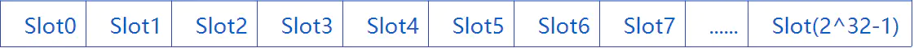

整个storage是一个持久化的存储区，它将32字节的键映射到32字节的值。总大小为2^32 - 1



## 整体规则：

- 变量位置按照声明的顺序，从`slot0`开始排序。
- 变量占用的内存大小与他定义的类型一致，也就是`uint256`占用`32`个字节，`uint8`占用`1`个字节。
- 如果一个变量不能完全存在一个`slot`中，那么他就从下一个`slot`开始存储。

1. 定长变量：定义时已经指定长度

```go
uint a;       // slot0
address b;    // address占160bit slot1 
bytes32 d;    // slot2
——————————————————————————————————————————
address a;      // slot0
uint8 b;        // 连续两个变量不足256bit，依然在slot0
address c;      // slot1
uint16 d;       // slot2

在opcode中
a：SLOAD(0) offset+len
b: SLOAD(0) offset+len
c: SLOAD(1)

```

将可以放入一个slot的变量放在一起，可以减少一点storage空间。

2. mapping

```go
mapping(address => uint) a; //a本身占一个slot0
//而a中的元素通过slot0的基址寻找

//如a[1]的位置就是keccak256(1 . p)，p为slot0的起始地址0x00，.为连接符
```

3. 变长数组

```go
uint a; //slot0
uint[] public b;//slot1 本身占一个空slot，其中元素查找类似mapping
uint c;//slot2
uint[3] d;//slot3-slot5
```

4. struct

```go
struct test {
    uint a;
    uint b;
    uint c;
}
address g;

其结构同
address g;
uint a;
uint b;
uint c;
```