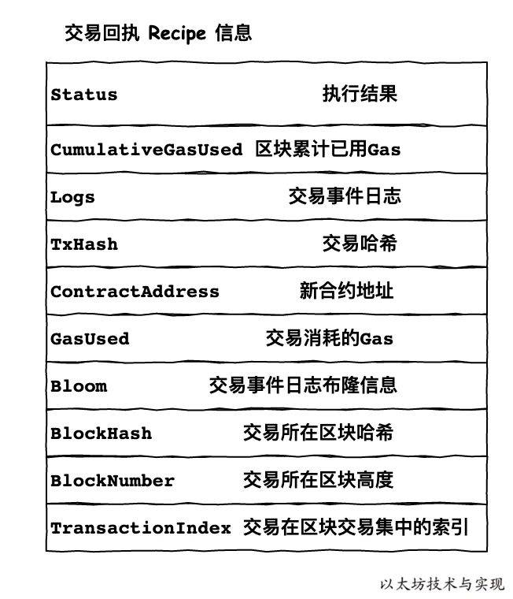
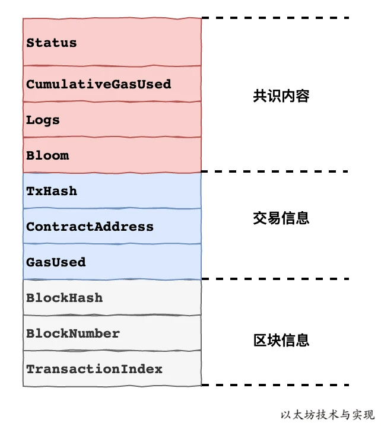

每一笔交易作为消息在以太坊虚拟机中执行时，均会获得一个交易回执信息(Receipt)。




## 构建`receipt`

交易回执是在以太坊虚拟机处理完交易后，根据结果整理出的交易执行结果信息。反映了交易执行前后以太坊变化以及交易执行状态。

```go
worker.go

func (w *worker) commitTransaction(env *environment, tx *types.Transaction) ([]*types.Log, error) {
	snap := env.state.Snapshot()

	//构建收据
	receipt, err := core.ApplyTransaction(w.chainConfig, w.chain, &env.coinbase, env.gasPool, env.state, env.header, tx, &env.header.GasUsed, *w.chain.GetVMConfig())
	if err != nil {
		//出现错误时使用快照回滚
		env.state.RevertToSnapshot(snap)
		return nil, err
	}
	//env中写入Transaction和receipt
	env.txs = append(env.txs, tx)
	env.receipts = append(env.receipts, receipt)

	return receipt.Logs, nil
}
```

```go
//数据结构
type Receipt struct {
	// Consensus fields: These fields are defined by the Yellow Paper
	//共识部分，即会参与校验
	Type              uint8  `json:"type,omitempty"`
	PostState         []byte `json:"root"`
	Status            uint64 `json:"status"`
	//区块累计使用gas
	CumulativeGasUsed uint64 `json:"cumulativeGasUsed" gencodec:"required"`
	Bloom             Bloom  `json:"logsBloom"         gencodec:"required"`
	//交易事件日志
	Logs              []*Log `json:"logs"              gencodec:"required"`

	// Implementation fields: These fields are added by geth when processing a transaction.
	// They are stored in the chain database.
	//交易信息部分
	//交易信息rlp hash
	TxHash          common.Hash    `json:"transactionHash" gencodec:"required"`
	ContractAddress common.Address `json:"contractAddress"`
	GasUsed         uint64         `json:"gasUsed" gencodec:"required"`

	// Inclusion information: These fields provide information about the inclusion of the
	// transaction corresponding to this receipt.
	//区块信息部分
	BlockHash        common.Hash `json:"blockHash,omitempty"`
	BlockNumber      *big.Int    `json:"blockNumber,omitempty"`
	TransactionIndex uint        `json:"transactionIndex"`
}

func applyTransaction(msg types.Message, config *params.ChainConfig, bc ChainContext, author *common.Address, gp *GasPool, statedb *state.StateDB, blockNumber *big.Int, blockHash common.Hash, tx *types.Transaction, usedGas *uint64, evm *vm.EVM) (*types.Receipt, error) {
	// Create a new context to be used in the EVM environment.
	txContext := NewEVMTxContext(msg)
	evm.Reset(txContext, statedb)

	//EVM执行事务
	result, err := ApplyMessage(evm, msg, gp)
	if err != nil {
		return nil, err
	}

	// Update the state with pending changes.
	var root []byte
	if config.IsByzantium(blockNumber) {
		statedb.Finalise(true)
	} else {
		root = statedb.IntermediateRoot(config.IsEIP158(blockNumber)).Bytes()
	}
	//计算总gas费
	*usedGas += result.UsedGas

	// Create a new receipt for the transaction, storing the intermediate root and gas used
	// by the tx.
	//设置CumulativeGasUsed
	receipt := &types.Receipt{Type: tx.Type(), PostState: root, CumulativeGasUsed: *usedGas}
	//设置state执行状态
	if result.Failed() {
		receipt.Status = types.ReceiptStatusFailed
	} else {
		receipt.Status = types.ReceiptStatusSuccessful
	}
	receipt.TxHash = tx.Hash()
	receipt.GasUsed = result.UsedGas

	// If the transaction created a contract, store the creation address in the receipt.
	if msg.To() == nil {
		receipt.ContractAddress = crypto.CreateAddress(evm.TxContext.Origin, tx.Nonce())
	}

	// Set the receipt logs and create the bloom filter.
	receipt.Logs = statedb.GetLogs(tx.Hash(), blockHash)
	receipt.Bloom = types.CreateBloom(types.Receipts{receipt})
	receipt.BlockHash = blockHash
	receipt.BlockNumber = blockNumber
	receipt.TransactionIndex = uint(statedb.TxIndex())
	return receipt, err
}
```

- 共识信息

共识信息意味着在校验区块合法性时，这部分信息也参与校验。这些信息参与校验的原因是确保交易必须在区块中的固定顺序中执行，且记录了交易执行后的状态信息。这样可强化交易顺序。

```go
block_validator.go

func (v *BlockValidator) ValidateState(block *types.Block, statedb *state.StateDB, receipts types.Receipts, usedGas uint64) error {
	...
	//校验receipt root
	receiptSha := types.DeriveSha(receipts, trie.NewStackTrie(nil))
	if receiptSha != header.ReceiptHash {
		return fmt.Errorf("invalid receipt root hash (remote: %x local: %x)", header.ReceiptHash, receiptSha)
	}
	...
	return nil
}

receipt.go

func (r *Receipt) EncodeRLP(w io.Writer) error {
	//这里定义了receiptRLP结构参与校验，这个结构中只有PostStateOrStatus,CumulativeGasUsed,Bloom,Logs
	//也只有这几个数据是参与校验的
	data := &receiptRLP{r.statusEncoding(), r.CumulativeGasUsed, r.Bloom, r.Logs}
	if r.Type == LegacyTxType {
		return rlp.Encode(w, data)
	}
	buf := encodeBufferPool.Get().(*bytes.Buffer)
	defer encodeBufferPool.Put(buf)
	buf.Reset()
	if err := r.encodeTyped(data, buf); err != nil {
		return err
	}
	return rlp.Encode(w, buf.Bytes())
}
```

- 交易回执信息
    - TxHash ： 交易回执所对应的交易哈希。
    - ContractAddress： 当这笔交易是部署新合约时，记录新合约的地址。
    - GasUsed: 这笔交易执行所消耗的gas

- ****交易回执区块信息****
    - BlockHash: 交易所在区块哈希。
    - BlockNumber: 交易所在区块高度。
    - TransactionIndex： 交易在区块中的序号。

根据这部分信息可以快速找到对应的交易

### receipt存储

交易回执作为交易执行中间产物，为了方便快速获取某笔交易的执行明细。以太坊中有跟随区块存储时实时存储交易回执。

```go
accessors_chain.go

func WriteReceipts(db ethdb.KeyValueWriter, hash common.Hash, number uint64, receipts types.Receipts) {
	// Convert the receipts into their storage form and serialize them
	storageReceipts := make([]*types.ReceiptForStorage, len(receipts))
	for i, receipt := range receipts {
		storageReceipts[i] = (*types.ReceiptForStorage)(receipt)
	}
	bytes, err := rlp.EncodeToBytes(storageReceipts)
	if err != nil {
		log.Crit("Failed to encode block receipts", "err", err)
	}
	// Store the flattened receipt slice
	if err := db.Put(blockReceiptsKey(number, hash), bytes); err != nil {
		log.Crit("Failed to store block receipts", "err", err)
	}
}
```