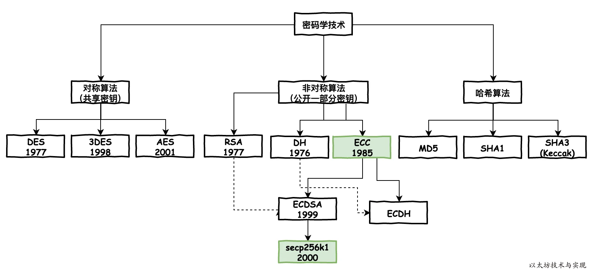
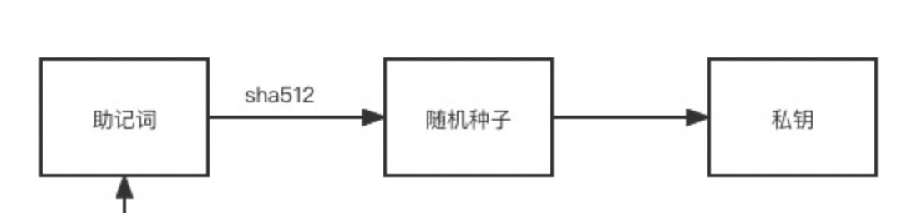

## 签名算法：椭圆曲线 secp256k1



secp256k1 是高效密码组标准(SECG)协会开发的一套高效的椭圆曲线签名算法标准。 在比特币流行之前，secp256k1并未真正使用过。secp256k1 命名由几部分组成：sec来自SECG标准，p表示曲线坐标是素数域，256表示素数是256位长，k 表示它是 Koblitz 曲线的变体，1表示它是第一个标准中该类型的曲线。

椭圆曲线本质上是一组方程。

任意一点 *R*可以通过这个点乘公式 `*R*=*k*×*P*`计算得到。这里的关键在于即使知道了 *P*和 *R*点，我们也无法计算得到 *k*，在椭圆曲线算法中没有减法或者除法这种逆向操作。这个特性也称之为单向陷门函数

这里k就是私钥，R就是计算得到的公钥。

在生产公钥P0和私钥之后，就可以用以下步骤来生成签名：

1. 生成一个随机数 *k*1 ，注意这个随机数不是上面生成的私钥
2. 利用 *P*=*k*1×*G* 计算点 *P*1 ，注意这个不是上面的公钥
3. *P*1 点的 x 坐标就是 *R*
4. 对需要签名的数据计算 hash，为 *H*
5. 计算 `S=k1^-1(H+K0*R)/p` ，这个 *p* 是模运算的底，也需要提前指定好

R + S 就是DCSDA 签名

## 以太签名算法

以太坊签名格式是`[R] [S] [V]`，R和S就是椭圆曲线计算结果。

V**是恢复 ID，recid+ chainID*2+ 35。**

**R**是偶数，**recid**为1，R是奇数，V为0。

测试示例

```go
func TestSignccc(t *testing.T) {
	data := []byte("ethereum")
	hash := Keccak256Hash(data)

	// 准备私钥
	privateKeyString, err := hex.DecodeString("cb9f200def7ba91fd7ad5852df10b324f9b231176ed4bd78b1f76c08e36e53d2")
	if err != nil {
		log.Fatalln(err)
	}
	// 基于secp256k1的私钥
	privateKey, err := ToECDSA(privateKeyString)
	if err != nil {
		log.Fatalln(err)
	}
	// 签名
	//R																   S 																V
	//a313c2ba4336e8fc08046761552cb193ee1fc2ff8b98c163c81085d5ddced161 3ecbb0f16561c8f659a62dcd38f8a550aac12d92c9ad6f0e94c5da3e9e2f8a3a 01
	sig, err := Sign(hash[:], privateKey)

	if err != nil {
		log.Fatal(err)
	}

	fmt.Println("sig length:", len(sig))
	fmt.Println("sig :", sig)
	fmt.Println("sig hex:", hex.EncodeToString(sig))

	signatureNoRecoverID := sig[:len(sig)-1] // remove recovery id
	signatureNoRecoverID[0] = 9
	publicKey := privateKey.PublicKey

	verified := VerifySignature(FromECDSAPub(&publicKey), hash.Bytes(), signatureNoRecoverID)
	fmt.Println(verified)
}
```

## 私钥公钥和地址

1. 私钥：私钥是一个32个字节的数、256位的二进制数，也就是64位的十六进制数，一般由伪随机数经过secp256k1生成
    
    `18e14a7b6a307f426a94f8114701e7c8e774e7f9a47e2c2035db29a206321725`
    
2. 公钥：拿私钥经secp256k1椭圆曲线推出的公钥(前缀04+X公钥+Y公钥) `04 xxx yyy`
3. 地址：公钥进行hash，计算公钥(压缩格式)的 SHA-256 哈希值(32bytes)，取后20bytes即为地址
    
    `600ffe422b4e00731a59557a5cca46cc183944191006324a447bdb2d98d4b408`
    
    0x`5cca46cc183944191006324a447bdb2d98d4b408`
    
4. 助记词：用于生成私钥，为了方便记忆和记录，**一个钱包只有一套助记词且不能修改。**



5. 密码：钱包密码主要用于管理钱包，例如转账时需要输入密码。密码可以进行修改或重置。如果原密码忘记，可以用私钥或是助记词导入钱包，同时设置新的密码。

## 签名实现

- 签名

```go
func SignTx(tx *Transaction, s Signer, prv *ecdsa.PrivateKey) (*Transaction, error) {
	//对tx hash，最后校验也是使用hash值校验
	h := s.Hash(tx)
	//私钥椭圆曲线签名
	sig, err := crypto.Sign(h[:], prv)
	if err != nil {
		return nil, err
	}
	//解析R S V放入tx数据结构中
	return tx.WithSignature(s, sig)
}

func (s EIP155Signer) SignatureValues(tx *Transaction, sig []byte) (R, S, V *big.Int, err error) {
	if tx.Type() != LegacyTxType {
		return nil, nil, nil, ErrTxTypeNotSupported
	}
	//切割sig，解析为R S V
	R, S, V = decodeSignature(sig)
	if s.chainId.Sign() != 0 {
		V = big.NewInt(int64(sig[64] + 35))
		V.Add(V, s.chainIdMul)
	}
	return R, S, V, nil
}

func decodeSignature(sig []byte) (r, s, v *big.Int) {
	if len(sig) != crypto.SignatureLength {
		panic(fmt.Sprintf("wrong size for signature: got %d, want %d", len(sig), crypto.SignatureLength))
	}
	//前32为R
	r = new(big.Int).SetBytes(sig[:32])
	//32-64为S
	s = new(big.Int).SetBytes(sig[32:64])
	//后面为V
	v = new(big.Int).SetBytes([]byte{sig[64] + 27})
	return r, s, v
}
```

注意EIP155改进的hash算法

```go
func (s EIP155Signer) Hash(tx *Transaction) common.Hash {
	return rlpHash([]interface{}{
		tx.Nonce(),
		tx.GasPrice(),
		tx.Gas(),
		tx.To(),
		tx.Value(),
		tx.Data(),
		//加入链id和空值，一笔交易有确定的链来源
		s.chainId, uint(0), uint(0),
	})
}
```

- 验签，从RSV恢复地址
```go
transaction_signing.go


func (s EIP155Signer) Sender(tx *Transaction) (common.Address, error) {
	if tx.Type() != LegacyTxType {
		return common.Address{}, ErrTxTypeNotSupported
	}
	if !tx.Protected() {
		return HomesteadSigner{}.Sender(tx)
	}
	if tx.ChainId().Cmp(s.chainId) != 0 {
		return common.Address{}, ErrInvalidChainId
	}
	//RSV已经保存在tx中
	V, R, S := tx.RawSignatureValues()
	V = new(big.Int).Sub(V, s.chainIdMul)
	V.Sub(V, big8)
	return recoverPlain(s.Hash(tx), R, S, V, true)
}

func recoverPlain(sighash common.Hash, R, S, Vb *big.Int, homestead bool) (common.Address, error) {
	if Vb.BitLen() > 8 {
		return common.Address{}, ErrInvalidSig
	}
	V := byte(Vb.Uint64() - 27)
	if !crypto.ValidateSignatureValues(V, R, S, homestead) {
		return common.Address{}, ErrInvalidSig
	}
	// encode the signature in uncompressed format
	r, s := R.Bytes(), S.Bytes()
	//根据RSV构建签名
	sig := make([]byte, crypto.SignatureLength)
	copy(sig[32-len(r):32], r)
	copy(sig[64-len(s):64], s)
	sig[64] = V
	//从签名恢复公钥，最终调用secp256k1.RecoverPubkey(hash, sig)
	pub, err := crypto.Ecrecover(sighash[:], sig)
	if err != nil {
		return common.Address{}, err
	}
	if len(pub) == 0 || pub[0] != 4 {
		return common.Address{}, errors.New("invalid public key")
	}
	var addr common.Address
	//由公钥计算出地址
	copy(addr[:], crypto.Keccak256(pub[1:])[12:])
	return addr, nil
}
```