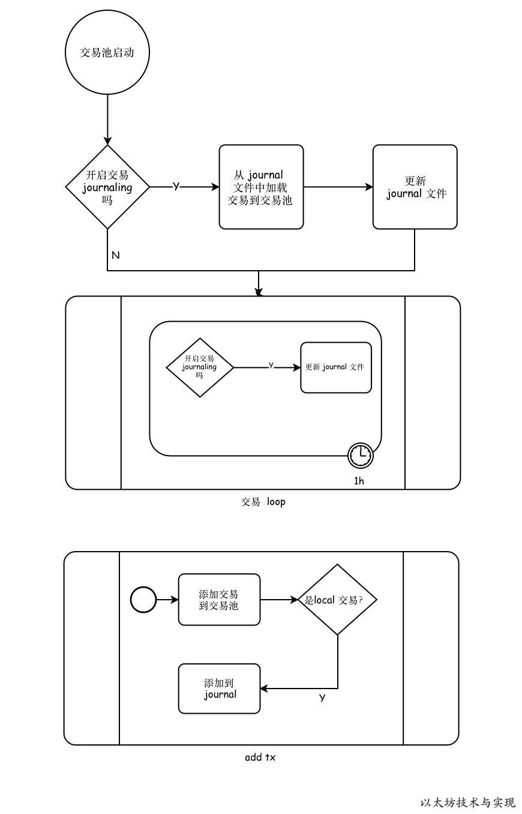

## 写入journal持久化

pool.journalTx(from, tx)
```go
tx_journal.go

func (pool *TxPool) journalTx(from common.Address, tx *types.Transaction) {
   //只有local交易可以写入journal
   if pool.journal == nil || !pool.locals.contains(from) {
      return
   }
   if err := pool.journal.insert(tx); err != nil {
      log.Warn("Failed to journal local transaction", "err", err)
   }
}
```

## 加载journal

在交易池首次启动时，将journal已存储的交易加载到交易池。

```go
func NewTxPool(config TxPoolConfig, chainconfig *params.ChainConfig, chain blockChain) *TxPool {
	...
	if !config.NoLocals && config.Journal != "" {
		pool.journal = newTxJournal(config.Journal)

		if err := pool.journal.load(pool.AddLocals); err != nil {
			log.Warn("Failed to load transaction journal", "err", err)
		}
		if err := pool.journal.rotate(pool.local()); err != nil {
			log.Warn("Failed to rotate transaction journal", "err", err)
		}
	}
	...
}

func (pool *TxPool) AddLocals(txs []*types.Transaction) []error {
	return pool.addTxs(txs, !pool.config.NoLocals, true)
}
```

```go
func (journal *txJournal) load(add func([]*types.Transaction) []error) error {
	// Skip the parsing if the journal file doesn't exist at all
	if !common.FileExist(journal.path) {
		return nil
	}

	//1.打开文件流
	input, err := os.Open(journal.path)
	if err != nil {
		return err
	}
	defer input.Close()

	// Temporarily discard any journal additions (don't double add on load)
	journal.writer = new(devNull)
	defer func() { journal.writer = nil }()

	//2.转为stream流
	stream := rlp.NewStream(input, 0)
	total, dropped := 0, 0

	// Create a method to load a limited batch of transactions and bump the
	// appropriate progress counters. Then use this method to load all the
	// journaled transactions in small-ish batches.
	loadBatch := func(txs types.Transactions) {
		for _, err := range add(txs) {
			if err != nil {
				log.Debug("Failed to add journaled transaction", "err", err)
				dropped++
			}
		}
	}
	var (
		failure error
		batch   types.Transactions
	)
	for {
		// Parse the next transaction and terminate on error
		tx := new(types.Transaction)
		if err = stream.Decode(tx); err != nil { //3.解码操作
			if err != io.EOF {
				failure = err
			}
			if batch.Len() > 0 {
				loadBatch(batch)
			}
			break
		}
		// New transaction parsed, queue up for later, import if threshold is reached
		total++

		if batch = append(batch, tx); batch.Len() > 1024 { //4.批量提交，每批1024个
			loadBatch(batch)
			batch = batch[:0]
		}
	}
	log.Info("Loaded local transaction journal", "transactions", total, "dropped", dropped)

	return failure
}
```

## 更新

```go
func (pool *TxPool) loop() {
	...
	for {
		//定时更新journal
		case <-journal.C:
			if pool.journal != nil {
				pool.mu.Lock()
				if err := pool.journal.rotate(pool.local()); err != nil {
					log.Warn("Failed to rotate local tx journal", "err", err)
				}
				pool.mu.Unlock()
			}
		}
	}
	...
}
```
```go
//基本思路是全量替换，不对比，直接创建新的覆盖原文件
func (journal *txJournal) rotate(all map[common.Address]types.Transactions) error {
	// Close the current journal (if any is open)
	if journal.writer != nil {
		if err := journal.writer.Close(); err != nil {
			return err
		}
		journal.writer = nil
	}
	// Generate a new journal with the contents of the current pool
	replacement, err := os.OpenFile(journal.path+".new", os.O_WRONLY|os.O_CREATE|os.O_TRUNC, 0644)
	if err != nil {
		return err
	}
	journaled := 0
	for _, txs := range all {
		for _, tx := range txs {
			if err = rlp.Encode(replacement, tx); err != nil {
				replacement.Close()
				return err
			}
		}
		journaled += len(txs)
	}
	replacement.Close()

	// Replace the live journal with the newly generated one
	if err = os.Rename(journal.path+".new", journal.path); err != nil {
		return err
	}
	sink, err := os.OpenFile(journal.path, os.O_WRONLY|os.O_APPEND, 0644)
	if err != nil {
		return err
	}
	journal.writer = sink
	log.Info("Regenerated local transaction journal", "transactions", journaled, "accounts", len(all))

	return nil
}
```