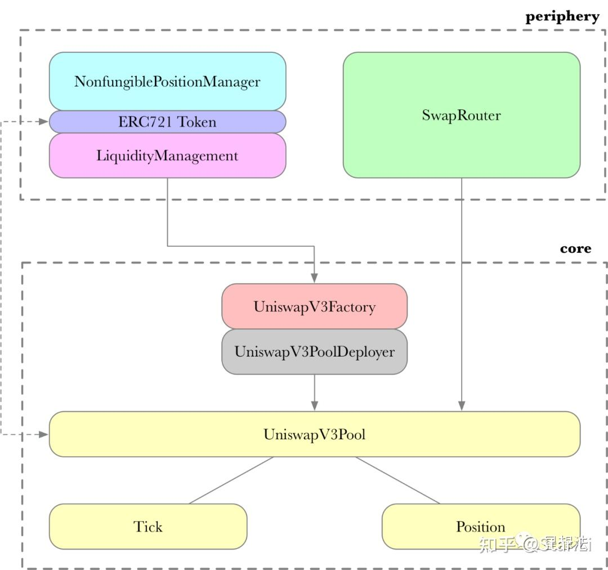

### Uniswap

Uniswap智能合约代码由两个项目组成。

- core是核心swap逻辑
- periphery是周边服务，周边合约主要作用是作为用户和核心合约之间的桥梁。

调用过程为 用户 → 周边合约 → 核心合约

### 自动做市

Uniswap采用自动做市协议，由恒定乘积公式来维持价格比例。并在以太坊上进行部署，完全的去中心化交易所。

Uniswap可以为任何两个ERC20代币提供交换服务，但是必须有人为此提供流动性。

Uniswap的兑换基础完全来源于流动性提供者添加的流动性。在储备中没有任何代币时，用户可以以任意比例添加流动性，但需要承担风险。例如用户初始提供了100WETH : 1000X，而市场的WETH：X为1 ： 100，因此立刻有套利者将WETH换走，直到双方储备比例重新变为1:100，那么用户由于以过低的价格提供了WETH而收到损失。也可以看到由于套利机制交易对的价值比例始终会回到市场预期。

Uniswap的价格曲线为x * y = k，只有当加入流动性或撤离流动性时k才会发生变化。当流动性过小时，兑换会导致价格波动，用户的预期兑换价格和实际成交价格之间的差距成为滑点，流动性越大即交易深度越大，滑点就越低。
 
### Uniswap V3

Uniswap V3相比V2增加了如下新特性：

1. 活跃流动性（active liquidity）：如果在特定流动性池中交易的资产价格变动到 LP 的价格范围之外，LP 的流动性就会被有效地从池中移除。
2. 范围限价订单（Range Limit Orders）：这允许 LP 在高于或低于当前市场自定义价格范围内提供单一代币作为流动性。当市场价格进入指定范围时，一种资产将沿着平滑曲线出售给另一种资产。
3. 多头寸：LP 也可以决定在多个价格区间提供流动性，这些价格区间可能会或不会重叠。
4. 弹性费用：v3提供了 3 个独立的费用等级——0.05%、0.3% 和 1%。这使得 LP 可以根据他们愿意承担的风险来选择资金池。Uniswap 背后的团队预计，0.05% 的费用主要用于资产类似的池子，比如不同的稳定币，0.3% 用于 ETH/DAI 等其他标准货币对，1% 用于更多的不同领域的货 币对。更大的风险，更多的收益。
5. 预言机：v3对TWAP 预言机的重大改进。V3 可以在一次链上调用中计算出过去约 9 天内的所有最近的 TWAP。
6. V3 也在 Optimism 上同步推出。

当 LP 向 V2 池提供流动性时，流动性沿着价格曲线均匀分布。虽然这样可以处理 0 到无穷之间的所有价格区间，但这使得资本的效率相当低下。这是因为大多数资产通常在一定的价格范围内交易。这在具有稳定资产的池子中尤其明显，这些资产的交易范围非常狭窄。而在 V3 中，LP 在提供流动性时可以选择一个自定义的价格范围，允许将资金集中在大部分交易活动发生的范围内。

集中流动性带来更好的资本利用效率和减少风险。举个例子，Alice 和 Bob 都决定在 Uniswap V3 的 ETH/DAI 池中提供流动性，他们每个人都有 10,000 美元，ETH 的当前价格是 1,750 美元。

Alice 将她的全部资本在 ETH 和 DAI 之间分配，并在任意价格范围内存入资金（类似于 V2），她存入 5,000 DAI 和 2.85 ETH。

Bob 没有使用他的全部资本，而是把他的流动性集中起来，并在 1,500 到 2,500 的价格范围内提供这些资本。他存入 600 DAI 和 0.37 ETH，共计 1200 美元，并将剩余的 8800 美元留作其他用途。

有趣的是，只要 ETH/DAI 价格保持在 1500 到 2500 的范围内，他们都能赚取相同的交易费用。这意味着 Bob 只需提供 Alice 的 12% 的资金，就能获得同样的回报，这使得他的资金效率是 Alice 资金的 8.34 倍。

最重要的是，Bob 将其整体资本的风险降低了。ETH 掉到 0 美元的可能性很小，假设真的是这样，Bob 和 Alice 的流动资金会全部变成 ETH。虽然他们都会损失全部资本，但 Bob 承担的风险要小得多。

更稳定的池子里的 LP，最有可能在狭窄范围内提供流动性。如果目前在 Uniswap v2 价值 2500 万美元的 DAI/USDC 池集中放在 v3 的 0.99 - 1.01 价格区间，只要价格保持在这个区间内，它将提供与 Uniswap v2 中 50 亿美元相同的深度。

当 V3 推出时，与 V2 相比，最大资本效率将达到 4000 倍。当在单一 0.1% 的价格范围内提供流动性时，这是可以实现的。除此之外，V3 池 factory 将能够支持 0.02% 的颗粒度范围——相对于 V2，这相当于最高 20000 倍的资本效率。