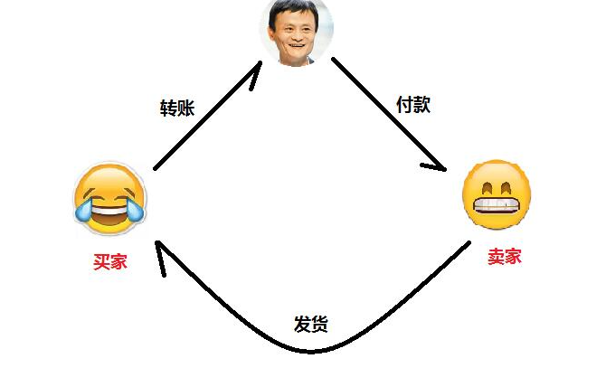
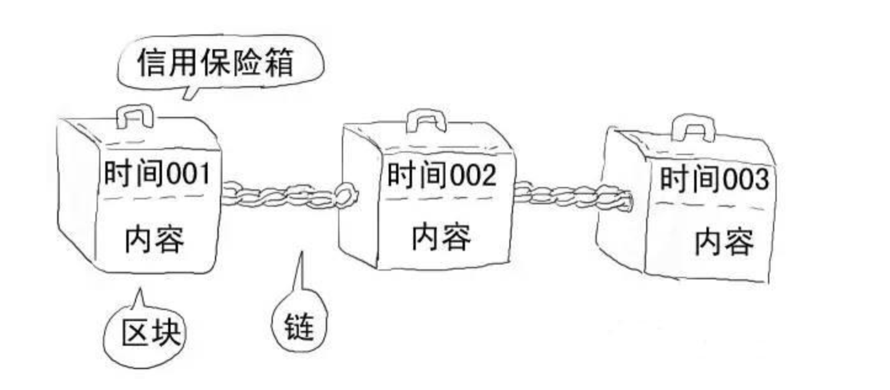
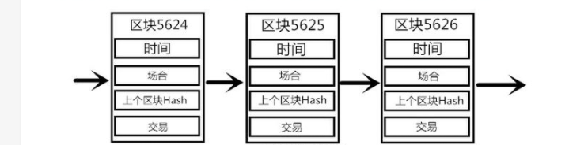
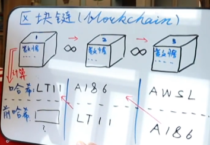

### 1.什么是区块链

链表结构。最早90年代提出，应用于文件标记改动和防止篡改。

中本聪于09年将区块链应用于分布式账本上，开发出比特币。

### 1.记账系统

中心化转账模式：

你要在某宝上买一部手机，交易流程是：你将钱打给支付宝－支付宝收款后通知卖家发货－卖家发货－你确认收货－支付宝把钱打给卖家。

在这个过程中，虽然你是在和卖家交易，但是这笔交易还牵扯到了除了你和卖家的第三方，即支付宝，你和卖家的交易都是围绕支付宝展开。
而这些交易又会记录在银行的账户里，银行知道你有多少钱，你向谁发起了交易。而你也相信支付宝和银行背后的体系不会搞错你的账户。
问题是：没有这些可信的第三方，在一个去中心化网络中，如何转账？

### 2.分布式记账-区块链

中本聪用9页白皮书实现了支持分布式账本的技术。

在一个所有人都无法信任的匿名网络环境中，我要给A转账就需要广播，所有人都会记录这个转账信息，
这个世界中的每一笔交易都会存在于所有人的账本中。

不仅仅是如何记账，而且是如何记录所有交易，且交易安全无法篡改。
账本的形态要解决几个问题。

区块链形态，链表结构形成顺序，也可以防止篡改。

1.余额问题

我发起一笔交易，如何证明我有这些钱?

记录这个体系下的所有交易，并按前后顺序组成链表结构，这样所有的交易可追溯，
别的账本接受到我的交易广播，可以通过回溯很容易计算出我之前进行了多少笔交易，此时我还有多少余额，
如果不够将拒绝记录。

2.身份问题

如何证明是我本人发起交易。

电子签名，非对称加密，每个账户加入比特币网络时，都会得到私钥，公钥，地址。

- 对交易信息message做sha的hash签名，得到摘要
- 用私钥对摘要加密，得到密码
- 将交易信息，密码和公钥广播出去

- 用公钥对密码揭秘得到字符串1
- 对message最sha操作得到字符串2
- 比较字符串1和字符串2
每次交易信息都会做一次hash得到签名，对签名做私钥加密，得到密码。

3.谁来记录

即谁来打包这个区块，打包者发布的信息会被所有人认可，即共识机制。

Pow工作量证明，prove of work

SHA256 任何字符哈希加密后可以得到256位的输出，且输入发生任何一点变化，输出都会截然不同。

- 区块头
    - 前区块哈希值
    - 时间戳
    - 随机数
    - Merkle Root（交易信息摘要）
- 交易数量
- 交易详情

对区块头做二次sha计算后前n位为0，首个计算出的节点会立刻广播，虽然计算很困难，但是验证很容易，如果通过那么所有人都会把这个块链到最后，然后计算打包计算下一个区块。

n的个数决定了难度，1 / 2^n。

为了让大家有动力计算打包，采用了激励机制，第一个计算出的节点可以得到50个比特币，激励每四年减半，现在是12.5。

4.防止篡改，碰撞和分叉

- 哈希值：对区块头做二次哈希计算得到当前块哈希值

出现相同时间计算出区块的情况，产生竞争。最长链机制，双方都继续打包，其他人会打在更长的链之后，即使存在分布式不一致的问题，六块之内也可以分出胜负。废弃链上的块会作废，交易信息会回到交易池。

如果是恶意行为就是篡改，篡改者需要重新打包之后的所有块，并在短时间内产生更长的节点，才可以被人认可，所需要的最少算力为51%。

- 双花

- 每个区块又多少交易？几千？不过交易速度大于产生块的速度（10min），就需要等待，也可以付出更多的矿工费来加速打包。
- 记账者改变这次交易信息？所有人都会验证信息非对称加密的信息
- 如何动态增加难度？根据算力加0
- 其他共识算法？工作量证明，工作时间证明，硬盘量证明。。。
- 以太坊 IPFS？显卡计算，分布式存储 p2p
