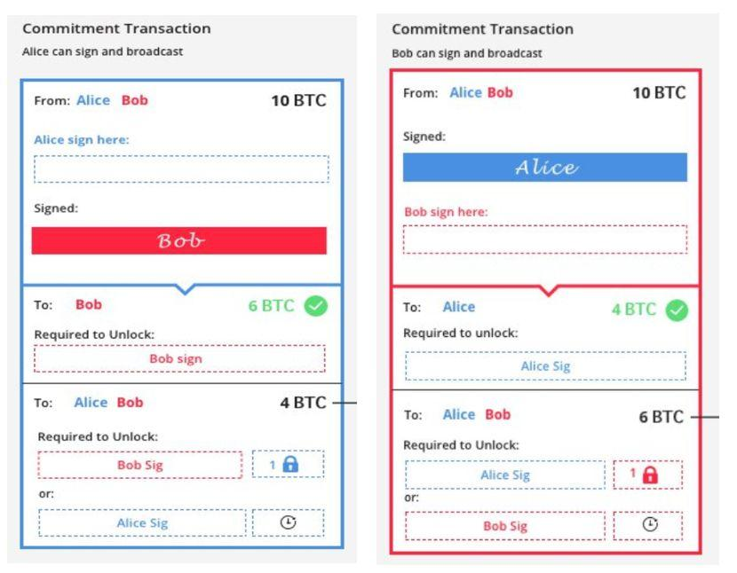
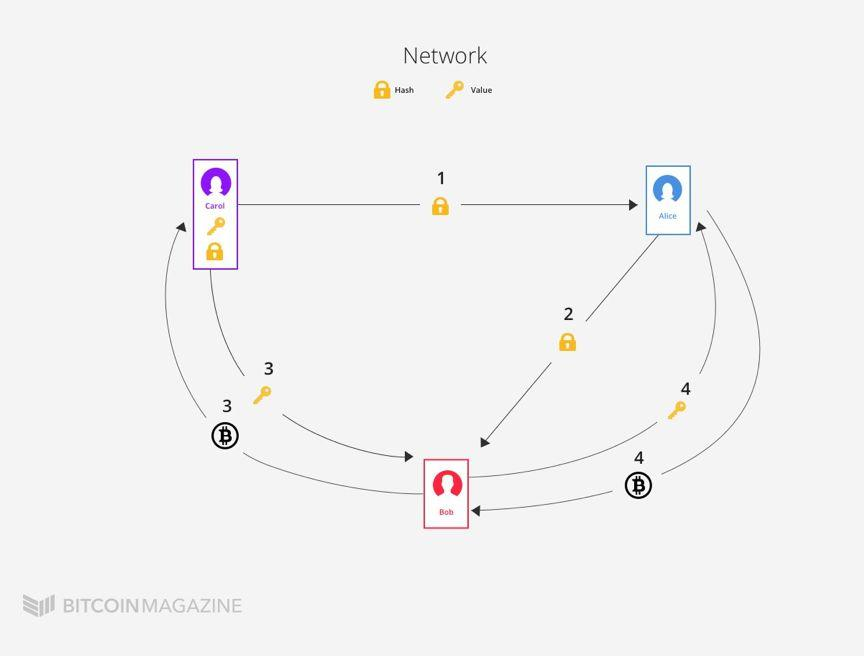

# 闪电网络

多重签名技术（multisig）：是多个用户同时对一个数字资产进行签名。可以简单地理解为，一个账户多个人拥有签名权和支付权。如果一个地址只能由一个私钥签名和支付，表现形式就是1/1；而多重签名的表现形式是m/n，也就是说一共n个私钥可以给一个账户签名，而当m个地址签名时，就可以支付一笔交易。例如，多重签名2/3，表示3个人拥有签名权，而两个人签名就可以支付这个账户里的比特币；多重签名1/2，表示2个人拥有签名权，谁都可以单独来支配这笔资金。

哈希时间锁定：这是在交易脚本里面设置时钟，必须要等设定时间之后，才能用地址的私钥签名解锁地址里的比特币。例如Alice收到了一笔2 BTC转账，但是对方设定了1000个区块之后才能解锁，所以Alice必须等待1000个区块之后才能用自己的私钥签署交易,花费其中的BTC转给Bob。

哈希密钥锁定：Alice收到了一笔2BTC转账，但是对方设定了哈希值锁定，所以Alice必须得到交易方的密文，同时配合自己的密钥签名才能签署交易，花费其中的BTC转给Bob。

## 闪电网络过程：

1. Alice和Bob先各自把5个BTC转给一个由两人共同控制的多重签名地址。这笔交易和比特币网络上其他普通交易没什么太大区别，只是转出的地址是一个多签地址。这个过程称为开启通道。
2. 开启通道后，这个多签地址里面就拥有10个比特币，这是被区块链记录了的，全网承认。接下来就是Alice和Bob私底下的交易了，不广播，不记在链上，正因如此，交易确认速度快，几乎零手续费，这个过程称为链外交易，在交易通道（channel）中进行。
3. 关闭通道
- 双方协商关闭：双方共同从最开始的多签地址签名发起一笔交易分别转到两人各自控制的地址对应数额的比特币，同时将之前记在小本本上的所有旧账一笔勾销。
- 单方关闭：如Alice单方面关闭，将通道中最后一笔交易广播出去，矿工验证并打包进区块。代价是Alice并不能立马得到比特币，需要等待一定时间，闪电协议设置了哈希时间锁。

## 如何在链下保证双方诚实，即如何在无信任的条件下如何建立双向支付通道？

第一次交易：Alice向Bob，转账1btc，现在Alice有4个，Bob有6个

- Bob与Alice建立通讯，获得Alice创建的密文的hash，并将此hash作为hash锁放入自己构建的交易信息中。这笔交易将6个转给自己，4个放在一个1/2多签地址中
    - Bob用自己的私钥和Alice的密文来解锁。
    - 将此交易发送给Alice。

- Alice方面做完全相同的操作，最后双方各持有对方锁的两条【含义相同，方向相反】的交易信息
- 关闭过程
    - 双方都同意签署并广播，Bob拿到自己的6个，Alice拿到自己的4个。
    - 单方同意并广播，如Alice单方关闭，则需要签署Bob交易，Bob立即拿到6个，而Alice需要等1000个区块时间，单方延迟惩罚。

第二次交易：Bob向Alice，转账1btc，现在Alice有5个，Bob有5个

一个最大的区别是建立第二笔交易之前，两人会相互交换第一笔交易中的密文，即对方第一把锁的钥匙。这么做的目的在于作废第一笔交易记录A，使得两人都只能承认最新的交易记录有效。

Bob在第一笔交易后有6个，再他支付完第二笔交易后，想要作弊，将自己拥有6个这个信息签署广播（相当于签署广播第一笔交易）出去，由于是单方面结束，Alice立刻获得4个，Bob则需要等待1000个区块，而由于双方交换了密文，Alice可以在Bob执行之前执行第一个签署条件，获得6个。Bob将一无所有。

---

双方交易扩展到闪电网络（多方交易）：

HTLC(哈希时间锁定合约)

第一，Carol会选择一个随机密文并运算得到其哈希值，再将此哈希值交给Alice。第二，Alice拿到哈希值后，会构建一笔转账给Bob的交易。这笔交易需要Bob拿到Carol的密文才能解锁，如果Bob在限定的时间内没有解锁成功，这笔钱则退回给Alice。第三，Bob从Alice处拿到哈希值，他也构建一笔转账给Carol的交易，Carol必须拿密文来解锁。第四，当Carol提供密文从Bob处获得1个BTC，Bob立马会拿密文从Alice处获得1个BTC，这就完成了从Alice给Carol转账的任务。

上述过程可以看作一个智能合约。故事类似于这样：A想经过B转账给C，那么C先给A一把锁，C有钥匙A有钱。A跟B说，你从C那里拿到了钥匙，我的钱就是你的了。B就拿着锁去找C，用钱跟C换钥匙，然后拿钥匙去换A的钱。如此一来，就实现了钱和锁从A到B再到C，钥匙从C到B再到A的一个流转。

当然，在实际操作过程中，Alice给Bob转账金额需要大于1个BTC，支付必要的路由费以激励Bob充当路由节点。其次，要注意两笔交易之间的哈希时间长度设置，第二步时间必须长于第三步时间。如果Bob在Alice关闭交易之后拿到Carol的钥匙，他将无法找Alice拿回1个BTC。
