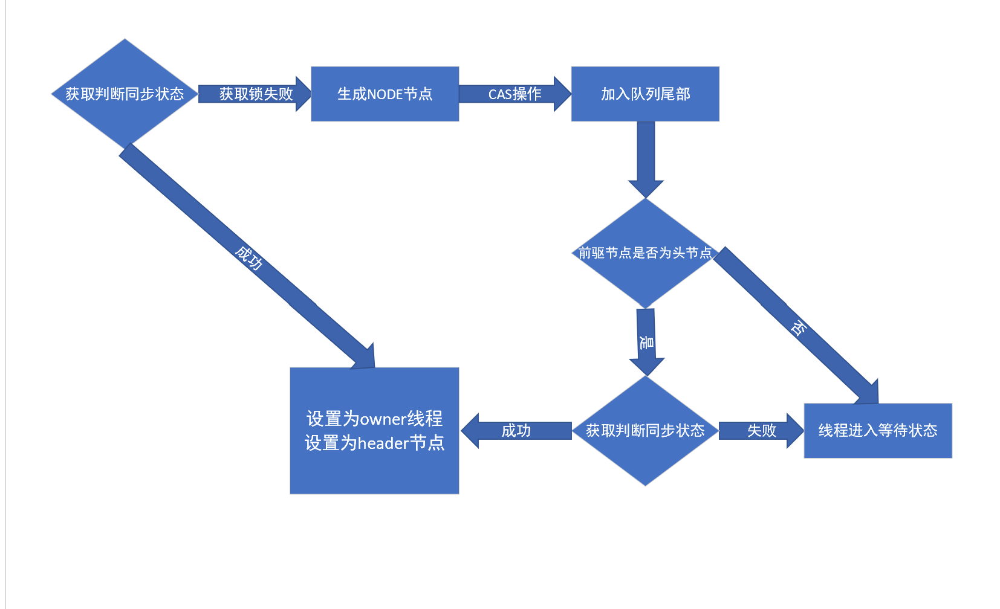

AQS同步器是concurrent包中最基础的组件，它定义了一系列抽象方法用于支持并发的组件，如ReentrantLock，countdownlatch，cyclicbarrier等都依赖于AQS。

AQS重要构成:

- volatile int state：核心同步状态，state的不同值可以定义为工作，阻塞，等待等状态，随后可以根据这个值做排队，唤醒等操作。

- LockSuppport类：支持阻塞的类，主要是park和unpark这两个native方法，进行线程的阻塞和唤醒。

- Node类：双向链表，线程排队阻塞的容器。
  - 0：无操作，初始化
  - 1：canceled
  - -1：singal，等待唤醒
  - -2：condition，等待某个条件
  - -3：propagate

- ConditionObject：条件队列，比如多个线程在这个队列中等待某个条件的完成。

通过这些可以实现同步状态管理，同步状态检查，以及排他锁，共享锁，读写锁，屏障等功能的实现。

AQS核心模板方法：

- boolean tryAcquire(int arg)：独占式锁获取步状态

- boolean tryRelease(int arg)：独占式锁尝试释放

通常对于上锁的操作是：获取同步状态state，如果当前状态未锁定，那么设置owner线程为当前线程，并更改stat值。
如果当前为锁定状态，那么在node链表后追加一个元素，这个node对象会包含当前线程信息，追加完成后，阻塞（park）当前线程。

对于解锁的操作是：当前state减1，如果state为0，那么设置线程owner为null（通常定义state为0是未上锁状态，具体的实现也可能有所不同），
然后设置head即自身node节点状态未0，并唤醒next节点，将next节点设置为head。

那么就以如ReentrantLock的独占非公平锁为例解释AQS和独占非公平锁的工作原理：

获取锁部分：

1.tryAcquire：

getState()获取状态，对于ReentrantLock来说，0表示未上锁，≥1表示上锁。
如果为0，则设置锁setExclusiveOwnerThread()为当前线程，并将state置为1。

如果大于0，表示上锁，判断owner线程是不是自己，如果是，state+1，如果不是，返回false，进入下一步。

2.addWaiter(Node node)：

产生一个新节点，并追加到双向链表的最后，这里的node是Exclusive独占模式。

这个方法中有一些(for ; ;)操作，无线自旋+CAS操作保证即是是并发状态该node也一定会添加到链表中。

3.acquireQueued()

````
for (;;) {
    final Node p = node.predecessor();
    if (p == head && tryAcquire(arg)) {
        setHead(node);
        p.next = null; // help GC
        failed = false;
        return interrupted;
    }
    if (shouldParkAfterFailedAcquire(p, node) &&
        parkAndCheckInterrupt())
        interrupted = true;
}
````
上面的for循环是这个方法的核心逻辑，第一次进入循环时，最后一次尝试获取锁（之前的逻辑已经尝试过），在前置节点prev node为header的情况下，
可能上一个线程已经执行完，锁被释放，如果获取到锁，进行设置owner，header等操作。

如果没有，则挂起（park）自身。



释放锁部分：
````
public final boolean release(int arg) {
        if (tryRelease(arg)) {
            Node h = head;
            if (h != null && h.waitStatus != 0)
                unparkSuccessor(h);
            return true;
        }
        return false;
    }
````
1.tryRelease(1)：

将同步状态state减1，如果不为0，表示被上了可重入锁，还需要解锁，如果为0，则将锁owner设置为null

2.找到当前队列头节点，节点调整设置为0，同时找到next节点唤醒。
````
for (;;) {
    final Node p = node.predecessor();
    if (p == head && tryAcquire(arg)) {
        setHead(node);
        p.next = null; // help GC
        failed = false;
        return interrupted;
    }   

    if (shouldParkAfterFailedAcquire(p, node) &&
        //线程阻塞在这个地方
        parkAndCheckInterrupt())
        interrupted = true;
}
````
这时在之前的代码段中上锁的地方线程唤醒，然后又进入for循环，这时满足了同步上锁态的判断条件，于是这个线程占有锁。

***
#### FairSync公平锁

前文阐述的是非公平锁的流程，而公平锁的流程和非公平锁类似，只是在某个线程获取锁的时候多了一步是否有队列的判断。

即非公平锁，在获取锁的时候，可能正好是某个线程释放了锁，这时按照顺序应该是加入队列等待中的线程获取锁，
非公平锁不管是否有等待队列，直接尝试抢占，而公平锁会判断是否是有等待队列并加入到队列最后，保证有序的公平性。

注：非公平锁整体上还是有序的，因为唤醒顺序还是按队列的顺序来的。

***
#### shared共享锁

共享锁和独占锁有两点不同

1.addwaiter(NODE.SHARED)，共享锁加入队列时加入的是shared节点

2.共享锁释放过程

独占锁的释放是只唤醒下一个节点，而共享锁会链式释放一整个队列中shared节点，这种模式在countdownlatch中就有应用

***
条件变量 condition

基于lock实现，通常配合ReentrantLock使用，与synchronized类似，await/singal方法必须在lock和unlock之中。

await与wait类似，即挂起线程，释放当前lock。这里挂起的线程都会以Node.condition节点状态的形式放入waiter队列中。

signal与notify类似，将队列中第一个节点由condition状态变为singal状态，表示这个节点可以参与之后的锁竞争。

signalAll是将wait队列所有节点变为signal。

condition的优势在于可以控制更细的竞争颗粒，synchronized必须以对象为上锁单位，而一个lock则可以创建多个condition，对多个条件进行控制。
比如生产者线程和消费者线程对于conditionP和conditionC，那么conditionC只控制消费者有关的线程。

lock多了几个功能

1.可中断的等待
2.公平锁
3.condition更小颗粒的控制