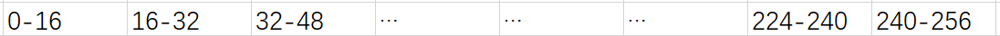

ConcurrentHashMap是并发条件下专属容器，以前的版本使用的是segments，分段锁来实现。
在jdk1.8中使用大量的CAS自旋和synchronized来实现，这大概也是synchronized优化后性能的体现。

ConcurrentHashMap中关键变量sizeCtl表示状态：

- 0：默认初始化
- -1：table正在初始化
- -N：表示N-1个线程正在进行扩容操作
- 其他值：表示table容量

###1.initTable初始化

ConcurrentHashMap的大部分操作都会在一个while或无限for循环中，本质上是对CAS操作的自旋，某个CAS失败后，会不断进入下一次循环，直到成功。

初始化也在一个while循环中，首先CAS操作将sizeCtl设置为-1，然后进行数组的生成。
而如果同时有其他线程尝试初始化，CAS操作将失败，就不断自旋，直到成功获得到数组已经生成的消息，然后返回。

###2.putVal方法

put的过程依然在一个无限for循环中，大致流程如下
````
if (table == null) {
    initTable();
} else (table[i] == null) {//索引位置第一次放入node，未形成链表，不上锁放入值
    put(Node)
    break;
} eles (table正在扩容) {
    当前线程帮助扩容
} else {//存在了hash冲突
    对当前链表或树synchronized之后，放入的逻辑与hashmap类似
}
````
这里有两个关键点

- 不上锁的首次put Node操作：这里的put又是一个CAS操作，compareAndSwapObject(obj,offset,exV,upV)，
通过数组的索引i可以计算出offset，然后读到这个偏移值 == null，那么进入更新。
在多线程环境下可能某个线程刚进入put逻辑，然后另一个线程已经设置了索引位置的值，那么这个线程就会CAS失败，然后进行第二次循环时直接进入最后的else，即hash冲突的逻辑中。

- hash冲突时的逻辑：对于hash冲突的情况，直接使用synchronized(table[i])对这个索引位置的节点进行锁定，保证多线程不会使链表中的数据丢失。

###3.size方法

ConcurrentHashMap中size不能简单地向hashmap一样进入一个元素count+1，因为多线程环境对count+1这个操作同样使用CAS完成，
在竞争激烈的情况下，会出现大量自旋影响性能。

ConcurrentHashMap使用basecount和countercells来共同表示size，不冲突的情况下使用basecount，如果有竞争那么每个线程单独使用自己的countercells计数，
那么最后的size = basecount + 所有countercells的总和。

###4.扩容操作

putVal的最后一步，会用上文所说的方法count+1，然后然后判断count总数是否大于sizeCtl，然后扩容逻辑，如果sizeCtl<0，
表示有其他线程已经开始扩容，那么加入扩容。

ConcurrentHashMap整个的扩容思想就是将table分段，根据CPU数量和table容量决定每段的长度，最低为16，即每个线程每次处理16个元素。

table[256]


如第一个扩容线程进入时领取240-256的元素进行处理，在一段for循环中，会不断领取元素进行处理，
帮助线程的本质也在于此处，每个新的线程进入时都会领取一段未处理过的元素。

而对于向新的数组中插入元素这个操作，依然与之前的put过程类似。

注：在开始扩容时，会new一个hash为moved的node，每当原table中的一个node处理完毕，这个node会变为moved node，
那么后续扩容时，如果遇到moved节点，就知道这个元素已经被处理，或者在put的过程遇到moved节点，就知道map当前正在扩容，
那么当前线程也会去帮助扩容。

***

jdk的整个并发包大都出自Doug Lea之手，可以说风格极为统一，都是用一个核心state表示状态，
加上大量的CAS自旋操作和synchronized锁定来实现并发的安全性。