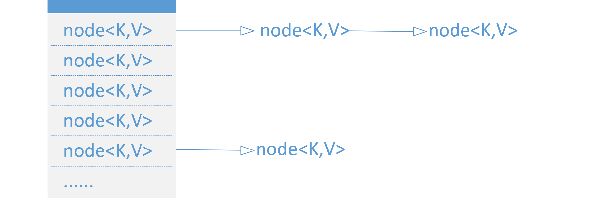
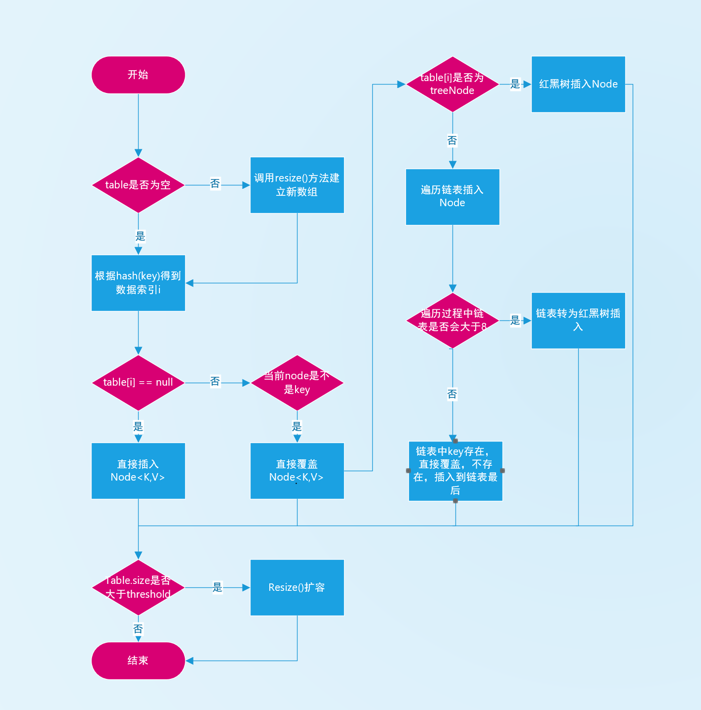

###1.数据结构

hashmap底层使用数组+链表的数据结构

Node<K,V> [] nodes

当某个链表大于8时，转为红黑树，让resize或remove之后链表长度小于6时，红黑树退化为链表

map中的key不能重复，所以判断一个key是否相等用hash方法和equals。

hashmap中采用哈希算法hash(key)：(h = key.hashCode()) ^ (h >>> 16)

key的哈希值决定了这组对象在node数组的位置，而equals用于判断在hash(key)相等情况下，这个链表中是否有相同的key对象。这也是为什么要求构建类的时候必须覆写hashcode和equals方法，
这两个方法是对象使用容器时的关键方法。

###2.put方法

流程比较复杂，以流程图表示

###3.扩容resize方法

hashmap的默认容量是16，负载因子是0.75，即容器内元素超过16*0.75=12时，会进行容器扩容。
loadFactor负载因子可以表示map的稀疏程度，loadFactor越高，map元素越密集。

resize方法首先会判断是否超出threshold上限，如果超出，则新建一个原数组**两倍容量**的数组，同时计算新数组的threshold等值。
随后进行元素的迁移，

如果是单个node，即node.next == null，那么重新计算hash & (newCap - 1)新的索引值后直接放入，

如果元素为树，那么进入树的迁移逻辑，这里的迁移过程树有可能退化为链表。

如果元素为链表，那么遍历链表重新选择位置插入。

注意hash & (newCap - 1)这个用于计算索引的算法，通常计算索引用的是hash % newCap 去余数为索引，
仅当cap是2的幂次方时，满足hash & (newCap - 1) = hash % newCap，而&操作性能比%高不少，这也是为什么map都是2倍扩容，为了满足元素迁移时的优化算法条件。

2倍扩容还带来另一个优化是，元素只要在原位置的索引上移动2次幂即是新的位置，如：

一个元素在16长度的map中位于[7]的位置，那么扩容成32长度的数组，必然位于[7]或者[23]位置

###4.线程安全

jdk1.7中经典的链表死循环问题，这个问题的本质在于1.7的链表移动时采用头插法，即新的元素插入到链表的头部，
当多个线程同时扩容时，一个线程的链表已经反转完毕，而另一个线程尝试没有反转而尝试反转时就引起了死循环。

死循环只是其中一个hashmap在多线程环境下的问题，但即使1.8中采用尾插法修复了死循环，依然有数据缺失等问题。
如"3C"，"2b"的hash值相同，当多个线程同时进行put操作时，可能会导致某个key的丢失。

所以不建议在任何多线程环境下使用hashmap，多线程有专门的并发容器ConcurrentHashMap。