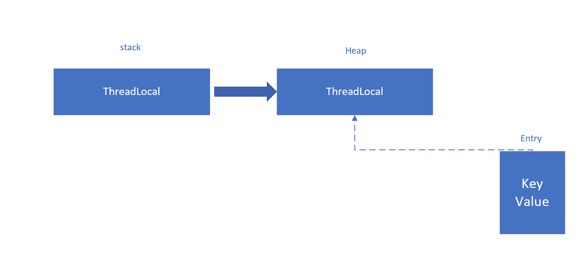

ThreadLocal，本地线程变量，用于线程间的数据隔离，ThreadLocal为变量在每个线程中都创建了一个副本，那么每个线程可以访问自己内部的副本变量。

其基本数据结构是 Entry[]数组，初始大小为16.

set操作以当前threadLocal的hash值为索引i，将value放入数组[i]

Entry类继承于weakReference弱引用

- 强引用：有显式的=操作，即使发生溢出，也不会回收对象
- 软引用：强引用断开后，在发生内存溢出前被回收
- 弱引用：无论内存是否溢出，下一次GC必定被回收

Entry继承于weakReference弱引用，即Entry中的key于threadlocal是弱引用关系

当某个使用threadlocal的方法结束时，其对象断开强引用，但对象依然存在于localmap中，
如果不适用弱引用，那么对象永远不会被回收，造成内存泄漏，但使用弱应用后，那么key对象下次GC就会被回收。

虽然threadlocal作为key对象解决了内存泄漏，当时value对象依然可能产生内存泄漏，所以当某个threadlocal使用完毕后，
建议使用remove()方法帮助回收。