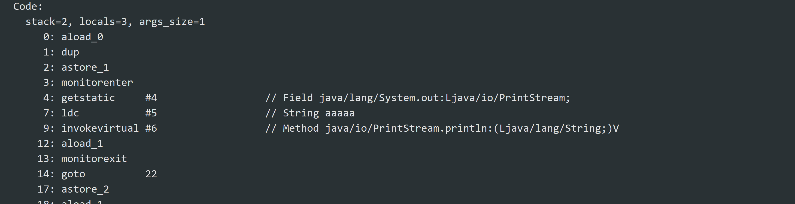

当使用java进行并发相关的开发时，永远需要考虑多线程共同操作共享数据的情况。
关键字synchronized是解决并发问题最简单也是最广泛的方法，它可以保证在同一时刻只有一个线程可以执行某个方法或某个代码块。

###1.synchronized的作用范围

synchronized的作用颗粒是**对象**。

- 作用于实例方法时，锁定的是当前对象
- 作用于静态方法时，锁定的是class对象，即该类的全局锁，任何其他该类静态方法或以该class对象为锁的代码块都无法进入
- 作用于代码块，可以自己指定锁定对象，如synchronized(object)或(this)或(String.class)

###2.synchronized的指令码和monitor对象

synchronized的代码段会在指令码上生成monitorenter和monitorexit指令。

当执行到monitorenter时，线程必须获取到一个monitor对象才可以继续往下执行，否则只能等待。
获取的这个过程是互斥的。所以当我们说对某个对象上锁实际上指的是获得这个对象的关联monitor对象

在JVM中会为每一个对象分配一个关联的monitor对象，通过java对象头的markword管理。
monitor对象中有几个关键属性是synchronized机制的关键。

- count：获取对象次数
- owner：当前monitor拥有者
- waitset：尝试获取这个monitor对象的线程中处于wait状态的list
- entryset：尝试获取这个monitor对象的线程中处于阻塞状态的list

1.当多个线程尝试执行monitorenter时，只有一个线程可以获得该monitor所有权，owner属性改为该线程，同时count从0变为1，
其他线程进入阻塞态，进入到entryset中。注：如果owner线程再次进入，那么count+1，这表示synchronized是可重入的。

2.当owner线程退出时，count-1，如果此时count为0，那么owner改为null，同时处于entryset中的线程可以尝试获取该monitor。

3.当某个线程调用wait方法时，当前线程释放monitor对象，即owner为null，自身进入waitset队列中，同时entryset中的线程开始竞争。

而当调用notify方法时，会从waitset中唤醒一个线程进入entryset中，注意并不是唤醒的线程马上可以执行，依然需要等待当前线程释放monitor，也并不是释放完成一定轮到该线程执行，依然要通过之前所说entryset的竞争获得。
notifyall则是将waitset中所有线程放入entryset中。

这里也解释了为什么wait()/notify()方法必须在synchronized中，这两个方法直接与monitor中的属性打交道，自然以获得这个monitor为前提条件。

###3.锁优化
在jdk6之后，对synchronized机制进行了优化，加入了自旋，锁消除，偏向锁，轻量级锁等。

再见java对象头布局：

这里面的一些属性就是synchronized优化的关键。
首先是重量级锁，这个指向互斥量的指针就是指指向反复提到的monitor对象，所以前文阐述的严格上说是对synchronized机制中重量级锁的解释。
而由于重量级锁涉及到线程的等待阻塞等，这又涉及到用户态和内核态的切换，不深入写，在这里只要知道这种切换是比较大的开销，所以synchronized未优化前一味地使用重量级锁付出的代价昂贵，
所以synchronized性能不高，会使用ReentrantLock这类锁作为代替。

####优化1：偏向锁

在某一monitor对象总是由一个线程获得，可能是来来回回进出同步块，不存在竞争，但却需要反复获得monitor，
对于这样的使用场景jvm给出了偏向锁的优化方式。

即某一线程第一次进入同步块时，不直接获取monitor，而是在对象头中记录这个线程id（偏向状态和偏向线程id），
之后该线程再次进出同步块，就不需要做锁相关的操作。

当出现其他线程竞争中，任何时候偏向线程id与尝试获取锁的线程不一致时，升级为轻量级锁。

####优化2：轻量级锁

在同步块处虽然出现了竞争，但是竞争的强度和时间都不大，于是通过CAS自旋操作去处理竞争，这种模式被称为轻量级锁。

在某一线程进入同步块时，在当前线程栈帧中建立一个lock record空间，存储对象markword的拷贝，同时将对象头中轻量级指针指向自己。

当这个线程退出，其他线程进入时，通过CAS操作更新这个指针，如果更新成功，表示当前线程成功获取到锁，如果失败，那么进行自旋再次尝试更新。

当一定程度的自旋之后，轻量级锁升级为重量级锁，轻量级的消耗主要是在自旋浪费cpu性能上，但是较少次数的自旋的开销依然比用户态与内核态的切换开销低。

####优化3：锁消除与锁粗化

锁消除：对于一定不会出现竞争的同步块，比如stringbuffer在底层就用synchronized进行了保证，那么业务层的synchronized就会被消除，其他如一些变量逃逸分析后确切不会有线程不安全的情况也会使用锁消除

锁粗化：多个连续加上synchronized的代码块分析后可能会合并一个更大范围的代码块，以减少上锁的次数。

