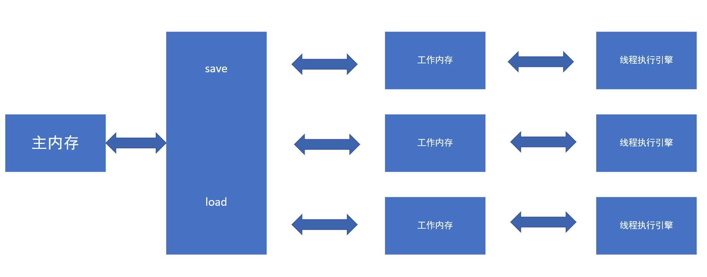

JVM工作时内存模型：

- 所有变量都在主内存中
- 每个线程都有自己的工作内存，保存了使用到的在主内存中的变量副本
- 线程不能直接操作主内存，所有操作在工作内存区域完成

内存中操作变量有以下几种：
- read：从主内存中读取到变量
- load：将读取到的变量复制一个变量放入到工作内存中
- use：将工作内存中的变量传递给执行引擎


- assign：执行引擎操作变量后放入工作内存中
- store：从工作内存中读取变量
- write：将从工作内存中读取到数据放入主内存中，完成修改

对于volatile变量而言：
1.read，load，use必须连续，即保证每次使用变量都是从主内存中拿到的最新的值。

2.assign，store，write必须连续，即保证每次修改变量后立刻同步到主内存。

3.volatile变量不会被指令重排序优化，执行顺序不会改变。

所以使用volatile可以保证可见性，不可重排性，但**不能保证原子性**。
可以理解为读取和写入两个过程各自都能保证原子，但是整个过程不能保证。

****
volatile通常有几个使用场景：
1.用于某种状态标志位，即某种状态转换，不依赖于程序内其他变量，如开始停止这类状态。

2.经典的双重检查单例模式
````
private volatile static Singleton sin;

public static Singleton getInstance() {
    if (sin == null) {
        synchronzied(singletion.class) {
            if (sin == null) {
                sin = new Singleton();//volatile变量生成
            }
        }
    }
    return sin;
}
````

上述过程中的sin = new Singleton()，在jvm上实际分为三步
- memory = allocate() //1分配对象内存空间
- init sin //2初始化对象
- memory -> sin //3对外暴露分配的内存地址

这里如果不使用volatile变量，上述的步骤可能被优化为先对外暴露地址，然后再初始化对象，多线程环境下，如果这两步之前出现了另外的线程去读取对象，
就会读到一个未初始化的对象，出现引用溢出的问题，而使用volatile变量就会禁止这种重排序。