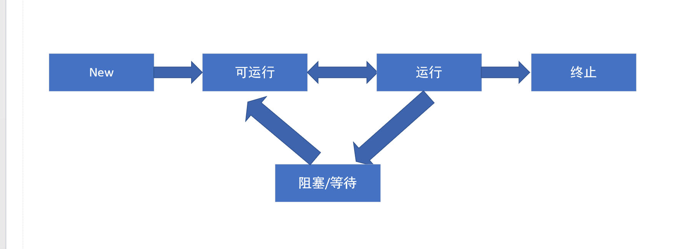

线程是进程中的实体，是资源配分的最小单位。
多个线程共享一块内存空间和一组资源，线程切换更快，进程切换则涉及到存储管理方面的操作。

###1. 线程状态

- 创建：如new Thread()，初始化状态

- 可运行：线程有资格运行，但未被调度程序选中，线程从阻塞态或休眠态恢复时，也进入到可运行状态，

- 运行：线程得到CPU片，并执行

- 阻塞/等待/休眠：线程不满足条件运行，阻塞于锁或者等待某个条件

- 终止：线程执行完毕

注：线程一旦启动，不可以重启



java中线程分为用户线程和守候线程，后者如垃圾回收线程，当所有用户线程执行完毕，只剩下守候线程时，JVM结束。
守候线程依赖于系统，通常周期性执行某些事务，不会自己结束，随着JVM一起死去。

通过设置Thread.setDaemon(true)为守候线程，默认为false。

一个java应用总是从一个main方法开始，所以启动时至少启动两个线程，一个main线程，一个垃圾回收线程。

###2.线程启动 让步与停止
创建线程通常继承于Thread类或者runable接口，重写run方法。
````
new Thread(new runnable() {
    run() {
    }
})
````
通常构造方法中还有线程名，线程组和线程栈大小。

注：直接调用run方法是合法的，但只有start方法才会启动新的线程。

- 线程休眠

Thread.sleep(1000)
通过sleep方法强制当前线程休眠，让出CPU资源，当休眠时间到时，不马上进入执行状态，而是进入可执行状态，等待CPU分配时间片。

- 线程让步

Thread.yield()

当前线程进入可执行状态，以使其他线程获取运行机会，但yield无法保存让步的目的，因为让步线程可能再次被cpu选中执行。
java选择线程运行也有一个优先级作为依据，可以设置线程优先级，但并不可靠。

- 线程join

````
main {
    t1.start();
    t1.join();
    t2.start;
}
````
在主线程中使用t1.join，使主线程放弃cpu执行片，并交给t1，直到t1执行完成后返回，主线程继续执行。
利用join可以达到简单的先后线程执行的控制。

join方法底层使用wait/notify机制（synchronized中详细解释），在t1执行完成后调用notify唤醒主线程。

注：join还有一个超时的重载方法，设置一个时间，如果超过时间还没返回，那么当前线程自动进入可运行状态。

如果保证t1 t2 t3的顺序执行

1.join方法
2.synchronized或lock设置竞争条件
3.cyclibarrier多个线程相互等待，t1等待t2，t2等待t3

- 关于线程切换

上下文切换时存储和恢复CPU状态的过程，使线程从中断点恢复
