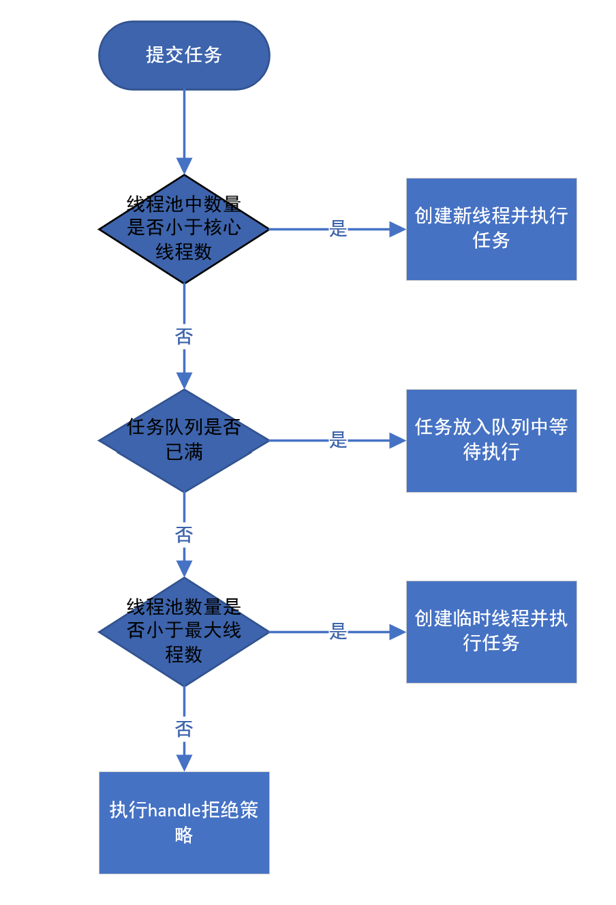

线程池的优势：
- 降低系统资源消耗，通过重用已存在的线程，降低线程创建和销毁造成的消耗
- 提高系统响应速度，当有任务到达时，通过复用已存在的线程，无需等待新线程的创建便能立即执行
- 限制线程并发数的大小，如果线程创建过多，可能会导致内存占用过多而产生OOM，并且会造成cpu过度切换
- 提供一些其他功能，如延时定时线程等

线程池本质上一个线程管理的容器。

ThreadPoolExcutor的几个重要参数：

- int corePoolSize（必需）：核心线程数，默认情况下，核心线程会一直存在 
  CPU密集型可恶意设置为n+1 IO密集型可以设置为2n
- int maximumPoolSize（必需）：线程池所容纳的最大线程数，达到这个上限后，后续的任务会执行拒绝策略
- long keepAliveTime（必需）：线程闲置时长，超过时长，非核心线程会被回收
- TimeUnit unit（必需）：时长时间单位
- ThreadFactory threadFactory（可选）：线程工厂，线程池创建线程方式
- RejectedExecutionHandler handler（可选）：达到最大线程后进入的任务的执行策略

ThreadPoolExcutor中同样有个核心状态值ctl，从这个值中可以获得线程池运行状态和线程池的线程数量。

线程池整体工作流程如下：

线程池接受的任务的基本单位是Worker，同样继承于AQS。

1.当线程池接受一个worker后，如上流程图，会判断线程池状态和数量，如果可以增加线程，那么用CAS操作增加核心或最大线程。

2.随后将worker交由某个线程执行，或放入执行队列中。

3.某个线程的执行逻辑也是在一个while循环中，
while(task == getTaks() != null)，会不断拉取任务执行，直到所有任务执行完成。

***
线程池任务队列总结：
- ArrayBlockingQueue：基于数组的有界阻塞队列
- LinkedBlockingQueue：基于链表的阻塞队列，默认容量为Integer最大值
- PriorityBlockingQueue：优先级排序的无界的阻塞队列，必须实现comparable接口的任务，会按照比较的大小值执行任务
- DelayedWorkQueue：二叉堆无界优先级阻塞队列，必须实现delayed接口的任务，按延时时间提取执行任务
- SynchronousQueue：不存储元素的阻塞队列，一个接一个处理，典型的生产者消费者使用场景
- LinkedBlockingDeque：双向队列实现的有界阻塞，可以FIFO，也可以FILO

***
线程池拒绝策略总结：
- AbortPolicy（默认）：会丢弃任务并抛出异常
- CallerRunsPolicy：主线程会调用自己执行器中execute方法去执行任务
- DiscardPolicy：会丢弃任务，但不抛出异常
- DiscardOldestPolicy：会将队列中最早元素移除，然后再尝试添加任务
- 自定义：可以自己实现RejectedExecutionHandle去处理任务