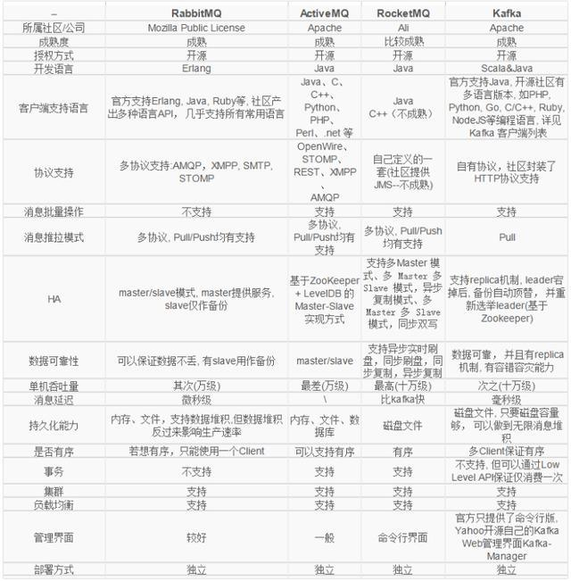
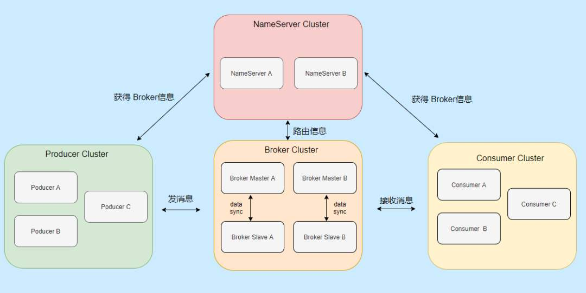
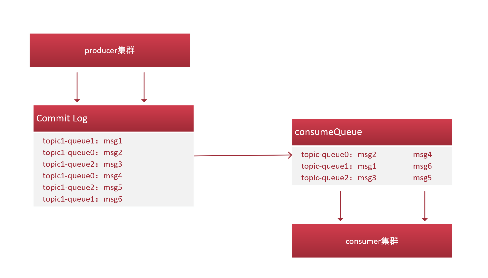

### 1.几种mq比较

### 2.rocketmq架构

- nameserver集群：无状态命名服务，负责发现和更新broker
- broker集群：消息存储服务，存储和转发，broker启动后将自己注册到nameserver中，并定期向nameserver报告topic消息
- producter集群：生产者集群，与nameserver中的某个节点保持长连接，并定期从中获取topic信息，
同时与master broker建立长连接以传送数据
- consumer集群：消费者集群，nameserver中的某个节点保持长连接，并定期从中获取topic信息，
同时与master broker或者slave broker建立长连接，既可以向master订阅，也可以向slave订阅

- Topic：划分消息的标志，发送方可以向多个topic发送消息，消费方也可以订阅多个topic消息，
topic是一个逻辑概念，实际的存储并不会按topic划分

### 3.broker存储模型

- commitlog：消息真正的物理存储文件，commitlog由一个个mappedFile文件组成，每个大小为1G，一个文件写满时，才创建下一个写入，当写入时就落地硬盘，所以rocketmq的消息是持久可恢复的。
注意消息写入是有序的

- ConsumeQueue：ConsumeQueue本身并不存储消息，它存储消息在commitlog中的偏移量，即可以理解为ConsumeQueue是CommitLog的索引。
ConsumeQueue代表了某个Topic下的一个队列，记录了某个Topic下的索引文件。

通常集群模式会做broker的分片，即某个Topic下会分成多个Queue，以负载均衡的模式将消息排列在不同的队列中，多个消费者可以并行消费。

### 4.消息刷盘

- 异步刷盘：消息进入内存，即返回成功ack，当内存数据积累到一定程度，触发统一的写操作，适合吞吐量大的场景
- 同步刷盘：消息成功进入硬盘后才会返回成功ack，适用于可靠性高的场景
