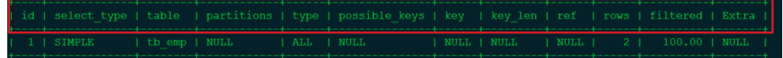

explain关键字可以模拟优化器执行sql查询语句，从知道MySQL是如何处理sql语句,
是sql优化的必要手段。

explain + sql语句执行，返回的数据包含如下信息：

1.id：mysql实际查询语句id，一条sql可能包含多个实际查询sql
- 多个返回数据中id相同的情况：出现查询多个表的情况，且按顺序排列。
- id不同：出现了子查询语句（临时表排列情况）。
- id存在相同和不同：同时有上述两种情况。

2.select_type：查询类型
- simple：简单select结构，不包含子查询或union查询。
- primary：查询中包含子查询，外层查询将标注为primary。
- derived：from中包含子查询，这个子查询被标注为derived，子查询结果放在临时表中。
- union：union之后的select查询将被标注为union

3.table：select的执行表来源

4.type：查询类型，显示sql语句执行效率，这是sql优化的关键指标

system > const > eq_ref > ref > range > index > all

- system：全表只有一行数据，一般不会出现

- const：表示通过一次索引就找到了结果，常出现于primary key或unique索引。因为只匹配一行数据，所以查询非常快。

- eq_ref：多表查询中，读取本表和关联表组成的一行，连接条件使用的是主键索引或唯一索引。

- ref：非唯一性索引扫描，返回符合条件的多个行，这个条件一定要是索引。

- range：只检索给定范围的行，可以使用key列查询使用的索引，出现在范围索引查询中，开始于索引某点，结束于索引某点，而不用全索引扫描。

- index：全索引扫描，遍历索引树。

- all：Full table scan，遍历全表，sql如果需要优化首先应该避免这种情况。

5.possible_keys：查询中可能被用到的索引，查询涉及到的字段若存在索引，则该索引将被列出，但不一定被查询实际使用。

6.key：实际中使用的索引，如为NULL，则表示未使用索引。若查询中使用了覆盖索引，则该索引和查询的select字段重叠。

7.len：表示索引中所使用的字节数，可通过该列计算查询中使用的索引长度。在不损失精确性的情况下，长度越短越好。

8.ref：显示关联的字段。如果使用常数等值查询，则显示const，如果是连接查询，则会显示关联的字段。

9.rows：mysql估算找到数据需要查询的行数，该值越小性能越好。

10.filtered：一个分比值，表示存储引擎返回的数据经过滤后，剩下多少满足查询条件记录数量的比例。

11.Extra：额外信息，这个字段也是优化的关键字段

- Using where：sql使用了where过滤。

- Using index：表明相应的select操作中使用了覆盖索引，避免访问表的额外数据行。

- Using filesort：表明使用一个外部的索引排序，而不是按照表内的索引顺序进行读取，mysql中无法利用索引完成的排序操作称为“文件排序”，出现Using filesort表示了性能较低。

- Using temporary：使用了临时表保存中间结果，常见于排序order by和分组查询group by，出现了Using temporary表示性能非常低。

