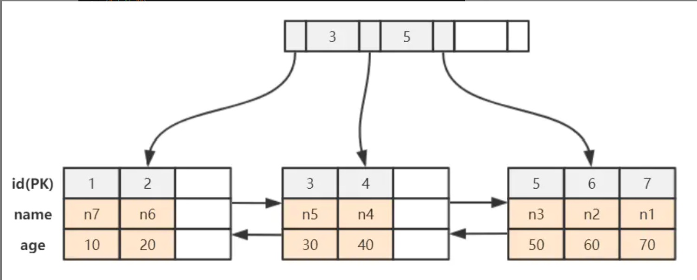
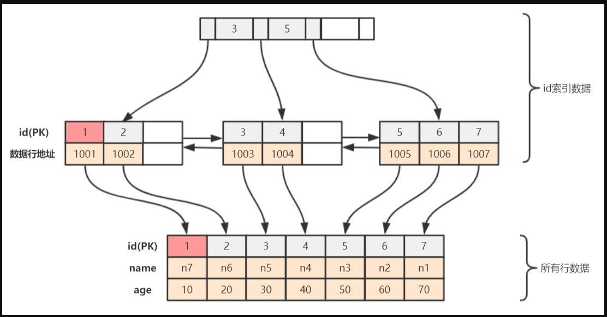

### 1.B+树索引

B+树定义

- 有k个子树的中间节点包括了k个元素，中间节点只保存索引，所有的数据都保存在叶子节点上

- 所有叶子节点中包含了全部元素的信息或者指向这些元素的指针，且叶子节点按顺序自小到大形成链表的结构

- 所有的中间节点元素同时存在于子节点，且在子节点元素是最大(最小)元素

使用B+树作为索引的优势

- B+树在中间节点上不保存数据信息，因此内存上可以存在更多的信息，有更好的性能和局部性

- B+树叶子节点相连，因此遍历数据只需要遍历一次叶子节点，而且这样的结构对区间查询更加友好

- 每次查询都最终会走到叶子节点，查询性能稳定

### 2. 聚簇与非聚簇索引

非聚簇索引的索引文件和数据文件是分开的，如MyIsam，叶子节点中实际上存储的是指向存放数据物理区域的指针。
而聚簇索引中每个叶子节点包括主键值，事务ID，回滚指针等，如InnnoDB，聚簇索引有如下优势

- 由于数据和叶子节点存储在一起，这样主键和行数据是一起被载入内存的，找到叶子节点就可以立刻返回数据，
非聚簇索引的每次查找可能额外多出一次IO

- 聚簇索引在排序和范围查找的场景比非聚簇索引性能高，非聚簇索引的物理地址必然是无序的

而也由于聚簇索引的顺序即是数据物理地址的顺序，所以一个表最多只能有一个聚簇索引，InnnoDB中必须有且只有一个主键用于组织聚簇索引
（如果不指定，mysql会隐式生成id作为聚簇索引）。

InnoDB中的主键非特殊需要务必使用自增id作为主键，这样每次插入新的数据，都会顺序记录到当前索引节点的后续位置，如果使用非单调的主键为了维持这个顺序性而频繁调整索引的位置，
严重影响插入的性能。

InnoDB的辅助索引即是一种非聚簇索引，这种索引的叶子节点中存放的主键的值，所以辅助索引的流程是检查辅助索引得到主键的值，
然后用主键再去主索引中获取记录，这个过程称为回表，也由于辅助索引回表的特征，主键字段也不宜过长，过长的主键会使辅助索引的数据量变大。

### 3.innoDb和MyIsam

- innoDb支持事务，MyIsam不支持事务

- innoDb支持三种锁定级别：行锁，页锁和表锁，MyIsam只支持表锁

- innoDb使用聚簇索引，索引即是数据，既能缓存索引，也能缓存数据。

而MyIsam只有非聚簇索引，索引和数据分开，随机存储，只能缓存索引。

通常不建议使用MyIsam，因为MyIsam不支持事务，而且**只有表锁**，现代数据使用模式下长时间的表lock带来的影响的致命的。

inndoDb的四大特征：插入缓存，二次写，自适应哈希，预读（详细待补充）
 
 ### 4.hash索引
 
 不能显示指定hash索引，InnoDb支持自适应hash索引，即当二级索引被频繁访问时，自动创建优化性能，不能认为人为定义。
 
 hash索引使用hash算法，故只能等值查找而不能范围查找，同理，无法进行排序，hash索引在大数量数据时会发生大量hash碰撞，链表变长时，此时性能是不如B+树的。
 
 ### 5.唯一索引
 
 唯一索引不允许重复的值，但是可以储存null，唯一索引可以简化索引的管理工作，因为值唯一，而可以在业务层作为去除重复的保证，重复会拒绝插入。
 
 
 ### 6.联合索引和覆盖索引
 
 对于多个列建立一个联合索引，非聚簇索引，对于一个查询可以使用索引的一部分，**但必须是左侧的一部分**，如a，b，c三列的组合索引，可以使用（a），（a，b），（a，b，c）三种索引，而不能使用（b，c）这种，
 这个原则称为最左匹配原则。
 
 关于最左匹配原则：如对age，height，weight建立索引
 
 - 最左匹配原则中索引失效本质上由于**高位数据的缺失的情况无法判断索引的顺序**，
 如where height = 2 and weight = 7，索引上的简单表现形式为?17，在age位缺失的情况下，后两位的比较没有意义。
 如where age = 2 and weight = 7，索引位2?7，这个查询只能使用age索引，因为weight位在height位不确定的情况下无法比较。

注：like xx%使用索引而like %xx不使用索引也是这个原理
 
 - 在遇上(>,<,between,like)会停止匹配索引，
 如where age = 2 and height > 2 and weight = 8，只会使用age和height索引，在herght不确定情况下weight的大小没有意义。

- =和in关键字可以不考虑顺序，sql优化器会自动调整顺序，另外并不是符合索引的查询一定就会使用索引查询，如果优化器认为全表查询的成本更低，也会不走索引。

覆盖索引是使用联合索引的一种特使情况，如果一个查询语句所需要的数据全部从索引中可以获取，而不用回表，那么就形成了覆盖索引。
如select age,weight,height where age = 2 and weight = 3，这时的所有需要的数据都在索引中，即为使用覆盖索引。