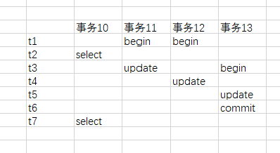
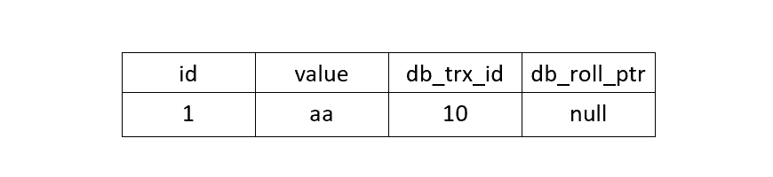
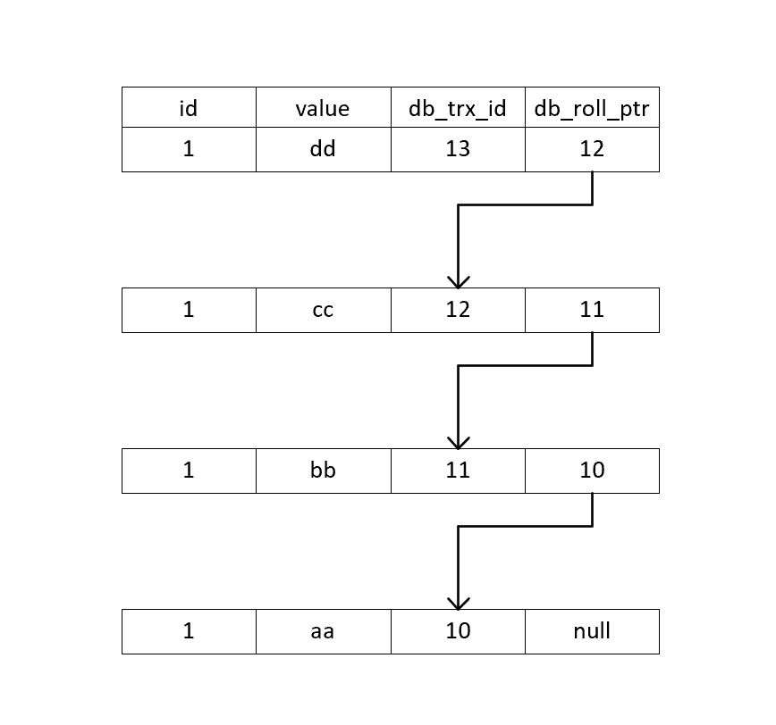

###1.事务概念

事务满足以下四个基本要素：
- 原子性（Atomicity）：事务开始后所有操作，要么全部做完，要么全部不做，不可能停滞在中间环节。事务执行过程中出错，会回滚到事务开始前的状态，所有的操作就像没有发生一样。也就是说事务是一个不可分割的整体，就像化学中学过的原子，是物质构成的基本单位。
- 一致性（Consistency）：事务开始前和结束后，数据库的完整性约束没有被破坏 。比如A向B转账，不可能A扣了钱，B却没收到。
- 隔离性（Isolation）：同一时间，只允许一个事务请求同一数据，不同的事务之间彼此没有任何干扰。比如A正在从一张银行卡中取钱，在A取钱的过程结束前，B不能向这张卡转账。
- 持久性（Durability）：事务完成后，事务对数据库的所有更新将被保存到数据库，不能回滚。

###2.Mysql事务级别
- 读未提交：一个事务可以读取到另一个事务未提交的数据

- 读已提交（READ COMMITTED）：一个事务只能读取另一个事务已提交的数据，会产生两种类型的不可重复读
  - 不可重复读类型1：即一个事务修改了数据，另一个事务在不同时间会读到两种情况
  - 不可重复读类型2：即俗称的幻读，即一个事务新增或删除了数据，另一个事务读某个范围的数据时，会莫名多出数据或少了数据
  
- 可重复读（REPEATABLE READ）：mysql的默认事务级别，使用了MVCC技术和间隙锁技术，同时避免了两种类型的不可重复读

- 串行化：事务之间不可并行，从根本上解决所有并发问题，但是会导致大量的超时现象

###3.MVCC版本并发控制：

即在事务开启时保存了数据在这一时刻的快照（read_view），那么这个事务无论运行了多少时间，重复读了多少次，
在这个事务内读取得到的数据都来自一个确定的版本，是一致的。

为了实现数据的快照，mysql每条数据都有4个额外的隐式字段
- DB_TRX_ID：最后一次修改/创建该记录的事务ID
- DB_ROLL_PTR：回滚指针，指向该记录的上一个版本，存在于undo log中
- DB_ROW_ID：如果没有指定主键，自动生成的隐式主键
- DELETE_FLAG：记录的删除标志

在mysql的RR事务下，一个记录的read_view由事务中对该记录的第一次select操作时获取，后续在查这条记录，都使用这个read_view。
而在RC级别下，每次select操作都获取一个新的read_view，所以rc级别无法避免不可重复读。

read_view数据结构：
- low_limit_id：创建该read_view时当前活跃事务中的最大id
- up_limit_id：创建该read_view时当前活跃事务中的最小id
- trx_ids：所有活跃事务数组

注意readview不是真的保存数据的快照，而是可以根据readview中一些参数可以算出一个版本数据号，决定当前数据可以看到哪个版本的数据。
这个版本可能是最新的数据，也可能是历史某个版本的数据。

读取流程如下：

1.如果被访问数据的版本号小于活跃事务中最小id，表示该版本是在当前所有活跃事务之前进行修改的，因此可以访问。

2.如果该访问数据的版本号大于活跃事务中最大id，表示该版本是在readview生成后才发生了，那么不能访问，会根据roll_id找到前一个版本，再一次进行可见性判断。

3.如果版本号介于两者之间，那么判断是否在活跃事务数组中，如果在表示事务正在活跃不可访问，然后寻找上一个版本，
如果不在活跃事务中，说明事务已提交可以访问。

4.最后需要判断delete_flag，未删除的数据才可以正确返回。

举个例子：

- t1时刻，活跃事务id[11,12]，读取到的数据为：

事务id小于事务活跃最小值，直接返回这条数据

- t7时刻，**RR事务级别下使用第一个readview**，所以活跃事务任务仍为[11,12]，此时读取到的数据为：

当前事务id为13，大于所有活跃事务，不可访问，那么往回找上一条数据，事务id为12，正在活跃中，不可访问，
同理11也不可访问，最后寻找到10，满足条件返回数据。

总结：MVCC在select操作时生成readview，用事务id于readview做可见性算法，如果满足条件就返回，如果不满足则通过roll_id找到上一个版本重复判断，直到找到一个可用的版本。

**MVCC解决了一切的读写冲突，写的事务执行后无法影响到读的那个版本**

