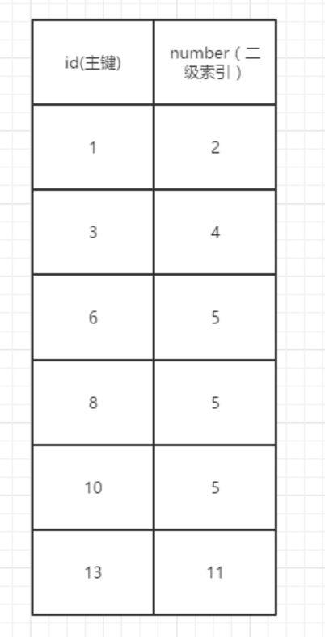

###1.next-key lock

两种形式的不可重复读：
- 类型1：一个事务修改了某个记录，导致另一个事务多次读取这条数据出现不一致

- 类型2：幻读，一个事务新增或删除了记录，导致另一个事务的范围读取多了或少了数据

这里出现了当前读和快照读的概念，这个概念通常会与MVCC和锁混在一起导致理解上的误区。

这里首先要明确快照读就是单纯的读取，对于单纯的读取使用MVCC版本控制就可以完全避免不一致，单纯的读取情况不与任何锁相关挂钩。

与之相对的当前读即select * from xxx **for update**，我更愿意把它理解为**写操作的前置操作**，当前读这个名字很有迷惑性，
事实上它通常不是单纯的读，在update一条数据之前，会自动先执行上述的for update语句，然后进行修改。了解了当前读大部分情况下就是事实上的写操作之后，对于数据的竞争就出现了，自然而然锁就出现了。

next-key lock实际上是两种锁的组合：gapLock + recordLock

1.类型1的不可重复读，直接使用recordLock行锁锁住数据不让其他事务访问就可以了。

注：MyIsam只支持表锁，而InnoDb同时支持表锁和行锁，且这个行锁是**加在索引**上的，
意味着只有走索引的查询才会使用行锁，否则将使用表锁。

2.对于幻读的处理则是使用gapLock间隙锁实现，这里要回顾mysql的索引结构在底部是按顺序排列的，是连续的

如图，要如何避免number=5的数据插入，由于索引连续的特性，可以将索引分为几个区间：
（无穷小，2），（2，4），（4，5），（5，5），（5,11），（11，无穷大）。
那么只需要保证（4，5），（5，5），（5,11）这几个区间中不能插入数据，就可以防止number=5的数据插入，这种锁区间的锁就是间隙锁

****
next-key lock还有几个原则：
- 加锁范围符合前开后闭原则
- 唯一索引的等值查询，next-key lock会退化为行锁，很好理解唯一索引不再会有相同的数据被插入
- 等值查询不满足条件时，next-key lock会退化为间隙锁，即当这条数据不存在时，自然也不需要行锁了

注：间隙锁可能出现的死锁问题：

1.t1时刻事务A，select ... where id = 9 for update，由于id=9数据不存在，直接加上间隙锁。

2.t2时刻事务B，select ... where id = 9 for update，由于间隙锁不冲突，同样加上间隙锁

3.t3时刻事务A，insert ... where id = 9，被事务B间隙锁挡住。

4.t4时刻事务B，insert ... where id = 9，被事务A间隙锁挡住。

方案1：尽量不要去对一定不存在的数据上锁

方案2：降低事务级别，RC级别下不会出现间隙锁
***
总结：MVCC应用于快照读之下，本质上是乐观锁的思想，解决了读写冲突，
next-key lock应用于当前读之下，可以理解为写操作的预操作，解决了写写冲突。

###2.其他的锁

- 共享锁：select ... from xxx for share，可以对同一数据加多个共享锁，但不能再加排他锁，
主从同步时可能会用到，在从表中insert一条数据，那么主表加上共享锁，防止同步过程中数据被修改。

- MDL锁：表结构变动时上的锁。