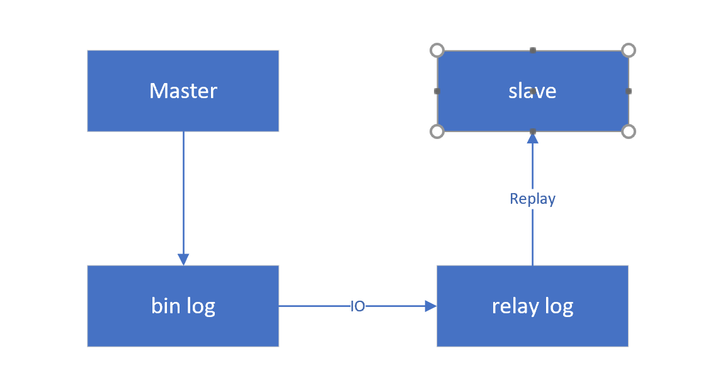

###1.mysql几种日志

- 错误日志：默认在为datadir目录下的 `hostname`.err中，记录了mysql服务的启停时正确和错误的信息，还记录启动、停止、运行过程中的错误信息。

- 一般日志：记录查询日志，对性能损耗很大，在配置中使用--general_log={0|1}来开启，一般建议关闭。

- 慢日志：查询超出变量 long_query_time 指定时间值的为慢查询，默认为10s，精确到为微妙级，在查询执行完毕且已经完全释放锁之后才记录。
慢查询在SQL语句调优的时候非常有用。

- 二进制日志（bin log）：该日志记录了引起或可能引起数据库改变(如delete语句但没有匹配行)的操作记录，但不包括select。
一般用于恢复数据和主从同步使用，在执行语句之后，但释放锁之前，记录到日志中。bin log文件的最大容量为1G，达到上限时会浮动刷新日志。
注：RC级别中出现的幻读问题可能会导致日志中的顺序与实际的顺序不一致，从而使从库在更新数据时发生错乱。

- relay log：主从复制中继日志，主库bin log -> 从库 relay log -> 从数据库

###2.mysql集群

1.主备HA：用于实现数据库的高可用

主从同步分为几种模式：

- 异步复制：mysql默认模式，主库执行完事务后，写入bin log，通知监听线程发送新写入的bin log数据到从库，主库继续执行，不关心同步结果。

- 全同步复制：主库提交事务后，发送bin log，必须等到所有从库都执行完毕后才继续执行，必然造成等待时间下降，性能降低。

- 半同步复制：主库提交事务后，发送bin log，只要收到一个从库写入的ack确认即可，其他从库可以从这个已同步的从库中去拉取数据，兼顾了性能与安全。

2.读写分离：一般是一主多从的架构，主库负责写，并同步到从库，从库只负责读，适用于读多写少的场景。

如果主从延迟较大可以从以下几个角度尝试分析：可能是从库性能太低，可能是主库TPS过高，可能是主库出现大事务，可能是主库在执行DDL事务

3.分表模式：横向分表，用于单表数据过大，将数据分散入多个表，集群模式首先要保证主键不重复，可以设置多个表插入id的步长不同，也可以使用proxy层用某种算法将数据落入不同的表。
使用的横向分表的架构，就要在查询中避免复杂的join，group语句，这会导致数据的二次处理，严重降低性能。
注：一般2kw以上的单表数据才会考虑分表