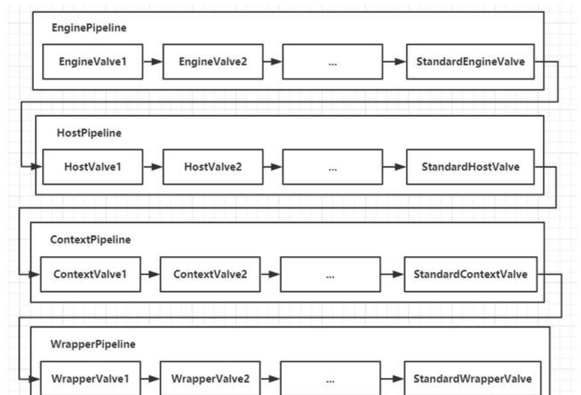
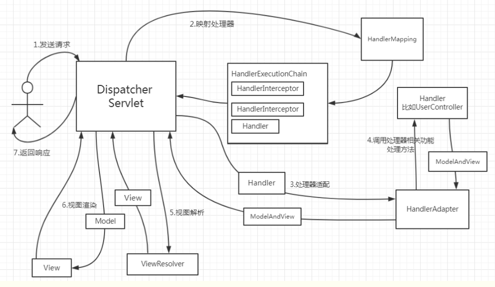

spring Web = tomcat + spring MVC

tomcat是web容器，即接受到浏览器发来的请求，然后将这些http请求映射到servlet实例上，
在springboot中自带tomcat容器，不用单独配置。

spring MVC即使servlet的实现，核心是dispatchservlet，所有的http请求映射到这个servlet上，由dispatchservlet统一分配这些请求到不同的controller上。

###1.tomcat部分

注：tomcat是由基于http协议实现的，netty则可以实现各种自定义协议。

- tomcat会在8080端口做Nio模式的selector轮询

- 轮询得到请求之后，进入处理socket请求的http11Processor，将tomcat的request，response转化为spring的
httpservletRequest和httpservletResponse

- 转化成功后，进入tomcat的"管道"中，这里使用的是责任链模式，每个pipeline的各个valve都会拦截请求做相应的处理。

- 按照链式调用完之后，进入Frameworkservlet.service()方法，即实现类Dispatchservlet中。

###2.MVC部分

- getHandle(Request)：

在RequestMappingHandleMapping中存放了所有url-> controller的映射，这里拿到对应的controller对象（调用getbean方法，这个对象是spring初始化时放入的单例bean），
执行方法和参数封装入handle中，同时完成执行链注册，即拦截器也一同放入handle。

- 然后根据handle找到对应的adapter适配器，通常是requestMappingHandleAdapter。

- 执行handle中各个拦截器的preHandle方法。

- 接下来进入真正的controller业务逻辑，mv = ha.handle(processedRequest, response, handle)，
这里的mv就是MVC概念中的视图，在前后端分离的框架下，mv通常为null，即返回空视图，真正返回的json对象会放入webRequest中，随着httpResponse一起返回。

- 最后执行handle中各个拦截器的postHandle方法，然后返回请求

至此一个完成的http请求流程结束。