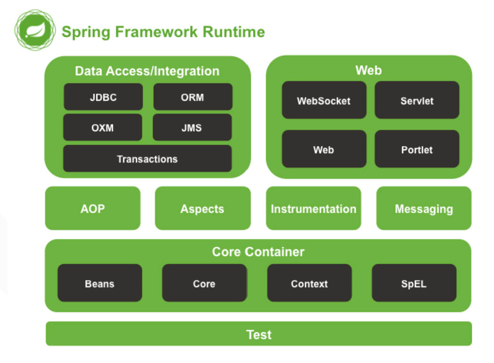

####1.Spring框架官方介绍：
Spring框架是一个为Java应用程序的开发提供了综合、广泛的基础性支 持的Java平台。Spring帮助开发者解决了开发中基础性的问题，使得开 发人员可以专注于应用程序的开发。

Spring框架本身亦是按照设计模式精心打造，这使得我们可以在开发环境 中安心的集成Spring框架，不必担心Spring是如何在后台进行工作的。

####2.spring框架的优势：

- 通过依赖注入(DI)方式,在构造方法或者java bean属性上，依赖关系是明确的和明显的。
- IoC容器往往是轻量级的,特别是与EJB容器相比。这是有利于在有限的内存和CPU资源的计算机上开发和部署应用程序。
- Spring不重新发明轮子，相反,它利用一些现有的技术如几个ORM框架,日志框架,JEE,quartz和JDK计时器,其他视图技术等。
- Spring是模块化的。尽管包和类很重要,你只关心你需要的模块,忽略其它模块。
- 在Spring测试应用程序很简单,因为依赖环境的代码被移入到框架本身。此外,通过使用JavaBean-style pojo方式,使用依赖注入注入测试数据变得更容易。
- Spring的web框架是一个设计良好的web MVC框架,它可以很好的替代其它web框架如struts或者其它web框架。
- Spring提供了一致的事务管理界面,可以管理小到一个本地事务(例如,使用一个数据库)和大到全局事务(例如,使用JTA)。

####3.spring几个基本概念：

- IOC：控制反转，即控制对象生命周期的不是引用它的对象，可以统一交由spring容器管理。

- DI：依赖注入，容器动态地将某个依赖注入到组件中，可以是构造方法注入，setter方法注入或接口注入。

- beanFactoy：最基础类型IOC容器，像是包含bean集合的工厂类，它提供了完整的IOC服务支持。

- ApplictionContext：BeanFactory的高级实现，提供了一些高级IOC支持。

- FactoryBean：是一类特殊的工厂bean，默认情况下，spring根据bean的class数据创建bean，FactoryBean则自己创建bean放入容器中，通过调用getObject()方法取得。