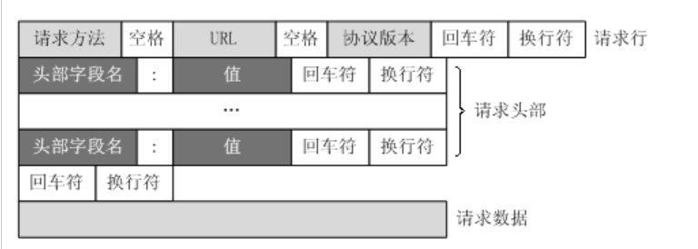
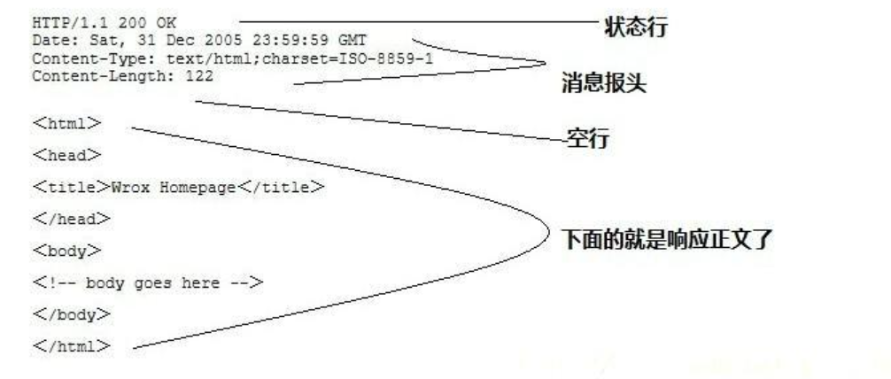

HTTP协议是Hyper Text Transfer Protocol（超文本传输协议）的缩写,是用于从万维网（WWW:World Wide Web ）服务器传输超文本到本地浏览器的传送协议。

HTTP是应用层协议，通常承载于TCP之上，默认端口为80，HTTPS默认端口为443。

HTTP无状态。

####1.http状态码

- 1xx：指示信息--表示请求已接收，继续处理
- 2xx：成功--表示请求已被成功接收、理解、接受
- 3xx：重定向--要完成请求必须进行更进一步的操作
- 4xx：客户端错误--请求有语法错误或请求无法实现
- 5xx：服务器端错误--服务器未能实现合法的请求

####2.http完整流程
- 域名解析得到ip
- 发起TCP三次握手
- 基于TCP发送http请求
- 服务器响应http请求，浏览器得到HTML代码
- 浏览器解析HTML代码中的资源
- 浏览器渲染页面
- 关闭连接

####3.request请求

- 请求行：用来说明请求类型,要访问的资源以及所使用的HTTP版本
- 请求头部：紧接着请求行（即第一行）之后的部分，用来说明服务器要使用的附加信息
- 空行：请求头部后面的空行是必须的
- 请求主体：任意类型数据。

####4.response请求

- 状态行：由HTTP协议版本号， 状态码， 状态消息三部分组成
- 消息报头：用来说明客户端要使用的一些附加信息
- 空行：消息报头后面的空行是必须的 
- 响应正文：服务器返回给客户端的文本信息

####5.http请求方法

get，post，head，put，delete，options，connect

- GET：数据跟在URL后面，可以别修改，且长度有限制
- POST：数据封装在请求头中，不能修改，无长度限制

####6.https

https=http+SSL

即对称加密用于数据通信，非对称加密用于解析对称加密密文，基于第三方权威证书避免中间人篡改。

首先server和机构交换信息

server发送证书给client，client到机构处验证证书，并得到公钥，然后使用公钥对key进行加密发送给server，
随后server使用私钥解密得到key，于是双方可以使用相同的key开始通信

####7.cookie和session

为了解决http无状态的缺陷，诞生了cookie，cookie是带在http协议中的，存在于header字段，cookie具有不可跨域性，存储在客户端，大小有限制。

- cookie是客户端保存用户信息的机制
- session用于追踪用户对话，存在于服务端的对象，session可以由cookie实现

一般在cookie中会设置一个sessionId，发送请求时带给服务端，服务端可以根据这个id找到用户信息，即保持了对话的连续性。
如果客户端禁用了cookie，那么sessionId可以带在URL或请求数据中。

一般cookie存放一些用户名，密码，特征值等，设置生效时间较长。session一般存放用户对象信息，一般较短，二三十分钟。

对于一般判断用户登录的简单模型：服务端使用拦截器获取每个请求中sessionId对应的用户信息，放入线程上下文中，
如果判断未登录，即id不存在或对应的用户信息不存在，那么跳转到登录页面。