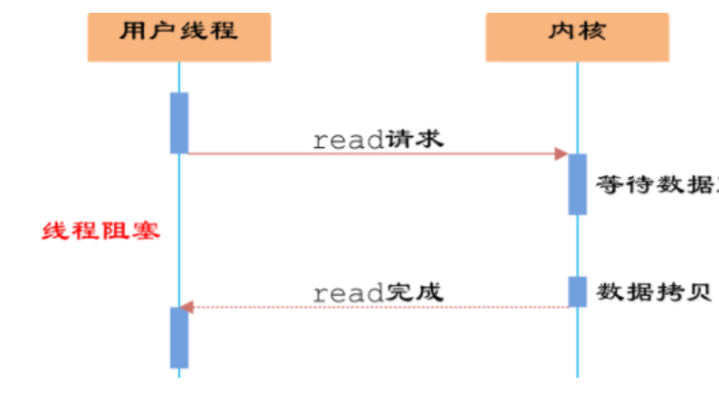
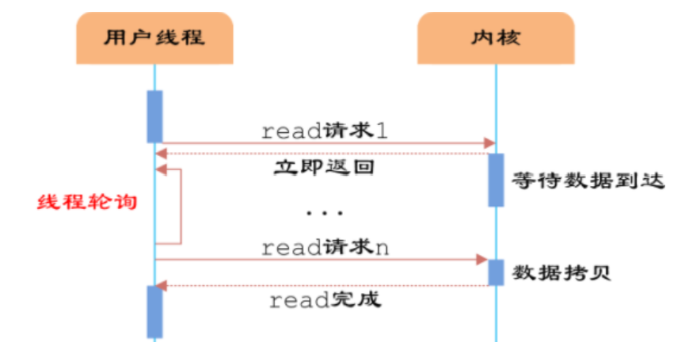
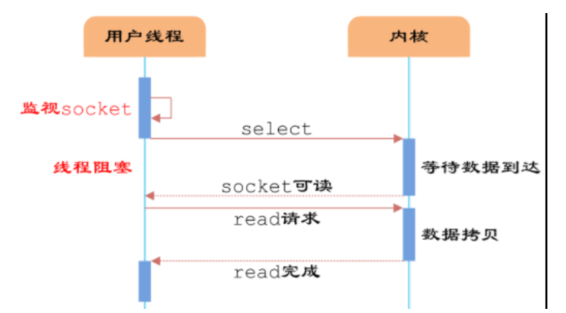
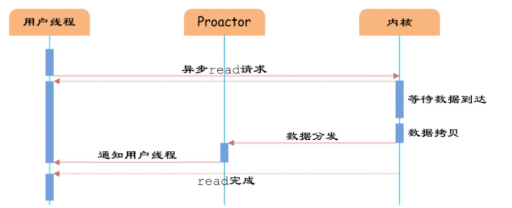

同步/异步：同步/异步关注的是消息通信的机制，同步指发起一个调用后，没有得到结果，被调用方不返回，
而异步是直接返回，没有返回结果，而是等到结果生成之后，通过回调函数来通知调用者。

阻塞/非阻塞：阻塞/非阻塞关注程序等待结果的状态，阻塞指没有得到返回结果时，当前线程挂起直到得到返回结果，
非阻塞指线程不阻塞，继续执行其他任务，但需要时不时来询问结果。

注：在操作系统层面，阻塞和同步的概念相同，只有阻塞式发送，非阻塞式发送，阻塞式接受，非阻塞式接受。

1.同步阻塞IO

2.同步非阻塞IO

用户需要不断调用read，重复轮询，消耗大量CPU资源，一般不使用这种IO

3.多路复用IO

用户将IO的socket加入select中，select可以统一处理不同的IO事件，处理完毕通知socket。
多路复用本质上还是阻塞，只是阻塞的位置在select上，select需要轮询每个是事件的状态。
典型应用如java中的nio，netty等。

4.真正的异步io

这种io需要操作系统的支持，所以在操作系统内部很多采用这种io。

