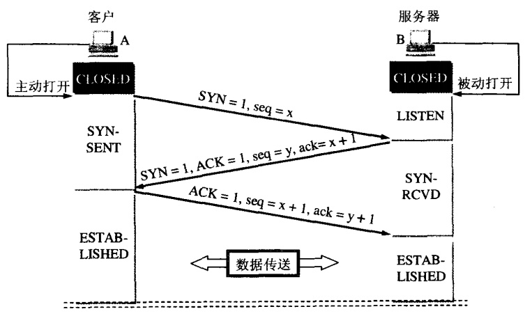
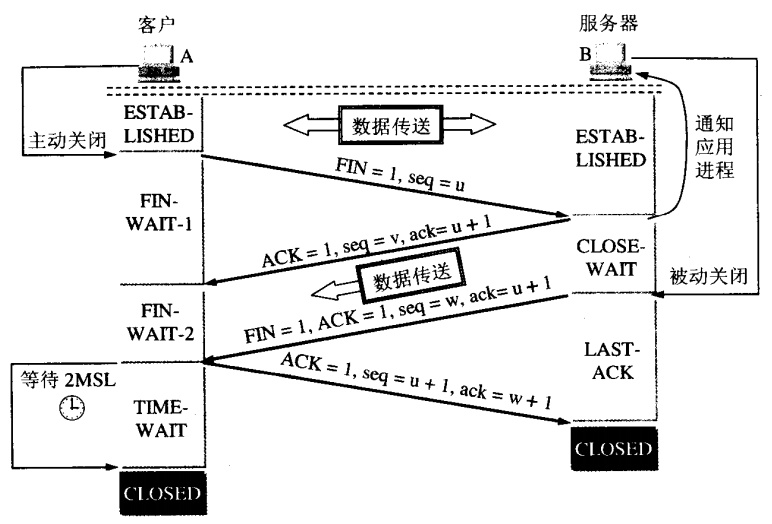
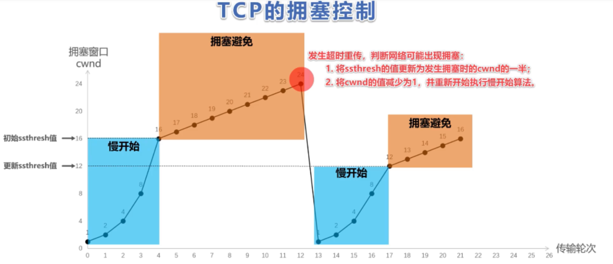

1.TCP简介

TCP(Transmission Control Protocol 传输控制协议)是一种面向连接(连接导向)的、可靠的、 基于IP的传输层协议。
TCP会将用户数据打包构成报文段，它发送数据时启动一个定时器，另一端收到数据进行确认，对失序的数据重新排序，丢弃重复的数据。TCP提供一种面向连接的可靠的字节流服务。

TCP的可靠性：
- 应用数据被分成TCP最合适的发送数据块
- 当TCP发送一个段之后，启动一个定时器，等待目的点确认收到报文，如果不能及时收到一个确认，将重发这个报文。
- 当TCP收到连接端发来的数据，就会推迟几分之一秒发送一个确认。
- TCP将保持它首部和数据的检验和，这是一个端对端的检验和，目的在于检测数据在传输过程中是否发生变化。（有错误，就不确认，发送端就会重发）
- TCP是以IP报文来传送，IP数据是无序的，TCP收到所有数据后进行排序，再交给应用层
- IP数据报会重复，所以TCP会去重
- TCP能提供流量控制，TCP连接的每一个地方都有固定的缓冲空间。TCP的接收端只允许另一端发送缓存区能接纳的数据。
- TCP对字节流不做任何解释，对字节流的解释由TCP连接的双方应用层解释。

2.TCP和UDP

- TCP面向连接，UDP无连接
- TCP慢，UDP快
- TCP可靠，UDP不可靠
- TCP数据量少，UDP数据量多
- TCP用于一般场景，对数据可靠性都有要求，UDP用于直播，视频这种传输大量数据，但可以允许丢失的场景

3.TCP三次握手

- 建立连接时，客户端发送syn包，进入SYN-SENT阶段
- 服务端收到syn包，发送确认包ack=x+1，同时也发送自己的syn包，syn=y，进入SYN_RECV状态
- 客户端收到syn+ack包，同时也发送确认包ack=y+1
- 双方建立连接，开始传输数据

三次握手的本质在于信道不可靠的情况下，通信双方需要就传输达成一致的问题的解答。

那么为什么不是两次握手？因为两次握手，只有服务端对客户端进行了确认，只证明了客户端发，服务端收的能力。
而双方都证明有收发的能力，其实需要四次握手。
- A -send-> B：证明A可以发消息
- B -reveive-> A：证明B可以收消息
- B -send-> A：证明B可以发消息
- A -reveive-> B：证明A可以收消息

这其中第三步和第四步可以合在一起，就形成了三次握手。

那么三次握手是否可靠？其实也不可靠，因为任何时候网络都不可靠，但是三次握手是证明双方收发能力的最低值，在此之上，再增加几次握手也无法提高可靠性。

4.四次挥手

为什么挥手是四次，发送和确认不能放在同一步。

因为关闭连接时，client发送FIN，此时server可能还有数据要发送，所以只能回一个ack确认，

5.TCP拥塞

对于网络拥堵时所实行的策略

- 慢开始：刚开始建立连接发送数据时，不清楚当前网络状况，所有先探测一下，由小到大增大发送窗口。
窗口cwnd按指数增加。
  
- 拥塞避免：当窗口值等于16(慢开始门限),然后我们开始采用”加法增大”的策略,即不在以2倍的方式增加,而是转变为每次加1的方式.直到网络拥塞。
  我们开始采用”拥塞避免”算法:让新的慢开始门限值变为发生拥塞时候的值的一半,将拥塞窗口置为1,然后让它再次重复,这时一瞬间会将网络中的数据量大量降低.
 
  

- 快速重传：发送方尽量地快速重传，而不是等待超时计数器通知，
  例如发送方收到了累计3个连续的针对2号报文段的重复确认，立即重传3号报文段。
  2个重复ack可能是顺序错乱，3个一定是丢失报文。
  
- 快恢复：当发送方连续收到三个重复确认，执行乘法减小，ssthresh减半，发送方可能认为网络现在没有拥塞，因此与慢开始不同，把cwnd值设置为ssthresh减半之后的值，然后执行拥塞避免算法，线性增大cwnd。

6.长连接

短连接：建立连接——数据传输——关闭连接...建立连接——数据传输——关闭连接

长连接：建立连接——数据传输...（保持连接）...数据传输——关闭连接

- 长连接可以省去较多的TCP建立和关闭的操作，减少浪费，节约时间。 对于频繁请求资源的客户来说，较适用长连接。
- 长连接多用于操作频繁，点对点的通讯，而且连接数不能太多情况。

7.七层模型

https://www.cnblogs.com/qishui/p/5428938.html

8.RPC

- NIO IO模型，多路复用IO，selector选择器上注册channel，
channel根据事件accept，read，write做不同功能，一般使用netty框架开发。
  
- 通讯协议：http，tpc，dubbo

- 注册中心：提供方提供服务名称到注册中心，消费方从注册中心拿到服务数据，实现解耦，TCP长连接

- 参数：服务名称，方法，参数，服务方通过以上参数反射调取服务端相应方法，返回响应 (动态代理实现)

- 请求体和响应体序列化，requestId保证请求和相应的对应关系。