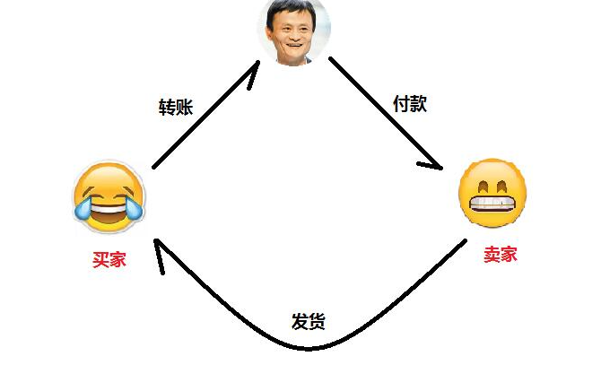
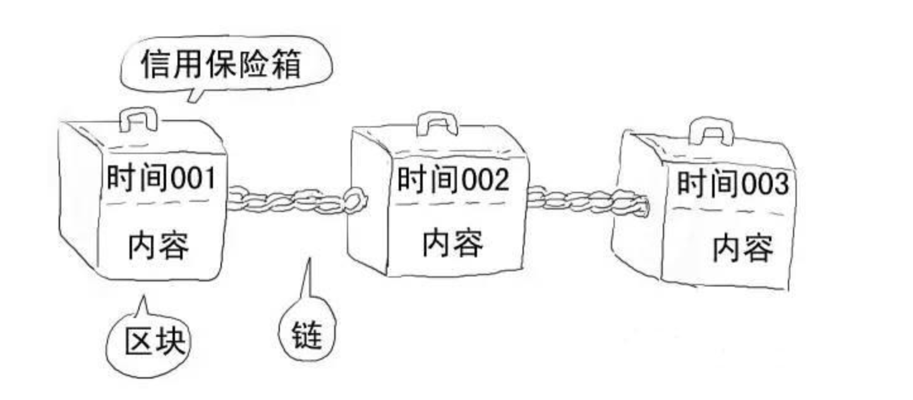

### 1.什么是区块链

链表结构。最早90年代提出，应用于文件标记改动和防止篡改。

中本聪于09年将区块链应用于分布式账本上，开发出比特币。

### 1.记账系统

中心化转账模式：

你要在某宝上买一部手机，交易流程是：你将钱打给支付宝－支付宝收款后通知卖家发货－卖家发货－你确认收货－支付宝把钱打给卖家。

在这个过程中，虽然你是在和卖家交易，但是这笔交易还牵扯到了除了你和卖家的第三方，即支付宝，你和卖家的交易都是围绕支付宝展开。
而这些交易又会记录在银行的账户里，银行知道你有多少钱，你向谁发起了交易。而你也相信支付宝和银行背后的体系不会搞错你的账户。
问题是：没有这些可信的第三方，在一个去中心化网络中，如何转账？

### 2.分布式记账-区块链

中本聪用9页白皮书实现了支持分布式账本的技术。

在一个所有人都无法信任的匿名网络环境中，我要给A转账就需要广播，所有人都会记录这个转账信息，
这个世界中的每一笔交易都会存在于所有人的账本中。

不仅仅是如何记账，而且是如何记录所有交易，且交易安全无法篡改。
账本的形态要解决几个问题。

1.余额问题

我发起一笔交易，如何证明我有这些钱?

记录这个体系下的所有交易，并按前后顺序组成链表结构，这样所有的交易可追溯，
别的账本接受到我的交易广播，可以通过回溯很容易计算出我之前进行了多少笔交易，此时我还有多少余额，
如果不够将拒绝记录。

2.身份问题

如何证明是我本人发起交易。

电子签名，非对称加密，每个账户加入比特币网络时，都会得到私钥，公钥，地址。

每次交易信息都会做一次hash得到签名，对签名做私钥加密，得到密码。

3.防止篡改

SHA256 任何字符哈希加密后可以得到256位的输出，且输入发生任何一点变化，输出都会截然不同。
最后把交易信息和公钥以及密码广播出去，别的账本得到交易信息后做一次hash然后通过公钥解密，如果解密出来的信息和密码相同，身份校验通过。

- 区块头
    - 前区块哈希值
    - 时间戳
    - 随机数

- 数据本身
- 哈希值：对区块头做二次哈希计算得到当前块哈希值

- 双花+分叉

每个区块又多少交易？
每个实时更新吗？
区块头其他参数和复杂加密作用？
记账者改变这次交易信息？
如何动态增加难度？
其他共识算法？
以太坊 IPFS？

分叉问题？